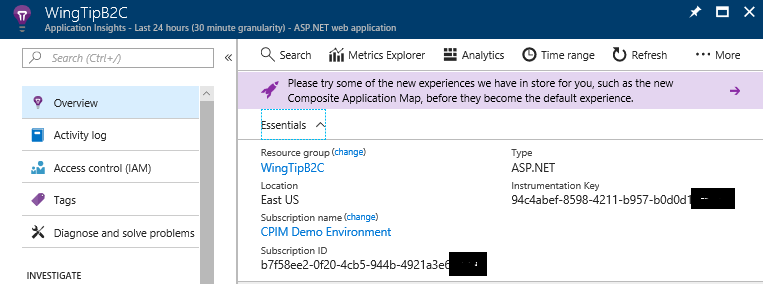

# Track user behavior in Azure AD B2C journeys by using Application Insights

Azure Active Directory B2C (Azure AD B2C) works well with Azure Application Insights. They provide detailed and customized event logs for your custom-created user journeys. This article shows how to get started so you can:

* Gain insights on user behavior.
* Troubleshoot your own policies in development or in production.
* Measure performance.
* Create notifications from Application Insights.

> [!NOTE]
> This feature is in preview.

## How it works

The Identity Experience Framework in Azure AD B2C now includes the provider `Handler="Web.TPEngine.Providers.UserJourneyContextProvider, Web.TPEngine, Version=1.0.0.0`.  It sends event data directly to Application Insights by using the instrumentation key provided to Azure AD B2C.

A technical profile uses this provider to define an event from B2C.  The profile specifies the name of the event, the claims that will be recorded, and the instrumentation key.  To post an event, the technical profile is then added as an `orchestration step` or as a `validation technical profile` in a custom user journey.

Application Insights can unify the events by using a correlation ID to record a user session. Application Insights makes the event and session available within seconds and presents many visualization, export, and analytical tools.

## Prerequisites

Complete the steps in [Getting started with custom policies](active-directory-b2c-get-started-custom.md). This article assumes that you're using the custom policy starter pack. But the starter pack isn't required.

## Step 1. Create an Application Insights resource and get the instrumentation key

When you're using Application Insights with Azure AD B2C, the only requirement is to create a resource and obtain an instrumentation key. You create a resource in the [Azure portal.](https://portal.azure.com)

1. In the Azure portal, within your subscription tenant, select **+ Create a resource**. This tenant is not your Azure AD B2C tenant.  
2. Search for and select **Application Insights**.  
3. Create a resource that uses **ASP.NET web application** as **Application Type**, under a subscription of your preference.
4. After you create the Application Insights resource, open it and note the instrumentation key.



## Step 2. Add new ClaimType definitions to your trust framework extension file

Open the extension file from the starter pack and add the following elements to the `<BuildingBlocks>` node. The file name is typically `yourtenant.onmicrosoft.com-B2C_1A_TrustFrameworkExtensions.xml`

```xml
<ClaimsSchema>
  <ClaimType Id="EventType">
    <DisplayName>EventType</DisplayName>
    <DataType>string</DataType>
    <AdminHelpText />
    <UserHelpText />
  </ClaimType>
  <ClaimType Id="PolicyId">
    <DisplayName>PolicyId</DisplayName>
    <DataType>string</DataType>
    <AdminHelpText />
    <UserHelpText />
  </ClaimType>
  <ClaimType Id="Culture">
    <DisplayName>Culture</DisplayName>
    <DataType>string</DataType>
    <AdminHelpText />
    <UserHelpText />
  </ClaimType>
  <ClaimType Id="CorrelationId">
    <DisplayName>CorrelationId</DisplayName>
    <DataType>string</DataType>
    <AdminHelpText />
    <UserHelpText />
  </ClaimType>
  <!--Additional claims used for passing claims to Application Insights Provider -->
  <ClaimType Id="federatedUser">
    <DisplayName>federatedUser</DisplayName>
    <DataType>boolean</DataType>
    <UserHelpText />
  </ClaimType>
  <ClaimType Id="parsedDomain">
    <DisplayName>Parsed Domain</DisplayName>
    <DataType>string</DataType>
    <UserHelpText>The domain portion of the email address.</UserHelpText>
  </ClaimType>
  <ClaimType Id="userInLocalDirectory">
    <DisplayName>userInLocalDirectory</DisplayName>
    <DataType>boolean</DataType>
    <UserHelpText />
  </ClaimType>
</ClaimsSchema>
```

## Step 3. Add new technical profiles that use the Application Insights provider

Technical profiles can be considered functions in the Identity Experience Framework of Azure AD B2C. This example defines five technical profiles to open a session and post events:

| Technical Profile | Task |
| ----------------- | -----|
| AzureInsights-Common | Creates a common set of parameters to be included in all AzureInsights technical profiles | 
| JourneyContextForInsights | Opens the session in Application Insights and sends a correlation ID |
| AzureInsights-SignInRequest | Creates a `SignIn` event with a set of claims when a sign-in request has been received | 
| AzureInsights-UserSignup | Creates a UserSignup event when the user triggers the sign-up option in a sign-up/sign-in journey | 
| AzureInsights-SignInComplete | Records the successful completion of an authentication when a token has been sent to the relying party application | 

Add the profiles to the extension file from the starter pack by adding these elements to the `<ClaimsProviders>` node.  The file name is typically `yourtenant.onmicrosoft.com-B2C_1A_TrustFrameworkExtensions.xml`

> [!IMPORTANT]
> Change the instrumentation key in the `ApplicationInsights-Common` technical profile to the GUID that your Application Insights resource provides.

```xml
<ClaimsProvider>
  <DisplayName>Application Insights</DisplayName>
  <TechnicalProfiles>
    <TechnicalProfile Id="JourneyContextForInsights">
      <DisplayName>Application Insights</DisplayName>
      <Protocol Name="Proprietary" Handler="Web.TPEngine.Providers.UserJourneyContextProvider, Web.TPEngine, Version=1.0.0.0, Culture=neutral, PublicKeyToken=null" />
      <OutputClaims>
        <OutputClaim ClaimTypeReferenceId="CorrelationId" />
      </OutputClaims>
    </TechnicalProfile>
    <TechnicalProfile Id="AzureInsights-SignInRequest">
      <InputClaims>
        <!-- An input claim with a PartnerClaimType="eventName" is required. This is used by the AzureApplicationInsightsProvider to create an event with the specified value. -->
        <InputClaim ClaimTypeReferenceId="EventType" PartnerClaimType="eventName" DefaultValue="SignInRequest" />
      </InputClaims>
      <IncludeTechnicalProfile ReferenceId="AzureInsights-Common" />
    </TechnicalProfile>
    <TechnicalProfile Id="AzureInsights-SignInComplete">
      <InputClaims>
        <InputClaim ClaimTypeReferenceId="EventType" PartnerClaimType="eventName" DefaultValue="SignInComplete" />
        <InputClaim ClaimTypeReferenceId="federatedUser" PartnerClaimType="{property:FederatedUser}" DefaultValue="false" />
        <InputClaim ClaimTypeReferenceId="parsedDomain" PartnerClaimType="{property:FederationPartner}" DefaultValue="Not Applicable" />
      </InputClaims>
      <IncludeTechnicalProfile ReferenceId="AzureInsights-Common" />
    </TechnicalProfile>
    <TechnicalProfile Id="AzureInsights-UserSignup">
      <InputClaims>
        <InputClaim ClaimTypeReferenceId="EventType" PartnerClaimType="eventName" DefaultValue="UserSignup" />
      </InputClaims>
      <IncludeTechnicalProfile ReferenceId="AzureInsights-Common" />
    </TechnicalProfile>
    <TechnicalProfile Id="AzureInsights-Common">
      <DisplayName>Alternate Email</DisplayName>
      <Protocol Name="Proprietary" Handler="Web.TPEngine.Providers.Insights.AzureApplicationInsightsProvider, Web.TPEngine, Version=1.0.0.0, Culture=neutral, PublicKeyToken=null" />
      <Metadata>
        <!-- The ApplicationInsights instrumentation key which will be used for logging the events -->
        <Item Key="InstrumentationKey">xxxxxxxx-xxxx-xxxx-xxxx-xxxxxxxxxxxx</Item>
        <!-- A Boolean that indicates whether developer mode is enabled. This controls how events are buffered. In a development environment with minimal event volume, enabling developer mode results in events being sent immediately to ApplicationInsights. -->
        <Item Key="DeveloperMode">false</Item>
        <!-- A Boolean that indicates whether telemetry should be enabled or not. -->
        <Item Key="DisableTelemetry ">false</Item>
      </Metadata>
      <InputClaims>
        <!-- Properties of an event are added through the syntax {property:NAME}, where NAME is property being added to the event. DefaultValue can be either a static value or a value that's resolved by one of the supported DefaultClaimResolvers. -->
        <InputClaim ClaimTypeReferenceId="PolicyId" PartnerClaimType="{property:Policy}" DefaultValue="{Policy:PolicyId}" />
        <InputClaim ClaimTypeReferenceId="CorrelationId" PartnerClaimType="{property:JourneyId}" />
        <InputClaim ClaimTypeReferenceId="Culture" PartnerClaimType="{property:Culture}" DefaultValue="{Culture:RFC5646}" />
      </InputClaims>
    </TechnicalProfile>
  </TechnicalProfiles>
</ClaimsProvider>
```

## Step 4. Add the technical profiles for Application Insights as orchestration steps in an existing user journey

Call `JournyeContextForInsights` as orchestration step 1:

```xml
<!-- Initialize a session with Application Insights -->
<OrchestrationStep Order="1" Type="ClaimsExchange">
  <ClaimsExchanges>
    <ClaimsExchange Id="JourneyContextForInsights" TechnicalProfileReferenceId="JourneyContextForInsights" />
  </ClaimsExchanges>
</OrchestrationStep>
```

Call `Azure-Insights-SignInRequest` as orchestration step 2 to track that a sign-in/sign-up request has been received:

```xml
<!-- Track that we have received a sign in request -->
<OrchestrationStep Order="2" Type="ClaimsExchange">
  <ClaimsExchanges>
    <ClaimsExchange Id="TrackSignInRequest" TechnicalProfileReferenceId="AzureInsights-SignInRequest" />
  </ClaimsExchanges>
</OrchestrationStep>
```

Immediately *before* the `SendClaims` orchestration step, add a new step that calls `Azure-Insights-UserSignup`. It's triggered when the user selects the sign-up button in a sign-up/sign-in journey.

```xml
<!-- Handles the user clicking the sign up link in the local account sign in page -->
<OrchestrationStep Order="9" Type="ClaimsExchange">
  <Preconditions>
    <Precondition Type="ClaimsExist" ExecuteActionsIf="false">
      <Value>newUser</Value>
      <Action>SkipThisOrchestrationStep</Action>
    </Precondition>
    <Precondition Type="ClaimEquals" ExecuteActionsIf="true">
      <Value>newUser</Value>
      <Value>false</Value>
      <Action>SkipThisOrchestrationStep</Action>
    </Precondition>
  </Preconditions>
  <ClaimsExchanges>
    <ClaimsExchange Id="TrackUserSignUp" TechnicalProfileReferenceId="AzureInsights-UserSignup" />
  </ClaimsExchanges>
```

Immediately after the `SendClaims` orchestration step, call `Azure-Insights-SignInComplete`. This step reflects a successfully completed journey.

```xml
<!-- Track that we have successfully sent a token -->
<OrchestrationStep Order="11" Type="ClaimsExchange">
  <ClaimsExchanges>
    <ClaimsExchange Id="TrackSignInComplete" TechnicalProfileReferenceId="AzureInsights-SignInComplete" />
  </ClaimsExchanges>
</OrchestrationStep>
```

> [!IMPORTANT]
> After you add the new orchestration steps, renumber the steps sequentially without skipping any integers from 1 to N.


## Step 5. Upload your modified extensions file, run the policy, and view events in Application Insights

Save and upload the new trust framework extension file. Then, call the relying party policy from your application or use `Run Now` in the Azure AD B2C interface. In seconds, your events are available in Application Insights.

1. Open the **Application Insights** resource in your Azure Active Directory tenant.
2. Select **Usage** > **Events**.
3. Set **During** to **Last hour** and **By** to **3 minutes**.  You might need to select **Refresh** to view results.


##  Next steps

Add claim types and events to your user journey to fit your needs. Here is a list of possible claims, using additional claims resolvers

### Culture-specific claims

```xml
Referenced using: {Culture:One of the property names below}
```

| Claim | Definition | Example |
| ----- | -----------| --------|
| LanguageName | The two letter ISO code for the language | en |
| RegionName | The two letter ISO code for the region | US |
| RFC5646 | The RFC5646 language code | en-US |
| LCID   | The LCID of language code | 1033 |

### Policy-specific claims

```xml
Referenced using {Policy:One of the property names below}
```

| Claim | Definition | Example |
| ----- | -----------| --------|
| TrustFrameworkTenantId | The trustframework tenant id | N/A |
| RelyingPartyTenantId | The tenant id of the relying party | N/A |
| PolicyId | The policy id of the policy | N/A |
| TenantObjectId | The tenant object id of the policy | N/A |

### OpenID Connect-specific claims

```xml
Referenced using {OIDC:One of the property names below}
```

| Claim | OpenIdConnect parameter | Example |
| ----- | ----------------------- | --------|
| Prompt | prompt | N/A |
| LoginHint |  login_hint | N/A |
| DomainHint | domain_hint | N/A |
|  MaxAge | max_age | N/A |
| ClientId | client_id | N/A |
| Username | login_hint | N/A |
|  Resource | resource| N/A |
| AuthenticationContextReferences | acr_values | N/A |

### Non-protocol parameters included with OIDC & OAuth2 requests

```xml
Referenced using { OAUTH-KV:Querystring parameter name }
```

Any parameter name included as part of an OIDC or OAuth2 request can be mapped to a claim in the user journey. You can then record it in the event. For example, the request from the application might include a query string parameter with a name of `app_session`, `loyalty_number` or `any_string`.

Here's a sample request from the application:

```
https://sampletenant.b2clogin.com/tfp/sampletenant.onmicrosoft.com/B2C_1A_signup_signin/oauth2/v2.0/authorize?client_id=e1d2612f-c2bc-4599-8e7b-d874eaca1ae1&nonce=defaultNonce&redirect_uri=https%3A%2F%2Fjwt.ms&scope=openid&response_type=id_token&prompt=login&app_session=0a2b45c&loyalty_number=1234567

```
You can then add the claims by adding an `Input Claim` element to the Application Insights event. Properties of an event are added through the syntax {property:NAME}, where NAME is property being added to the event. For example:

```
<InputClaim ClaimTypeReferenceId="app_session" PartnerClaimType="{property:app_session}" DefaultValue="{OAUTH-KV:app_session}" />
<InputClaim ClaimTypeReferenceId="loyalty_number" PartnerClaimType="{property:loyalty_number}" DefaultValue="{OAUTH-KV:loyalty_number}" />
```

### Other system claims

Some system claims must be added to the claims bag before they are available to record as events. The technical profile `SimpleUJContext` must be called as an orchestration step or a validation technical profile before these claims are available.

```xml
<ClaimsProvider>
  <DisplayName>User Journey Context Provider</DisplayName>
  <TechnicalProfiles>
    <TechnicalProfile Id="SimpleUJContext">
      <DisplayName>User Journey Context Provide</DisplayName>
      <Protocol Name="Proprietary" Handler="Web.TPEngine.Providers.UserJourneyContextProvider, Web.TPEngine, Version=1.0.0.0, Culture=neutral, PublicKeyToken=null" />
      <OutputClaims>
        <OutputClaim ClaimTypeReferenceId="IP-Address" />
        <OutputClaim ClaimTypeReferenceId="CorrelationId" />
        <OutputClaim ClaimTypeReferenceId="DateTimeInUtc" />
        <OutputClaim ClaimTypeReferenceId="Build" />
      </OutputClaims>
    </TechnicalProfile>
  </TechnicalProfiles>
</ClaimsProvider>
```


