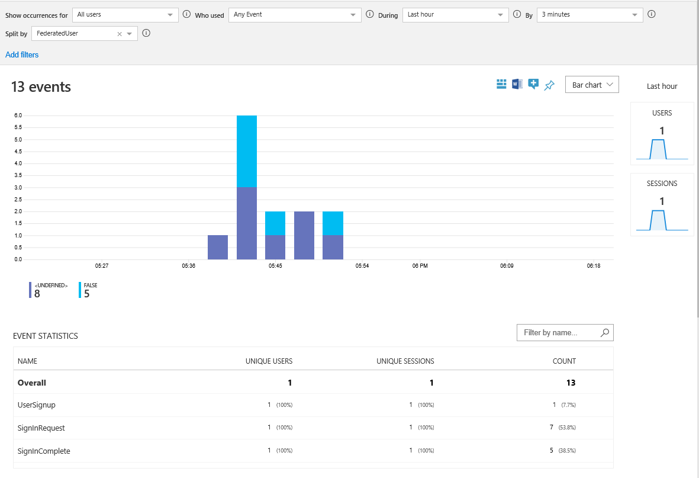

# Track user behavior in Azure Active Directory B2C using Application Insights

When you use Azure Active Directory (Azure AD) B2C together with Azure Application Insights, you can get detailed and customized event logs for your user journeys. In this article, you learn how to:

* Gain insights on user behavior.
* Troubleshoot your own policies in development or in production.
* Measure performance.
* Create notifications from Application Insights.

> [!NOTE]
> This feature is in preview.

## How it works

The Identity Experience Framework in Azure AD B2C includes the provider `Handler="Web.TPEngine.Providers.UserJourneyContextProvider, Web.TPEngine, Version=1.0.0.0`. It sends event data directly to Application Insights by using the instrumentation key provided to Azure AD B2C.

A technical profile uses this provider to define an event from Azure AD B2C. The profile specifies the name of the event, the claims that are recorded, and the instrumentation key. To post an event, the technical profile is then added as an `orchestration step`, or as a `validation technical profile` in a custom user journey.

Application Insights can unify the events by using a correlation ID to record a user session. Application Insights makes the event and session available within seconds and presents many visualization, export, and analytical tools.

## Prerequisites

Complete the steps in [Get started with custom policies](active-directory-b2c-get-started-custom.md). This article assumes that you're using the custom policy starter pack. But the starter pack isn't required.

## Create an Application Insights resource

When you're using Application Insights with Azure AD B2C, all you need to do is create a resource and get the instrumentation key.

1. Sign in to the [Azure portal](https://portal.azure.com/).
2. Make sure you're using the directory that contains your Azure subscription by clicking the **Directory and subscription filter** in the top menu and choosing the directory that contains your subscription. This tenant is not your Azure AD B2C tenant.
3. Choose **Create a resource** in the top-left corner of the Azure portal, and then search for and select **Application Insights**.
4. Click **Create**.
5. Enter a **Name** for the resource.
6. For **Application Type**, select **ASP.NET web application**.
7. For **Resource Group**, select an existing group or enter a name for a new group.
8. Click **Create**.
4. After you create the Application Insights resource, open it, expand **Essentials**, and copy the instrumentation key.


## Add new ClaimType definitions

Open the *TrustFrameworkExtensions.xml* file from the starter pack and add the following elements to the [BuildingBlocks](buildingblocks.md) element:

```xml
<ClaimsSchema>
  <ClaimType Id="EventType">
    <DisplayName>EventType</DisplayName>
    <DataType>string</DataType>
    <AdminHelpText />
    <UserHelpText />
  </ClaimType>
  <ClaimType Id="PolicyId">
    <DisplayName>PolicyId</DisplayName>
    <DataType>string</DataType>
    <AdminHelpText />
    <UserHelpText />
  </ClaimType>
  <ClaimType Id="Culture">
    <DisplayName>Culture</DisplayName>
    <DataType>string</DataType>
    <AdminHelpText />
    <UserHelpText />
  </ClaimType>
  <ClaimType Id="CorrelationId">
    <DisplayName>CorrelationId</DisplayName>
    <DataType>string</DataType>
    <AdminHelpText />
    <UserHelpText />
  </ClaimType>
  <!--Additional claims used for passing claims to Application Insights Provider -->
  <ClaimType Id="federatedUser">
    <DisplayName>federatedUser</DisplayName>
    <DataType>boolean</DataType>
    <UserHelpText />
  </ClaimType>
  <ClaimType Id="parsedDomain">
    <DisplayName>Parsed Domain</DisplayName>
    <DataType>string</DataType>
    <UserHelpText>The domain portion of the email address.</UserHelpText>
  </ClaimType>
  <ClaimType Id="userInLocalDirectory">
    <DisplayName>userInLocalDirectory</DisplayName>
    <DataType>boolean</DataType>
    <UserHelpText />
  </ClaimType>
</ClaimsSchema>
```

## Add new technical profiles

Technical profiles can be considered functions in the Identity Experience Framework of Azure AD B2C. This table defines the technical profiles that are used to open a session and post events.

| Technical Profile | Task |
| ----------------- | -----|
| AzureInsights-Common | Creates a common set of parameters to be included in all AzureInsights technical profiles. | 
| AzureInsights-SignInRequest | Creates a SignIn event with a set of claims when a sign-in request has been received. | 
| AzureInsights-UserSignup | Creates a UserSignup event when the user triggers the sign-up option in a sign-up/sign-in journey. | 
| AzureInsights-SignInComplete | Records the successful completion of an authentication when a token has been sent to the relying party application. | 

Add the profiles to the *TrustFrameworkExtensions.xml* file from the starter pack. Add these elements to the **ClaimsProviders** element:

```xml
<ClaimsProvider>
  <DisplayName>Application Insights</DisplayName>
  <TechnicalProfiles>
    <TechnicalProfile Id="AzureInsights-SignInRequest">
      <InputClaims>
        <!-- An input claim with a PartnerClaimType="eventName" is required. This is used by the AzureApplicationInsightsProvider to create an event with the specified value. -->
        <InputClaim ClaimTypeReferenceId="EventType" PartnerClaimType="eventName" DefaultValue="SignInRequest" />
      </InputClaims>
      <IncludeTechnicalProfile ReferenceId="AzureInsights-Common" />
    </TechnicalProfile>
    <TechnicalProfile Id="AzureInsights-SignInComplete">
      <InputClaims>
        <InputClaim ClaimTypeReferenceId="EventType" PartnerClaimType="eventName" DefaultValue="SignInComplete" />
        <InputClaim ClaimTypeReferenceId="federatedUser" PartnerClaimType="{property:FederatedUser}" DefaultValue="false" />
        <InputClaim ClaimTypeReferenceId="parsedDomain" PartnerClaimType="{property:FederationPartner}" DefaultValue="Not Applicable" />
      </InputClaims>
      <IncludeTechnicalProfile ReferenceId="AzureInsights-Common" />
    </TechnicalProfile>
    <TechnicalProfile Id="AzureInsights-UserSignup">
      <InputClaims>
        <InputClaim ClaimTypeReferenceId="EventType" PartnerClaimType="eventName" DefaultValue="UserSignup" />
      </InputClaims>
      <IncludeTechnicalProfile ReferenceId="AzureInsights-Common" />
    </TechnicalProfile>
    <TechnicalProfile Id="AzureInsights-Common">
      <DisplayName>Alternate Email</DisplayName>
      <Protocol Name="Proprietary" Handler="Web.TPEngine.Providers.Insights.AzureApplicationInsightsProvider, Web.TPEngine, Version=1.0.0.0, Culture=neutral, PublicKeyToken=null" />
      <Metadata>
        <!-- The ApplicationInsights instrumentation key which will be used for logging the events -->
        <Item Key="InstrumentationKey">xxxxxxxx-xxxx-xxxx-xxxx-xxxxxxxxxxxx</Item>
        <!-- A Boolean that indicates whether developer mode is enabled. This controls how events are buffered. In a development environment with minimal event volume, enabling developer mode results in events being sent immediately to ApplicationInsights. -->
        <Item Key="DeveloperMode">false</Item>
        <!-- A Boolean that indicates whether telemetry should be enabled or not. -->
        <Item Key="DisableTelemetry ">false</Item>
      </Metadata>
      <InputClaims>
        <!-- Properties of an event are added through the syntax {property:NAME}, where NAME is property being added to the event. DefaultValue can be either a static value or a value that's resolved by one of the supported DefaultClaimResolvers. -->
        <InputClaim ClaimTypeReferenceId="PolicyId" PartnerClaimType="{property:Policy}" DefaultValue="{Policy:PolicyId}" />
        <InputClaim ClaimTypeReferenceId="CorrelationId" PartnerClaimType="{property:JourneyId}" />
        <InputClaim ClaimTypeReferenceId="Culture" PartnerClaimType="{property:Culture}" DefaultValue="{Culture:RFC5646}" />
      </InputClaims>
    </TechnicalProfile>
  </TechnicalProfiles>
</ClaimsProvider>
```

> [!IMPORTANT]
> Change the instrumentation key in the `ApplicationInsights-Common` technical profile to the GUID that your Application Insights resource provides.

## Add the technical profiles as orchestration steps

Call `Azure-Insights-SignInRequest` as orchestration step 2 to track that a sign-in/sign-up request has been received:

```xml
<!-- Track that we have received a sign in request -->
<OrchestrationStep Order="1" Type="ClaimsExchange">
  <ClaimsExchanges>
    <ClaimsExchange Id="TrackSignInRequest" TechnicalProfileReferenceId="AzureInsights-SignInRequest" />
  </ClaimsExchanges>
</OrchestrationStep>
```

Immediately *before* the `SendClaims` orchestration step, add a new step that calls `Azure-Insights-UserSignup`. It's triggered when the user selects the sign-up button in a sign-up/sign-in journey.

```xml
<!-- Handles the user clicking the sign up link in the local account sign in page -->
<OrchestrationStep Order="8" Type="ClaimsExchange">
  <Preconditions>
    <Precondition Type="ClaimsExist" ExecuteActionsIf="false">
      <Value>newUser</Value>
      <Action>SkipThisOrchestrationStep</Action>
    </Precondition>
    <Precondition Type="ClaimEquals" ExecuteActionsIf="true">
      <Value>newUser</Value>
      <Value>false</Value>
      <Action>SkipThisOrchestrationStep</Action>
    </Precondition>
  </Preconditions>
  <ClaimsExchanges>
    <ClaimsExchange Id="TrackUserSignUp" TechnicalProfileReferenceId="AzureInsights-UserSignup" />
  </ClaimsExchanges>
```

Immediately after the `SendClaims` orchestration step, call `Azure-Insights-SignInComplete`. This step shows a successfully completed journey.

```xml
<!-- Track that we have successfully sent a token -->
<OrchestrationStep Order="10" Type="ClaimsExchange">
  <ClaimsExchanges>
    <ClaimsExchange Id="TrackSignInComplete" TechnicalProfileReferenceId="AzureInsights-SignInComplete" />
  </ClaimsExchanges>
</OrchestrationStep>
```

> [!IMPORTANT]
> After you add the new orchestration steps, renumber the steps sequentially without skipping any integers from 1 to N.


## Upload your file, run the policy, and view events

Save and upload the *TrustFrameworkExtensions.xml* file. Then, call the relying party policy from your application or use **Run Now** in the Azure portal. In seconds, your events are available in Application Insights.

1. Open the **Application Insights** resource in your Azure Active Directory tenant.
2. Select **Usage** > **Events**.
3. Set **During** to **Last hour** and **By** to **3 minutes**.  You might need to select **Refresh** to view results.



## Next steps

Add claim types and events to your user journey to fit your needs. You can use [claim resolvers](claim-resolver-overview.md) or any string claim type, add the claims by adding an **Input Claim** element to the Application Insights event or to the AzureInsights-Common technical profile. 

- **ClaimTypeReferenceId** is the reference to a claim type.
- **PartnerClaimType** is the name of the property that appears in Azure Insights. Use the syntax of `{property:NAME}`, where `NAME` is property being added to the event. 
- **DefaultValue** use any string value or the claim resolver. 

```XML
<InputClaim ClaimTypeReferenceId="app_session" PartnerClaimType="{property:app_session}" DefaultValue="{OAUTH-KV:app_session}" />
<InputClaim ClaimTypeReferenceId="loyalty_number" PartnerClaimType="{property:loyalty_number}" DefaultValue="{OAUTH-KV:loyalty_number}" />
<InputClaim ClaimTypeReferenceId="language" PartnerClaimType="{property:language}" DefaultValue="{Culture:RFC5646}" />
```

