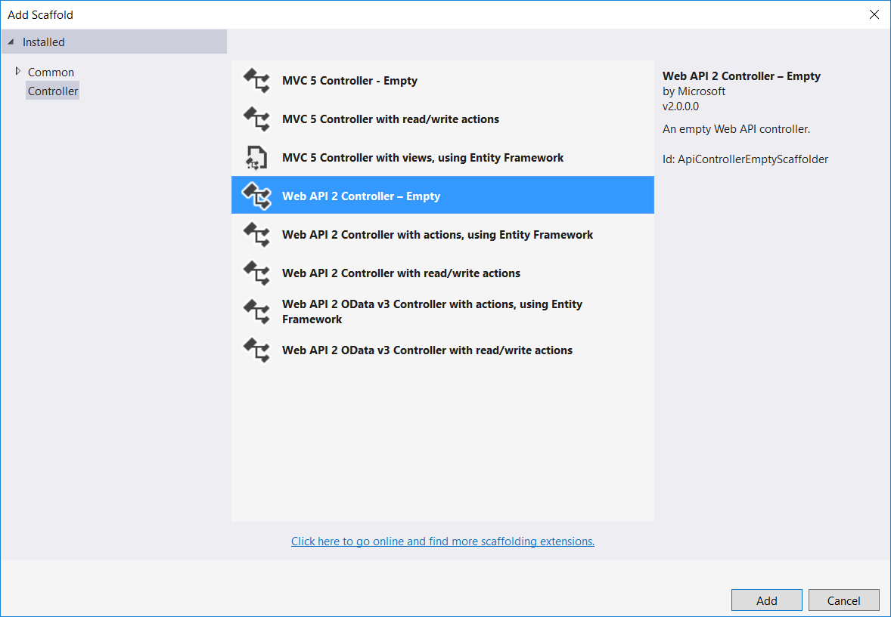
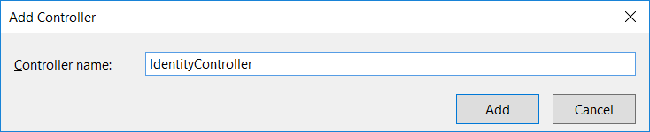
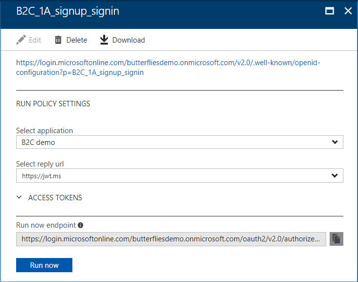

# Integrate REST API claims exchanges in your Azure AD B2C user journey as validation of user input

[!INCLUDE [active-directory-b2c-advanced-audience-warning](../../includes/active-directory-b2c-advanced-audience-warning.md)]

With the Identity Experience Framework, which underlies Azure Active Directory B2C (Azure AD B2C), you can integrate with a RESTful API in a user journey. In this walkthrough, you'll learn how Azure AD B2C interacts with .NET Framework RESTful services (web API).

## Introduction
By using Azure AD B2C, you can add your own business logic to a user journey by calling your own RESTful service. The Identity Experience Framework sends data to the RESTful service in an *Input claims* collection and receives data back from RESTful in an *Output claims* collection. With RESTful service integration, you can:

* **Validate user input data**: This action prevents malformed data from persisting into Azure AD. If the value from the user is not valid, your RESTful service returns an error message that instructs the user to provide an entry. For example, you can verify that the email address provided by the user exists in your customer's database.
* **Overwrite input claims**: For example, if a user enters the first name in all lowercase or all uppercase letters, you can format the name with only the first letter capitalized.
* **Enrich user data by further integrating with corporate line-of-business applications**: Your RESTful service can receive the user's email address, query the customer's database, and return the user's loyalty number to Azure AD B2C. The return claims can be stored in the user's Azure AD account, evaluated in the next *Orchestration Steps*, or included in the access token.
* **Run custom business logic**: You can send push notifications, update corporate databases, run a user migration process, manage permissions, audit databases, and perform other actions.

You can design the integration with the RESTful services in the following ways:

* **Validation technical profile**: The call to the RESTful service happens within the validation technical profile of the specified technical profile. The validation technical profile validates the user-provided data before the user journey moves forward. With the validation technical profile, you can:
   * Send input claims.
   * Validate the input claims and throw custom error messages.
   * Send back output claims.

* **Claims exchange**: This design is similar to the validation technical profile, but it happens within an orchestration step. This definition is limited to:
   * Send input claims.
   * Send back output claims.

## RESTful walkthrough
In this walkthrough, you develop a .NET Framework web API that validates the user input and provides a user loyalty number. For example, your application can grant access to *platinum benefits* based on the loyalty number.

Overview:
* Develop the RESTful service (.NET Framework web API).
* Use the RESTful service in the user journey.
* Send input claims and read them in your code.
* Validate the user's first name.
* Send back a loyalty number.
* Add the loyalty number to a JSON Web Token (JWT).

## Prerequisites
Complete the steps in the [Getting started with custom policies](active-directory-b2c-get-started-custom.md) article.

## Step 1: Create an ASP.NET web API

1. In Visual Studio, create a project by selecting **File** > **New** > **Project**.

2. In the **New Project** window, select **Visual C#** > **Web** > **ASP.NET Web Application (.NET Framework)**.

3. In the **Name** box, type a name for the application (for example, *Contoso.AADB2C.API*), and then select **OK**.

    

4. In the **New ASP.NET Web Application** window, select a **Web API** or **Azure API app** template.

    

5. Make sure that authentication is set to **No Authentication**.

6. Select **OK** to create the project.

## Step 2: Prepare the REST API endpoint

### Step 2.1: Add data models
The models represent the input claims and output claims data in your RESTful service. Your code reads the input data by deserializing the input claims model from a JSON string to a C# object (your model). The ASP.NET web API automatically deserializes the output claims model back to JSON and then writes the serialized data to the body of the HTTP response message.

Create a model that represents input claims by doing the following:

1. If Solution Explorer is not already open, select **View** > **Solution Explorer**.
2. In Solution Explorer, right-click the **Models** folder, select **Add**, and then select **Class**.

    

3. Name the class `InputClaimsModel`, and then add the following properties to the `InputClaimsModel` class:

    ```csharp
    namespace Contoso.AADB2C.API.Models
    {
        public class InputClaimsModel
        {
            public string email { get; set; }
            public string firstName { get; set; }
            public string lastName { get; set; }
        }
    }
    ```

4. Create a new model, `OutputClaimsModel`, and then add the following properties to the `OutputClaimsModel` class:

    ```csharp
    namespace Contoso.AADB2C.API.Models
    {
        public class OutputClaimsModel
        {
            public string loyaltyNumber { get; set; }
        }
    }
    ```

5. Create one more model, `B2CResponseContent`, which you use to throw input-validation error messages. Add the following properties to the `B2CResponseContent` class, provide the missing references, and then save the file:

    ```csharp
    namespace Contoso.AADB2C.API.Models
    {
        public class B2CResponseContent
        {
            public string version { get; set; }
            public int status { get; set; }
            public string userMessage { get; set; }

            public B2CResponseContent(string message, HttpStatusCode status)
            {
                this.userMessage = message;
                this.status = (int)status;
                this.version = Assembly.GetExecutingAssembly().GetName().Version.ToString();
            }
        }
    }
    ```

### Step 2.2: Add a controller
In the web API, a _controller_ is an object that handles HTTP requests. The controller returns output claims or, if the first name is not valid, throws a Conflict HTTP error message.

1. In Solution Explorer, right-click the **Controllers** folder, select **Add**, and then select **Controller**.

    

2. In the **Add Scaffold** window, select **Web API Controller - Empty**, and then select **Add**.

    

3. In the **Add Controller** window, name the controller **IdentityController**, and then select **Add**.

    

    The scaffolding creates a file named *IdentityController.cs* in the *Controllers* folder.

4. If the *IdentityController.cs* file is not open already, double-click it, and then replace the code in the file with the following code:

    ```csharp
    using Contoso.AADB2C.API.Models;
    using Newtonsoft.Json;
    using System;
    using System.NET;
    using System.Web.Http;

    namespace Contoso.AADB2C.API.Controllers
    {
        public class IdentityController: ApiController
        {
            [HttpPost]
            public IHttpActionResult SignUp()
            {
                // If no data came in, then return
                if (this.Request.Content == null) throw new Exception();

                // Read the input claims from the request body
                string input = Request.Content.ReadAsStringAsync().Result;

                // Check the input content value
                if (string.IsNullOrEmpty(input))
                {
                    return Content(HttpStatusCode.Conflict, new B2CResponseContent("Request content is empty", HttpStatusCode.Conflict));
                }

                // Convert the input string into an InputClaimsModel object
                InputClaimsModel inputClaims = JsonConvert.DeserializeObject(input, typeof(InputClaimsModel)) as InputClaimsModel;

                if (inputClaims == null)
                {
                    return Content(HttpStatusCode.Conflict, new B2CResponseContent("Can not deserialize input claims", HttpStatusCode.Conflict));
                }

                // Run an input validation
                if (inputClaims.firstName.ToLower() == "test")
                {
                    return Content(HttpStatusCode.Conflict, new B2CResponseContent("Test name is not valid, please provide a valid name", HttpStatusCode.Conflict));
                }

                // Create an output claims object and set the loyalty number with a random value
                OutputClaimsModel outputClaims = new OutputClaimsModel();
                outputClaims.loyaltyNumber = new Random().Next(100, 1000).ToString();

                // Return the output claim(s)
                return Ok(outputClaims);
            }
        }
    }
    ```

## Step 3: Publish the project to Azure
1. In Solution Explorer, right-click the **Contoso.AADB2C.API** project, and then select **Publish**.

    

2. In the **Publish** window, select **Microsoft Azure App Service**, and then select **Publish**.

    

    The **Create App Service** window opens. In it, you create all the necessary Azure resources to run the ASP.NET web app in Azure.

    > [!NOTE]
    >For more information about how to publish, see [Create an ASP.NET web app in Azure](https://docs.microsoft.com/azure/app-service-web/app-service-web-get-started-dotnet).

3. In the **Web App Name** box, type a unique app name (valid characters are a-z, 0-9, and hyphens (-). The URL of the web app is http://<app_name>.azurewebsites.NET, where *app_name* is the name of your web app. You can accept the automatically generated name, which is unique.

    

4. To start creating Azure resources, select **Create**.
    After the ASP.NET web app has been created, the wizard publishes it to Azure and then starts the app in the default browser.

6. Copy the web app's URL.

## Step 4: Add the new `loyaltyNumber` claim to the schema of your TrustFrameworkExtensions.xml file
The `loyaltyNumber` claim is not yet defined in our schema. Add a definition within the `<BuildingBlocks>` element, which you can find at the beginning of the *TrustFrameworkExtensions.xml* file.

```xml
<BuildingBlocks>
    <ClaimsSchema>
        <ClaimType Id="loyaltyNumber">
            <DisplayName>loyaltyNumber</DisplayName>
            <DataType>string</DataType>
            <UserHelpText>Customer loyalty number</UserHelpText>
        </ClaimType>
    </ClaimsSchema>
</BuildingBlocks>
```

## Step 5: Add a claims provider
Every claims provider must have one or more technical profiles, which determine the endpoints and protocols needed to communicate with the claims provider.

A claims provider can have multiple technical profiles for various reasons. For example, multiple technical profiles might be defined because the claims provider supports multiple protocols, endpoints can have varying capabilities, or releases can contain claims that have a variety of assurance levels. It might be acceptable to release sensitive claims in one user journey but not in another.

The following XML snippet contains a claims provider node with two technical profiles:

* **TechnicalProfile Id="REST-API-SignUp"**: Defines your RESTful service.
  * `Proprietary` is described as the protocol for a RESTful-based provider.
  * `InputClaims` defines the claims that will be sent from Azure AD B2C to the REST service.

    In this example, the content of the claim `givenName` sends to the REST service as `firstName`, the content of the claim `surname` sends to the REST service as `lastName`, and `email` sends as is. The `OutputClaims` element defines the claims that are retrieved from RESTful service back to Azure AD B2C.

* **TechnicalProfile Id="LocalAccountSignUpWithLogonEmail"**: Adds a validation technical profile to an existing technical profile (defined in base policy). During the sign-up journey, the validation technical profile invokes the preceding technical profile. If the RESTful service returns an HTTP error 409 (a conflict error), the error message is displayed to the user.

Locate the `<ClaimsProviders>` node, and then add the following XML snippet under the `<ClaimsProviders>` node:

```xml
<ClaimsProvider>
  <DisplayName>REST APIs</DisplayName>
  <TechnicalProfiles>

    <!-- Custom Restful service -->
    <TechnicalProfile Id="REST-API-SignUp">
      <DisplayName>Validate user's input data and return loyaltyNumber claim</DisplayName>
      <Protocol Name="Proprietary" Handler="Web.TPEngine.Providers.RestfulProvider, Web.TPEngine, Version=1.0.0.0, Culture=neutral, PublicKeyToken=null" />
      <Metadata>
        <Item Key="ServiceUrl">https://your-app-name.azurewebsites.NET/api/identity/signup</Item>
        <Item Key="AuthenticationType">None</Item>
        <Item Key="SendClaimsIn">Body</Item>
        <Item Key="AllowInsecureAuthInProduction">true</Item>
      </Metadata>
      <InputClaims>
        <InputClaim ClaimTypeReferenceId="email" />
        <InputClaim ClaimTypeReferenceId="givenName" PartnerClaimType="firstName" />
        <InputClaim ClaimTypeReferenceId="surname" PartnerClaimType="lastName" />
      </InputClaims>
      <OutputClaims>
        <OutputClaim ClaimTypeReferenceId="loyaltyNumber" PartnerClaimType="loyaltyNumber" />
      </OutputClaims>
      <UseTechnicalProfileForSessionManagement ReferenceId="SM-Noop" />
    </TechnicalProfile>

    <!-- Change LocalAccountSignUpWithLogonEmail technical profile to support your validation technical profile -->
    <TechnicalProfile Id="LocalAccountSignUpWithLogonEmail">
      <OutputClaims>
        <OutputClaim ClaimTypeReferenceId="loyaltyNumber" PartnerClaimType="loyaltyNumber" />
      </OutputClaims>
      <ValidationTechnicalProfiles>
        <ValidationTechnicalProfile ReferenceId="REST-API-SignUp" />
      </ValidationTechnicalProfiles>
    </TechnicalProfile>
  </TechnicalProfiles>
</ClaimsProvider>
```

## Step 6: Add the `loyaltyNumber` claim to your relying party policy file so the claim is sent to your application
Edit your *SignUpOrSignIn.xml* relying party (RP) file, and modify the TechnicalProfile Id="PolicyProfile" element to add the following: `<OutputClaim ClaimTypeReferenceId="loyaltyNumber" />`.

After you add the new claim, the relying party code looks like this:

```xml
<RelyingParty>
    <DefaultUserJourney ReferenceId="SignUpOrSignIn" />
    <TechnicalProfile Id="PolicyProfile">
        <DisplayName>PolicyProfile</DisplayName>
        <Protocol Name="OpenIdConnect" />
        <OutputClaims>
        <OutputClaim ClaimTypeReferenceId="displayName" />
        <OutputClaim ClaimTypeReferenceId="givenName" />
        <OutputClaim ClaimTypeReferenceId="surname" />
        <OutputClaim ClaimTypeReferenceId="email" />
        <OutputClaim ClaimTypeReferenceId="objectId" PartnerClaimType="sub"/>
        <OutputClaim ClaimTypeReferenceId="identityProvider" />
        <OutputClaim ClaimTypeReferenceId="loyaltyNumber" DefaultValue="" />
        </OutputClaims>
        <SubjectNamingInfo ClaimType="sub" />
    </TechnicalProfile>
    </RelyingParty>
</TrustFrameworkPolicy>
```

## Step 7: Upload the policy to your tenant

1. In the [Azure portal](https://portal.azure.com), switch to the [context of your Azure AD B2C tenant](active-directory-b2c-navigate-to-b2c-context.md), and then open **Azure AD B2C**.

2. Select **Identity Experience Framework**.

3. Open **All Policies**.

4. Select **Upload Policy**.

5. Select the **Overwrite the policy if it exists** check box.

6. Upload the TrustFrameworkExtensions.xml file, and ensure that it passes validation.

7. Repeat the preceding step with the SignUpOrSignIn.xml file.

## Step 8: Test the custom policy by using Run Now
1. Select **Azure AD B2C Settings**, and then go to **Identity Experience Framework**.

    > [!NOTE]
    > **Run now** requires at least one application to be preregistered on the tenant. To learn how to register applications, see the Azure AD B2C [Get started](active-directory-b2c-get-started.md) article or the [Application registration](active-directory-b2c-app-registration.md) article.

2. Open **B2C_1A_signup_signin**, the relying party (RP) custom policy that you uploaded, and then select **Run now**.

    

3. Test the process by typing **Test** in the **Given Name** box.
    Azure AD B2C displays an error message at the top of the window.

    

4. In the **Given Name** box, type a name (other than "Test").
    Azure AD B2C signs up the user and then sends a loyaltyNumber to your application. Note the number in this JWT.

```
{
  "typ": "JWT",
  "alg": "RS256",
  "kid": "X5eXk4xyojNFum1kl2Ytv8dlNP4-c57dO6QGTVBwaNk"
}.{
  "exp": 1507125903,
  "nbf": 1507122303,
  "ver": "1.0",
  "iss": "https://contoso.b2clogin.com/f06c2fe8-709f-4030-85dc-38a4bfd9e82d/v2.0/",
  "aud": "e1d2612f-c2bc-4599-8e7b-d874eaca1ee1",
  "acr": "b2c_1a_signup_signin",
  "nonce": "defaultNonce",
  "iat": 1507122303,
  "auth_time": 1507122303,
  "loyaltyNumber": "290",
  "given_name": "Emily",
  "emails": ["B2cdemo@outlook.com"]
}
```

## (Optional) Download the complete policy files and code
* After you complete the [Get started with custom policies](active-directory-b2c-get-started-custom.md) walkthrough, we recommend that you build your scenario by using your own custom policy files. For your reference, we have provided [Sample policy files](https://github.com/Azure-Samples/active-directory-b2c-custom-policy-starterpack/tree/master/scenarios/aadb2c-ief-rest-api-netfw).
* You can download the complete code from [Sample Visual Studio solution for reference](https://github.com/Azure-Samples/active-directory-b2c-custom-policy-starterpack/tree/master/scenarios/aadb2c-ief-rest-api-netfw/).

## Next steps
* [Secure your RESTful API with basic authentication (username and password)](active-directory-b2c-custom-rest-api-netfw-secure-basic.md)
* [Secure your RESTful API with client certificates](active-directory-b2c-custom-rest-api-netfw-secure-cert.md)
