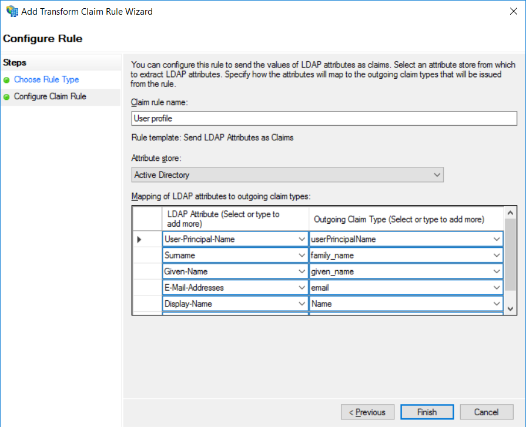

# Add ADFS as a SAML identity provider using custom policies in Azure Active Directory B2C

[!INCLUDE [active-directory-b2c-advanced-audience-warning](../../includes/active-directory-b2c-advanced-audience-warning.md)]

This article shows you how to enable sign-in for an ADFS user account by using [custom policies](active-directory-b2c-overview-custom.md) in Azure Active Directory (Azure AD) B2C.

## Prerequisites

Complete the steps in the [Getting started with custom policies](active-directory-b2c-get-started-custom.md) article.

## Add the ADFS account application key to Azure AD B2C

Federation with an ADFS account requires a client secret for the account to trust Azure AD B2C on behalf of the application. You need to store your ADFS certificate in your Azure AD B2C tenant. 

1. Log in to the [Azure portal](https://portal.azure.com/).
2. Make sure you're using the directory that contains your Azure AD B2C tenant by switching to it in the top-right corner of the Azure portal. Select **Switch Directory**, and then choose the directory that contains the tenant you created. In this tutorial, the *contoso* directory is used that contains the tenant named *contoso0522Tenant.onmicrosoft.com*.

    

3. Choose **All services** in the top-left corner of the Azure portal, search for and select **Azure AD B2C**. You should now be using your tenant.
4. On the Overview page, select **Identity Experience Framework**.
5. Select **Policy Keys** to view the keys available in your tenant, and then click **Add**.
6. Choose **Upload** as the Option.
7. Enter `ADFSSamlCert` for the name. The prefix `B2C_1A_` might be added automatically.
8. Browse to and select your certificate .pfx file with the private key. This certificate with the private key should be the same one that was issued and used for the ADFS relying party.
9. Click **Create** and confirm that you've created the `B2C_1A_ADFSSamlCert` key.

## Add a claims provider in your extension policy

If you want users to sign in by using an ADFS account, you need to define the account as a claims provider. You do this by specifying an endpoint that Azure AD B2C communicates with. The endpoint provides a set of claims that are used by Azure AD B2C to verify that a specific user has authenticated.

Define ADFS as a claims provider, by adding **ClaimsProvider** element in your extension policy file.

1. Open the *TrustFrameworkExtensions.xml* policy file in your working directory. If you need an XML editor, [try Visual Studio Code](https://code.visualstudio.com/download), which is a lightweight cross-platform editor.
2. Add the following XML under the **ClaimsProviders** element and replace **your-ADFS-domain** with your ADFS domain name and replace the value of the **identityProvider** output claim with your DNS (Arbitrary value that indicates your domain), and save the file. 

    ```xml
    <ClaimsProvider>
      <Domain>contoso.com</Domain>
      <DisplayName>Contoso ADFS</DisplayName>
      <TechnicalProfiles>
        <TechnicalProfile Id="Contoso-SAML2">
          <DisplayName>Contoso ADFS</DisplayName>
          <Description>Login with your Contoso account</Description>
          <Protocol Name="SAML2"/>
          <Metadata>
            <Item Key="RequestsSigned">false</Item>
            <Item Key="WantsEncryptedAssertions">false</Item>
            <Item Key="PartnerEntity">https://your-ADFS-domain/federationmetadata/2007-06/federationmetadata.xml</Item>
          </Metadata>
          <CryptographicKeys>
            <Key Id="SamlAssertionSigning" StorageReferenceId="B2C_1A_ADFSSamlCert"/>
            <Key Id="SamlMessageSigning" StorageReferenceId="B2C_1A_ADFSSamlCert"/>
          </CryptographicKeys>
          <OutputClaims>
            <OutputClaim ClaimTypeReferenceId="socialIdpUserId" PartnerClaimType="userPrincipalName" />
            <OutputClaim ClaimTypeReferenceId="givenName" PartnerClaimType="given_name"/>
            <OutputClaim ClaimTypeReferenceId="surname" PartnerClaimType="family_name"/>
            <OutputClaim ClaimTypeReferenceId="email" PartnerClaimType="email"/>
            <OutputClaim ClaimTypeReferenceId="displayName" PartnerClaimType="name"/>
            <OutputClaim ClaimTypeReferenceId="identityProvider" DefaultValue="contoso.com" />
            <OutputClaim ClaimTypeReferenceId="authenticationSource" DefaultValue="socialIdpAuthentication"/>
          </OutputClaims>
          <OutputClaimsTransformations>
            <OutputClaimsTransformation ReferenceId="CreateRandomUPNUserName"/>
            <OutputClaimsTransformation ReferenceId="CreateUserPrincipalName"/>
            <OutputClaimsTransformation ReferenceId="CreateAlternativeSecurityId"/>
            <OutputClaimsTransformation ReferenceId="CreateSubjectClaimFromAlternativeSecurityId"/>
          </OutputClaimsTransformations>
          <UseTechnicalProfileForSessionManagement ReferenceId="SM-Noop"/>
        </TechnicalProfile>
      </TechnicalProfiles>
    </ClaimsProvider>
    ```

## Register the claims provider for sign-up and sign-in

To make the ADFS account identity provider available in the sign-up and sign-in pages, you need to add it to your **SignUpOrSignIn** user journey. 

Make a copy of an existing template user journey and then modify it so that it includes the ADFS identity provider:

>[!NOTE]
>If you previously copied the **UserJourneys** element from the base file of your policy to the extension file (*TrustFrameworkExtensions.xml*) you can skip this section.

1. Open the base file of your policy. For example, *TrustFrameworkBase.xml*.
2. Copy the entire content of **UserJourneys** element.
3. Open the extension file (*TrustFrameworkExtensions.xml*) and paste the entire content of **UserJourneys** element that you copied in the extension file.

### Display the button

The **ClaimsProviderSelections** element defines the list of claims provider selections and their order.  The **ClaimsProviderSelection** element is analogous to an identity provider button on a sign-up and sign-in page. If you add a **ClaimsProviderSelection** element for an ADFS account, a new button is displayed when a user sees the page. To add this element:

1. In the **UserJourney** element with an identifier of `SignUpOrSignIn` in the user journeys that you copied, locate the **OrchestrationStep** element of `Order="1"`.
2. Add following **ClaimsProviderSelection** element under the **ClaimsProviderSelections** element:

    ```xml
    <ClaimsProviderSelection TargetClaimsExchangeId="ContosoExchange" />
    ```

### Link the button to an action

Now that you have a button in place, you need to link it to an action. The action, in this case, is for Azure AD B2C to communicate with ADFS account to receive a token. Link the button to an action by linking the technical profile for your ADFS account claims provider:

1. Find the **OrchestrationStep** of `Order="2"` under the **UserJourney** element.
2. Add following **ClaimsExchange** element under the **ClaimsExchanges** element:

    ```xml
    <ClaimsExchange Id="ContosoExchange" TechnicalProfileReferenceId="Contoso-SAML2" />
    ```

> [!NOTE]
> * Make sure that the `Id` has the same value as `TargetClaimsExchangeId` in the preceding section.
> * Make sure that the `TechnicalProfileReferenceId` is set to the technical profile you created earlier (Contoso-SAML2).


## [Optional] Register the claims provider for profile edit

You may also want to add the ADFS account identity provider to your profile edit user journey.

### Display the button

1. Open the extension file of your policy. For example, *TrustFrameworkExtensions.xml*.
2. In the **UserJourney** element with an identifier `ProfileEdit` in the user journeys that you copied, locate the **OrchestrationStep** element of `Order="1"`.
3. Add following **ClaimsProviderSelection** element under **ClaimsProviderSelections** element:

    ```xml
    <ClaimsProviderSelection TargetClaimsExchangeId="ContosoExchange" />
    ```

### Link the button to an action

1. Find the **OrchestrationStep** of `Order="2"` under the **UserJourney** element.
2. Add following **ClaimsExchange** element under the **ClaimsExchanges** element:

    ```xml
    <ClaimsExchange Id="ContosoExchange" TechnicalProfileReferenceId="Contoso-SAML2" />
    ```

## Upload the policy to your tenant

1. In the Azure portal, select **All Policies**.
2. Select **Upload Policy**.
3. Enable **Overwrite the policy if it exists**.
4. Browse to and select your *TrustFrameworkExtensions.xml* policy file, and then select **Upload**. Make sure that the validation is successful.


## Configure an ADFS Relying Party Trust

To use ADFS as an identity provider in Azure AD B2C, you need to create an ADFS Relying Party Trust with the Azure AD B2C SAML metadata. The following example shows a URL address to the SAML metadata of an Azure AD B2C technical profile:

```
https://login.microsoftonline.com/te/your-tenant/your-policy/samlp/metadata?idptp=your-technical-profile
```

Replace the following values:

- **your-tenant** with your tenant name, such as your-tenant.onmicrosoft.com.
- **your-policy** with your policy name. Use the policy where you configure the SAML provider technical profile, or a policy that inherits from that policy.
- **your-technical-profile** with tha name of your SAML identity provider technical profile.
 
Open a browser and navigate to the URL. Make sure you type the correct URL and that you have access to the XML metadata file.

To add a new relying party trust by using the ADFS Management snap-in and manually configure the settings, perform the following procedure on a federation server. Membership in **Administrators** or equivalent on the local computer is the minimum required to complete this procedure. Review details about using the appropriate accounts and group memberships at [Local and Domain Default Groups](http://go.microsoft.com/fwlink/?LinkId=83477).

1. In Server Manager, select **Tools**, and then select **ADFS Management**.
2. Select **Add Relying Party Trust**.
3. On the **Welcome** page, choose **Claims aware**, and then click **Start**.
4. On the **Select Data Source** page, select **Import data about the relying party publish online or on a local network**, provide your Azure AD B2C metadata URL, and then click **Next**.
5. On the **Specify Display Name** page, enter a **Display name**, under **Notes**, enter a description for this relying party trust, and then click **Next**.
6. On the **Choose Access Control Policy** page, select a policy, and then click **Next**.
7. On the **Ready to Add Trust** page, review the settings, and then click **Next** to save your relying party trust information.
8. On the **Finish** page, click **Close**, this action automatically displays the **Edit Claim Rules** dialog box.
9. Select **Add Rule**.  
10. In **Claim rule template**, select **Send LDAP attributes as claims**.
11. Provide a **Claim rule name**. For the **Attribute store**, select **Select Active Directory**, add the following claims, then click **Finish** and **OK**.

    

12.  Based on your certificate type, you may need to set the HASH algorithm. On the relying party trust (B2C Demo) properties window, select the **Advanced** tab and change the **Secure hash algorithm** to `SHA-1` or `SHA-256`, and click **Ok**.  

### Update the relying party metadata

Changing the SAML technical profile requires you to update ADFS with the updated metadata version. You don’t need to update the metadata when you create the relying party application, but when you make a change, you update the metadata in ADFS.

1. In Server Manager, select **Tools**, and then select **ADFS Management**.
2. Select the relying party trust you created, select **Update from Federation Metadata**, and then click **Update**. 

### Test the policy by using Run Now

1.  Open **Azure AD B2C Settings** and go to **Identity Experience Framework**.
2.  Open **B2C_1A_ProfileEdit**, the relying party (RP) custom policy that you uploaded. Select **Run now**. You should be able to sign in using ADFS account.

## Download the complete policy files

Optional: You can build your scenario using your own custom policy files after completing the steps in [Getting Started with Custom Policies](active-directory-b2c-get-started-custom.md). For example files, see [Policy sample files for reference only](https://github.com/Azure-Samples/active-directory-b2c-custom-policy-starterpack/tree/master/scenarios/aadb2c-ief-setup-adfs2016-app).
