---
title: 'Azure Active Directory B2C: Add ADFS as a SAML identity provider using custom policies'
description: A How-To article on setting up ADFS 2016 using SAML protocol and custom policies
services: active-directory-b2c
documentationcenter: ''
author: yoelhor
manager: joroja
editor: 

ms.assetid:
ms.service: active-directory-b2c
ms.workload: identity
ms.tgt_pltfrm: na
ms.topic: article
ms.devlang: na
ms.date: 08/04/2017
ms.author: yoelh
---

# Azure Active Directory B2C: Add ADFS as a SAML identity provider using custom policies

[!INCLUDE [active-directory-b2c-advanced-audience-warning](../../includes/active-directory-b2c-advanced-audience-warning.md)]

This article shows you how to enable sign-in for users from ADFS account through the use of [custom policies](active-directory-b2c-overview-custom.md).

## Prerequisites

Complete the steps in the [Getting started with custom policies](active-directory-b2c-get-started-custom.md) article.

These steps include:

1.  Creating an ADFS Relying Party Trust.
2.  Adding the ADFS Relying Party Trust certificate to Azure AD B2C.
3.  Adding claims provider to a policy.
4.  Registering the ADFS account claims provider to a user journey.
5.  Uploading the policy to an Azure AD B2C tenant and test it.

## To create a claims-aware Relying Party Trust

To use ADFS as an identity provider in Azure Active Directory (Azure AD) B2C, you need to create an ADFS Relying Party Trust and supply it with the right parameters.

To add a new relying party trust by using the AD FS Management snap-in and manually configure the settings, perform the following procedure on a federation server.

Membership in **Administrators**, or equivalent, on the local computer is the minimum required to complete this procedure. Review details about using the appropriate accounts and group memberships at [Local and Domain Default Groups](http://go.microsoft.com/fwlink/?LinkId=83477)

1.  In Server Manager, click **Tools**, and then select **ADFS Management**.

2.  Click on **Add Relying Party Trust**.
    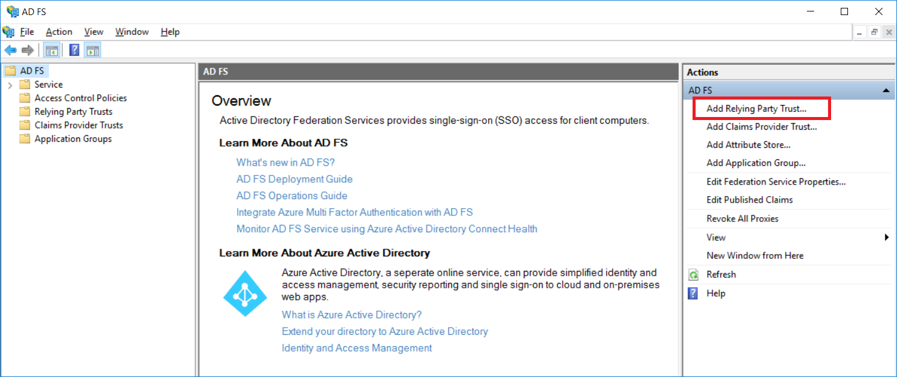

3.  On the **Welcome** page, choose **Claims aware** and click **Start**.
    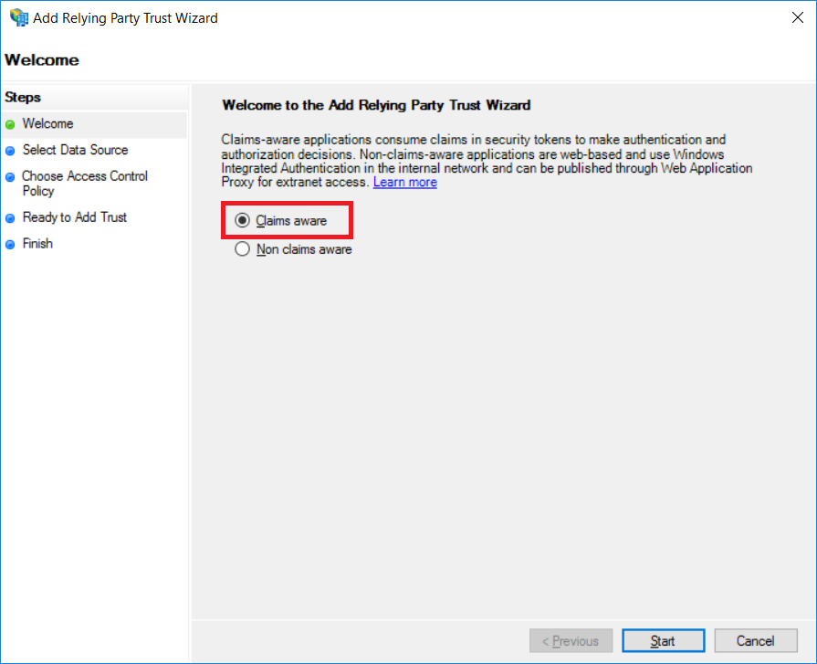
4.  On the **Select Data Source** page, click **Enter data about the relying party manually**, and then click **Next**.
    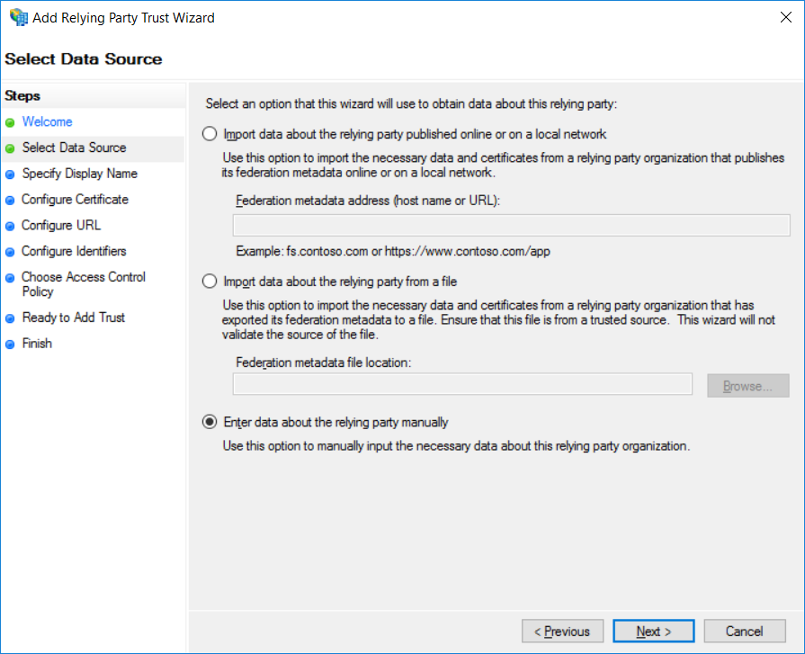

5.  On the **Specify Display Name** page, type a name in **Display name**, under **Notes** type a description for this relying party trust, and then click **Next**.
    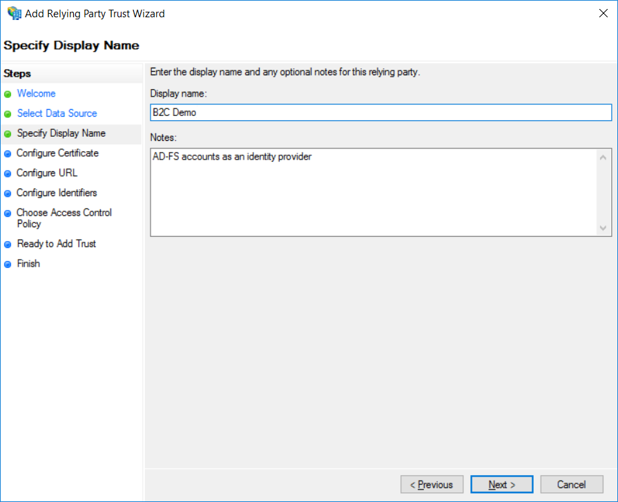
6.  Optional. If you have an optional token encryption certificate, then on the **Configure Certificate** page, click **Browse** to locate your certificate file, and then click **Next**.
    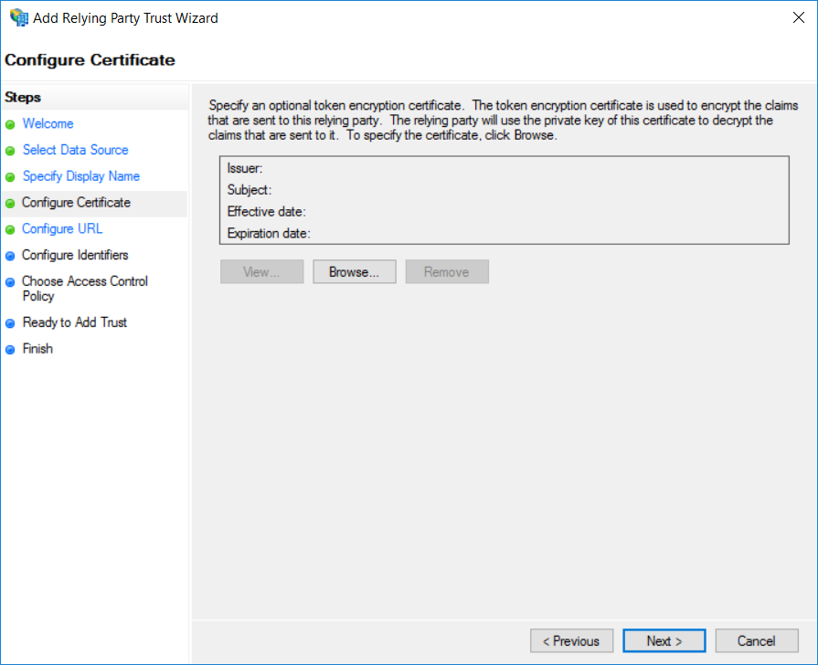
7.  On the **Configure URL** page, select the **Enable support for the SAML 2.0 WebSSO protocol** check box. Under **Relying party SAML 2.0 SSO service URL**, type the Security Assertion Markup Language (SAML) service endpoint URL for this relying party trust, and then click **Next**.  For the **Relying party SAML 2.0 SSO service URL**, paste the `https://login.microsoftonline.com/te/{tenant}.onmicrosoft.com/{policy}`. Replace {tenant} with your tenant's name (for example, contosob2c.onmicrosoft.com), and replace the {policy} with your extensions policy name (for example, B2C_1A_TrustFrameworkExtensions).
    > [!IMPORTANT]
    >The policy name  is the one that signup_or_signin policy inherits from, in this case it is: `B2C_1A_TrustFrameworkExtensions`.
    >For example the URL could be:   https://login.microsoftonline.com/te/**contosob2c**.onmicrosoft.com/**B2C_1A_TrustFrameworkBase**.

    
8. On the **Configure Identifiers** page, specify the same URL as the previous step, click **Add** to add them to the list, and then click **Next**.
    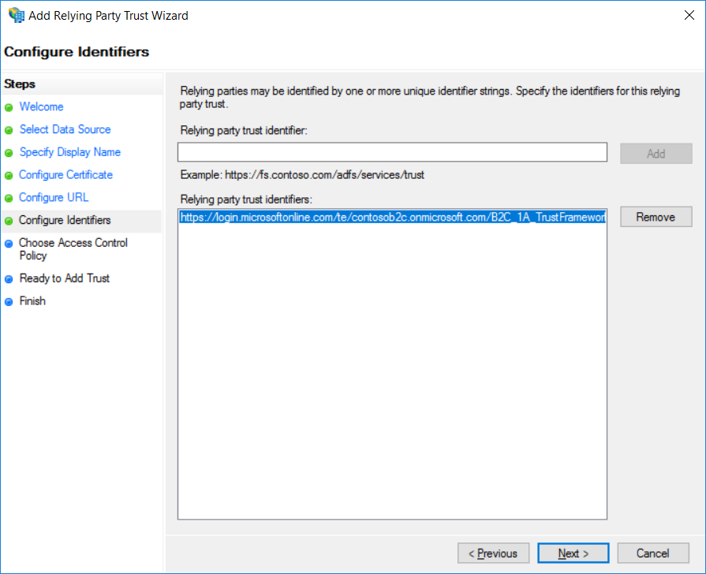
9.  On the **Choose Access Control Policy** select a policy and click **Next**.
    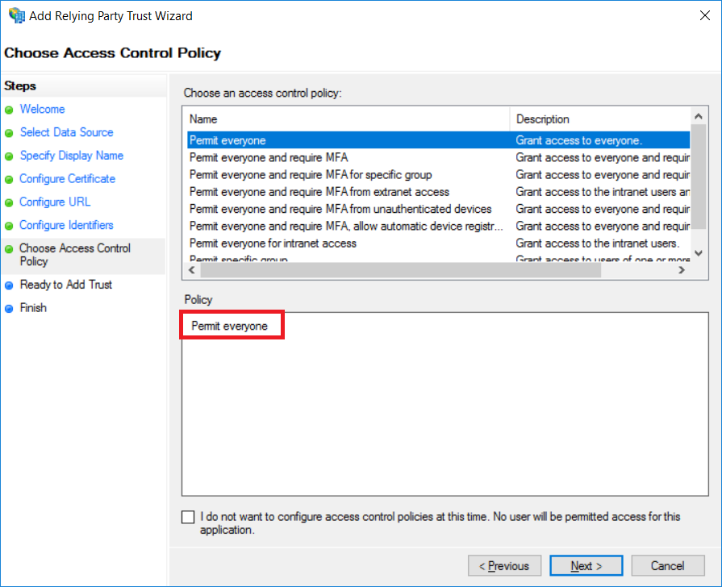
10.  On the **Ready to Add Trust** page, review the settings, and then click **Next** to save your relying party trust information.
    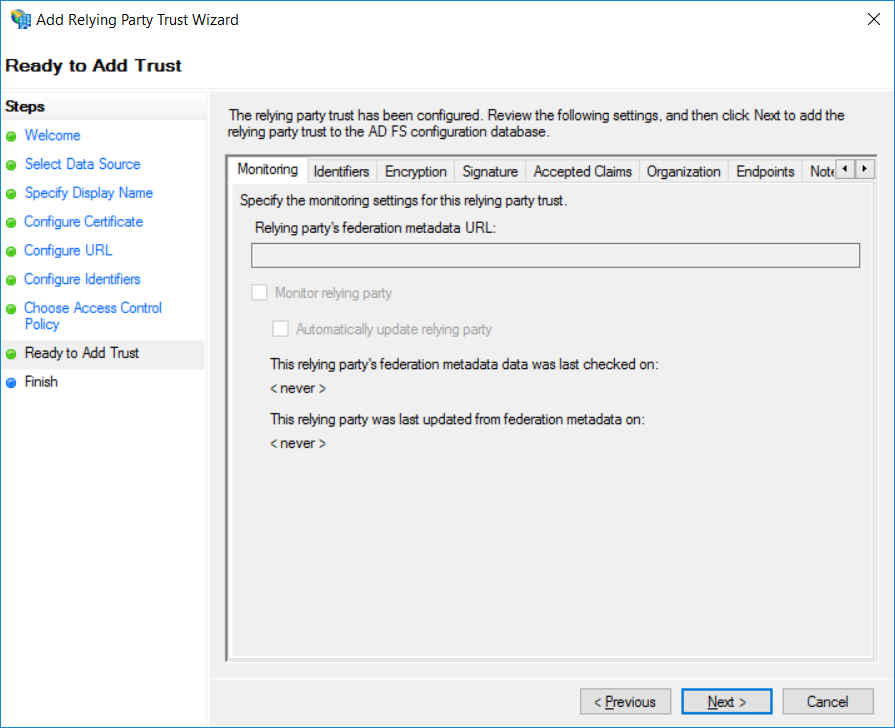
11.  On the **Finish** page, click **Close**, this action automatically displays the **Edit Claim Rules** dialog box.
    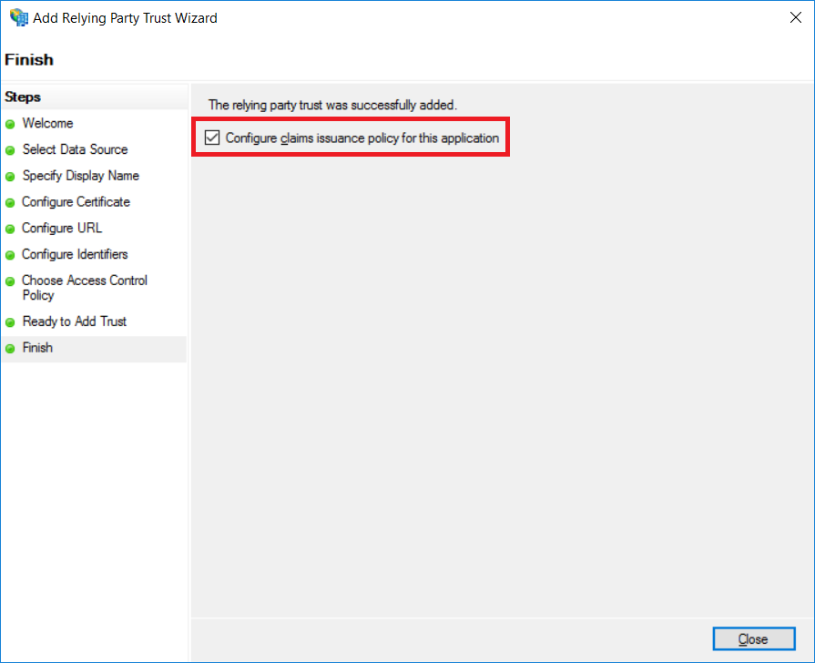
12. Click **Add Rule**.  
      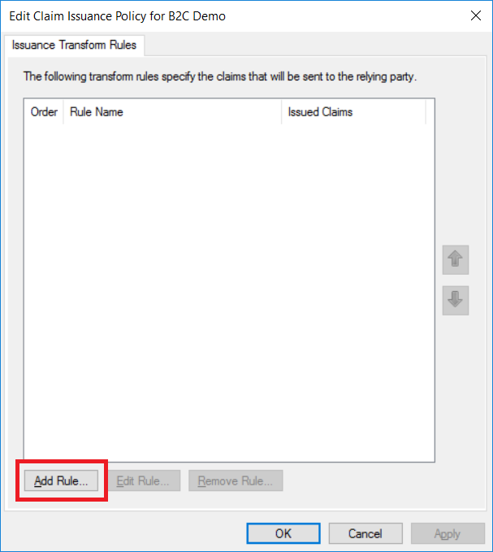
13.  In **Claim rule template**, select **Send LDAP attributes as claims**.
    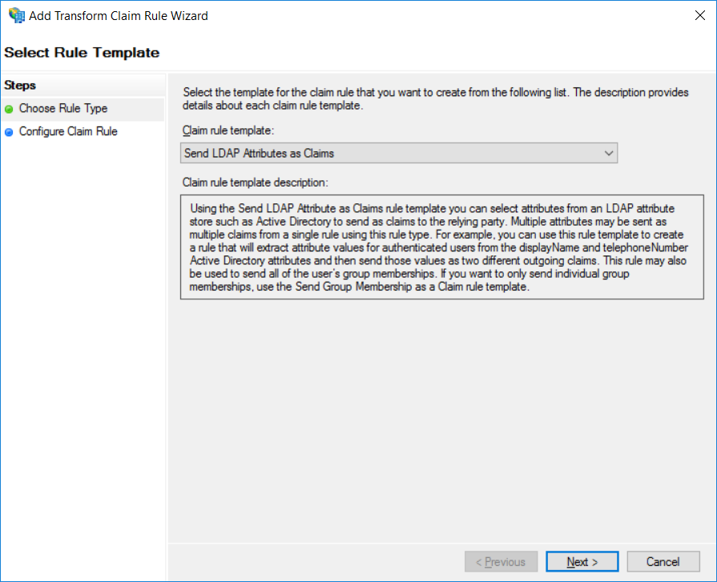
14.  Provide **Claim rule name**. For the **Attribute store** select **Select Active Directory** Add the following claims, then click **Finish** and **OK**.
    
15.  In Server Manager, select **Relying Party Trusts** then select the relying party trust you created and click **Properties**.
    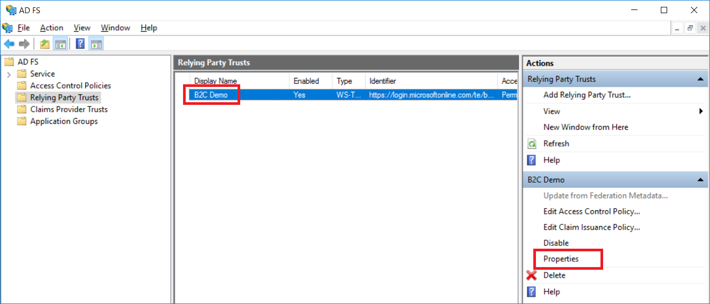
16.  One the relying party trust (B2C Demo) properties window click **Signature** tab and click **Add**.  
    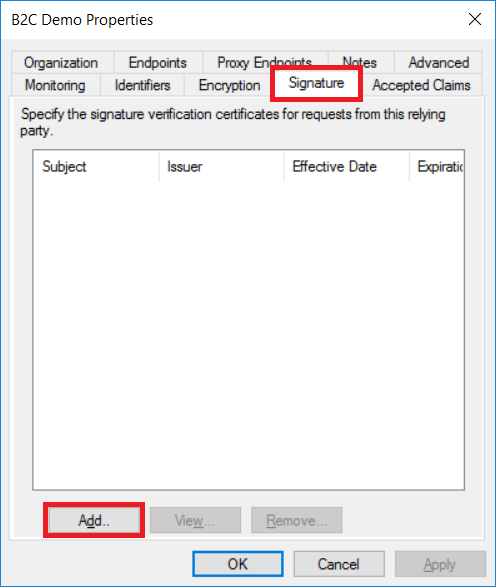
17.  Add your signature certificate (.cert file, without private key).  
    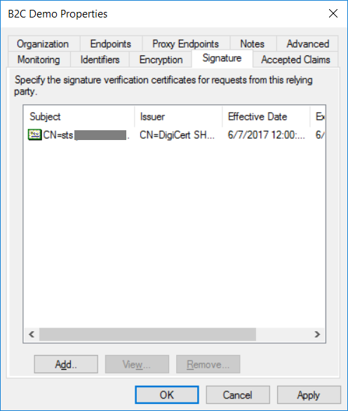
18.  On the relying party trust (B2C Demo) properties window click **Advanced** tab and change the **Secure hash algorithm** to **SHA-1**, Click **Ok**.  
    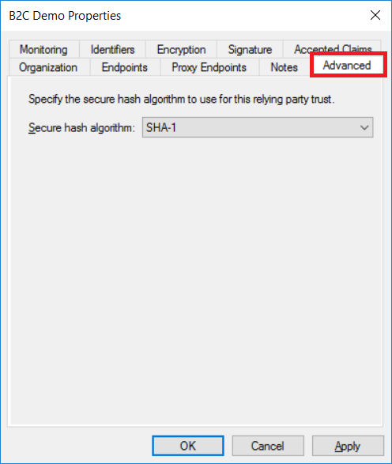

## Add the ADFS account application key to Azure AD B2C
Federation with ADFS accounts requires a client secret for ADFS account to trust Azure AD B2C on behalf of the application. You need to store your ADFS certificate in your Azure AD B2C tenant. 

1.  Go to your Azure AD B2C tenant, and select **B2C Settings** > **Identity Experience Framework**
2.  Select **Policy Keys** to view the keys available in your tenant.
3.  Click **+Add**.
4.  For **Options**, use **Upload**.
5.  For **Name**, use `ADFSSamlCert`.  
    The prefix `B2C_1A_` might be added automatically.
6.  In the File upload,** select your certificate .pfx file with private key. Note: this certificate (with the private key) should be the same one that issued and used for the ADFS relying party.
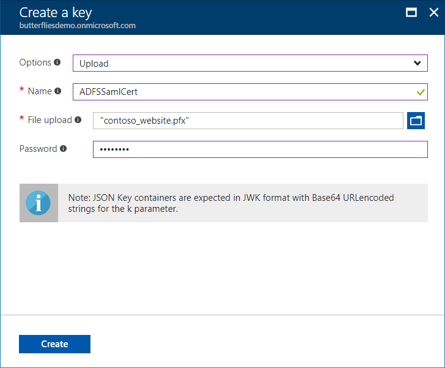
7.  Click **Create**
8.  Confirm that you've created the key `B2C_1A_ADFSSamlCert`.

## Add a claims provider in your extension policy
If you want users to sign in by using ADFS account, you need to define ADFS account as a claims provider. In other words, you need to specify an endpoint that Azure AD B2C communicates with. The endpoint provides a set of claims that are used by Azure AD B2C to verify that a specific user has authenticated.

Define ADFS as a claims provider, by adding `<ClaimsProvider>` node in your extension policy file:

1. Open the extension policy file (TrustFrameworkExtensions.xml) from your working directory. If you need an XML editor, [try Visual Studio Code](https://code.visualstudio.com/download), a lightweight cross-platform editor.
2. Find the `<ClaimsProviders>` section
3. Add the following XML snippet under the `ClaimsProviders` element and replace `identityProvider` with your DNS (Arbitrary value that indicates your domain), and save the file. 

```xml
<ClaimsProvider>
    <Domain>contoso.com</Domain>
    <DisplayName>Contoso ADFS</DisplayName>
    <TechnicalProfiles>
    <TechnicalProfile Id="Contoso-SAML2">
        <DisplayName>Contoso ADFS</DisplayName>
        <Description>Login with your Contoso account</Description>
        <Protocol Name="SAML2"/>
        <Metadata>
        <Item Key="RequestsSigned">false</Item>
        <Item Key="WantsEncryptedAssertions">false</Item>
        <Item Key="PartnerEntity">https://{your_ADFS_domain}/federationmetadata/2007-06/federationmetadata.xml</Item>
        </Metadata>
        <CryptographicKeys>
        <Key Id="SamlAssertionSigning" StorageReferenceId="B2C_1A_ADFSSamlCert"/>
        <Key Id="SamlMessageSigning" StorageReferenceId="B2C_1A_ADFSSamlCert"/>
        </CryptographicKeys>
        <OutputClaims>
        <OutputClaim ClaimTypeReferenceId="socialIdpUserId" PartnerClaimType="userPrincipalName" />
        <OutputClaim ClaimTypeReferenceId="givenName" PartnerClaimType="given_name"/>
        <OutputClaim ClaimTypeReferenceId="surname" PartnerClaimType="family_name"/>
        <OutputClaim ClaimTypeReferenceId="email" PartnerClaimType="email"/>
        <OutputClaim ClaimTypeReferenceId="displayName" PartnerClaimType="name"/>
        <OutputClaim ClaimTypeReferenceId="identityProvider" DefaultValue="contoso.com" />
        <OutputClaim ClaimTypeReferenceId="authenticationSource" DefaultValue="socialIdpAuthentication"/>
        </OutputClaims>
        <OutputClaimsTransformations>
        <OutputClaimsTransformation ReferenceId="CreateRandomUPNUserName"/>
        <OutputClaimsTransformation ReferenceId="CreateUserPrincipalName"/>
        <OutputClaimsTransformation ReferenceId="CreateAlternativeSecurityId"/>
        <OutputClaimsTransformation ReferenceId="CreateSubjectClaimFromAlternativeSecurityId"/>
        </OutputClaimsTransformations>
        <UseTechnicalProfileForSessionManagement ReferenceId="SM-Noop"/>
    </TechnicalProfile>
    </TechnicalProfiles>
</ClaimsProvider>
```

## Register the ADFS account claims provider to Sign up or Sign in user journey
At this point, the identity provider has been set up.  However, it is not available in any of the sign-up/sign-in screens. Now you need to add the ADFS account identity provider to your user `SignUpOrSignIn` user journey. To make it available, we create a duplicate of an existing template user journey.  Then, we modify it so it includes the ADFS identity provider:
    >[!NOTE]
    >If you previously copied the `<UserJourneys>` element from base file of your policy to the extension file (TrustFrameworkExtensions.xml) you can skip this section.
1.  Open the base file of your policy (for example, TrustFrameworkBase.xml).
2.  Find the `<UserJourneys>` element and copy the entire content of `<UserJourneys>` node.
3.  Open the extension file (for example, TrustFrameworkExtensions.xml) and find the `<UserJourneys>` element. If the element doesn't exist, add one.
4.  Paste the entire content of `<UserJournesy>` node that you copied as a child of the `<UserJourneys>` element.

### Display the button
The `<ClaimsProviderSelections>` element defines the list of claims provider selection options and their order.  `<ClaimsProviderSelection>` element is analogous to an identity provider button on a sign-up/sign-in page. If you add a `<ClaimsProviderSelection>` element for  ADFS account, a new button shows up when a user lands on the page. To add this element:

1.  Find the `<UserJourney>` node that includes `Id="SignUpOrSignIn"` in the user journey that you copied.
2.  Locate the `<OrchestrationStep>` node that includes `Order="1"`
3.  Add following XML snippet under `<ClaimsProviderSelections>` node:

```xml
<ClaimsProviderSelection TargetClaimsExchangeId="ContosoExchange" />
```
### Link the button to an action

Now that you have a button in place, you need to link it to an action. The action, in this case, is for Azure AD B2C to communicate with ADFS account to receive a token. Link the button to an action by linking the technical profile for your ADFS account claims provider:

1.  Find the `<OrchestrationStep>` that includes `Order="2"` in the `<UserJourney>` node.
2.  Add following XML snippet under `<ClaimsExchanges>` node:

```xml
<ClaimsExchange Id="ContosoExchange" TechnicalProfileReferenceId="Contoso-SAML2" />
```

> [!NOTE]
> * Ensure the `Id` has the same value as that of `TargetClaimsExchangeId` in the preceding section.
> * Ensure `TechnicalProfileReferenceId` is set to the technical profile you created earlier (Contoso-SAML2).

## Upload the policy to your tenant
1.  In the [Azure portal](https://portal.azure.com), switch into the [context of your Azure AD B2C tenant](active-directory-b2c-navigate-to-b2c-context.md), and open the **Azure AD B2C** blade.
2.  Select **Identity Experience Framework**.
3.  Open the **All Policies** blade.
4.  Select **Upload Policy**.
5.  Check **Overwrite the policy if it exists** box.
6.  **Upload** TrustFrameworkExtensions.xml and ensure that it does not fail the validation

## Test the custom policy by using Run Now
1.  Open **Azure AD B2C Settings** and go to **Identity Experience Framework**.
2.  Open **B2C_1A_signup_signin**, the relying party (RP) custom policy that you uploaded. Select **Run now**.
3.  You should be able to sign in using ADFS account.

## [Optional] Register the ADFS account claims provider to Profile-Edit user journey
You may want to add the ADFS account identity provider also to your user `ProfileEdit` user journey. To make it available, we repeat the last two steps:

### Display the button
1.  Open the extension file of your policy (for example, TrustFrameworkExtensions.xml).
2.  Find the `<UserJourney>` node that includes `Id="ProfileEdit"` in the user journey that you copied.
3.  Locate the `<OrchestrationStep>` node that includes `Order="1"`
4.  Add following XML snippet under `<ClaimsProviderSelections>` node:

```xml
<ClaimsProviderSelection TargetClaimsExchangeId="ContosoExchange" />
```

### Link the button to an action
1.  Find the `<OrchestrationStep>` that includes `Order="2"` in the `<UserJourney>` node.
2.  Add following XML snippet under `<ClaimsExchanges>` node:

```xml
<ClaimsExchange Id="ContosoExchange" TechnicalProfileReferenceId="Contoso-SAML2" />
```

### Test the custom Profile-Edit policy by using Run Now
1.  Open **Azure AD B2C Settings** and go to **Identity Experience Framework**.
2.  Open **B2C_1A_ProfileEdit**, the relying party (RP) custom policy that you uploaded. Select **Run now**.
3.  You should be able to sign in using ADFS account.

## Download the complete policy files
Optional: We recommend you build your scenario using your own Custom policy files after completing the Getting Started with Custom Policies walk through. [Policy sample files for reference only](https://github.com/Azure-Samples/active-directory-b2c-custom-policy-starterpack/tree/master/scenarios/aadb2c-ief-setup-adfs2016-app)
