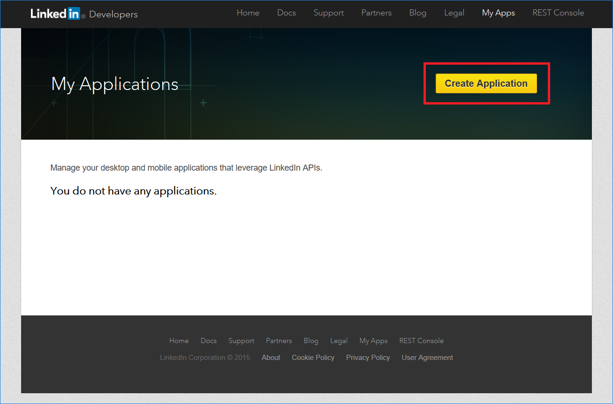
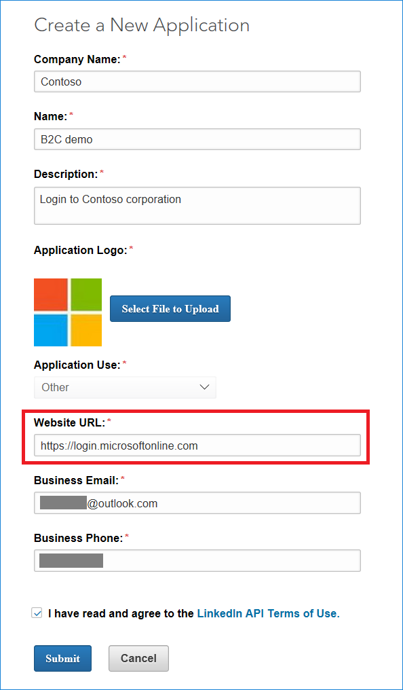
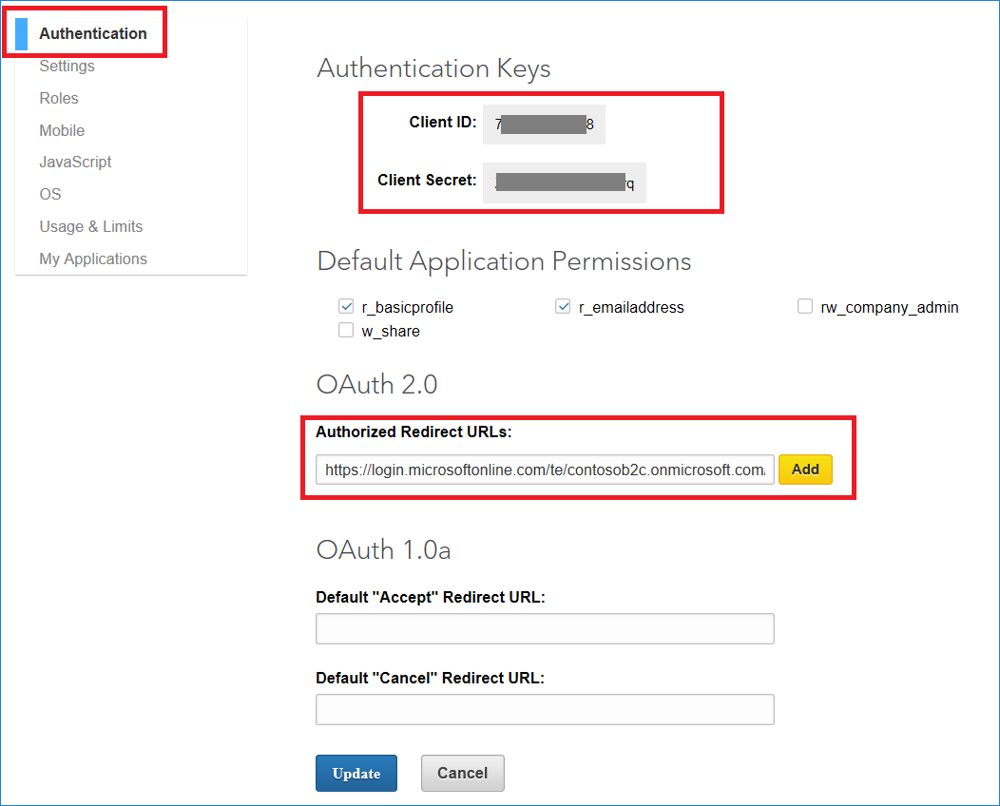
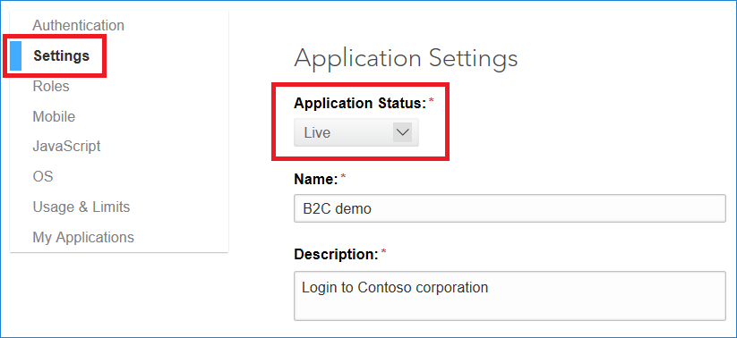

# Azure Active Directory B2C: Add LinkedIn as an identity provider by using custom policies
[!INCLUDE [active-directory-b2c-advanced-audience-warning](../../includes/active-directory-b2c-advanced-audience-warning.md)]

This article shows you how to enable sign-in for users of a LinkedIn account by using [custom policies](active-directory-b2c-overview-custom.md).

## Prerequisites
Complete the steps in the [Get started with custom policies](active-directory-b2c-get-started-custom.md) article.

## Step 1: Create a LinkedIn account application
To use LinkedIn as an identity provider in Azure Active Directory B2C (Azure AD B2C), you must create a LinkedIn application and supply it with the right parameters. You can register a LinkedIn application by going to the [LinkedIn sign-up page](https://www.linkedin.com/start/join).

1. Go to the [LinkedIn application management](https://www.linkedin.com/secure/developer?newapp=) website, sign in with your LinkedIn account credentials, and then select **Create Application**.

    

2. On the **Create a New Application** page, do the following:

    a. Type your **Company Name**, a descriptive **Name** for the company, and a **Description** of your new app.

    b. Upload your **Application Logo**.

    c. Select an **Application Use**.

    d. In the **Website URL** box, paste **https://{tenant}.b2clogin.com**.  Where {*tenant*} is your tenant name (for example contoso.b2clogin.com).

    e. Type your **Business Email** address and **Business Phone** number.

    f. At the bottom of the page, read and accept the terms of use, and then select **Submit**.

    

3. Select **Authentication**, and then note the **Client ID** and **Client Secret** values.

4. In the **Authorized Redirect URLs** box, paste **https://{tenant}.b2clogin.com/te/{tenant}.onmicrosoft.com/oauth2/authresp**. Replace {*tenant*} with your tenant name (for example, contosob2c.onmicrosoft.com). Make sure that you are using the HTTPS scheme. 

    

    >[!NOTE]
    >The client secret is an important security credential. Do not share this secret with anyone or distribute it with your app.

5. Select **Add**.

6. Select **Settings**, change the **Application status** to **Live**, and then select **Update**.

    

## Step 2: Add your LinkedIn application key to Azure AD B2C
Federation with LinkedIn accounts requires a client secret for the LinkedIn account to trust Azure AD B2C on behalf of the application. To store the LinkedIn application secret in your Azure AD B2C tenant, do the following:  

1. In your Azure AD B2C tenant, select **B2C Settings** > **Identity Experience Framework**.

2. To view the keys that are available in your tenant, select **Policy Keys**.

3. Select **Add**.

4. In the **Options** box, select **Upload**.

5. In the **Name** box, type **B2cRestClientCertificate**.  
    The prefix *B2C_1A_* might be added automatically.

6. In the **Secret** box, enter your LinkedIn application secret from the [Application Registration Portal](https://apps.dev.microsoft.com).

7. For **Key usage**, select **Encryption**.

8. Select **Create**. 

9. Confirm that you've created the `B2C_1A_LinkedInSecret`key.

## Step 3: Add a claims provider in your extension policy
If you want users to sign in by using their LinkedIn account, you must define LinkedIn as a claims provider. In other words, you must specify the endpoints that Azure AD B2C communicates with. The endpoints provide a set of claims that are used by Azure AD B2C to verify that a specific user has authenticated.

Define LinkedIn as a claims provider by adding a `<ClaimsProvider>` node in your extension policy file:

1. In your working directory, open the *TrustFrameworkExtensions.xml* extension policy file. 

2. Search for the `<ClaimsProviders>` element.

3. In the `<ClaimsProviders>` element, add the following XML snippet: 

    ```xml
    <ClaimsProvider>
      <Domain>linkedin.com</Domain>
      <DisplayName>LinkedIn</DisplayName>
      <TechnicalProfiles>
        <TechnicalProfile Id="LinkedIn-OAUTH">
          <DisplayName>LinkedIn</DisplayName>
          <Protocol Name="OAuth2" />
          <Metadata>
            <Item Key="ProviderName">linkedin</Item>
            <Item Key="authorization_endpoint">https://www.linkedin.com/oauth/v2/authorization</Item>
            <Item Key="AccessTokenEndpoint">https://www.linkedin.com/oauth/v2/accessToken</Item>
            <Item Key="ClaimsEndpoint">https://api.linkedin.com/v1/people/~:(id,first-name,last-name,email-address,headline)</Item>
            <Item Key="ClaimsEndpointAccessTokenName">oauth2_access_token</Item>
            <Item Key="ClaimsEndpointFormatName">format</Item>
            <Item Key="ClaimsEndpointFormat">json</Item>
            <Item Key="scope">r_emailaddress r_basicprofile</Item>
            <Item Key="HttpBinding">POST</Item>
            <Item Key="UsePolicyInRedirectUri">0</Item>
            <Item Key="client_id">Your LinkedIn application client ID</Item>
          </Metadata>
          <CryptographicKeys>
            <Key Id="client_secret" StorageReferenceId="B2C_1A_LinkedInSecret" />
          </CryptographicKeys>
          <OutputClaims>
            <OutputClaim ClaimTypeReferenceId="socialIdpUserId" PartnerClaimType="id" />
            <OutputClaim ClaimTypeReferenceId="givenName" PartnerClaimType="firstName" />
            <OutputClaim ClaimTypeReferenceId="surname" PartnerClaimType="lastName" />
            <OutputClaim ClaimTypeReferenceId="email" PartnerClaimType="emailAddress" />
            <!--<OutputClaim ClaimTypeReferenceId="jobTitle" PartnerClaimType="headline" />-->
            <OutputClaim ClaimTypeReferenceId="identityProvider" DefaultValue="linkedin.com" />
            <OutputClaim ClaimTypeReferenceId="authenticationSource" DefaultValue="socialIdpAuthentication" />
          </OutputClaims>
          <OutputClaimsTransformations>
            <OutputClaimsTransformation ReferenceId="CreateRandomUPNUserName" />
            <OutputClaimsTransformation ReferenceId="CreateUserPrincipalName" />
            <OutputClaimsTransformation ReferenceId="CreateAlternativeSecurityId" />
            <OutputClaimsTransformation ReferenceId="CreateSubjectClaimFromAlternativeSecurityId" />
          </OutputClaimsTransformations>
          <UseTechnicalProfileForSessionManagement ReferenceId="SM-SocialLogin" />
        </TechnicalProfile>
      </TechnicalProfiles>
    </ClaimsProvider>
    ```

4. Replace the *client_id* value with your LinkedIn application client ID.

5. Save the file.

## Step 4: Register the LinkedIn account claims provider
You've set up the identity provider. However, it is not yet available in any of the sign-up or sign-in windows. Now you must add the LinkedIn account identity provider to your user `SignUpOrSignIn` user journey.

### Step 4.1: Make a copy of the user journey
To make the user journey available, you create a duplicate of an existing user journey template and then add the LinkedIn identity provider:

>[!NOTE]
>If you copied the `<UserJourneys>` element from the base file of your policy to the *TrustFrameworkExtensions.xml* extension file, you can skip this section.

1. Open the base file of your policy (for example, TrustFrameworkBase.xml).

2. Search for the `<UserJourneys>` element, select the entire contents of the `<UserJourney>` node, and then select **Cut** to move the selected text to the clipboard.

3. Open the extension file (for example, TrustFrameworkExtensions.xml), and search for the `<UserJourneys>` element. If the element doesn't exist, add it.

4. Paste the entire contents of the `<UserJourney>` node, which you moved to the clipboard in step 2, into the `<UserJourneys>` element.

### Step 4.2: Display the "button"
The `<ClaimsProviderSelections>` element defines the list of claims provider selection options and their order. The `<ClaimsProviderSelection>` node is analogous to an identity provider button on a sign-up or sign-in page. If you add a `<ClaimsProviderSelection>` node for a LinkedIn account, a new button is displayed when a user lands on the page. To add this element, do the following:

1. Search for the `<UserJourney>` node that contains `Id="SignUpOrSignIn"` in the user journey that you copied.

2. Locate the `<OrchestrationStep>` node that includes `Order="1"`.

3. In the `<ClaimsProviderSelections>` element, add the following XML snippet:

    ```xml
    <ClaimsProviderSelection TargetClaimsExchangeId="LinkedInExchange" />
    ```

### Step 4.3: Link the button to an action
Now that you have a button in place, you must link it to an action. The action, in this case, is for Azure AD B2C to communicate with the LinkedIn account to receive a token. Link the button to an action by linking the technical profile for your LinkedIn account claims provider:

1. Search for the `<OrchestrationStep>` node that contains `Order="2"` in the `<UserJourney>` node.

2. In the `<ClaimsExchanges>` element, add the following XML snippet:

    ```xml
    <ClaimsExchange Id="LinkedInExchange" TechnicalProfileReferenceId="LinkedIn-OAuth" />
    ```

    >[!NOTE]
    >* Ensure that `Id` has the same value as that of `TargetClaimsExchangeId` in the preceding section.
    >* Ensure that the `TechnicalProfileReferenceId` ID is set to the technical profile that you created earlier (LinkedIn-OAuth).

## Step 5: Upload the policy to your tenant
1. In the [Azure portal](https://portal.azure.com), switch to the [context of your Azure AD B2C tenant](active-directory-b2c-navigate-to-b2c-context.md), and then select **Azure AD B2C**.

2. Select **Identity Experience Framework**.

3. Select **All Policies**.

4. Select **Upload Policy**.

5. Select the **Overwrite the policy if it exists** check box.

6. Upload the *TrustFrameworkBase.xml* and *TrustFrameworkExtensions.xml* files, and ensure that they pass validation.

## Step 6: Test the custom policy by using Run Now
1. Select **Azure AD B2C Settings**, and then select **Identity Experience Framework**.

    >[!NOTE]
    >Run Now requires at least one application to be preregistered on the tenant. To learn how to register applications, see the Azure AD B2C [Get started](active-directory-b2c-get-started.md) article or the [Application registration](active-directory-b2c-app-registration.md) article.

2. Open **B2C_1A_signup_signin**, the relying party (RP) custom policy that you uploaded, and then select **Run now**.  
    You should now be able to sign in by using the LinkedIn account.

## Step 7: (Optional) Register the LinkedIn account claims provider to the Profile-Edit user journey
You might also want to add the LinkedIn account identity provider to your `ProfileEdit` user journey. To make the user journey available, repeat "Step 4." This time, select the `<UserJourney>` node that contains `Id="ProfileEdit"`. Save, upload, and test your policy.

## (Optional) Download the complete policy files
After you complete the [Get started with custom policies](active-directory-b2c-get-started-custom.md) walkthrough, we recommend that you build your scenario by using your own custom policy files. For your reference, we have provided [Sample policy files](https://github.com/Azure-Samples/active-directory-b2c-custom-policy-starterpack/tree/master/scenarios/aadb2c-ief-setup-li-app).
