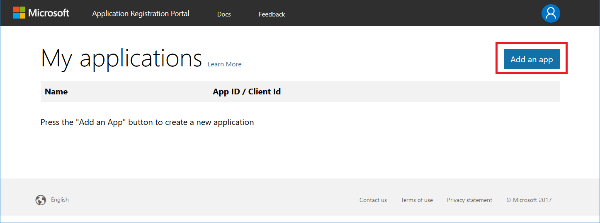
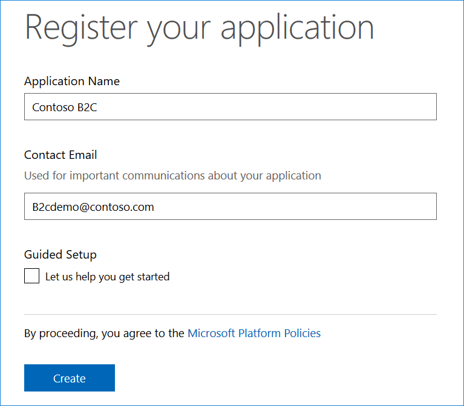
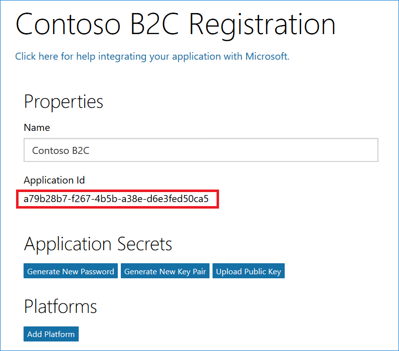
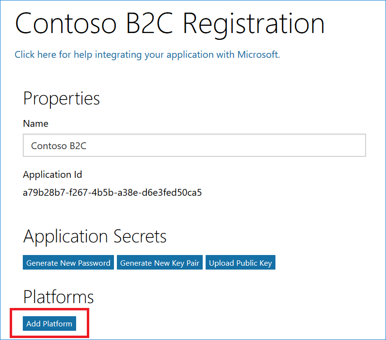
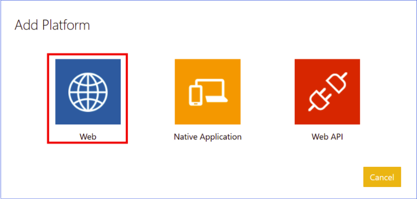
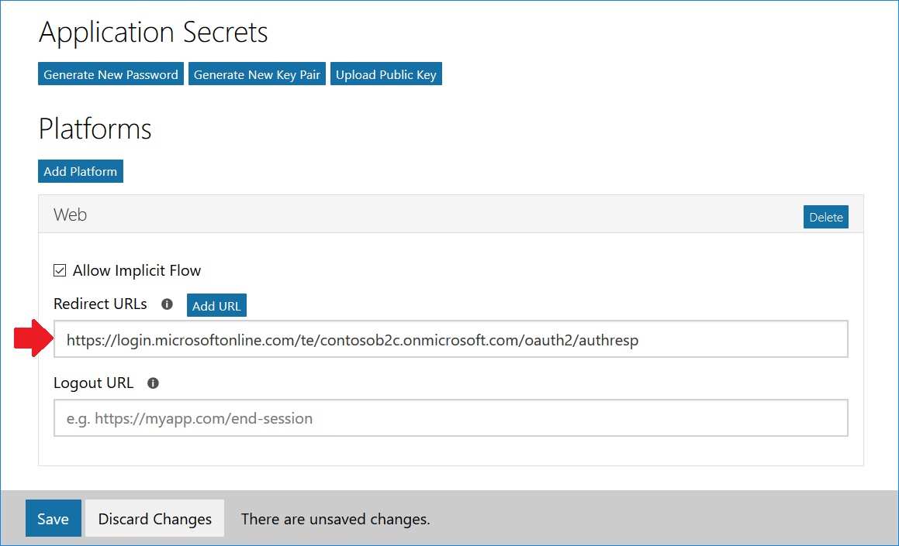
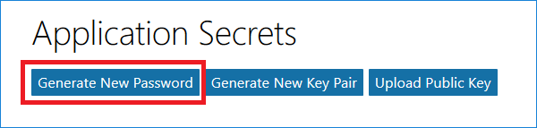
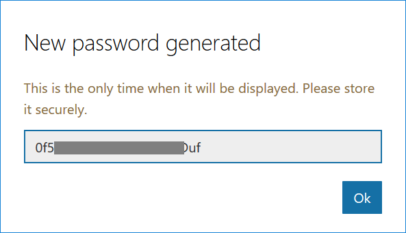
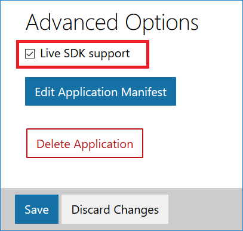

---
title: Add Microsoft Account (MSA) as an identity provider using custom policies in Azure Active Directory B2C | Microsoft Docs
description: Sample using Microsoft as identity provider using OpenID Connect (OIDC) protocol.
services: active-directory-b2c
author: davidmu1
manager: mtillman

ms.service: active-directory
ms.workload: identity
ms.topic: conceptual
ms.date: 08/04/2017
ms.author: davidmu
ms.component: B2C
---

# Azure Active Directory B2C: Add Microsoft Account (MSA) as an identity provider using custom policies

[!INCLUDE [active-directory-b2c-advanced-audience-warning](../../includes/active-directory-b2c-advanced-audience-warning.md)]

This article shows you how to enable sign-in for users from Microsoft account (MSA) through the use of [custom policies](active-directory-b2c-overview-custom.md).

## Prerequisites
Complete the steps in the [Getting started with custom policies](active-directory-b2c-get-started-custom.md) article.

These steps include:

1.  Creating a Microsoft account application.
2.  Adding the Microsoft account application key to Azure AD B2C
3.  Adding claims provider to a policy
4.  Registering the Microsoft Account claims provider to a user journey
5.  Uploading the policy to an Azure AD B2C tenant and test it

## Create a Microsoft account application
To use Microsoft account as an identity provider in Azure Active Directory (Azure AD) B2C, you need to create a Microsoft account application and supply it with the right parameters. You need a Microsoft account. If you don’t have one, visit [https://www.live.com/](https://www.live.com/).

1.  Go to the [Microsoft Application Registration Portal](https://apps.dev.microsoft.com/?referrer=https://azure.microsoft.com/documentation/articles&deeplink=/appList) and sign in with your Microsoft account credentials.
2.  Click **Add an app**.

    

3.  Provide a **Name** for your application, **Contact email**, uncheck **Let us help you get started** and click **Create**.

    

4.  Copy the value of **Application Id**. You need it to configure Microsoft account as an identity provider in your tenant.

    

5.  Click on **Add platform**

    

6.  From the platform list, choose **Web**.

    

7.  Enter `https://{tenant}.b2clogin.com/te/{tenant}.onmicrosoft.com/oauth2/authresp` in the **Redirect URIs** field. Replace **{tenant}** with your tenant's name (for example, contosob2c).

    

8.  Click on **Generate New Password** under the **Application Secrets** section. Copy the new password displayed on screen. You need it to configure Microsoft account as an identity provider in your tenant. This password is an important security credential.

    

    

9.  Check the box that says **Live SDK support** under the **Advanced Options** section. Click **Save**.

    

## Add the Microsoft account application key to Azure AD B2C
Federation with Microsoft accounts requires a client secret for Microsoft account to trust Azure AD B2C on behalf of the application. You need to store your Microsoft account application secert in Azure AD B2C tenant:   

1.  Go to your Azure AD B2C tenant, and select **B2C Settings** > **Identity Experience Framework**
2.  Select **Policy Keys** to view the keys available in your tenant.
3.  Click **+Add**.
4.  For **Options**, use **Manual**.
5.  For **Name**, use `MSASecret`.  
    The prefix `B2C_1A_` might be added automatically.
6.  In the **Secret** box, enter your Microsoft application secret from https://apps.dev.microsoft.com
7.  For **Key usage**, use **Signature**.
8.  Click **Create**
9.  Confirm that you've created the key `B2C_1A_MSASecret`.

## Add a claims provider in your extension policy
If you want users to sign in by using Microsoft Account, you need to define Microsoft Account as a claims provider. In other words, you need to specify an endpoint that Azure AD B2C communicates with. The endpoint provides a set of claims that are used by Azure AD B2C to verify that a specific user has authenticated.

Define Microsoft Account as a claims provider, by adding `<ClaimsProvider>` node in your extension policy file:

1.  Open the extension policy file (TrustFrameworkExtensions.xml) from your working directory. If you need an XML editor, [try Visual Studio Code](https://code.visualstudio.com/download), a lightweight cross-platform editor.
2.  Find the `<ClaimsProviders>` section
3.  Add following XML snippet under the `ClaimsProviders` element:

    ```xml
<ClaimsProvider>
    <Domain>live.com</Domain>
    <DisplayName>Microsoft Account</DisplayName>
    <TechnicalProfiles>
    <TechnicalProfile Id="MSA-OIDC">
        <DisplayName>Microsoft Account</DisplayName>
        <Protocol Name="OpenIdConnect" />
        <Metadata>
        <Item Key="ProviderName">https://login.live.com</Item>
        <Item Key="METADATA">https://login.live.com/.well-known/openid-configuration</Item>
        <Item Key="response_types">code</Item>
        <Item Key="response_mode">form_post</Item>
        <Item Key="scope">openid profile email</Item>
        <Item Key="HttpBinding">POST</Item>
        <Item Key="UsePolicyInRedirectUri">0</Item>
        <Item Key="client_id">Your Microsoft application client id</Item>
        </Metadata>
    <CryptographicKeys>
        <Key Id="client_secret" StorageReferenceId="B2C_1A_MSASecret" />
    </CryptographicKeys>
    <OutputClaims>
        <OutputClaim ClaimTypeReferenceId="identityProvider" DefaultValue="live.com" />
        <OutputClaim ClaimTypeReferenceId="authenticationSource" DefaultValue="socialIdpAuthentication" />
        <OutputClaim ClaimTypeReferenceId="socialIdpUserId" PartnerClaimType="sub" />
        <OutputClaim ClaimTypeReferenceId="displayName" PartnerClaimType="name" />
        <OutputClaim ClaimTypeReferenceId="email" />
        </OutputClaims>
        <OutputClaimsTransformations>
        <OutputClaimsTransformation ReferenceId="CreateRandomUPNUserName" />
        <OutputClaimsTransformation ReferenceId="CreateUserPrincipalName" />
        <OutputClaimsTransformation ReferenceId="CreateAlternativeSecurityId" />
        <OutputClaimsTransformation ReferenceId="CreateSubjectClaimFromAlternativeSecurityId" />
        </OutputClaimsTransformations>
        <UseTechnicalProfileForSessionManagement ReferenceId="SM-SocialLogin" />
    </TechnicalProfile>
    </TechnicalProfiles>
</ClaimsProvider>
```

4.  Replace `client_id` value with your Microsoft Account application client Id

5.  Save the file.

## Register the Microsoft Account claims provider to Sign up or Sign-in user journey

At this point, the identity provider has been set up, but it’s not available in any of the sign-up/sign-in screens. Now you need to add the Microsoft Account identity provider to your user `SignUpOrSignIn` user journey. To make it available, we create a duplicate of an existing template user journey.  Then we add the Microsoft Account identity provider:

> [!NOTE]
>
>If you previously copied the `<UserJourneys>` element from base file of your policy to the extension file `TrustFrameworkExtensions.xml`, you can skip to this section.

1.  Open the base file of your policy (for example, TrustFrameworkBase.xml).
2.  Find the `<UserJourneys>` element and copy the entire content of `<UserJourneys>` node.
3.  Open the extension file (for example, TrustFrameworkExtensions.xml) and find the `<UserJourneys>` element. If the element doesn't exist, add one.
4.  Paste the entire content of `<UserJourneys>` node that you copied as a child of the `<UserJourneys>` element.

### Display the button
The `<ClaimsProviderSelections>` element defines the list of claims provider selection options and their order.  `<ClaimsProviderSelection>` element is analogous to an identity provider button on a sign-up/sign-in page. If you add a `<ClaimsProviderSelection>` element for Microsoft account, a new button shows up when a user lands on the page. To add this element:

1.  Find the `<UserJourney>` node that includes `Id="SignUpOrSignIn"` in the user journey that you copied.
2.  Locate the `<OrchestrationStep>` node that includes `Order="1"`
3.  Add following XML snippet under `<ClaimsProviderSelections>` node:

```xml
<ClaimsProviderSelection TargetClaimsExchangeId="MicrosoftAccountExchange" />
```

### Link the button to an action
Now that you have a button in place, you need to link it to an action. The action, in this case, is for Azure AD B2C to communicate with Microsoft Account to receive a token. Link the button to an action by linking the technical profile for your Microsoft Account claims provider:

1.  Find the `<OrchestrationStep>` that includes `Order="2"` in the `<UserJourney>` node.
2.  Add following XML snippet under `<ClaimsExchanges>` node:

```xml
<ClaimsExchange Id="MicrosoftAccountExchange" TechnicalProfileReferenceId="MSA-OIDC" />
```

> [!NOTE]
>
>   * Ensure the `Id` has the same value as that of `TargetClaimsExchangeId` in the preceding section
>   * Ensure `TechnicalProfileReferenceId` ID is set to the technical profile you created earlier (MSA-OIDC).

## Upload the policy to your tenant
1.  In the [Azure portal](https://portal.azure.com), switch into the [context of your Azure AD B2C tenant](active-directory-b2c-navigate-to-b2c-context.md), and open the **Azure AD B2C** blade.
2.  Select **Identity Experience Framework**.
3.  Open the **All Policies** blade.
4.  Select **Upload Policy**.
5.  Check **Overwrite the policy if it exists** box.
6.  **Upload** TrustFrameworkExtensions.xml and ensure that it does not fail the validation

## Test the custom policy by using Run Now

1.  Open **Azure AD B2C Settings** and go to **Identity Experience Framework**.
> [!NOTE]
>
>**Run now** requires at least one application to be preregistered on the tenant. To learn how to register applications, see the Azure AD B2C [Get started](active-directory-b2c-get-started.md) article or the [Application registration](active-directory-b2c-app-registration.md) article.
2.  Open **B2C_1A_signup_signin**, the relying party (RP) custom policy that you uploaded. Select **Run now**.
3.  You should be able to sign in using Microsoft account.

## [Optional] Register the Microsoft Account claims provider to Profile-Edit user journey
You may want to add the Microsoft Account identity provider also to your user `ProfileEdit` user journey. To make it available, we repeat the last two steps:

### Display the button
1.  Open the extension file of your policy (for example, TrustFrameworkExtensions.xml).
2.  Find the `<UserJourney>` node that includes `Id="ProfileEdit"` in the user journey that you copied.
3.  Locate the `<OrchestrationStep>` node that includes `Order="1"`
4.  Add following XML snippet under `<ClaimsProviderSelections>` node:

```xml
<ClaimsProviderSelection TargetClaimsExchangeId="MSAExchange" />
```

### Link the button to an action
1.  Find the `<OrchestrationStep>` that includes `Order="2"` in the `<UserJourney>` node.
2.  Add following XML snippet under `<ClaimsExchanges>` node:

```xml
<ClaimsExchange Id="MSAExchange" TechnicalProfileReferenceId="MSA-OIDC" />
```

### Test the custom Profile-Edit policy by using Run Now
1.  Open **Azure AD B2C Settings** and go to **Identity Experience Framework**.
2.  Open **B2C_1A_ProfileEdit**, the relying party (RP) custom policy that you uploaded. Select **Run now**.
3.  You should be able to sign in using Microsoft account.

## Download the complete policy files
Optional: We recommend you build your scenario using your own Custom policy files after completing the Getting Started with Custom Policies walk through instead of using these sample files.  [Sample policy files for reference](https://github.com/Azure-Samples/active-directory-b2c-custom-policy-starterpack/tree/master/scenarios/aadb2c-ief-setup-msa-app)
