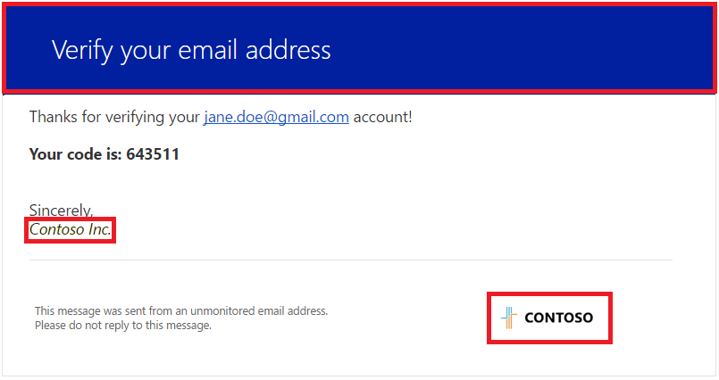

# Azure AD B2C: Frequently asked questions (FAQ) 
This page answers frequently asked questions about the Azure Active Directory (Azure AD) B2C. Keep checking back for updates.

### Why can't I access the Azure AD B2C extension in the Azure portal?
There are two common reasons for why the Azure AD extension is not working for you.  Azure AD B2C requires your user role in the directory to be global administrator.  Please contact your administrator if you think you should have access.  If you have global administrator privileges, make sure that you are in an Azure AD B2C directory and not an Azure Active Directory directory.  You can see instructions for [creating an Azure AD B2C directory here](https://docs.microsoft.com/azure/active-directory-b2c/tutorial-create-tenant).

### Can I use Azure AD B2C features in my existing, employee-based Azure AD tenant?
Azure AD and Azure AD B2C are separate product offerings and cannot coexist in the same tenant.  An Azure AD tenant represents an organization.  An Azure AD B2C tenant represents a collection of identities to be used with relying party applications.  With custom policies (in public preview), Azure AD B2C can federate to Azure AD allowing authentication of employees in an organization.

### Can I use Azure AD B2C to provide social login (Facebook and Google+) into Office 365?
Azure AD B2C can't be used to authenticate users for Microsoft Office 365.  Azure AD is Microsoft's solution for managing employee access to SaaS apps and it has features designed for this purpose such as licensing and conditional access.  Azure AD B2C provides an identity and access management platform for building web and mobile applications.  When Azure AD B2C is configured to federate to an Azure AD tenant, the Azure AD tenant manages employee access to applications that rely on Azure AD B2C.

### What are local accounts in Azure AD B2C? How are they different from work or school accounts in Azure AD?
In an Azure AD tenant, users that belong to the tenant sign-in with an email address of the form `<xyz>@<tenant domain>`.  The `<tenant domain>` is one of the verified domains in the tenant or the initial `<...>.onmicrosoft.com` domain. This type of account is a work or school account.

In an Azure AD B2C tenant, most apps want the user to sign-in with any arbitrary email address (for example, joe@comcast.net, bob@gmail.com, sarah@contoso.com, or jim@live.com). This type of account is a local account.  We also support arbitrary user names as local accounts (for example, joe, bob, sarah, or jim). You can choose one of these two local account types when configuring identity providers for Azure AD B2C in the Azure portal. In your Azure AD B2C tenant, click **Identity providers** and then select **Username** under Local accounts. 

User accounts for applications must always be created through a sign-up policy, sign-up or sign-in policy, or by using the Azure AD Graph API. User accounts created in the Azure portal are only used for administering the tenant.

### Which social identity providers do you support now? Which ones do you plan to support in the future?
We currently support Facebook, Google+, LinkedIn, Amazon, Twitter (preview), WeChat (preview), Weibo (preview), and QQ (Preview). We will add support for other popular social identity providers based on customer demand.

Azure AD B2C has also added support for [custom policies](https://docs.microsoft.com/azure/active-directory-b2c/active-directory-b2c-overview-custom).  These [custom policies](https://docs.microsoft.com/azure/active-directory-b2c/active-directory-b2c-overview-custom) allow a developer to create their own policy that with any identity provider that supports [OpenID Connect](http://openid.net/specs/openid-connect-core-1_0.html) or SAML. 

Get started with custom policies by checking out our [custom policy starter pack](https://github.com/Azure-Samples/active-directory-b2c-custom-policy-starterpack).

### Can I configure scopes to gather more information about consumers from various social identity providers?
No, but this feature is on our roadmap. The default scopes used for our supported set of social identity providers are:

* Facebook: email
* Google+: email
* Microsoft account: openid email profile
* Amazon: profile
* LinkedIn: r_emailaddress, r_basicprofile

### Does my application have to be run on Azure for it work with Azure AD B2C?
No, you can host your application anywhere (in the cloud or on-premises). All it needs to interact with Azure AD B2C is the ability to send and receive HTTP requests on publicly accessible endpoints.

### I have multiple Azure AD B2C tenants. How can I manage them on the Azure portal?
Before opening 'Azure AD B2C' in the left side menu of the Azure portal, you must switch into the directory you want to manage.  Switch directories by clicking your identity in the upper right of the Azure portal, then choose a directory in the drop down that appears.  For a step-by-step with images, see [Navigate to Azure AD B2C settings](active-directory-b2c-app-registration.md#navigate-to-b2c-settings).

### How do I customize verification emails (the content and the "From:" field) sent by Azure AD B2C?
You can use the [company branding feature](../active-directory/fundamentals/customize-branding.md) to customize the content of verification emails. Specifically, these two elements of the email can be customized:

* **Banner Logo**: Shown at the bottom-right.
* **Background color**: Shown at the top.

    

The email signature contains the Azure AD B2C tenant's name that you provided when you first created the Azure AD B2C tenant. You can change the name using these instructions:

1. Sign in to the [Azure portal](https://portal.azure.com/) as the Global Administrator.
1. Open the **Azure Active Directory** blade.
1. Click the **Properties** tab.
1. Change the **Name** field.
1. Click **Save** at the top of the page.

Currently there is no way to change the "From:" field on the email. Vote on [feedback.azure.com](https://feedback.azure.com/forums/169401-azure-active-directory/suggestions/15334335-fully-customizable-verification-emails) you are interested in customizing the body of the verification email.

### How can I migrate my existing user names, passwords, and profiles from my database to Azure AD B2C?
You can use the Azure AD Graph API to write your migration tool. See the [User migration guide](active-directory-b2c-user-migration.md) for details.

### What password policy is used for local accounts in Azure AD B2C?
The Azure AD B2C password policy for local accounts is based on the policy for Azure AD. Azure AD B2C's sign-up, sign-up or sign-in and password reset policies uses the "strong" password strength and doesn't expire any passwords. Read the [Azure AD password policy](https://msdn.microsoft.com/library/azure/jj943764.aspx) for more details.

### Can I use Azure AD Connect to migrate consumer identities that are stored on my on-premises Active Directory to Azure AD B2C?
No, Azure AD Connect is not designed to work with Azure AD B2C. Consider using the [Graph API](active-directory-b2c-devquickstarts-graph-dotnet.md) for user migration.  See the [User migration guide](active-directory-b2c-user-migration.md) for details.

### Can my app open up Azure AD B2C pages within an iFrame?
No, for security reasons, Azure AD B2C pages cannot be opened within an iFrame.  Our service communicates with the browser to prohibit iFrames.  The security community in general and the OAUTH2 specification, recommend against using iFrames for identity experiences due to the risk of click-jacking.

### Does Azure AD B2C work with CRM systems such as Microsoft Dynamics?
Integration with Microsoft Dynamics 365 Portal is available.  See [Configuring Dynamics 365 Portal to use Azure AD B2C for authentication](https://docs.microsoft.com/dynamics365/customer-engagement/portals/azure-ad-b2c).

### Does Azure AD B2C work with SharePoint on-premises 2016 or earlier?
Azure AD B2C is not meant for the SharePoint external partner-sharing scenario; see [Azure AD B2B](https://cloudblogs.microsoft.com/enterprisemobility/2015/09/15/learn-all-about-the-azure-ad-b2b-collaboration-preview/) instead.

### Should I use Azure AD B2C or B2B to manage external identities?
Read this article about [external identities](../active-directory/active-directory-b2b-compare-external-identities.md) to learn more about applying the appropriate features to your external identity scenarios.

### What reporting and auditing features does Azure AD B2C provide? Are they the same as in Azure AD Premium?
No, Azure AD B2C does not support the same set of reports as Azure AD Premium. However there are many commonalities:

* **Sign-in reports** provide a record of each sign-in with reduced details.
* **Audit reports** include both admin activity as well as application activity. 
* **Usage reports** include the number of users, number of logins, and volume of MFA. 

### Can I localize the UI of pages served by Azure AD B2C? What languages are supported?
Yes!  Read about [language customization](active-directory-b2c-reference-language-customization.md), which is in public preview.  We provide translations for 36 languages, and you can override any string to suit your needs.

### Can I use my own URLs on my sign-up and sign-in pages that are served by Azure AD B2C? For instance, can I change the URL from login.microsoftonline.com to login.contoso.com?
Not currently. This feature is on our roadmap. Verifying your domain in the **Domains** tab in the Azure portal does not accomplish this goal.

### How do I delete my Azure AD B2C tenant?
Follow these steps to delete your Azure AD B2C tenant:

1. Follow these steps to [navigate to Azure AD B2C settings](active-directory-b2c-app-registration.md#navigate-to-b2c-settings) on the Azure portal.
1. Navigate to the **Applications**, **Identity providers**, and **All policies** and delete all the entries in each of them.
1. Now sign in to the [Azure portal](https://portal.azure.com/) as the Subscription Administrator. (Use the same work or school account or the same Microsoft account that you used to sign up for Azure.)
1. Switch to the Azure AD B2C tenant you want to delete.
2. Navigate to the Active Directory menu on the left.
3. Select **Users and groups**.
4. Select each user in turn (exclude the Subscription Administrator user you are currently signed in as). Click **Delete** at the bottom of the page and click **YES** when prompted.
5. Click the **App registrations**.
6. Select application called **b2c-extensions-app**. Click **Delete** and click **YES** when prompted.
7. Select **Overview**.
8. Click **Delete directory**. To complete the process, follow the instructions on the screen.

### Can I get Azure AD B2C as part of Enterprise Mobility Suite?
No, Azure AD B2C is a pay-as-you-go Azure service and is not part of Enterprise Mobility Suite.

### How do I report issues with Azure AD B2C?
See [File support requests for Azure Active Directory B2C](active-directory-b2c-support.md).
