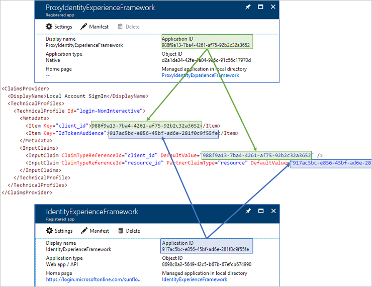

# Get started with custom policies in Azure Active Directory B2C

[!INCLUDE [active-directory-b2c-advanced-audience-warning](../../includes/active-directory-b2c-advanced-audience-warning.md)]

[Custom policies](active-directory-b2c-overview-custom.md) are configuration files that define the behavior of your Azure Active Directory (Azure AD) B2C tenant. In this article, you create a custom policy that supports local account sign-up or sign-in by using an email address and password. You also prepare your environment for adding identity providers, such as Facebook or Azure Active Directory.

## Prerequisites

If you don't have one already, you need to [create an Azure AD B2C tenant](tutorial-create-tenant.md) that is linked to your Azure subscription.

## Add signing and encryption keys

1. Sign in to the [Azure portal](https://portal.azure.com/) as the global administrator of your Azure AD B2C tenant.
2. Make sure you're using the directory that contains your Azure AD B2C tenant by clicking the **Directory and subscription filter** in the top menu and choosing the directory that contains your tenant. 

    

3. Choose **All services** in the top-left corner of the Azure portal, search for and select **Azure AD B2C**.
4. On the Overview page, select **Identity Experience Framework - PREVIEW**.

### Create the signing key

1. Select **Policy Keys** and then select **Add**.
2. For **Options**, choose `Generate`.
3. In **Name**, enter `TokenSigningKeyContainer`. The prefix `B2C_1A_` might be added automatically.
4. For **Key type**, select **RSA**.
5. For **Key usage**, select **Signature**.
6. Click **Create**.

### Create the encryption key

1. Select **Policy Keys** and then select **Add**.
2. For **Options**, choose `Generate`.
3. In **Name**, enter `TokenEncryptionKeyContainer`. The prefix `B2C_1A`_ might be added automatically.
4. For **Key type**, select **RSA**.
5. For **Key usage**, select **Encryption**.
6. Click **Create**.

### Create the Facebook key

If you already have a [Facebook application secret](active-directory-b2c-setup-fb-app.md), add it as a policy key to your tenant. Otherwise, you must create the key with a placeholder value so that your policies pass validation.

1. Select **Policy Keys** and then select **Add**.
2. For **Options**, choose `Manual`.
3. For **Name**, enter `FacebookSecret`. The prefix `B2C_1A_` might be added automatically.
4. In **Secret**, enter your Facebook secret from developers.facebook.com or `0` as a placeholder. This is the secret, not the application ID.
5. For **Key usage**, select **Signature**.
6. Click **Create**.

## Register applications

Azure AD B2C requires you to register two applications that are used to sign up and sign in users: IdentityExperienceFramework (a web app), and ProxyIdentityExperienceFramework (a native app) with delegated permission from the IdentityExperienceFramework app. Local accounts exist only in your tenant. Your users sign up with a unique email address/password combination to access your tenant-registered applications.

### Register the IdentityExperienceFramework application

1. Choose **All services** in the top-left corner of the Azure portal, search for and select **Azure Active Directory**, and then select **App registrations**.
2. Select **New application registration**.
3. For **Name**, enter `IdentityExperienceFramework`.
4. For **Application type**, choose **Web app/API**.
5. For **Sign-on URL**, enter `https://your-tenant-name.b2clogin.com/your-tenant-name.onmicrosoft.com`, where `your-tenant-name` is your Azure AD B2C tenant domain name.
6. Click **Create**. 
7. After it's created, copy the application ID and save it to use later.

### Register the ProxyIdentityExperienceFramework application

1. Select **App registrations**, and then select **New application registration**.
2. For **Name**, enter `ProxyIdentityExperienceFramework`.
3. For **Application type**, choose **Native**.
4. For **Redirect URI**, enter `https://your-tenant-name.b2clogin.com/your-tenant-name.onmicrosoft.com`, where `yourtenant` is your Azure AD B2C tenant.
5. Click **Create**. After it's created, copy the application ID and save it to use later.
6. On the Settings page, select **Required permissions**, and then select **Add**.
7. Select **Select an API**.
8. Search for and select **IdentityExperienceFramework**, and then click **Select**.
9. Select the check box next to **Access IdentityExperienceFramework**, click **Select**, and then click **Done**.
10. Select **Grant Permissions**, and then confirm by selecting **Yes**.

## Download starter pack and modify policies

Custom policies are a set of XML files that need to be uploaded to your Azure AD B2C tenant. Starter packs of files are provided to get you going quickly. Each starter pack in the following list contains the smallest number of technical profiles and user journeys needed to achieve the scenarios described:

- LocalAccounts - Enables the use of local accounts only.
- SocialAccounts - Enables the use of social (or federated) accounts only.
- SocialAndLocalAccounts - Enables both the use of local accounts and social accounts.
- SocialAndLocalAccountsWithMFA - Enables social, local, and Multi-Factor Authentication options.

Each starter pack contains:

- The base file. Few modifications are required to the base.
* The extension file.  This file is where most configuration changes are made.
* The relying party files. Task-specific files called by your application.

>[!NOTE]
>If your XML editor supports validation, validate the files against the TrustFrameworkPolicy_0.3.0.0.xsd XML schema that is located in the root directory of the starter pack. XML schema validation identifies errors before uploading.

1. [Download the .zip file](https://github.com/Azure-Samples/active-directory-b2c-custom-policy-starterpack/archive/master.zip) or run:

    ```console
    git clone https://github.com/Azure-Samples/active-directory-b2c-custom-policy-starterpack
    ```

2. In the SocialAndLocalAccounts folder, edit all of the files replacing `yourtenant.onmicrosoft.com` with the name for your tenant. For example, `contosoTenant.onmicrosoft.com`. If you need an XML editor, [try Visual Studio Code](https://code.visualstudio.com/download), a lightweight cross-platform editor.

### Add application IDs to the custom policy

Add the application IDs to the extensions file *TrustFrameworkExtensions.xml*.

1. Open the *TrustFrameworkExtensions.xml* file and find the element `<TechnicalProfile Id="login-NonInteractive">`.
2. Replace both instances of `IdentityExperienceFrameworkAppId` with the application ID of the Identity Experience Framework application that you created earlier. Replace both instances of `ProxyIdentityExperienceFrameworkAppId` with the application ID of the Proxy Identity Experience Framework application that you created earlier. The following example shows the **login-NonInteractive** technical profile after the changes:

    

3. Save your extensions file.

## Upload the policies

1. On the Custom Policies page of Identity Experience Framework, select **Upload Policy**.
1. In this order, upload *TrustFrameworkBase.xml*, *TrustFrameworkExtensions.xml*, *SignUpOrSignin.xml*, *ProfileEdit.xml*, and *PasswordReset.xml*. When a file is uploaded, the name of the policy file is prepended with `B2C_1A_`.

## Test the custom policy

1. On the Custom Policies page, select **B2C_1A_signup_signin**. 
2. Select **Run now**.

3. You should be able to sign up using an email address.

4. Sign in with the same account to confirm that you have the correct configuration.

## Add Facebook as an identity provider

1. Configure a [Facebook application](active-directory-b2c-setup-fb-app.md).
2. In the *TrustFrameworkExtensions.xml* file, replace the value of `client_id` with the Facebook application ID:

   ```xml
   <TechnicalProfile Id="Facebook-OAUTH">
     <Metadata>
     <!--Replace the value of client_id in this technical profile with the Facebook app ID"-->
       <Item Key="client_id">00000000000000</Item>
   ```
3. Upload the *TrustFrameworkExtensions.xml* file to your tenant.
4. Test by using **Run now** or by invoking the policy directly from your registered application.

## Next Steps

- Add Azure Active Directory as an identity provider. The base file used in this getting started guide already contains some of the content that you need for adding other identity providers. For information about setting up sign-ins, see the [Set up sign-up and sign-in with an Azure Active Directory account using Active Directory B2C custom policies](active-directory-b2c-setup-aad-custom.md) article.
