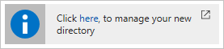

# Create an Azure Active Directory B2C tenant in the Azure portal

This Quickstart helps you create a Microsoft Azure Active Directory (Azure AD) B2C tenant in just a few minutes. When you're finished, you have a B2C tenant (also known as a directory) to use for registering B2C applications.

## Prerequisites

[!INCLUDE [quickstarts-free-trial-note](../../includes/quickstarts-free-trial-note.md)]

##  Log in to Azure

Log in to the [Azure portal](https://portal.azure.com/).

## Create an Azure AD B2C tenant

B2C features can't be enabled in your existing tenants. You need to create an Azure AD B2C tenant.

[!INCLUDE [active-directory-b2c-create-tenant](../../includes/active-directory-b2c-create-tenant.md)]

Congratulations, you have created an Azure Active Directory B2C tenant. You are a Global Administrator of the tenant. You can add other Global Administrators as required. To switch to your new tenant, click the *manage your new tenant link*.

> [!IMPORTANT]
> If you are planning to use a B2C tenant for a production app, read the article on [production-scale vs. preview B2C tenants](active-directory-b2c-reference-tenant-type.md). There are known issues when you delete an existing B2C tenant and re-create it with the same domain name. You need to create a B2C tenant with a different domain name.
>
>

## Link your tenant to your subscription

You need to link your Azure AD B2C tenant to your Azure subscription to enable all B2C functionality and pay for usage charges. To learn more, read [this article](active-directory-b2c-how-to-enable-billing.md). If you don't link your Azure AD B2C tenant to your Azure subscription, some functionality is blocked and, you see a warning message ("No Subscription linked to this B2C tenant or the Subscription needs your attention.") in the B2C settings. It is important that you take this step before you ship your apps into production.

## Easy access to settings

[!INCLUDE [active-directory-b2c-find-service-settings](../../includes/active-directory-b2c-find-service-settings.md)]

You can also access the blade by entering `Azure AD B2C` in **Search resources** at the top of the portal. In the results list, select **Azure AD B2C** to access the B2C settings blade.

## Next steps

> [!div class="nextstepaction"]
> [Register your B2C application in a B2C tenant](active-directory-b2c-app-registration.md)