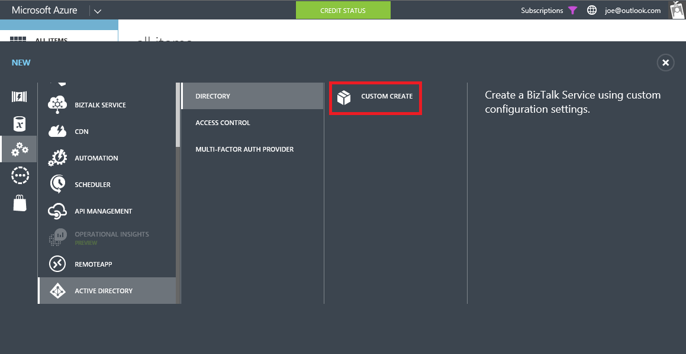
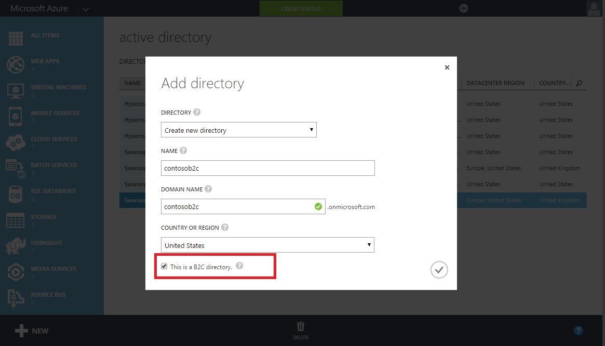
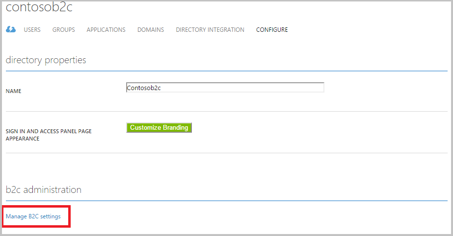
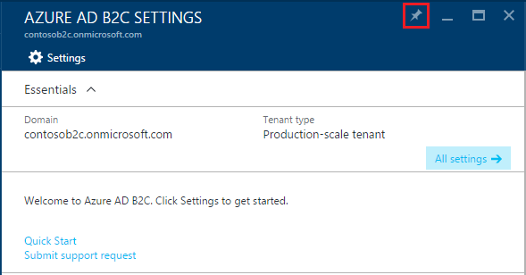
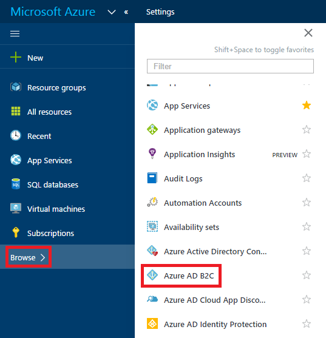

<properties
	pageTitle="Azure Active Directory B2C: Create an Azure Active Directory B2C tenant | Microsoft Azure"
	description="A topic on how to create an Azure Active Directory B2C tenant"
	services="active-directory-b2c"
	documentationCenter=""
	authors="swkrish"
	manager="msmbaldwin"
	editor="bryanla"/>

<tags
	ms.service="active-directory-b2c"
	ms.workload="identity"
	ms.tgt_pltfrm="na"
	ms.topic="article"
    ms.devlang="na"
	ms.date="07/24/2016"
	ms.author="swkrish"/>

# Azure Active Directory B2C: Create an Azure AD B2C tenant

To start using Microsoft Azure Active Directory (Azure AD) B2C, follow the three steps outlined in this article.

## Step 1: Sign up for an Azure subscription

If you already have an Azure subscription, skip this step. If not, sign up for an [Azure subscription](../active-directory/sign-up-organization.md) and get access to Azure AD B2C.

## Step 2: Create an Azure AD B2C tenant

Use the following steps to create a new Azure AD B2C tenant. Currently B2C features can't be turned on in your existing tenants.

1. Sign in to the [Azure classic portal](https://manage.windowsazure.com/) as the Subscription Administrator. This is the same work or school account or the same Microsoft account that you used to sign up for Azure.
2. Click **New** > **App Services** > **Active Directory** > **Directory** > **Custom Create**.

    

3. Choose the **Name**, **Domain Name** and **Country or Region** for your tenant.
4. Check the option that says **This is a B2C directory**.
5. Click the check mark to complete the action.

    

6. Your tenant is now created and will appear in the Active Directory extension. You are also made a Global Administrator of the tenant. You can add other Global Administrators as required.

    > [AZURE.IMPORTANT]
	If you are planning to use a B2C tenant for a production app, read the article on [production-scale vs. preview B2C tenants](active-directory-b2c-reference-tenant-type.md).

## Step 3: Navigate to the B2C features blade on the Azure portal

1. Navigate to the Active Directory extension on the navigation bar on the left side.
2. Find your tenant under the **Directory** tab and click it.
3. Click the **Configure** tab.
4. Click the **Manage B2C settings** link in the **B2C administration** section.

    

5. The Azure portal with the B2C features blade showing will open in a new browser tab or window.

    > [AZURE.IMPORTANT]
    It can take up to 2-3 minutes for your tenant to be accessible on the Azure portal. Retrying these steps after some time will fix this. If not, please contact Support.

6. Pin this blade to your Startboard for easy access. (The Pin tool is marked in red at the upper-right corner of the features blade.)

    

    > [AZURE.NOTE]
    You can manage users and groups, self-service password reset configuration, and company branding features of your tenant on the [Azure classic portal](https://manage.windowsazure.com/).

## Easy access to the B2C features blade on the Azure portal

To improve discoverability, we've added a shortcut to the B2C features blade on the Azure portal.

1. Sign into the Azure portal as the Global Administrator of your B2C tenant. If you are already signed into a different tenant, switch tenants (on the top-right corner).
2. Click **Browse** on the left hand navigation.
3. Click **Azure AD B2C** to access the B2C features blade.

    

## Next steps

Learn how to register an application with Azure AD B2C and to build a Quick Start application by reading [Azure Active Directory B2C: Register your application](active-directory-b2c-app-registration.md).
