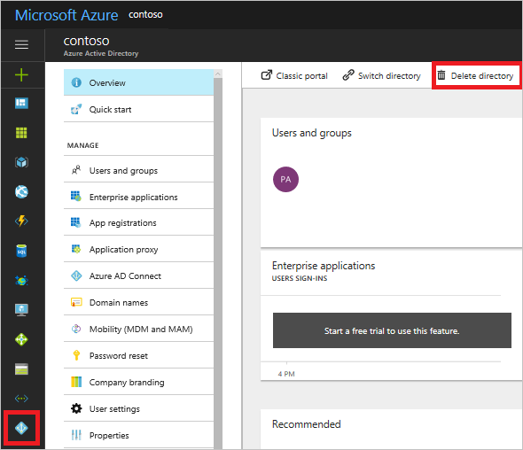
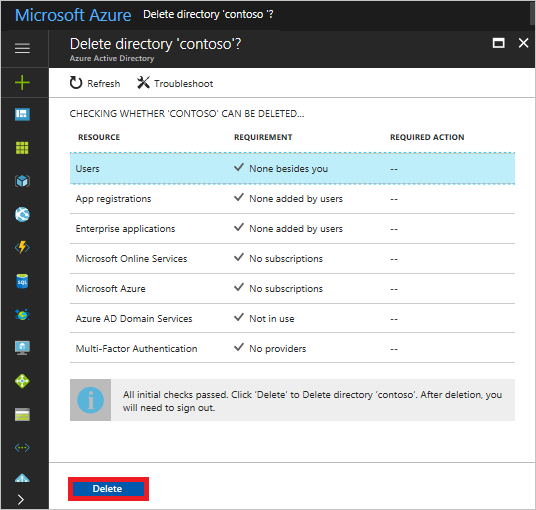

# Create an Azure Active Directory B2C tenant in the Azure portal

This Quickstart helps you create a Microsoft Azure Active Directory (Azure AD) B2C tenant in just a few minutes. When you're finished, you have a B2C tenant to use and start registering applications.

## Prerequisites

[!INCLUDE [quickstarts-free-trial-note](../../includes/quickstarts-free-trial-note.md)]

##  Log in to Azure

Log in to the [Azure portal](https://portal.azure.com/).

## Create an Azure AD B2C tenant

B2C features can't be enabled in your existing tenants. You need to create an Azure AD B2C tenant.

Click the **New** button. In the **Search the marketplace** field, enter `Azure Active Directory B2C`.

In the results list, select **Azure Active Directory B2C**.

Details about Azure Active Directory B2C are shown. To begin configuring your new Azure Active Directory B2C tenant, click the **Create** button.

Select **Create a new Azure AD B2C Tenant**. Then, use the settings specified in the table.

| Setting      | Sample value  | Description                                        |
| ------------ |  ------- | -------------------------------------------------- |
| **Organization  name** | Contoso | Name of the organization. | 
| **Initial domain name** |  ContosoB2CTenant | Domain name for the B2C tenant. By default, the initial domain name will include .microsoft.com. You can change this to a domain name your organization uses later. | 
| **Country or region** | United States | Choose the country or region for the directory. The directory will be created in this location and cannot be changed later.  |

Click the **Create** button to create your tenant. Creating the tenant may take a few minutes. You are alerted in your notifications when it is complete.

Congratulations, you have created an Azure Active Directory B2C tenant. You are a Global Administrator of the tenant. You can add other Global Administrators as required. To switch to your new tenant, click the *manage your new tenant link*.

> [!IMPORTANT]
> If you are planning to use a B2C tenant for a production app, read the article on [production-scale vs. preview B2C tenants](active-directory-b2c-reference-tenant-type.md). There are known issues when you delete an existing B2C tenant and re-create it with the same domain name. You need to create a B2C tenant with a different domain name.
>
>

## Navigate to the B2C settings in the Azure portal

To switch to your Azure AD B2C tenant, select the B2C directory in the top-right corner of the portal.

Expand **More services** below the navigation bar in the bottom-left side of the portal.

Search for **Azure AD B2C** and select **Azure AD B2C** in the result list.

The Azure AD B2C settings are displayed.

Use the pin tool to pin B2C settings to your dashboard for easy access.

## Link your Azure AD B2C tenant to your Azure subscription

If you are planning to use your B2C tenant for production apps, you need to link your Azure AD B2C tenant to your Azure subscription to pay for usage charges. To learn more, read [this article](active-directory-b2c-how-to-enable-billing.md). If you don't link your Azure AD B2C tenant to your Azure subscription, you see a warning message ("No Subscription linked to this B2C tenant or the Subscription needs your attention.") in the B2C settings. It is important that you take this step before you ship your apps into production.

## Easy access to the B2C settings in the Azure portal

Sign into the Azure portal as the Global Administrator of your Azure AD B2C tenant.

Switch to your Azure AD B2C tenant by selecting the B2C directory in the top-right corner of the portal.

In **Search resources** at the top of the portal, enter `Azure AD B2C` and select **Azure AD B2C** in the results list to access the B2C settings.

## Clean up resources

Other quick starts in this collection build upon this quick start. If you plan to continue on to work with subsequent quick starts or with the tutorials, do not clean up the resources created in this quick start. 

If you do not plan to continue, switch to the Active Directory service and select **Delete directory**.

Verify all requirements are met for deletion. If a requirement is not met, perform the required actions. Once all the requirements are met, click **Delete**.

## Next steps

> [!div class="nextstepaction"]
> [Create an ASP.NET web app with sign-up, sign-in, and password reset](active-directory-b2c-devquickstarts-web-dotnet-susi.md)

> [!div class="nextstepaction"]
> [Register your B2C application in a B2C tenant](active-directory-b2c-app-registration.md)

