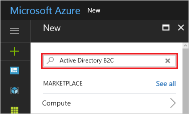
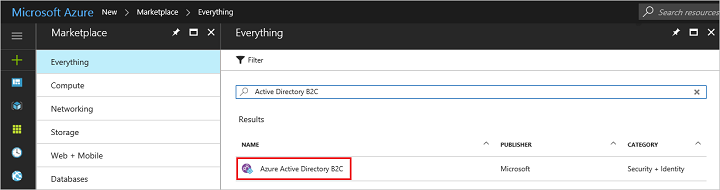
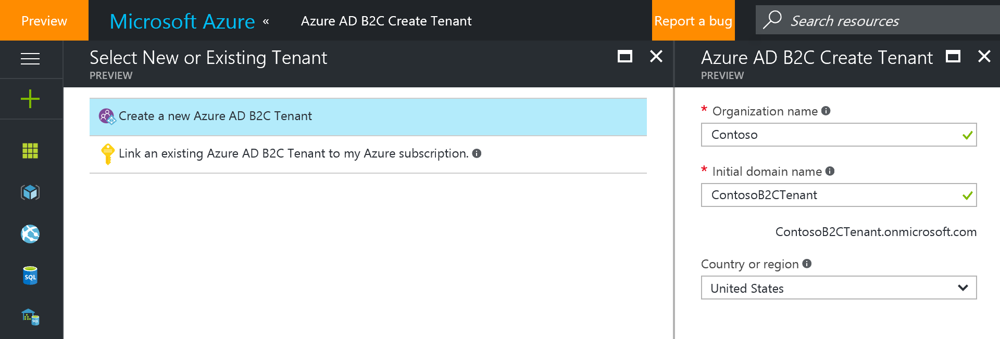
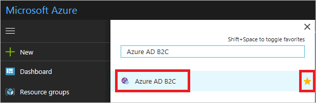
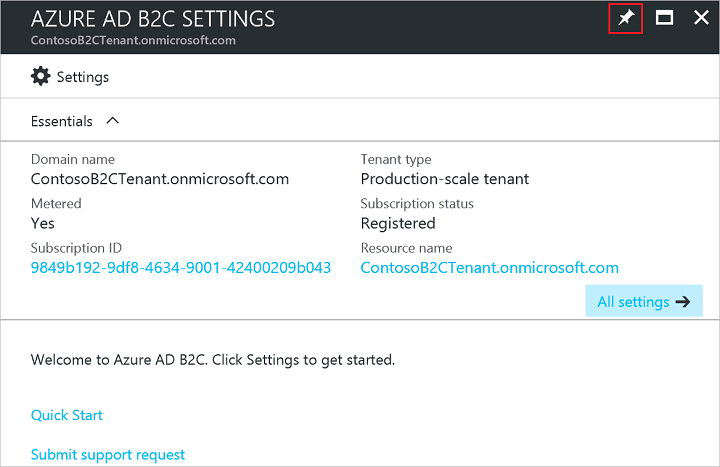

# Azure Active Directory B2C: Create an Azure AD B2C tenant
To start using Microsoft Azure Active Directory (Azure AD) B2C, follow the four steps outlined in this article.

## Step 1: Sign up for an Azure subscription
If you already have an Azure subscription, skip this step. If not, sign up for an [Azure subscription](../active-directory/sign-up-organization.md) and get access to Azure AD B2C.

## Step 2: Create an Azure AD B2C tenant
Use the following steps to create a new Azure AD B2C tenant. Currently B2C features can't be turned on in your existing tenants.

1. Sign in to the [Azure portal](https://portal.azure.com/) as the Subscription Administrator. This is the same work or school account or the same Microsoft account that you used to sign up for Azure.
2. Click **New**(or the + button if collapsed) and in the **Search the marketplace** field enter "Azure Active Directory B2C".
   
    
3. In the result, click on **Azure Active Directory B2C**

    
4. You'll be shown a page with the details on B2C.  Click **Create** at the bottom to start configuring your new Azure Active Directory B2C tenant.
5. Click **Create a new Azure AD B2C Tenant**.
6. Choose the **Organization name, Domain name, and Country or Region** for your tenant.

    
7. Click **Create** to create your tenant.  This may take a few minutes, you will be alerted in your notifications when it is complete.

8. Your tenant is now created and will appear in the Active Directory extension. You are also made a Global Administrator of the tenant. You can add other Global Administrators as required.
   
   > [!IMPORTANT]
   > If you are planning to use a B2C tenant for a production app, read the article on [production-scale vs. preview B2C tenants](active-directory-b2c-reference-tenant-type.md). Note that there are known issues when you delete an existing B2C tenant and re-create it with the same domain name. You have to create a B2C tenant with a different domain name.
   > 
   > 

## Step 3: Navigate to the B2C features blade on the Azure portal
1. Expand **More services** below the navigation bar on the left side.
2. Search for **Azure AD B2C** and click on the result (You can favorite this for easy access in the future).

    

3. The Azure portal with the B2C features blade showing will open in a new browser tab or window.
   
4. Pin this blade to your Startboard for easy access. (The Pin tool is in the upper-right corner of the features blade.)
   
    

## Step 4: Link your Azure AD B2C tenant to your Azure subscription
If you are planning to use your B2C tenant for production apps, you will need to link your Azure AD B2C tenant to your Azure subscription to pay for usage charges. Read [this article](active-directory-b2c-how-to-enable-billing.md) to learn how to do this.

   > [!IMPORTANT]
   > If you don't link your Azure AD B2C tenant to your Azure subscription, you will see a warning message ("No Subscription linked to this B2C tenant or the Subscription needs your attention.") on the B2C features blade on the Azure portal. It is important that you take this step before you ship your apps into production.
   > 
   > 

## Easy access to the B2C features blade on the Azure portal
To improve discoverability, we've added a shortcut to the B2C features blade on the Azure portal.

1. Sign into the Azure portal as the Global Administrator of your B2C tenant. If you are already signed into a different tenant, switch tenants (on the top-right corner).
2. Click **Browse** on the left hand navigation.
3. Click **Azure AD B2C** to access the B2C features blade.
   
    

## Next steps
Learn how to register an application with Azure AD B2C and to build a Quick Start application by reading [Azure Active Directory B2C: Register your application](active-directory-b2c-app-registration.md).

