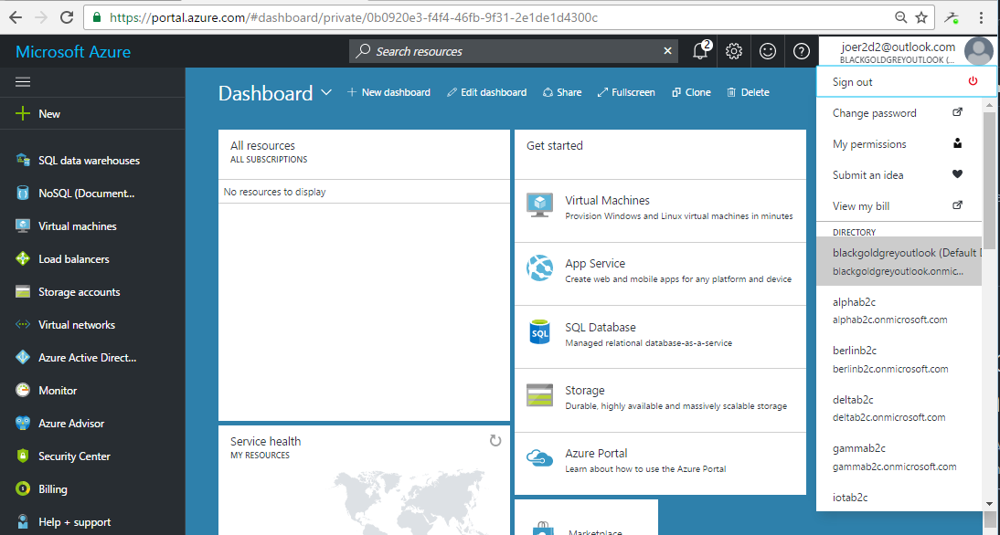
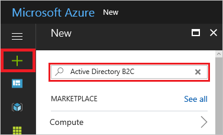
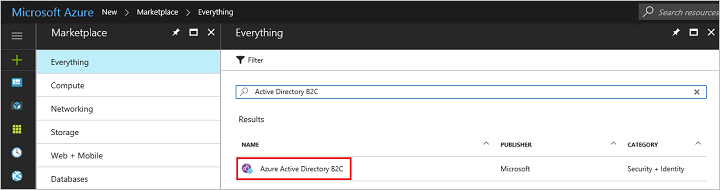
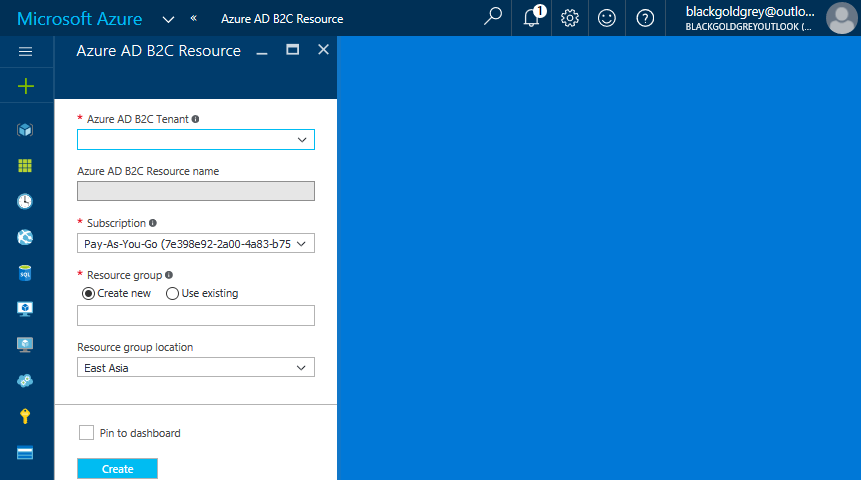

# Link an Azure subscription to an Azure Active Directory B2C tenant

> [!IMPORTANT]
> For the latest information about usage billing and pricing for Azure Active Directory (Azure AD) B2C, see [Azure AD B2C Pricing](https://azure.microsoft.com/pricing/details/active-directory-b2c/).

Usage charges for Azure AD B2C are billed to an Azure subscription. When an Azure AD B2C tenant is created, the tenant administrator needs to explicitly link the Azure AD B2C tenant to an Azure subscription. This article shows you how.

> [!NOTE]
> A subscription linked to an Azure AD B2C tenant can be used for the billing of Azure AD B2C usage or other Azure resources including additional Azure AD B2C resources.  It cannot be used to add other Azure license-based services or Office 365 licenses within the Azure AD B2C tenant.

The subscription link is achieved by creating an Azure AD B2C "resource" within the target Azure subscription. Many Azure AD B2C "resources" can be created within a single Azure subscription, along with other Azure resources (for example, VMs, Data storage, LogicApps). You can see all of the resources within the subscription by going to the Azure AD tenant that the subscription is associated to.

Azure Cloud Solution Providers (CSP) subscriptions are supported in Azure AD B2C. The functionality is available using APIs or the Azure portal for Azure AD B2C and for all Azure resources. CSP subscription administrators can link, move, and delete relationships with Azure AD B2C in the same way that it's done for all Azure resources. The management of Azure AD B2C using role-based access control is not affected by the association between the Azure AD B2C tenant and an Azure CSP subscription. Role-based access control is achieved by using tenant-base roles, not subscription-based roles.

A valid Azure subscription is needed to proceed.

## Create an Azure AD B2C tenant

You must first [create an Azure AD B2C tenant](active-directory-b2c-get-started.md) that you would like to link a subscription to. Skip this step if you have already created an Azure AD B2C tenant.

## Open Azure portal in the Azure AD tenant that shows your Azure subscription

Navigate to the Azure AD tenant that shows your Azure subscription. Open the [Azure portal](https://portal.azure.com), and switch to the Azure AD tenant that shows the Azure subscription you would like to use.

## Find Azure AD B2C in the Azure Marketplace

Click the **Create a resource** button. In the **Search the Marketplace** field, enter `Active Directory B2C`.

In the results list, select **Azure AD B2C**.

Details about Azure AD B2C are shown. To begin configuring your new Azure Active Directory B2C tenant, click the **Create** button.

In the resource creation screen, select **Link an existing Azure AD B2C Tenant to my Azure subscription**.

## Create an Azure AD B2C resource within the Azure subscription

In the resource creation dialog, select an Azure AD B2C tenant from the dropdown. You will see all of the tenants that you are the global administrator of and those that are not already linked to a subscription.

The Azure AD B2C resource name will be preselected to match the domain name of the Azure AD B2C tenant.

For Subscription, select an active Azure subscription that you are the administrator of.

Select a Resource Group and Resource Group location. The selection here has no impact on your Azure AD B2C tenant location, performance, or billing status.

## Manage your Azure AD B2C tenant resources

Once an Azure AD B2C resource is successfully created within the Azure subscription, you should see a new resource of the type "B2C tenant" added alongside your other Azure resources.

You can use this resource to:

- Navigate to the subscription to review billing information.
- Go to your Azure AD B2C tenant
- Submit a support request
- Move your Azure AD B2C tenant resource to another Azure subscription or to another Resource Group.

## Change the Azure AD B2C tenant billing subscription

Azure AD B2C tenants can be moved to another subscription if the source and destination subscriptions exist within the same Azure Active Directory tenant.

To learn how to move Azure resources like your Azure AD B2C tenant to another subscription, see [Move resources to new resource group or subscription](../azure-resource-manager/resource-group-move-resources.md).

Before you initiate the move, be sure to read the entire article to fully understand the limitations and requirements for such a move. In addition to instructions for moving resources, it includes critical information like a pre-move checklist and how to validate the move operation.

## Known Issues

### Self-imposed restrictions

A user may have established a regional restriction for Azure resource creation. This restriction may prevent the creation of Azure AD B2C resource. To mitigate, please relax this restriction.

## Next steps

Once these steps are complete for each of your Azure AD B2C tenants, your Azure subscription is billed in accordance with your Azure Direct or Enterprise Agreement details.

You can review the usage and billing details within your selected Azure subscription. You can also review detailed day-by-day usage reports using the [usage reporting API](active-directory-b2c-reference-usage-reporting-api.md).
