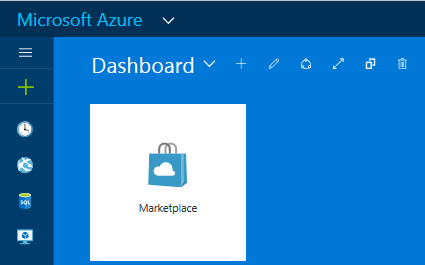
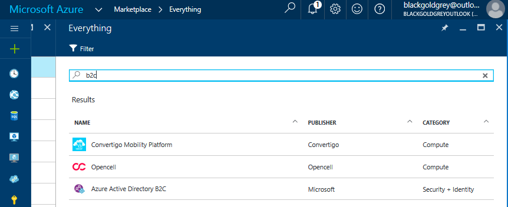

# Linking an Azure Subscription to an Azure B2C tenant to pay for usage charges

Ongoing usage charges for Azure Active Directory B2C (or Azure AD B2C) are billed to an Azure Subscription. It is necessary for the tenant administrator to explicitly link the Azure AD B2C tenant to an Azure subscription after creating the B2C tenant itself.  This link is achieved by creating an Azure AD "B2C Tenant" resource in the target Azure subscription. Many B2C tenants can be linked to a single Azure subscription along with other Azure resources (for example, VMs, Data storage, LogicApps)

> [!IMPORTANT]
> The latest information on usage billing and pricing for B2C is at the following page: [Azure AD B2C Pricing](
https://azure.microsoft.com/pricing/details/active-directory-b2c/)

## Step 1 - Create an Azure AD B2C Tenant
B2C tenant creation must be completed first. Skip this step if you have already created your target B2C Tenant. [Get started with Azure AD B2C](active-directory-b2c-get-started.md)

## Step 2 - Open Azure portal in the Azure AD Tenant that shows your Azure subscription
Navigate to the [Azure portal](https://portal.azure.com). Switch to the Azure AD Tenant that shows the Azure subscription you would like to use. This Azure AD tenant is different from the B2C tenant. Within the Azure portal, click the account name on the upper right of the dashboard to select the Azure AD Tenant. An Azure subscription is needed to proceed. [Get an Azure Subscription](https://account.windowsazure.com/signup?showCatalog=True)

## Step 3 - Create a B2C Tenant resource in Azure Marketplace
Open Marketplace by clicking the Marketplace icon, or selecting the green "+" in the upper left corner of the dashboard.  Search for and select Azure Active Directory B2C. Select Create.

The Azure AD B2C Resource create dialog covers the following parameters:

1. Azure AD B2C Tenant – Select an Azure AD B2C Tenant from the dropdown.  Only eligible Azure AD B2C tenants show.  Eligible B2C tenants meet these conditions: You are the global administrator of the B2C tenant, and the B2C tenant is not currently associated to an Azure subscription

2. Azure AD B2C Resource name - is preselected to match the domain name of the B2C Tenant

3. Subscription - An active Azure subscription in which you are an administrator or a co-administrator.  Multiple Azure AD B2C Tenants may be added to one Azure subscription

4. Resource Group and Resource Group location - This artifact helps you organize multiple Azure resources.  This choice has no impact on your B2C tenant location, performance, or billing status

5. Pin to dashboard for easiest access to your B2C tenant billing information and the B2C tenant settings

## Step 4 - Manage your B2C Tenant resources (optional)
Once deployment is complete, a new "B2C Tenant" resource is created in the target resource group and related Azure subscription.  You should see a new resource of type "B2C Tenant" added alongside your other Azure resources.

By clicking the B2C tenant resource, you are able to
- Click Subscription name to review billing information. See Billing & Usage.
- Click Azure AD B2C Settings to open a new browser tab directly in to your B2C tenant Settings blade
- Submit a support request
- Move your B2C tenant resource to another Azure Subscription, or to another Resource Group.  This choice changes which Azure subscription receives usage charges.

## Known Issues
- B2C Tenant deletion. If a B2C Tenant is created, deleted, and re-created with the same domain name, please also delete and re-create the "Linking" resource with the same domain name.  You will find this "Linking" resource under "All resources" in the subscription tenant via the Azure portal.
- Self-imposed restrictions on regional resource location.  In rare cases, a user may have established a regional restriction for Azure resource creation.  This restriction may prevent the creation of the Link between an Azure subscription and a B2C Tenant. To mitigate, please relax this restriction.

## Next steps
Once these steps are complete for each of your B2C tenants, your Azure subscription is billed in accordance with your Azure Direct or Enterprise Agreement details.
- Review usage and billing within your selected Azure subscription
- Review detailed day-by-day usage reports using the [Usage Reporting API](active-directory-b2c-reference-usage-reporting-api.md)
