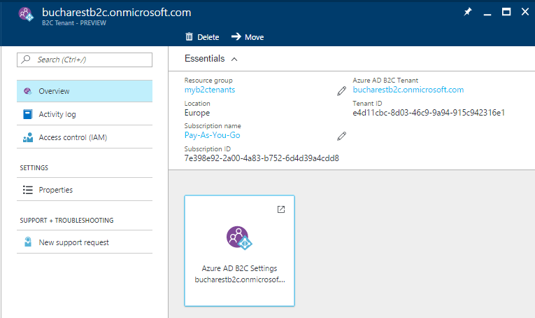

# Link an Azure subscription to an Azure Active Directory B2C tenant

Usage charges for Azure Active Directory B2C (Azure AD B2C) are billed to an Azure subscription. When an Azure AD B2C tenant is created, the tenant administrator needs to explicitly link the Azure AD B2C tenant to an Azure subscription. This article shows you how.

> [!IMPORTANT]
> For the latest information about usage billing and pricing for Azure AD B2C, see [Azure AD B2C Pricing](https://azure.microsoft.com/pricing/details/active-directory-b2c/).

## Link an Azure AD B2C tenant to a subscription

The subscription link is achieved by creating an Azure AD B2C *resource* within the target Azure subscription. Several Azure AD B2C resources can be created in a single Azure subscription, along with other Azure resources like virtual machines, Storage accounts, and Logic Apps. You can see all of the resources within a subscription by going to the Azure Active Directory (Azure AD) tenant that the subscription is associated with.

A subscription linked to an Azure AD B2C tenant can be used for the billing of Azure AD B2C usage or other Azure resources, including additional Azure AD B2C resources. It cannot be used to add other Azure license-based services or Office 365 licenses within the Azure AD B2C tenant.

### Prerequisites

* [Azure subscription](https://azure.microsoft.com/free/)
* [Azure AD B2C tenant](active-directory-b2c-get-started.md) that you want to link a subscription
  * You must be a tenant administrator
  * The tenant must not already be linked to a subscription

### Create the link

1. Sign in to the [Azure portal](https://portal.azure.com).
1. Select the **Directory + subscription** filter in the top menu, and then select the directory that contains the Azure subscription you'd like to use (*not* the directory containing the Azure AD B2C tenant).
1. Select **Create a resource**, enter `Active Directory B2C` in the **Search the Marketplace** field, and then select **Azure Active Directory B2C**.
1. Select **Create**
1. Select **Link an existing Azure AD B2C Tenant to my Azure subscription**.
1. Select an **Azure AD B2C Tenant** from the dropdown. Only tenants for which you are a global administrator and that are not already linked to a subscription are shown. The **Azure AD B2C Resource name** field is populated with the domain name of the Azure AD B2C tenant you select.
1. Select an active Azure **Subscription** of which you are an administrator.
1. Under **Resource group**, select **Create new**, and then specify the **Resource group location**. The resource group settings here have no impact on your Azure AD B2C tenant location, performance, or billing status.
1. Select **Create**.
    

### Manage your Azure AD B2C tenant resources

Once you've created the Azure AD B2C resource in an Azure subscription, you should see a new resource of the type "B2C tenant" appear with your other Azure resources.

You can use this resource to:

* Navigate to the subscription to review billing information
* Get the Azure AD B2C tenant's tenant ID in GUID format
* Go to your Azure AD B2C tenant
* Submit a support request
* Move your Azure AD B2C tenant resource to another Azure subscription or resource group

## Azure Cloud Solution Providers (CSP) subscriptions

Azure Cloud Solution Providers (CSP) subscriptions are supported in Azure AD B2C. The functionality is available using APIs or the Azure portal for Azure AD B2C and for all Azure resources. CSP subscription administrators can link, move, and delete relationships with Azure AD B2C in the same way that it's done for all Azure resources. The management of Azure AD B2C using role-based access control is not affected by the association between the Azure AD B2C tenant and an Azure CSP subscription. Role-based access control is achieved by using tenant-base roles, not subscription-based roles.

## Change the Azure AD B2C tenant billing subscription

Azure AD B2C tenants can be moved to another subscription if the source and destination subscriptions exist within the same Azure Active Directory tenant.

To learn how to move Azure resources like your Azure AD B2C tenant to another subscription, see [Move resources to new resource group or subscription](../azure-resource-manager/resource-group-move-resources.md).

Before you initiate the move, be sure to read the entire article to fully understand the limitations and requirements for such a move. In addition to instructions for moving resources, it includes critical information like a pre-move checklist and how to validate the move operation.

## Known Issues

### Self-imposed restrictions

If you've established a regional restriction for Azure resource creation, that restriction may prevent the creation of the Azure AD B2C resource. To mitigate, relax the restriction.

## Next steps

Once these steps are complete for each of your Azure AD B2C tenants, your Azure subscription is billed in accordance with your Azure Direct or Enterprise Agreement details.

You can review the usage and billing details within your selected Azure subscription. You can also review detailed day-by-day usage reports using the [usage reporting API](active-directory-b2c-reference-usage-reporting-api.md).
