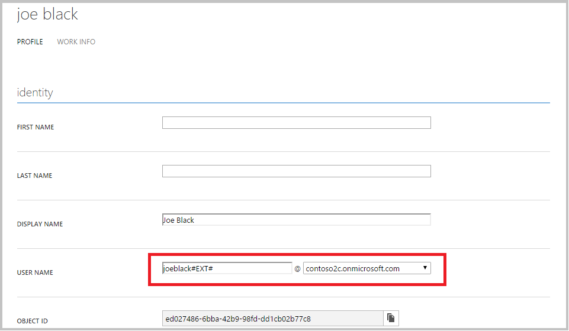

<properties
	pageTitle="Azure Active Directory B2C: Limitations and restrictions | Microsoft Azure"
	description="A list of limitations and restrictions with Azure Active Directory B2C"
	services="active-directory-b2c"
	documentationCenter=""
	authors="swkrish"
	manager="msmbaldwin"
	editor="bryanla"/>

<tags
	ms.service="active-directory-b2c"
	ms.workload="identity"
	ms.tgt_pltfrm="na"
	ms.devlang="na"
	ms.topic="article"
	ms.date="07/24/2016"
	ms.author="swkrish"/>

# Azure Active Directory B2C: Limitations and restrictions

There are several features and functionalities of Azure Active Directory (Azure AD) B2C that are not yet supported. Many of these known issues & limitations will be addressed going forward, but you should be aware of them if you are building consumer-facing applications using Azure AD B2C.

## Issues during the creation of Azure AD B2C tenants

If you encounter issues during the [creation of an Azure AD B2C tenant](active-directory-b2c-get-started.md), see [Create an Azure AD tenant or an Azure AD B2C tenant--issues and resolutions](active-directory-b2c-support-create-directory.md) for guidance.

## Note about B2C tenant quotas

By default, the number of users in a B2C tenant is limited to 50,000 users. If you need to raise the quota of your B2C tenant, you should contact Support.

## Branding issues on verification email

The default verification email contains Microsoft branding. We will remove it in the future. For now, you can remove it by using the [company branding feature](../active-directory/active-directory-add-company-branding.md).

## Restrictions on applications

The following types of applications are not currently supported in Azure AD B2C. For a description of the supported types of applications, refer to [Azure AD B2C: Types of applications](active-directory-b2c-apps.md).

### Single Page Applications (JavaScript)

Many modern applications have a Single Page Application (SPA) front-end that is written primarily in JavaScript and often uses an SPA framework such as AngularJS, Ember.js, Durandal, etc. This flow is not yet available in Azure AD B2C.

### Daemons / server-side applications

Applications that contain long-running processes or that operate without the presence of a user also need a way to access secured resources, such as Web APIs. These applications can authenticate and get tokens by using the application's identity (rather than a consumer's delegated identity) in the [OAuth 2.0 client credentials flow](active-directory-b2c-reference-protocols.md#oauth2-client-credentials-grant-flow). This flow is not yet available in Azure AD B2C, so for now, applications can get tokens only after an interactive consumer sign-in flow has occurred.

### Standalone Web APIs

In the Azure AD B2C, you have the ability to [build a Web API that is secured by using OAuth 2.0 tokens](active-directory-b2c-apps.md#web-apis). However, that Web API will only be able to receive tokens from a client that shares the same Application ID. Building a Web API that is accessed from several different clients is not supported.

### Web API chains (On-Behalf-Of)

Many architectures include a Web API that needs to call another downstream Web API, both secured by Azure AD B2C. This scenario is common in native clients that have a Web API back end, which in turn calls a Microsoft online service such as the Azure AD Graph API.

This chained Web API scenario can be supported by using the OAuth 2.0 Jwt Bearer Credential grant, otherwise known as the On-Behalf-Of flow. However, the On-Behalf-Of flow is not currently implemented in the Azure AD B2C.

## Restriction on libraries and SDKs

The set of Microsoft supported libraries that work Azure AD B2C is very limited at this time. We have support for .NET based web apps and services, as well as NodeJS web apps and services.  We also have a preview .NET client library known as MSAL that can be used with Azure AD B2C in Windows & other .NET apps.

We do not currently have library support any other languages or platforms, including iOS & Android.  If you wish to build on a different platform than those mentioned above, we recommend using an open-source SDK, referring to our [OAuth 2.0 and OpenID Connect Protocol Reference](active-directory-b2c-reference-protocols.md) as necessary.  Azure AD B2C implements OAuth & OpenID Connect, which makes it possible to use a generic OAuth or OpenID Connect library for integration.

Our iOS & Android quick start tutorials use open-source libraries that we have tested for compatibility with Azure AD B2C.  All of our quick-start tutorials are available in our [Getting started](active-directory-b2c-overview.md#getting-started) section.

## Restriction on protocols

Azure AD B2C supports OpenID Connect and OAuth 2.0. However, not all features and capabilities of each protocol have been implemented. To better understand the scope of supported protocol functionality in Azure AD B2C, read through our [OpenID Connect and OAuth 2.0 protocol reference](active-directory-b2c-reference-protocols.md). SAML and WS-Fed protocol support is not available.

## Restriction on tokens

Many of the tokens issued by Azure AD B2C are implemented as JSON Web Tokens, or JWTs. However, not all information contained in JWTs (known as "claims") is quite as it should be or is missing. Some examples include the "sub" and the "preferred_username" claims.  As the values, format, or meaning of claims change over time, tokens for your existing policies will remain unaffected - you can rely on their values in production apps.  As values change, we will give you the opportunity to configure those changes for each of your policies.  To better understand the tokens emitted currently by the Azure AD B2C service, read through our [token reference](active-directory-b2c-reference-tokens.md).

## Restriction on nested groups

Nested group memberships aren't supported in Azure AD B2C tenants. We don't plan to add this capability.

## Restriction on differential query feature on Azure AD Graph API

The [differential query feature on Azure AD Graph API](https://msdn.microsoft.com/library/azure/ad/graph/howto/azure-ad-graph-api-differential-query) isn't supported in Azure AD B2C tenants. This is on our long-term roadmap.

## Issues with user management on the Azure classic portal

B2C features are accessible on the Azure portal. However, you can use the Azure classic portal to access other tenant features, including user management. Currently there are a couple of known issues with user management (the **Users** tab) on the Azure classic portal:

- For a local account user (i.e., a consumer who signs up with an email address and password, or a username and password), the **User Name** field doesn't correspond to the sign-in identifier (email address or username) that was used during sign-up. This is because the field displayed on the Azure classic portal is actually the User Principal Name (UPN), which is not used in B2C scenarios. To view the sign-in identifier of the local account, find the user object in [Graph Explorer](https://graphexplorer.cloudapp.net/). You will find the same issue with a social account user (i.e., a consumer who signs up with Facebook, Google+, etc.), but in that case, there is no sign-in identifier to speak of.

    

- For a local account user, you will not able to edit any of the fields and save changes on the **Profile** tab.

## Issues with admin-initiated password reset on the Azure classic portal

If you reset the password for a local account-based consumer on the Azure classic portal (the **Reset Password** command on the **Users** tab), that consumer will not be able to change his or her password on the next sign in, if you use a Sign up or Sign in policy, and will be locked out of your applications. As a workaround, use the [Azure AD Graph API](active-directory-b2c-devquickstarts-graph-dotnet.md) to reset the consumer's password (without password expiration) or use a Sign in policy instead of a Sign up or Sign in policy.

## Issues with creating a custom attribute

A [custom attribute added on the Azure portal](active-directory-b2c-reference-custom-attr.md) is not immediately created in your B2C tenant. You'll have to use the custom attribute in at least one of your policies for it to get created in your B2C tenant and to become available via Graph API.

## Issues with verifying a domain on the Azure classic portal

Currently you can't verify a domain successfully on the [Azure classic portal](https://manage.windowsazure.com/).

## Issues with Sign-in with MFA policy on Safari browsers

Requests to sign-in policies (with MFA turned ON) fail intermittently on Safari browsers with HTTP 400 (Bad Request) errors. This is due Safari's low cookie size limits. There are a couple of workarounds for this issue:

- Use the "Sign-up or sign-in policy" instead of the "sign-in policy".
- Reduce the number of **Application claims** being requested in your policy.
