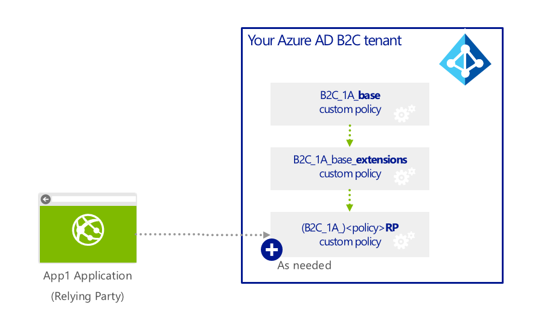

# Azure Active Directory B2C: Custom policies

## What are custom policies?

Custom policies are configuration files that define the behavior of your Azure AD B2C tenant. Whereas **built-in policies** are predefined in the Azure AD B2C portal for the most common identity tasks, custom policies can be fully edited by an identity developer to complete a near unlimited number of tasks. Read on to determine if custom policies are right for you and your identity scenario.

**Custom policy editing is not for everyone.** The learning curve is demanding, the startup time is longer, and future changes to custom policies will require similar expertise to maintain. Built-in policies should be carefully considered first for your scenario before using custom policies.

## Comparing built-in policies and custom policies

| | Built-in policies | Custom policies |
|-|-------------------|-----------------|
|Target users | All app developers with or without identity expertise | Identity pros: systems integrators, consultants and in-house identity teams. They are comfortable with OpenIDConnect flows, and understand identity providers and claims-based authentication |
|Configuration method | Azure portal with a user-friendly UI | Directly editing XML files and then uploading to the Azure portal |
|UI customization | Full UI customization, including HTML, CSS, and jscript support(requires custom domain)  Multilanguage support with Custom strings | Same |
| Attribute customization | Standard and custom attributes | Same |
|Token and session management | Custom token and multiple session options | Same |
|Identity Providers| **Today**: predefined local, social provider  **Future**: Standards-based OIDC, SAML, OAuth | **Today**: Standards-based OIDC, OAUTH, SAML  **Future**: WsFed |
|Identity Tasks (examples) | Signup or SignIn with local and many social accounts  Password Reset  Profile Edit  Multi-Factor Auth scenarios  Customize Tokens and sessions  Access Token flows | Complete the same tasks as built-in policies using custom identity providers or use custom scopes  Provision user in another system at the time of registration  Send a welcome email using your own email service provider  Use a user store outside B2C  Validate user provided information with a trusted system via API |

## Policy files

A custom policy is represented as one or several XML-formatted files which refer to each other in a hierarchical chain. The XML elements define: Claims schema, claims transformations, content definitions, claims providers/technical profiles, and Userjourney orchestration steps, among other elements.

We recommend the use of three types of policy files:

- **A BASE file**, which contains most of the definitions and for which Azure provides a complete sample.  We recommend you make a minimum number of changes to this file to help with troubleshooting, and long-term maintenance of your policies
- **an EXTensions file** that holds the unique configuration changes for your tenant
- **a Relying Party (RP) file** which is the single task-focused file that is invoked directly by the application or service (aka Relying Party).  Read the article on Policy file definitions for more information.  Each unique task requires its own RP and depending on branding requirements the number might be "total of applications x total number of use cases".

Built-in policies in Azure AD B2C follow the 3-file pattern depicted above, but the developer only sees the Relying Party (RP) file, while the portal makes changes in the background to the EXTenstions file.

## Core concepts you should know when using custom policies

### Azure Active Directory B2C

Azure’s customer identity and access management (CIAM) service. The service includes:

1. A user directory in the form of a special-purpose Azure Active Directory accessible via Microsoft Graph and which holds user data for both local accounts and federated accounts 
2. Access to the **Identity Experience Framework** which orchestrates trust between users and entities and passes claims between them to complete an identity/access management task 
3. A security token service (STS) issuing id tokens, refresh tokens, and access tokens (and equivalent SAML assertions) and validating them to protect resources.

Azure AD B2C interacts with identity providers, users, other systems, and with the local user directory in sequence to achieve an identity task (e.g. login a user, register a new user, reset a password). The underlying platform which establishes multi-party trust and executes these steps is called the Identity Experience Framework and a policy (also called an user journey or a Trust framework policy) explicitly defines the actors, the actions, the protocols, and the sequence of steps to complete.

### Identity Experience Framework

A fully configurable, policy-driven, cloud-based Azure platform that orchestrates trust between entities (broadly Claims Providers) in standard protocol formats such as OpenIDConnect, OAuth, SAML, WSFed, and a few non-standard ones (e.g. REST API-based system-to-system claims exchanges). The I2E creates user-friendly, whitelabelled experiences that support HTML, CSS, and jscript.  Today, the Identity Experience Framework is available only in the context of the Azure AD B2C service and prioritized for tasks related to CIAM.

### Built-in policies

Predefined configuration files that direct the behavior of Azure AD B2C to perform the most commonly used identity tasks (i.e. user registration, signin, password reset) and interact with trusted parties whose relationship is also predefined in Azure AD B2C (e.g. Facebook identity provider, LinkedIn, Microsoft Account, Google accounts).  In the future, built-in policies may also provide for customization of identity providers which are typically in the enterprise realm such as Azure Active Directory Premium, Active Directory/ADFS, Salesforce ID Provider etc.

### Custom policies

Configuration files that define the behavior of Identity Experience Framework in your Azure AD B2C tenant. A custom policy is accessible as one or several XML files (see Policy Files definitions) which are executed by the Identity Experience Framework when invoked by a relying party (e.g. an application). Custom policies can be directly edited by an identity developer to complete a near unlimited number of tasks. Developers configuring custom policies must define the trusted relationships in careful detail to include metadata endpoints, exact claims exchange definitions, and configure secrets, keys and certificates as needed by each identity provider.

## Policy File Definitions for Identity Experience Framework Trustframeworks

### Policy Files

A custom policy is represented as one or several XML-formatted files which refer to each other in a hierarchical chain. The XML elements define: Claims schema, claims transformations, content definitions, claims providers/technical profiles, and Userjourney orchestration steps, among other elements.  We recommend the use of three types of policy files:

- **A BASE file**, which contains most of the definitions and for which Azure provides a complete sample.  We recommend you make a minimum number of changes to this file to help with troubleshooting, and long-term maintenance of your policies
- **an EXTensions file** that holds the unique configuration changes for your tenant
- **a Relying Party (RP) file** which is the single task-focused file that is invoked directly by the application or service (aka Relying Party).  Read the article on Policy file definitions for more information.  Each unique task requires its own RP and depending on branding requirements the number might be "total of applications x total number of use cases".

| Type of policy file | Examples file name | Recommended use | Inherits from |
|---------------------|--------------------|-----------------|---------------|
| BASE |TrustFrameworkBase.xml  Mytenant.onmicrosoft.com-B2C-1A_BASE1.xml | Includes the core claims schema, claims transformations, claims providers, and user journeys configured by Microsoft  Make minimal changes to this file | None |
| Extension (EXT) | TrustFrameworkExtensions.xml  Mytenant.onmicrosoft.com-B2C-1A_EXT.xml | Consolidate your changes to the BASE file here  Modified claims providers  Modified user journeys  Your own custom schema definitions | BASE file |
| Relying Party (RP) | | | Extensions file |

### Inheritance model

When an application calls the RP Policy file, the Identity Experience Framework in B2C will add all the elements from BASE, then from EXTENSIONS, and lastly from the RP policy file to assemble the current policy in effect.  Elements of the same type and name in the RP file will override those in the EXTENSIONS, and EXTENSIONS overrides BASE.

**Built-in policies** in Azure AD B2C follow the 3-file pattern depicted above, but the developer only sees the Relying Party (RP) file, while the portal makes changes in the background to the EXTenstions file.  All of Azure AD B2C shares a BASE policy file that is under the control of the Azure B2C team and is updated frequently.
