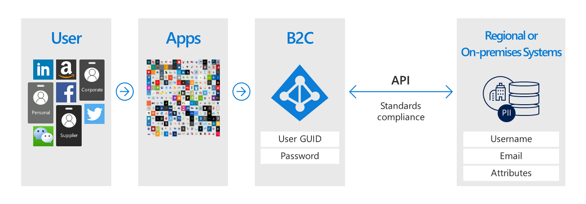
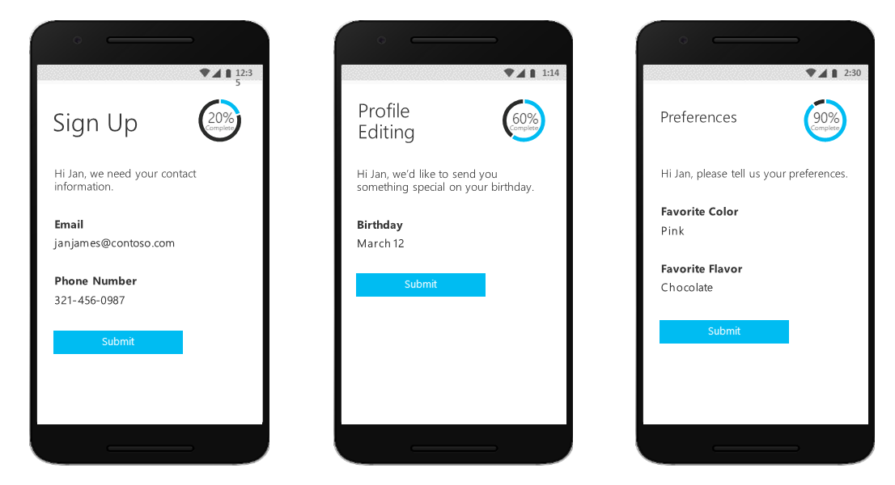
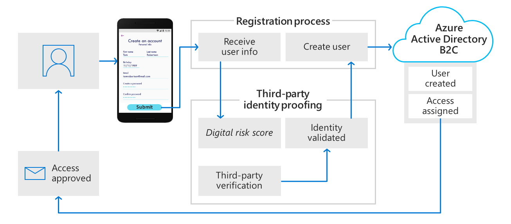
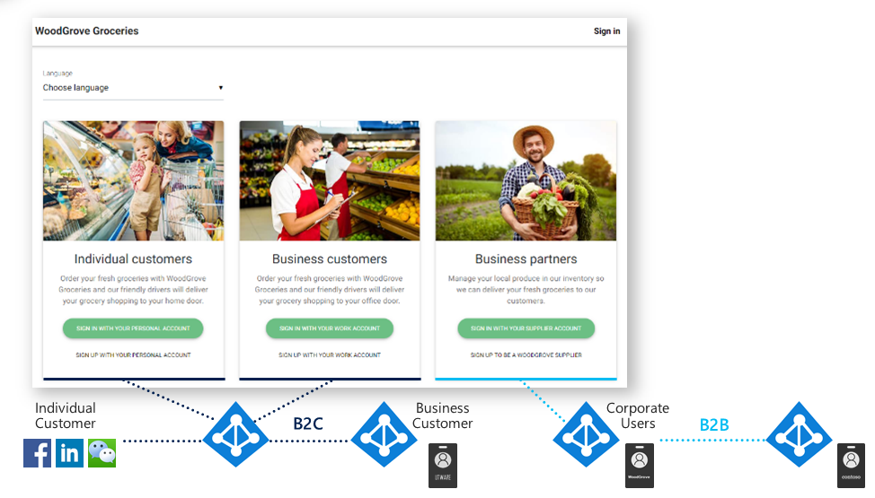
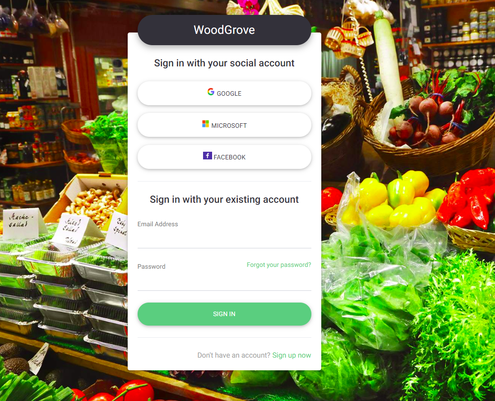

# What is Azure Active Directory B2C?

Azure Active Directory B2C provides business-to-customer identity as a service. Your customers use their preferred social identity, enterprise identity, or local accounts (username and password) to get single sign-on access to your applications and APIs.

Azure AD B2C supports many business-to-business (B2B) and business-to-consumer (B2C) commerce use cases. Continue on to the sections below for an overview of several such scenarios.

## Custom-branded identity solution

Azure Active Directory (Azure AD) B2C is a white-label authentication solution. The entire user experience can be branded and customized to blend seamlessly with your web and mobile applications.

You can customize every page that is displayed by when your users sign up, sign in, and modify their profile information. Customize the HTML, CSS, and JavaScript in your user journeys so that the Azure AD B2C experience looks and feels like it's a native part of your application.

## Single sign-on access with a user-provided identity

By serving as the central authentication authority for all your applications, Azure AD B2C enables you to build a single sign-on (SSO) solution your API, web, and mobile application. Centralize the collection of user profile and preference information, and capture detailed analytics information about login behavior and sign-up conversion.

Azure AD B2C takes care of the safety and scalability of the authentication platform, monitoring and automatically handling threats like denial-of-service, password spray, or brute force attacks.

Azure AD B2C uses standards-based authentication protocols, including OpenID Connect, OAuth2, and SAML. It can integrate with most modern applications and commercial off-the-shelf software.

## Scenarios enabled using the Identity Experience Framework

The power of Azure AD B2C lies in the Identity Experience Framework (IEF). This framework is an extremely powerful orchestration engine which can be used to build almost any authentication, user registration, or profile editing experience that you can imagine. The Identity Experience Framework gives you the ability to construct user journeys out of any combination of steps such as: federation with other identity providers, first party and 3rd party MFA challenges, collecting user input, and integration with external systems using REST API communication.

Each of these user journeys is defined by a policy, and you can build as many or as few policies as you need to enable the best user experience for your business. Let's take a look at some examples of the interesting and valuable scenarios, which can be achieved using the power of the Identity Experience Framework and custom policies in Azure AD B2C.

### Integration with external user stores

One common B2C see scenario involves integration with an external system, which stores user profile or PII data (personally identifying information). Potential reasons for using this pattern include the need for specific data residency requirements, such as regional or on premises data storage.

Another reason to follow this patter is when Azure AD B2C handles authentication, but delegates to an external CRM membership or customer loyalty database, which serves as the source of truth for customer data. Azure AD B2C can facilitate collecting the information from the user during registration, or profile editing, then handing it off to the other system. Then during authentication, Azure AD B2C can retrieve the data from the external system, and if needed included as a part of the authentication token response, which is sent the application.

### Progressive profiling

Other high value user journey orchestrations include progressive profiling, allowing the user to quickly complete their first transaction by collecting a minimal amount of information, then gradually collecting more profile data on subsequent logins.

### Third-party identity verification and proofing

Another valuable use of the Identity Experience Framework is to facilitate identity verification and proofing by collecting user data and passing it to a third party system to perform validation, trust scoring, or approval for user account creation.

## Provide access to customers, partners, and employees

Let's take a look at how Azure AD B2C works with an actual website. [Woodgrove Groceries](https://aka.ms/ciamdemo) is a 21st century online grocery store. They sell their groceries to individual consumers and to business customers, who may be buying groceries on behalf of their company, or business that they manage. They offer a few different login options depending on the type of relationship that a user has with the grocery store. **Individual customers** can sign-up or sign-in with individual accounts, **Business customers** can sign-in with an enterprise credential. **Partners** and suppliers are individuals who supply the grocery store with products to sell.

### Authenticate individual consumers

But let's take a look at what looks like to log in with a **individual customer** account. Clicking on **sign-in with your personal account** redirects the user to a sign-in user interface that's hosted by Azure AD B2C. Here you can see that we've customize the UI and it looks and feels just like the Contoso groceries website. Users actually have no idea that they are on a website that's hosted and secured by Azure AD B2C that looks and feels just like with group groceries. Users given the option to sign in with a few different types of social accounts. Choose an existing username and password are in this case, email address and password that user may already have with good growth or sign up for a new account.

Choosing to sign up for a new account, your can see what that experience looks like. On the registration form for the groceries website. It's going to be any email address. When users clickes on **Send verification code**, Azure AD B2C sends the verification code right away. User needs to open the mailbox copy and paste the verification code.Now that the emails is verified. User set up a password, provide a name. And in this case Contoso groceries is also set up a terms of service, so user needs to agree to the terms of service before can continue. Azure AD B2C sents the user back to the Contoso Groceries Web application, which trust be to see for authentication. It passes an OpenID connect authentication token over to the website. Now the user is signed-in and ready to go. The application is showing user dispaly name up here in the top corner to indicate that user is signed in.

### Authenticate business customers

By selecting **Business Customer** the Woodgrove Groceries site will invoke a separate Azure AD B2C policy which provides the user with an option to use a corporate credential. In this example, users will be prompted to login with any Office 365 or Azure AD account. The policy leverages a [multi-tenant Azure AD application](https://docs.microsoft.com/en-us/azure/active-directory/develop/howto-convert-app-to-be-multi-tenant) and the `/common` Azure AD endpoint to federate Azure AD B2C with every Office 365 customer in the world.

### Authenticate partner users

The **Partner/Supplier** signin link in this demo uses the Azure AD B2B Collaboration functionality. [Click here](https://docs.microsoft.com/en-us/azure/active-directory/b2b/what-is-b2b) to learn more about B2B Collaboration in Azure AD.

## How to construct these samples

For examples for how to construct these scenarios in Azure AD B2C, visit the community-maintained [samples repository](https://github.com/azure-ad-b2c/samples) on GitHub.

## Next steps

Now that you have an idea of what Azure Active Directory B2C is about and the scenarios it can help with, dig a little deeper into its technical aspects.

> [!div class="nextstepaction"]
> [Azure AD B2C technical overview >](technical-overview.md)
