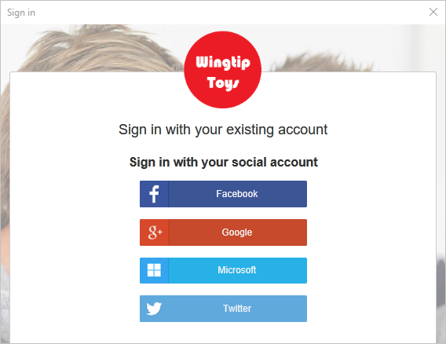
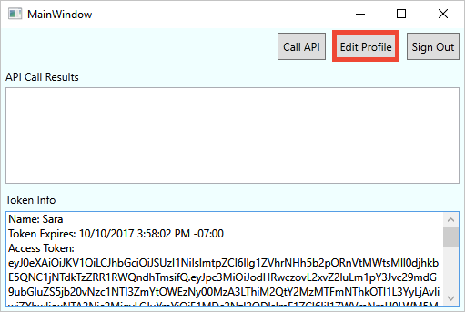

# Quickstart: Set up sign-in for a desktop app using Azure Active Directory B2C

Azure Active Directory (Azure AD) B2C provides cloud identity management to keep your application, business, and customers protected. Azure AD B2C enables your applications to authenticate to social accounts and enterprise accounts using open standard protocols. In this quickstart, you use a Windows Presentation Foundation (WPF) desktop application to sign in using a social identity provider and call an Azure AD B2C protected web API.

[!INCLUDE [quickstarts-free-trial-note](../../includes/quickstarts-free-trial-note.md)]

## Prerequisites

- [Visual Studio 2019](https://www.visualstudio.com/downloads/) with the **ASP.NET and web development** workload.
- A social account from either Facebook, Google, Microsoft, or Twitter.
- [Download a zip file](https://github.com/Azure-Samples/active-directory-b2c-dotnet-desktop/archive/master.zip) or clone the sample web app from GitHub.

    ```
    git clone https://github.com/Azure-Samples/active-directory-b2c-dotnet-desktop.git
    ```

## Run the application in Visual Studio

1. In the sample application project folder, open the **active-directory-b2c-wpf.sln** solution in Visual Studio.
2. Press **F5** to debug the application.

## Sign in using your account

1. Click **Sign in** to start the **Sign Up or Sign In** workflow.

    

    The sample supports several sign-up options. These options include using a social identity provider or creating a local account using an email address. For this quickstart, use a social identity provider account from either Facebook, Google, Microsoft, or Twitter.


2. Azure AD B2C presents a custom login page for a fictitious brand called Wingtip Toys for the sample web app. To sign up using a social identity provider, click the button of the identity provider you want to use.

    

    You authenticate (sign in) using your social account credentials and authorize the application to read information from your social account. By granting access, the application can retrieve profile information from the social account such as your name and city.

2. Finish the sign-in process for the identity provider.

    Your new account profile details are pre-populated with information from your social account.

## Edit your profile

Azure AD B2C provides functionality to allow users to update their profiles. The sample web app uses an Azure AD B2C edit profile user flow for the workflow.

1. In the application menu bar, click **Edit profile** to edit the profile you created.

    

2. Choose the identity provider associated with the account you created. For example, if you used Twitter as the identity provider when you created your account, choose Twitter to modify the associated profile details.

3. Change your **Display name** or **City**, and then click **Continue**.

    A new access token is displayed in the *Token info* text box. If you want to verify the changes to your profile, copy and paste the access token into the token decoder https://jwt.ms.

## Access a protected API resource

Click **Call API** to make a request to the protected resource.

    

    The application includes the Azure AD access token in the request to the protected web API resource. The web API sends back the display name contained in the access token.

You've successfully used your Azure AD B2C user account to make an authorized call an Azure AD B2C protected web API.

## Clean up resources

You can use your Azure AD B2C tenant if you plan to try other Azure AD B2C quickstarts or tutorials. When no longer needed, you can [delete your Azure AD B2C tenant](active-directory-b2c-faqs.md#how-do-i-delete-my-azure-ad-b2c-tenant).

## Next steps

In this quickstart, you used a sample desktop application to:

* Sign in with a custom login page
* Sign in with a social identity provider
* Create an Azure AD B2C account
* Call a web API protected by Azure AD B2C

Get started creating your own Azure AD B2C tenant.

> [!div class="nextstepaction"]
> [Create an Azure Active Directory B2C tenant in the Azure portal](tutorial-create-tenant.md)
