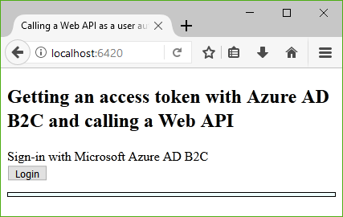
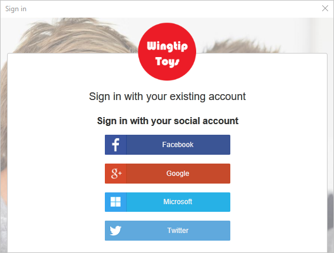
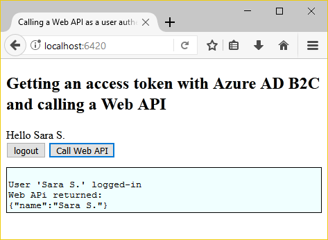

# Quickstart: Set up sign-in for a single-page app using Azure Active Directory B2C

Azure Active Directory (Azure AD) B2C provides cloud identity management to keep your application, business, and customers protected. Azure AD B2C enables your applications to authenticate to social accounts, and enterprise accounts using open standard protocols. In this quickstart, you use a single-page application to sign in using a social identity provider and call an Azure AD B2C protected web API.

[!INCLUDE [quickstarts-free-trial-note](../../includes/quickstarts-free-trial-note.md)]

## Prerequisites

- [Visual Studio 2019](https://www.visualstudio.com/downloads/) with the **ASP.NET and web development** workload.
- Install [Node.js](https://nodejs.org/en/download/)
- A social account from either Facebook, Google, Microsoft, or Twitter.
- [Download a zip file](https://github.com/Azure-Samples/active-directory-b2c-javascript-msal-singlepageapp/archive/master.zip) or clone the sample web app from GitHub.

    ```
    git clone https://github.com/Azure-Samples/active-directory-b2c-javascript-msal-singlepageapp.git
    ```

## Run the application

1. Start the server by running the following commands from the Node.js command prompt:

    ```
    cd active-directory-b2c-javascript-msal-singlepageapp
    npm install && npm update
    node server.js
    ```

    Server.js outputs the port number it's listening on at localhost.

    ```
    Listening on port 6420...
    ```

2. Browse to the URL of the application. For example, `http://localhost:6420`.

## Sign in using your account

1. Click **Login** to start the workflow.

    

    The sample supports several sign-up options including using a social identity provider or creating a local account using an email address. For this quickstart, use a social identity provider account from either Facebook, Google, Microsoft, or Twitter.

2. Azure AD B2C presents a custom login page for a fictitious brand called Wingtip Toys for the sample web app. To sign up using a social identity provider, click the button of the identity provider you want to use.

    

    You authenticate (sign in) using your social account credentials and authorize the application to read information from your social account. By granting access, the application can retrieve profile information from the social account such as your name and city.

3. Finish the sign-in process for the identity provider.

## Access a protected API resource

Click **Call Web API** to have your display name returned from the Web API call as a JSON object.



The sample single-page application includes an access token in the request to the protected web API resource.

## Clean up resources

You can use your Azure AD B2C tenant if you plan to try other Azure AD B2C quickstarts or tutorials. When no longer needed, you can [delete your Azure AD B2C tenant](active-directory-b2c-faqs.md#how-do-i-delete-my-azure-ad-b2c-tenant).

## Next steps

In this quickstart, you used a sample single-page application to:

* Sign in with a custom login page
* Sign in with a social identity provider
* Create an Azure AD B2C account
* Call a web API protected by Azure AD B2C

Get started creating your own Azure AD B2C tenant.

> [!div class="nextstepaction"]
> [Create an Azure Active Directory B2C tenant in the Azure portal](tutorial-create-tenant.md)
