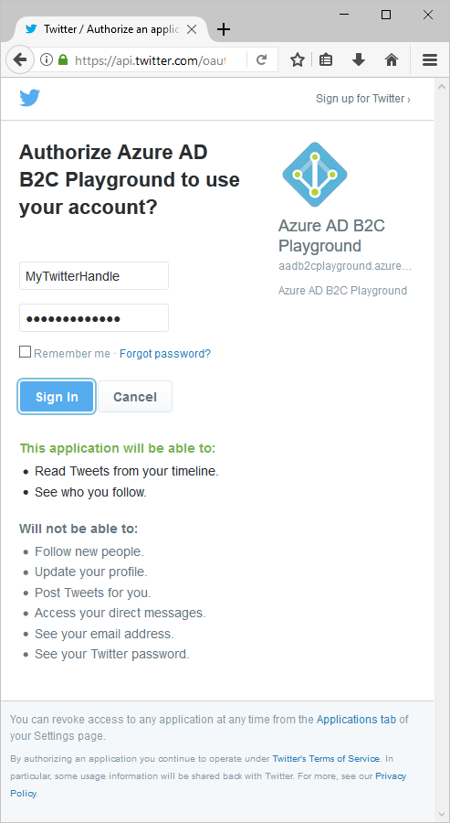
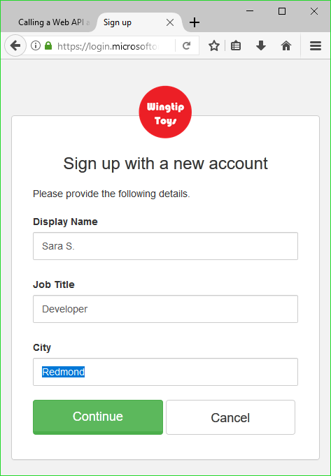

# Test drive a single-page application configured with Azure AD B2C

## About this sample

Azure Active Directory B2C provides cloud identity management to keep your application, business, and customers protected.  This quickstart uses a sample single page application to demonstrate:

* Using the **Sign Up or Sign In** policy to create or sign in with a social identity provider or a local account using an email address. 
* **Calling an API** to retrieve your display name from an Azure AD B2C secured resource.

## Prerequisites

* Install [Visual Studio 2017](https://www.visualstudio.com/downloads/) with the following workloads:
    - **ASP.NET and web development**

* Install [Node.js](https://nodejs.org/en/download/)

* A social account from either Facebook, Google, Microsoft, or Twitter. If you don't have a social account, a valid email address is required.

[!INCLUDE [quickstarts-free-trial-note](../../includes/quickstarts-free-trial-note.md)]

## Download the sample

[Download or clone the sample application](https://github.com/Azure-Samples/active-directory-b2c-javascript-msal-singlepageapp) from GitHub.

## Run the sample application

To run this sample from the Node.js command prompt: 

```
cd active-directory-b2c-javascript-msal-singlepageapp
npm install && npm update
node server.js
```

The console window shows the port number for the web application running on your computer.

```
Listening on port 6420...
```

Open `http://localhost:6420` in a web browser to access the web application.


## Create an account

Click the **Login** button to start the Azure AD B2C **Sign Up or Sign In** workflow. When creating an account, you can use an existing social identity provider account or an email account.

### Sign up using a social identity provider

To sign up using a social identity provider, click the button of the identity provider you want to use. If you prefer to use an email address, jump to the [Sign up using an email address](#sign-up-using-an-email-address) section.


You need to authenticate (sign-in) using your social account credentials and authorize the application to read information from your social account. By granting access, the application can retrieve profile information from the social account such as your name and city. 



Your new account profile details are pre-populated with information from your social account. 



Update the Display Name, Job Title, and City fields and click **Continue**.  The values you enter are used for your Azure AD B2C user account profile.

You have successfully created a new Azure AD B2C user account that uses an identity provider. 

Next step: [Call a resource](#call-a-resource) section.

### Sign up using an email address

If you choose to not use a social account to provide authentication, you can create an Azure AD B2C user account using a valid email address. An Azure AD B2C local user account uses Azure Active Directory as the identity provider. To use your email address, click the **Don't have an account? Sign up now** link.


Enter a valid email address and click **Send verification code**. A valid email address is required to receive the verification code from Azure AD B2C. 

Enter the verification code you receive in email and click **Verify code**.

Add your profile information and click **Create**.


You have successfully created a new Azure AD B2C local user account.

## Call a resource

Once signed in, you can click the **Call Web API** button to have your display name returned from the Web API call as a JSON object. 


## Next steps

The next step is to create your own Azure AD B2C tenant and configure the sample to run using your tenant. 

> [!div class="nextstepaction"]
> [Create an Azure Active Directory B2C tenant in the Azure portal](active-directory-b2c-get-started.md)