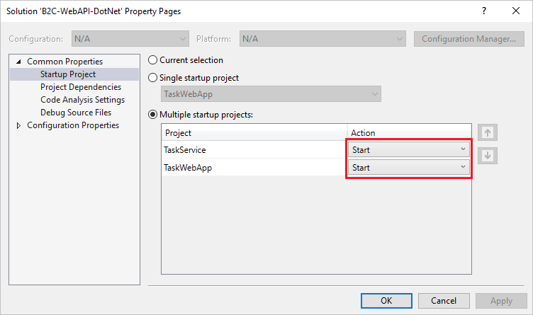
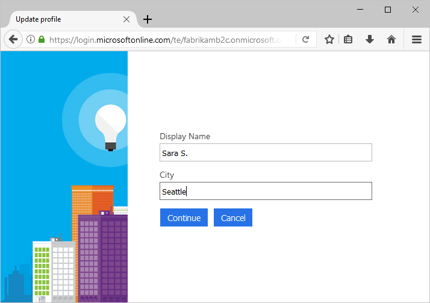

# Test drive an Azure AD B2C enabled web app

Azure Active Directory B2C provides cloud identity management to keep your application, business, and customers protected. This quickstart uses a sample to-do list app to demonstrate:

> [!div class="checklist"]
> * Sign-in with a custom login page.
> * Sign-in using a social identity provider.
> * Creating and managing your Azure AD B2C account and user profile.
> * Calling a web API secured by Azure AD B2C.

## Prerequisites

* [Visual Studio 2017](https://www.visualstudio.com/downloads/) with the **ASP.NET and web development** workload. 
* A social account from either Facebook, Google, Microsoft, or Twitter.

[!INCLUDE [quickstarts-free-trial-note](../../includes/quickstarts-free-trial-note.md)]

## Download the sample

[Download or clone the sample application](https://github.com/Azure-Samples/active-directory-b2c-dotnet-webapp-and-webapi) from GitHub.

## Run the app in Visual Studio

In the sample application project folder, open the `B2C-WebAPI-DotNet.sln` solution in Visual Studio. 

The solution is a sample to-do list application consisting of two projects:

* **TaskWebApp** – An ASP.NET MVC web application where a user can manage their to-do list items.  
* **TaskService** – An ASP.NET Web API backend that manages operations performed on a user's To-do list items. The web app calls this web API and displays the results.

For this quickstart, you need to run both the `TaskWebApp` and `TaskService` projects at the same time. 

1. In the Visual Studio menu, select **Projects > Set StartUp Projects...**. 
2. Select **Multiple startup projects** radio button.
3. Change the **Action** for both projects to **Start**. Click **OK**.

Select **Debug > Start Debugging** to build and run both applications. Each application opens in its own browser tab:

`https://localhost:44316/` - This page is the ASP.NET web application. You interact directly with this application in the quickstart.
`https://localhost:44332/` - This page is the web API that is called by the ASP.NET web application.

## Create an account

Click the **Sign up / Sign in** link in the ASP.NET web application to start the **Sign Up or Sign In** workflow. When creating an account, you can use an existing social identity provider account or an email account. For this quickstart, use a social identity provider account from either Facebook, Google, Microsoft, or Twitter.

### Sign up using a social identity provider

To sign up using a social identity provider, click the button of the identity provider you want to use. 

You need to authenticate (sign-in) using your social account credentials and authorize the application to read information from your social account. By granting access, the application can retrieve profile information from the social account such as your name and city. 

Finish the sign-in process for the identity provider. For example, if you chose Twitter, enter your Twitter credentials and click **Sign in**.

Your new Azure AD B2C account profile details are pre-populated with information from your social account.

Update the Display Name, Job Title, and City fields and click **Continue**.  The values you enter are used for your Azure AD B2C user account profile.

You have successfully:

> [!div class="checklist"]
> * Authenticated using an identity provider.
> * Created an Azure AD B2C user account. 

## Edit your profile

Azure Active Directory B2C provides functionality to allow users to update their profiles. In the web application menu bar, click your profile name and select **Edit profile** to edit the profile you created.

Change your **Display name** and **City**.  Click **Continue** to update your profile.

Notice your display name in the upper right portion of the page shows the updated name. 

## Access a secured web API resource

Click **To-Do List** to enter and modify your to-do list items. The ASP.NET web application includes an access token in the request to the web API resource requesting permission to perform operations on the user's to-do list items. 

Enter text in the **New Item** text box. Click **Add** to call the Azure AD B2C secured web API that adds a to-do list item.

You have successfully used your Azure AD B2C user account to make an authorized call an Azure AD B2C secured web API.

## Next steps

The sample used in this quickstart can be used to try other Azure AD B2C scenarios including:

* Creating a new local account using an email address.
* Resetting your local account password.

If you're ready to delve into creating your own Azure AD B2C tenant and configure the sample to run using your own tenant, try out the following tutorial.

> [!div class="nextstepaction"]
> [Create an ASP.NET web app with Azure Active Directory B2C sign-up, sign-in, profile edit, and password reset](active-directory-b2c-devquickstarts-web-dotnet-susi.md)