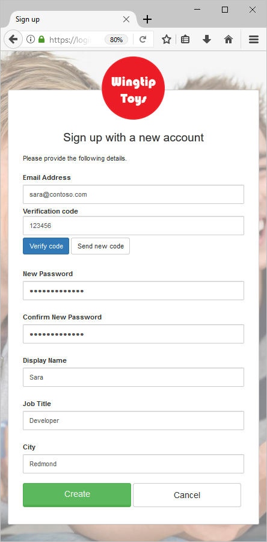
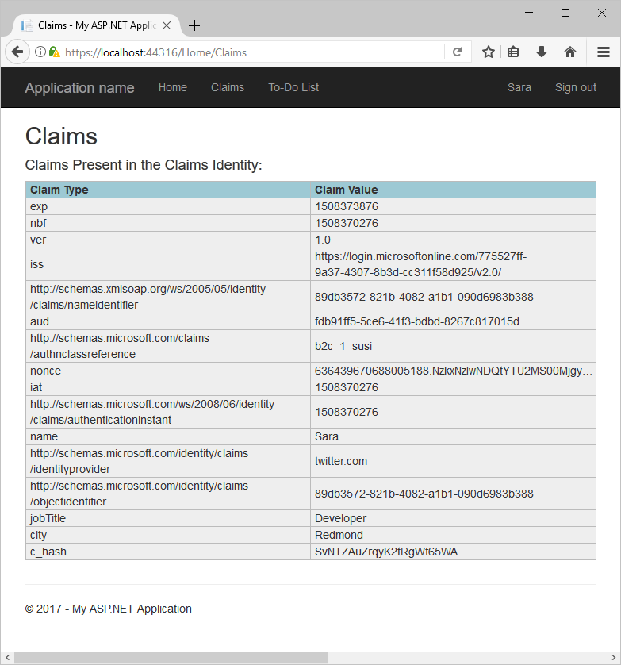
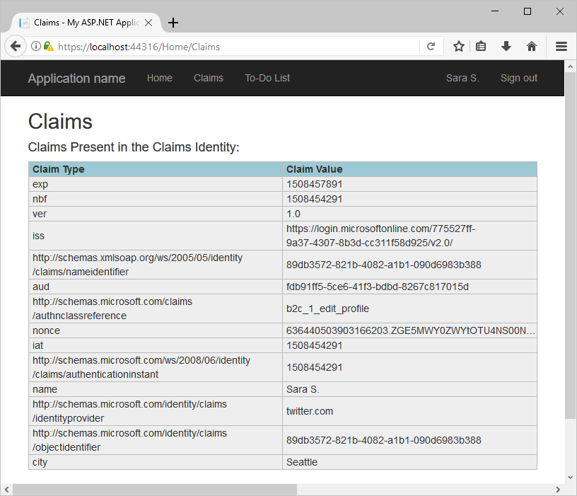

# Test drive a web application configured with Azure AD B2C

Azure Active Directory B2C provides cloud identity management to keep your application, business, and customers protected.  This quickstart uses a sample to-do list app to demonstrate:

* Using the **Sign Up or Sign In** policy to create or sign in with a social identity provider or a local account using an email address. 
* Calling an API secured by Azure AD B2C to create and edit to-do items.

## Prerequisites

* Install [Visual Studio 2017](https://www.visualstudio.com/downloads/) with the following workloads:
    - **ASP.NET and web development**

* A social account from either Facebook, Google, Microsoft, or Twitter. If you don't have a social account, a valid email address is required.

[!INCLUDE [quickstarts-free-trial-note](../../includes/quickstarts-free-trial-note.md)]

## Download the sample

[Download or clone the sample application](https://github.com/Azure-Samples/active-directory-b2c-dotnet-webapp-and-webapi) from GitHub.

## Run the app in Visual Studio

In the sample application project folder, open the `B2C-WebAPI-DotNet.sln` solution in Visual Studio. 

The solution consists of two projects:

* **TaskWebApp** – An ASP.NET MVC web application where a user can manage their to-do list items.  
* **TaskService** – An ASP.NET Web API backend that manages all CRUD operations performed on a user's To-do list items. The web app calls this API and displays the results.

For this quickstart, you need to run both the `TaskWebApp` and `TaskService` projects at the same time. 

1. In Solution Explorer, right-click on the solution and select **Set StartUp Projects...**. 
2. Select **Multiple startup projects** radio button.
3. Change the **Action** for both projects to **Start**. Click **OK**.

Select **Debug > Start Debugging** to build and run both applications. Each application opens in its own browser tab:

* `https://localhost:44316/` - This page is the ASP.NET web application. You interact directly with this application in the quickstart.
* `https://localhost:44332/` - This page is the web API that is called by the ASP.NET web application.

## Create an account

Click the **Sign up / Sign in** link in the ASP.NET web application to start the **Sign Up or Sign In** workflow. When creating an account, you can use an existing social identity provider account or an email account.

### Sign up using a social identity provider

To sign up using a social identity provider, click the button of the identity provider you want to use. If you prefer to use an email address, jump to the [Sign up using an email address](#sign-up-using-an-email-address) section.

You need to authenticate (sign-in) using your social account credentials and authorize the application to read information from your social account. By granting access, the application can retrieve profile information from the social account such as your name and city. 

Finish the sign-in process for the identity provider. For example, click **Sign in** button for Twitter.

Your new account profile details are pre-populated with information from your social account.

Update the Display Name, Job Title, and City fields and click **Continue**.  The values you enter are used for your Azure AD B2C user account profile.

You have successfully created a new Azure AD B2C user account that uses an identity provider. 

Next step: [Jump to view your claims](#view-your-claims) section.

### Sign up using an email address

If you choose to not use a social account to provide authentication, you can create an Azure AD B2C user account using a valid email address. An Azure AD B2C local user account uses Azure Active Directory as the identity provider. To use your email address, click the **Don't have an account? Sign up now** link.

Enter a valid email address and click **Send verification code**. A valid email address is required to receive the verification code from Azure AD B2C. 

Enter the verification code you receive in email and click **Verify code**.

Add your profile information and click **Create**.

You have successfully created a new Azure AD B2C local user account.

## Reset your password

If you created your account using an email address, Azure AD B2C has functionality to allow users to reset their password. To edit the profile you created, click your profile name in the menu bar and select **Reset Password**.

Verify your email address by entering it and clicking **Send verification code**. A verification code is sent to your email address.

Enter the verification code you received in email and click **Verify code**.

After your email address is verified, click **Continue**.

Enter your new password and click **Continue**.

## View your claims

Click **Claims** in the web application menu bar to view the claims associated with your last action. 

In this example, the last action was for the *sign in or sign up* experience. Notice the  **Claim type** `http://schemas.microsoft.com/claims/authnclassreference` is `b2c_1_susi` indicating the last action was sign-up or sign-in. If the last action was password reset, the **Claim type** would be `b2c_1_reset`.

## Edit your profile

Azure Active Directory B2C provides functionality to allow users to update their profiles. In the web application menu bar, click your profile name and select **Edit profile** to edit the profile you created.

Change your **Display name** and **City**.  Click **Continue** to update your profile.

Notice your display name updates in the upper right portion of the page after changing your name. 

Click **Claims**. Changes you made to **Display name** and **City** are reflected in the claims.

 Notice the  **Claim type** `http://schemas.microsoft.com/claims/authnclassreference` has updated to `b2c_1_edit_profile` indicating the last action performed was a profile edit. Also note, the name and city are the new values *Sara S.* and *Seattle*.

## Access a resource

Click **To-Do List** to enter and modify your to-do list items. The ASP.NET web application includes an access token in the request to the web API resource requesting permission to perform operations on the user's to-do list items. 

Enter text in the **New Item** text box. Click **Add** to call the Azure AD B2C secured web API that adds a to-do list item.

## Other scenarios

Other scenarios to test drive are as follows:

* Sign out of the application and click **To-do list**. Notice how you are prompted to sign in and your list items are persisted. 
* Create a new account using a different type of account. For example, use a social identity provider if you created an account using an email address previously.

## Next steps

The next step is to create your own Azure AD B2C tenant and configure the sample to run using your tenant. 

> [!div class="nextstepaction"]
> [Create an Azure Active Directory B2C tenant in the Azure portal](active-directory-b2c-get-started.md)