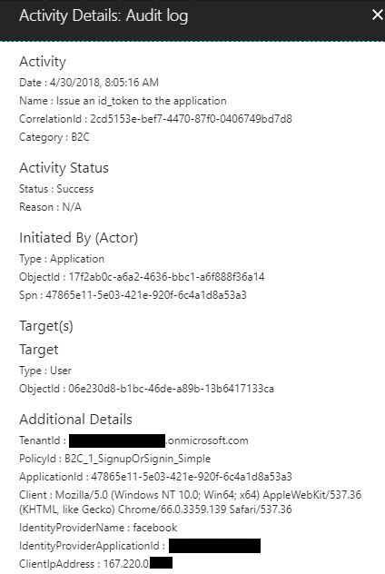
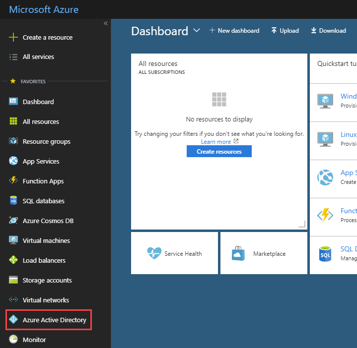
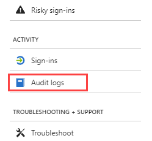
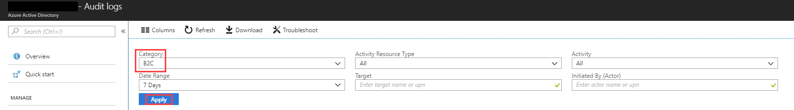

# Accessing Azure AD B2C audit logs

Azure Active Directory B2C (Azure AD B2C) emits audit logs containing activity information about B2C resources, issued tokens, and administrator access. This article provides a brief overview of the information available through audit logs and instructions on how to access this data for your Azure AD B2C tenant.

> [!IMPORTANT]
> Audit logs are only retained for seven days. Plan to download and store your logs using one of the methods shown below if you require a longer retention period. 

## Overview of activities available in the B2C category of audit logs
The **B2C** category in audit logs contains the following types of activities:
|Activity type |Description  |
|---------|---------|
|Authorization |Activities concerning the authorization of a user to access B2C resources (for example, an administrator accessing a list of B2C policies)         |
|Directory |Activities related to directory attributes retrieved when an administrator signs in using the Azure Portal |
|Application | CRUD operations on B2C applications |
|Key |CRUD operations on keys stored in B2C key container |
|Resource |CRUD operations on B2C resources (for example, policies and identity providers)
|Authentication |Validation of user credentials and token issuance|

> [!NOTE]
> For user object CRUD activities, refer to the **Core Directory** category.

## Example activity
The example below shows the data captured when a user signs in with an external identity provider:
    

## Accessing audit logs through the Azure Portal
1. Go to the [Azure portal](https://portal.azure.com). Make sure you are in your B2C directory.
2. Click on **Azure Active Directory** in the favorites bar on the left 
    
    

1. Under **Activity**, click on **Audit Logs**

    

2. In the **Category** dropbox, select **B2C**
3. Click on **Apply**

    

You will see a list of activities logged over the last seven days. 
- Use the **Activity Resource Type** dropdown to filter by the activity types outlined above
- Use the **Date Range** dropdown to filter the date range of the activities shown
- If you click on a specific row in the list, a contextual box on the right will show you additional attributes associated with the activity
- Click on **Download** to download the activities as a csv file

## Accessing audit logs through the Azure AD reporting API
Audit logs are published to the same pipeline as other activities for Azure Active Directory, so they can be accessed through the [Azure Active Directory reporting API](https://docs.microsoft.com/azure/active-directory/active-directory-reporting-api-audit-reference). 

### Prerequisites
To authenticate to the Azure AD reporting API you first need to register an application. Make sure to follow the steps in [Prerequisites to access the Azure AD reporting APIs](https://azure.microsoft.com/documentation/articles/active-directory-reporting-api-getting-started/).

### Accesing the API
To download the Azure AD B2C audit logs via the API, you'll want to filter the logs to the **B2C** category. To filter by category, use the query string parameter when calling the Azure AD reporting API endpoint, as shown below:

`https://graph.windows.net/your-b2c-tentant.onmicrosoft.com/activities/audit?api-version=beta&$filter=category eq 'B2C'`

### PowerShell script
The following script provides an example of using PowerShell to query the Azure AD reporting API and store the results as a JSON file:

```powershell
# This script will require registration of a Web Application in Azure Active Directory (see https://azure.microsoft.com/documentation/articles/active-directory-reporting-api-getting-started/)

# Constants
$ClientID       = "your-client-application-id-here"       # Insert your application's Client ID, a Globally Unique ID (registered by Global Admin)
$ClientSecret   = "your-client-application-secret-here"   # Insert your application's Client Key/Secret string
$loginURL       = "https://login.microsoftonline.com"     
$tenantdomain   = "your-b2c-tenant.onmicrosoft.com"       # AAD B2C Tenant; for example, contoso.onmicrosoft.com
$resource       = "https://graph.windows.net"             # Azure AD Graph API resource URI
$7daysago       = "{0:s}" -f (get-date).AddDays(-7) + "Z" # Use 'AddMinutes(-5)' to decrement minutes, for example
Write-Output "Searching for events starting $7daysago"

# Create HTTP header, get an OAuth2 access token based on client id, secret and tenant domain
$body       = @{grant_type="client_credentials";resource=$resource;client_id=$ClientID;client_secret=$ClientSecret}
$oauth      = Invoke-RestMethod -Method Post -Uri $loginURL/$tenantdomain/oauth2/token?api-version=1.0 -Body $body

# Parse audit report items, save output to file(s): auditX.json, where X = 0 thru n for number of nextLink pages
if ($oauth.access_token -ne $null) {   
    $i=0
    $headerParams = @{'Authorization'="$($oauth.token_type) $($oauth.access_token)"}
    $url = 'https://graph.windows.net/' + $tenantdomain + '/activities/audit?api-version=beta&$filter=category eq ''B2C''and activityDate gt ' + $7daysago 

    # loop through each query page (1 through n)
    Do{
        # display each event on the console window
        Write-Output "Fetching data using Uri: $url"
        $myReport = (Invoke-WebRequest -UseBasicParsing -Headers $headerParams -Uri $url)
        foreach ($event in ($myReport.Content | ConvertFrom-Json).value) {
            Write-Output ($event | ConvertTo-Json)
        }

        # save the query page to an output file
        Write-Output "Save the output to a file audit$i.json"
        $myReport.Content | Out-File -FilePath audit$i.json -Force
        $url = ($myReport.Content | ConvertFrom-Json).'@odata.nextLink'
        $i = $i+1
    } while($url -ne $null)
} else {
    Write-Host "ERROR: No Access Token"
}
```

