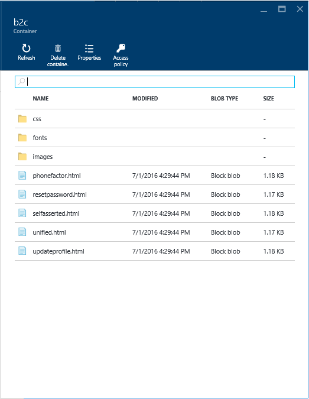

# Customize the UI of a user journey with custom policies

[!INCLUDE [active-directory-b2c-advanced-audience-warning](../../includes/active-directory-b2c-advanced-audience-warning.md)]

> [!NOTE]
> This article is an advanced description of how UI customization works and how to enable with Azure AD B2C custom policies, using the Identity Experience Framework.


A seamless user experience is key for any business-to-consumer solution. A seamless user experience is an experience, whether on device or browser, where a user’s journey through the service is indistinguishable from that of the customer service they are using.

## Understand the CORS way for UI customization

Azure AD B2C lets you customize the look-and-feel of user experience (UX) on the various pages that are served and displayed by Azure AD B2C using your custom policies.

For that purpose, Azure AD B2C runs code in your consumer's browser and uses the modern and standard approach [Cross-Origin Resource Sharing (CORS)](https://www.w3.org/TR/cors/) to load custom content from a specific URL that you specify in a custom policy to point to your HTML5/CSS templates. CORS is a mechanism that allows restricted resources, like fonts, on a web page to be requested from another domain outside the domain from which the resource originated.

Compared to the old traditional way, where template pages are owned by the solution where you provided limited text and images, where limited control of layout and feel was offered leading to more than difficulties to achieve a seamless experience, the CORS way supports HTML5 and CSS and allow you to:

- Host the content and the solution injects its controls using client-side script.
- Have full control over every pixel of layout and feel.

You can provide as many content pages as you like by crafting HTML5/CSS files as appropriate.

> [!NOTE]
> For security reasons, the use of JavaScript is currently blocked for customization. 

In each of your HTML5/CSS templates, you provide an *anchor* element, which corresponds to the required `<div id=”api”>` element in the HTML or the content page as illustrate hereafter. Azure AD B2C requires that all content pages have this specific div.

```
<!DOCTYPE html>
<html>
  <head>
    <title>Your page content’s tile!</title>
  </head>
  <body>
    <div id="api"></div>
  </body>
</html>
```

Azure AD B2C-related content for the page is injected into this div, while the rest of the page is yours to control. The Azure AD B2C JavaScript code pulls in your content and injects HTML into this specific div element. Azure AD B2C injects the following controls as appropriate: account chooser control, log in controls, multi-factor (currently phone-based) controls, and attribute collection controls. Azure AD B2C ensures that all the controls are HTML5 compliant and accessible, all the controls can be fully styled, and that a control version does not regress.

The merged content is eventually displayed as the dynamic document to your consumer.

To ensure that everything works as expected, you must:

- Ensure your content is HTML5 compliant and accessible
- Ensure your content server is enabled for CORS.
- Serve content over HTTPS.
- Use absolute URLS such as `https://yourdomain/content` for all links and CSS content.

> [!TIP]
> To verify that the site you are hosting your content on has CORS enabled and test CORS requests, you can use the site https://test-cors.org/. Thanks to this site, you can either send the CORS request to a remote server (to test if CORS is supported), or send the CORS request to a test server (to explore certain features of CORS).

> [!TIP]
> The site https://enable-cors.org/ also constitutes a more than useful resources on CORS.

Thanks to this CORS-based approach, the end users have consistent experiences between your application and the pages served by Azure AD B2C.

## Create a storage account

As a prerequisite, you need to create a storage account. You need an Azure subscription to create an Azure Blob Storage account. You can sign up a free trial at the [Azure website](https://azure.microsoft.com/pricing/free-trial/).

1. Open a browsing session and navigate to the [Azure portal](https://portal.azure.com).
2. Sign in with your administrative credentials.
3. Click **Create a resource** > **Storage** > **Storage account**.  A **Create storage account** pane opens up.
4. In **Name**, provide a name for the storage account, for example, *contoso369b2c*. This value is later referred as to *storageAccountName*.
5. Pick the appropriate selections for the pricing tier, the resource group, and the subscription. Make sure that you have the **Pin to Startboard** option checked. Click **Create**.
6. Go back to the Startboard and click the storage account that you created.
7. In the **Services** section, click **Blobs**. A **Blob service pane** opens up.
8. Click **+ Container**.
9. In **Name**, provide a name for the container, for example, *b2c*. This value is later referred to as *containerName*.
9. Select **Blob** as the **Access type**. Click **Create**.
10. The container that you created appears in the list on the **Blob service pane**.
11. Close the **Blobs** pane.
12.	On the **storage account pane**, click the **Key** icon. An **Access keys pane** opens up.  
13.	Write down the value of **key1**. This value is later referred as *key1*.

## Downloading the helper tool

1.	Download the helper tool from [GitHub](https://github.com/azureadquickstarts/b2c-azureblobstorage-client/archive/master.zip).
2.	Save the *B2C-AzureBlobStorage-Client-master.zip* file on your local machine.
3.	Extract the content of the B2C-AzureBlobStorage-Client-master.zip file on your local disk, for example under the **UI-Customization-Pack** folder, which creates a *B2C-AzureBlobStorage-Client-master* folder underneath.
4.	Open that folder and extract the content of the archive file *B2CAzureStorageClient.zip* within it.

## Upload the UI-Customization-Pack sample files

1.	Using Windows Explorer, navigate to the folder *B2C-AzureBlobStorage-Client-master* located under the *UI-Customization-Pack* folder created in the previous section.
2.	Run the *B2CAzureStorageClient.exe* file. This program uploads all the files in the directory that you specify to your storage account, and enable CORS access for those files.
3.	When prompted, specify:
    a.	The name of your storage account, *storageAccountName*, for example *contoso369b2c*.
    b.	The primary access key of your azure blob storage, *key1*, for example *contoso369b2c*.
    c.	The name of your storage blob storage container, *containerName*, for example *b2c*.
    d.	The path of the *Starter-Pack* sample files, for example *..\B2CTemplates\wingtiptoys*.

If you followed the preceding steps, the HTML5 and CSS files of the *UI-Customization-Pack* for the fictitious company **wingtiptoys** is now pointing to your storage account.  You can verify that the content has been uploaded correctly by opening the related container pane in the Azure portal. You can alternatively verify that the content has been uploaded correctly by accessing the page from a browser. For more information, see [Azure Active Directory B2C: A helper tool used to demonstrate the page user interface (UI) customization feature](active-directory-b2c-reference-ui-customization-helper-tool.md).

## Ensure the storage account has CORS enabled

CORS (Cross-Origin Resource Sharing) must be enabled on your endpoint for Azure AD B2C to load your content. This is because your content is hosted on a different domain than the domain Azure AD B2C will be serving the page from.

To verify that the storage you are hosting your content on has CORS enabled, proceed with the following steps:

1. Open a browsing session and navigate to the page *unified.html* using the full URL of its location in your storage account, `https://<storageAccountName>.blob.core.windows.net/<containerName>/unified.html`. For example, https://contoso369b2c.blob.core.windows.net/b2c/unified.html.
2. Navigate to https://test-cors.org. This site allows you to verify that the page you are using has CORS enabled.  
   <!--
   
   -->

3. In **Remote URL**, enter the full URL for your unified.html content, and click **Send Request**.
4. Verify that the output in the **Results** section contains *XHR status: 200*, which indicates that CORS is enabled.
   <!--
   
   -->
   The storage account should now contain a blob container named *b2c* in the illustration that contains the following wingtiptoys templates from the *Starter-Pack*.

<!--

-->

The following table describes the purpose of the preceding HTML5 pages.

| HTML5 template | Description |
|----------------|-------------|
| *phonefactor.html* | This page can be used as a template for a multi-factor authentication page. |
| *resetpassword.html* | This page can be used as a template for a forgot password page. |
| *selfasserted.html* | This page can be used as a template for a social account sign up page, a local account sign up page, or a local account sign-in page. |
| *unified.html* | This page can be used as a template for a unified sign up or sign-in page. |
| *updateprofile.html* | This page can be used as a template for a profile update page. |

## Add a link to your HTML5/CSS templates to your user journey

You can add a link to your HTML5/CSS templates to your user journey by editing a custom policy directly.

The custom HTML5/CSS templates to use in your user journey have to be specified in a list of content definitions that can be used in those user journeys. For that purpose, an optional *\<ContentDefinitions>* XML element must be declared under the *\<BuildingBlocks>* section of your custom policy XML file.

The following table describes the set of content definition IDs recognized by the Azure AD B2C identity experience engine and the type of pages that relates to them.

| Content definition ID | Description |
|-----------------------|-------------|
| *api.error* | **Error page**. This page is displayed when an exception or an error is encountered. |
| *api.idpselections* | **Identity provider selection page**. This page contains a list of identity providers that the user can choose from during sign-in. These providers are either enterprise identity providers, social identity providers such as Facebook and Google+, or local accounts (based on email address or user name). |
| *api.idpselections.signup* | **Identity provider selection for sign-up**. This page contains a list of identity providers that the user can choose from during sign-up. These providers are either enterprise identity providers, social identity providers such as Facebook and Google+, or local accounts (based on email address or user name). |
| *api.localaccountpasswordreset* | **Forgot password page**. This page contains a form that the user has to fill to initiate their password reset.  |
| *api.localaccountsignin* | **Local account sign-in page**. This page contains a sign-in form that the user has to fill in when signing in with a local account that is based on an email address or a user name. The form can contain a text input box and password entry box. |
| *api.localaccountsignup* | **Local account sign-up page**. This page contains a sign-up form that the user has to fill in when signing up for a local account that is based on an email address or a user name. The form can contain different input controls such as text input box, password entry box, radio button, single-select drop-down boxes, and multi-select check boxes. |
| *api.phonefactor* | **Multi-factor authentication page**. On this page, users can verify their phone numbers (using text or voice) during sign-up or sign-in. |
| *api.selfasserted* | **Social account sign-up page**. This page contains a sign-up form that the user has to fill in when signing up using an existing account from a social identity provider such as Facebook or Google+. This page is similar to the preceding social account sign-up page with the exception of the password entry fields. |
| *api.selfasserted.profileupdate* | **Profile update page**. This page contains a form that the user can use to update their profile. This page is similar to the preceding social account sign-up page with the exception of the password entry fields. |
| *api.signuporsignin* | **Unified sign-up or sign-in page**.  This page handles both sign-up & sign in of users, who can use enterprise identity providers, social identity providers such as Facebook or Google+, or local accounts.

## Next steps
[Reference: Understand how custom policies work with the Identity Experience Framework in B2C](active-directory-b2c-reference-custom-policies-understanding-contents.md)
