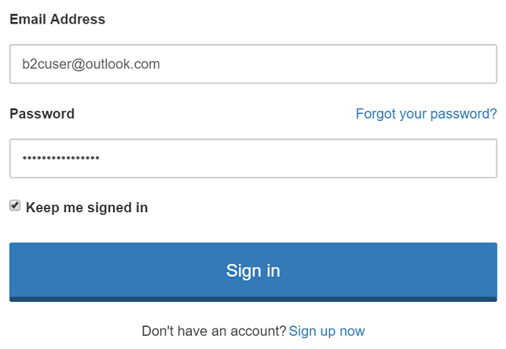

# Azure Active Directory B2C: Enable 'Keep me signed in (KMSI)'  
[!INCLUDE [active-directory-b2c-advanced-audience-warning](../../includes/active-directory-b2c-advanced-audience-warning.md)]

Azure AD B2C now allows your web and native applications to enable the 'Keep me signed in (KMSI)' functionality. This feature grants access to returning users to application without prompting to reenter the username and password. This access is revoked when the user logs out. 

We recommend against users checking this option on public computers. 




## Prerequisites

An Azure AD B2C tenant configured to allow local account sign-up/sign-in, as described in [Getting started](active-directory-b2c-get-started-custom.md).

## How to enable KMSI

Make the following changes in your trust framework extensions policy.

## Adding a content definition element 

The `BuildingBlocks` node of your extention file must include a `ContentDefinitions` element. 

1. In the `ContentDefinitions` section, define a new `ContentDefinition` with ID `api.signuporsigninwithkmsi`.
2. Your new `ContentDefinition` must include a `LoadUri`, `RecoveryUri` and `DataUri` as follows.
3. Datauri`urn:com:microsoft:aad:b2c:elements:unifiedssp:1.1.0` is a machine understandable identifier that brings up a KMSI check box in the sign-in pages. Please make sure you don't change this value. 

```XML
  <BuildingBlocks>
    <ContentDefinitions>
      <ContentDefinition Id="api.signuporsigninwithkmsi">
        <LoadUri>~/tenant/default/unified.cshtml</LoadUri>
        <RecoveryUri>~/common/default_page_error.html</RecoveryUri>
        <DataUri>urn:com:microsoft:aad:b2c:elements:unifiedssp:1.1.0</DataUri>
        <Metadata>
          <Item Key="DisplayName">Signin and Signup</Item>
        </Metadata>
      </ContentDefinition>
    </ContentDefinitions>
  </BuildingBlocks>                       
```


## Add a  local account sign-in claims provider 

You can define Local Account SignIn as a claims provider to the `<ClaimsProvider>` node in the extension file of your policy:

1. Open the extension file (TrustFrameworkExtensions.xml) from your working directory. 
2. Find the `<ClaimsProviders>` section. If it does not exist, add it under the root node.
3. The starter pack from  [Getting started](active-directory-b2c-get-started-custom.md) comes with a 'Local Account SignIn' claims provider. 
4. If not, add a new `<ClaimsProvider>` node as follows:

```XML
<ClaimsProviders>
    <ClaimsProvider>
      <DisplayName>Local Account SignIn</DisplayName>
      <TechnicalProfiles>
         <TechnicalProfile Id="login-NonInteractive">
           <Metadata>
            <Item Key="client_id">ProxyIdentityExperienceFrameworkAppId</Item>
            <Item Key="IdTokenAudience">IdentityExperienceFrameworkAppId</Item>
           </Metadata>
            <InputClaim ClaimTypeReferenceId="client_id" DefaultValue="ProxyIdentityExperienceFrameworkAppID" />
            <InputClaim ClaimTypeReferenceId="resource_id" PartnerClaimType="resource" DefaultValue="IdentityExperienceFrameworkAppID" />
           </InputClaims>
        </TechnicalProfile>
      </TechnicalProfiles>
    </ClaimsProvider>
 </ClaimsProviders>
```

### Add the application IDs to your custom policy

Add the application IDs to the extensions file (`TrustFrameworkExtensions.xml`):

1. In the extensions file (TrustFrameworkExtensions.xml), find the element `<TechnicalProfile Id="login-NonInteractive">` and `<TechnicalProfile Id="login-NonInteractive-PasswordChange">`

2. Replace all instances of `IdentityExperienceFrameworkAppId` with the application ID of the Identity Experience Framework application as described in [Getting started](active-directory-b2c-get-started-custom.md). Here is an example:

   ```
   <Item Key="client_id">8322dedc-cbf4-43bc-8bb6-141d16f0f489</Item>
   ```

3. Replace all instances of `ProxyIdentityExperienceFrameworkAppId` with the application ID of the Proxy Identity Experience Framework application as described in [Getting started](active-directory-b2c-get-started-custom.md).

4. Save your extensions file.

## Create a KMSI in enabled user journey

You now need to add Local Account SignIn claims provider to your user journey. 

1. Open the base file of your policy (for example, TrustFrameworkBase.xml).
2. Find the `<UserJourneys>` element and copy the entire `<UserJourney>` node that includes `Id="SignUpOrSignIn"`.
3. Open the extension file (for example, TrustFrameworkExtensions.xml) and find the `<UserJourneys>` element. If the element doesn't exist, add one.
4. Paste the entire `<UserJourney>` node that you copied as a child of the `<UserJourneys>` element.
5. Rename the ID of the new user journey (for example, rename as `SignUpOrSignInWithKmsi`).
6. Finally, in `OrchestrationStep 1` change the `ContentDefinitionReferenceId` to `api.signuporsigninwithkmsi` , you definied in the earlier steps. This enables the  checkbox in the user journey. 
7. You are done modifying the extension file. Save and upload this file. Ensure that all validations succeed.

```XML
<UserJourneys>
    <UserJourney Id="SignUpOrSignInWithKmsi">
      <OrchestrationSteps>
        <OrchestrationStep Order="1" Type="CombinedSignInAndSignUp" ContentDefinitionReferenceId="api.signuporsigninwithkmsi">
          <ClaimsProviderSelections>
            <ClaimsProviderSelection ValidationClaimsExchangeId="LocalAccountSigninEmailExchange" />
          </ClaimsProviderSelections>
          <ClaimsExchanges>
            <ClaimsExchange Id="LocalAccountSigninEmailExchange" TechnicalProfileReferenceId="SelfAsserted-LocalAccountSignin-Email" />
          </ClaimsExchanges>
        </OrchestrationStep>
        <OrchestrationStep Order="2" Type="ClaimsExchange">
          <Preconditions>
            <Precondition Type="ClaimsExist" ExecuteActionsIf="true">
              <Value>objectId</Value>
              <Action>SkipThisOrchestrationStep</Action>
            </Precondition>
          </Preconditions>
          <ClaimsExchanges>
            <ClaimsExchange Id="SignUpWithLogonEmailExchange" TechnicalProfileReferenceId="LocalAccountSignUpWithLogonEmail" />
          </ClaimsExchanges>
        </OrchestrationStep>
        <!-- This step reads any user attributes that we may not have received when in the token. -->
        <OrchestrationStep Order="3" Type="ClaimsExchange">
          <ClaimsExchanges>
            <ClaimsExchange Id="AADUserReadWithObjectId" TechnicalProfileReferenceId="AAD-UserReadUsingObjectId" />
          </ClaimsExchanges>
        </OrchestrationStep>
        <OrchestrationStep Order="4" Type="SendClaims" CpimIssuerTechnicalProfileReferenceId="JwtIssuer" />
      </OrchestrationSteps>
      <ClientDefinition ReferenceId="DefaultWeb" />
    </UserJourney>
  </UserJourneys>
```

## Create a relying party (RP) file

Next, update the relying party (RP) file that initiates the user journey that you created:

1. Make a copy of SignUpOrSignIn.xml in your working directory. Then, rename it (for example, SignUpOrSignInWithKmsi.xml).

2. Open the new file and update the `PolicyId` attribute for `<TrustFrameworkPolicy>` with a unique value. This is the name of your policy (for example, SignUpOrSignInWithKmsi).

3. Modify the `ReferenceId` attribute in `<DefaultUserJourney>` to match the `Id` of the new user journey that you created (for example, SignUpOrSignInWithKmsi).

4. KMSI is configured in `UserJourneyBehaviors`. 

5. **`KeepAliveInDays`** controls how long the user remains signed in. In the following example, KMSI session automatically expires after 14 days regardless of how often the user performs silent authentication.

   Setting `KeepAliveInDays`  value to 0 turns off KMSI functionality. By default, this value is 0

6. If **`SessionExpiryType`** is *Rolling*, then the KMSI session is extended by 14 days every time the user performs silent authentication.  If *Rolling* is selected, we recommend you to keep the number of days to minimum. 

       <RelyingParty>
       <DefaultUserJourney ReferenceId="SignUpOrSignInWithKmsi" />
       <UserJourneyBehaviors>
         <SingleSignOn Scope="Tenant" KeepAliveInDays="14" />
         <SessionExpiryType>Absolute</SessionExpiryType>
         <SessionExpiryInSeconds>1200</SessionExpiryInSeconds>
       </UserJourneyBehaviors>
       <TechnicalProfile Id="PolicyProfile">
         <DisplayName>PolicyProfile</DisplayName>
         <Protocol Name="OpenIdConnect" />
         <OutputClaims>
           <OutputClaim ClaimTypeReferenceId="displayName" />
           <OutputClaim ClaimTypeReferenceId="givenName" />
           <OutputClaim ClaimTypeReferenceId="surname" />
           <OutputClaim ClaimTypeReferenceId="email" />
           <OutputClaim ClaimTypeReferenceId="objectId" PartnerClaimType="sub"/>
         </OutputClaims>
         <SubjectNamingInfo ClaimType="sub" />
       </TechnicalProfile>
       </RelyingParty>

7. Save your changes, and then upload the file.

8. To test the custom policy that you uploaded, in the Azure portal, go to the policy blade, and then click **Run now**.


## Link to sample policy

You can find the sample policy [here](https://github.com/Azure-Samples/active-directory-b2c-custom-policy-starterpack/tree/master/scenarios/keep%20me%20signed%20in).


