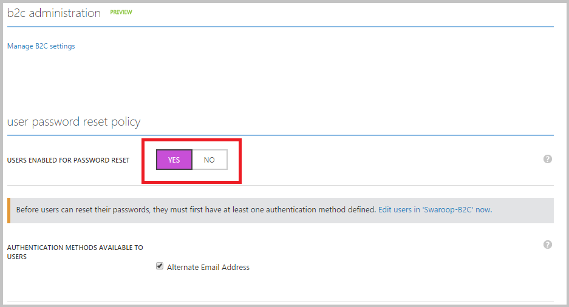

<properties
	pageTitle="Azure Active Directory B2C: Self-service password reset | Microsoft Azure"
	description="A topic demonstrating how to set up self-service password reset for your consumers in Azure Active Directory B2C"
	services="active-directory-b2c"
	documentationCenter=""
	authors="swkrish"
	manager="msmbaldwin"
	editor="curtand"/>

<tags
	ms.service="active-directory-b2c"
	ms.workload="identity"
	ms.tgt_pltfrm="na"
	ms.devlang="na"
	ms.topic="article"
	ms.date="07/22/2016"
	ms.author="swkrish"/>

# Azure Active Directory B2C: Set up self-service password reset for your consumers

With the self-service password reset feature, your consumers (who have signed up for local accounts) can reset their passwords on their own. This significantly reduces the burden on your support staff, especially if your application has millions of consumers using it on a regular basis. Currently, we only support using a verified email address as a recovery method. We will add additional recovery methods (verified phone number, security questions, etc.) in the future.

> [AZURE.NOTE]
This article applies to self-service password reset used in the context of a sign-in policy. If you need fully customizable password reset policies invoked from your app, see [this article](./active-directory-b2c-reference-policies.md#create-a-password-reset-policy).

By default, your directory will not have self-service password reset turned on. Use the following steps to turn it on:

1. Sign in to the [Azure classic portal](https://manage.windowsazure.com/) as the Subscription Administrator. This is the same work or school account or the same Microsoft account that you used to create your directory.
2. Navigate to the Active Directory extension on the navigation bar on the left side.
3. Find your directory under the **Directory** tab and click it.
4. Click the **Configure** tab.
5. Scroll down to the **User password reset policy** section and toggle the **Users enabled for password reset** option to **YES**. Notice that the **Alternate Email Address** option is checked; leave it as it is.

    

6. Click **Save** at the bottom of the page. You're done!

To test, use the "Run now" feature on any sign-in policy that has local accounts as an identity provider. On the local account sign-in page (where you enter an email address and password, or a username and password), click **Can't access your account?** to verify the consumer experience.

> [AZURE.NOTE]
The self-service password reset pages can be customized by using the [company branding feature](../active-directory/active-directory-add-company-branding.md).
