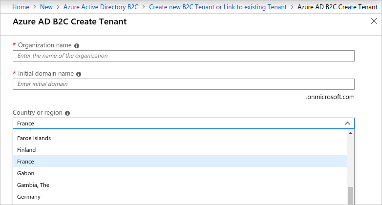

# Azure Active Directory B2C: Region availability & data residency
Region availability and data residency are two very different concepts that apply differently to Azure AD B2C from the rest of Azure. This article will explain the differences between these two concepts and compare how they apply to Azure versus Azure AD B2C.

## Summary
Azure AD B2C is **generally available worldwide** with the option for **data residency in United States or Europe**.

## Concepts
* **Region availability** refers to where a service is available for use.
* **Data residency** refers to where user data is stored.

## Region availability
Azure AD B2C is available worldwide via the Azure public cloud. 

This differs from the model most other Azure services follow which couple availability with data residency. You can see examples of this in both Azure's [Products Available By Region](https://azure.microsoft.com/regions/services/) page and the [Active Directory B2C pricing calculator](https://azure.microsoft.com/pricing/details/active-directory-b2c/).

## Data residency
Azure AD B2C stores user data in either United States or Europe.

Data residency is determined based on which country/region is selected when [creating an Azure AD B2C tenant](active-directory-b2c-get-started.md).

Data resides in the United States for the following countries/regions:

> United States, Canada, Costa Rica, Dominican Republic, El Salvador, Guatemala, Mexico, Panama, Puerto Rico and Trinidad & Tobago

Data resides in Europe for the following countries/regions:

> Algeria, Austria, Azerbaijan, Bahrain, Belarus, Belgium, Bulgaria, Croatia, Cyprus, Czech Republic, Denmark, Egypt, Estonia, Finland, France, Germany, Greece, Hungary, Iceland, Ireland, Israel, Italy, Jordan, Kazakhstan, Kenya, Kuwait, Lativa, Lebanon, Liechtenstein, Lithuania, Luxembourg, North Macedonia, Malta, Montenegro, Morocco, Netherlands, Nigeria, Norway, Oman, Pakistan, Poland, Portugal, Qatar, Romania, Russia, Saudi Arabia, Serbia, Slovakia, Slovenia, South Africa, Spain, Sweden, Switzerland, Tunisia, Turkey, Ukraine, United Arab Emirates and United Kingdom.

The remaining countries/regions are in the process of being added to the list.  For now, you can still use Azure AD B2C by picking any of the countries/regions above.

> Afghanistan, Argentina, Australia, Brazil, Chile, Colombia, Ecuador, Hong Kong SAR, India, Indonesia, Iraq, Japan, Korea, Malaysia, New Zealand, Paraguay, Peru, Philippines, Singapore, Sri Lanka, Taiwan, Thailand, Uruguay and Venezuela.

## Preview tenant
If you had created a B2C tenant during Azure AD B2C's preview period, it is likely that your **Tenant type** says **Preview tenant**. If this is the case, you MUST use your tenant only for development and testing purposes, and NOT for production apps.

> [!IMPORTANT]
> There is no migration path from a preview B2C tenant to a production-scale B2C tenant. Note that there are known issues when you delete a preview B2C tenant and re-create a production-scale B2C tenant with the same domain name. You have to create a production-scale B2C tenant with a different domain name.

