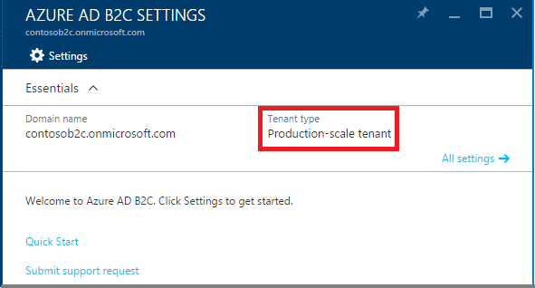

<properties
	pageTitle="Azure Active Directory B2C: Production-scale vs. preview B2C tenants | Microsoft Azure"
	description="A topic on the types of Azure Active Directory B2C tenants"
	services="active-directory-b2c"
	documentationCenter=""
	authors="swkrish"
	manager="msmbaldwin"
	editor="bryanla"/>

<tags
	ms.service="active-directory-b2c"
	ms.workload="identity"
	ms.tgt_pltfrm="na"
	ms.devlang="na"
	ms.topic="article"
	ms.date="07/24/2016"
	ms.author="swkrish"/>

# Azure Active Directory B2C: Production-scale vs. preview B2C tenants

If you are planning to write a production app on Azure Active Directory (Azure AD) B2C, you'll need to be certain that you have the right tenant "type" to go live on. To see what you have, follow these steps to [navigate to the B2C features blade](active-directory-b2c-app-registration.md#navigate-to-the-b2c-features-blade) on the Azure portal.

## Production-scale B2C tenant in North America

If you [created your B2C tenant](active-directory-b2c-get-started.md) in North America, i.e., in one of the following countries or regions: United States, Canada, Costa Rica, Dominican Republic, El Salvador, Guatemala, Mexico, Panama, Puerto Rico and Trinidad & Tobago, AND the **Tenant type** on your B2C Admin UI says **Production-scale**, your tenant can be used for production apps.

> [AZURE.NOTE]
Production-scale tenants are deployed on newer hardware and are capable of scaling to 100s of millions of user per tenant.

## Preview B2C tenant in any country or region

If you had created a B2C tenant during Azure AD B2C's preview period, it is likely that your **Tenant type** says **Preview tenant**. If this is the case, you MUST use your tenant only for development and testing purposes, and NOT for production apps.

> [AZURE.IMPORTANT]
There is no migration path from a preview to a production-scale B2C tenant.

## Production-scale B2C tenant outside of North America

Azure AD B2C is currently NOT generally-available outside of North America. However you can create and use production-scale tenants, for development and testing purposes, in one of the following countries or regions: Algeria, Austria, Azerbaijan, Bahrain, Belarus, Belgium, Bulgaria, Croatia, Cyprus, Czech Republic, Denmark, Egypt, Estonia, Finland, France, Germany, Greece, Hungary, Iceland, Ireland, Israel, Italy, Jordan, Kazakhstan, Kenya, Kuwait, Lativa, Lebanon, Liechtenstein, Lituania, Luxembourg, Macedonia FYRO, Malta, Montenegro, Morocco, Netherlands, Nigeria, Norway, Oman, Pakistan, Poland, Portugal, Qatar, Romania, Russia, Saudi Arabia, Serbia, Slovakia, Slovenia, South Africa, Spain, Sweden, Switzerland, Tunisia, Turkey, Ukraine, United Arab Emirates and United Kingdom.

## Geo-availability of B2C tenants

B2C tenants are currently not available in the following countries or regions: Afghanistan, Argentina, Australia, Brazil, Chile, Colombia, Ecuador, Hong Kong SAR, India, Indonesia, Iraq, Japan, Korea, Malaysia, New Zealand, Paraguay, Peru, Philippines, Singapore, Sri Lanka, Taiwan, Thailand, Uruguay and Venezuela. We plan to include them in the future.
