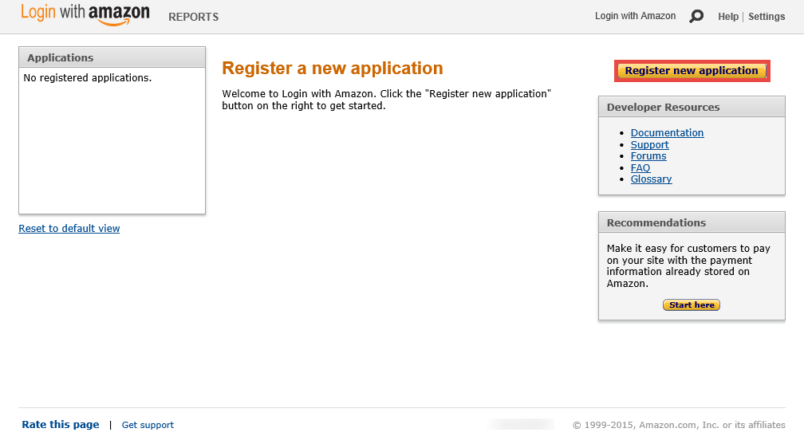
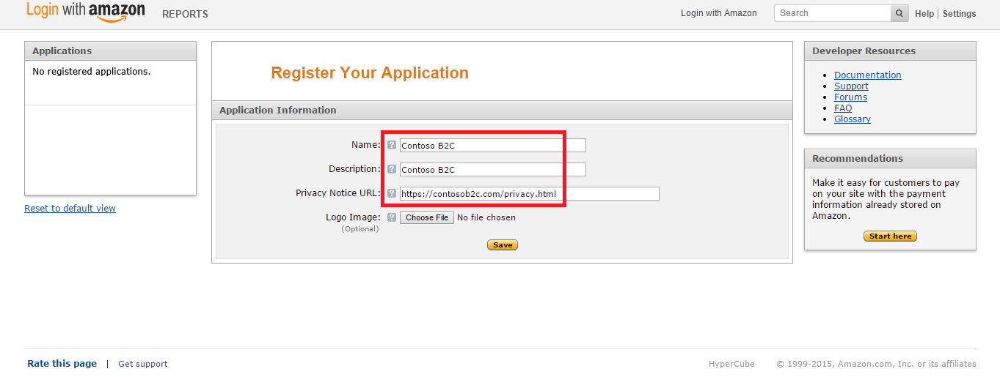
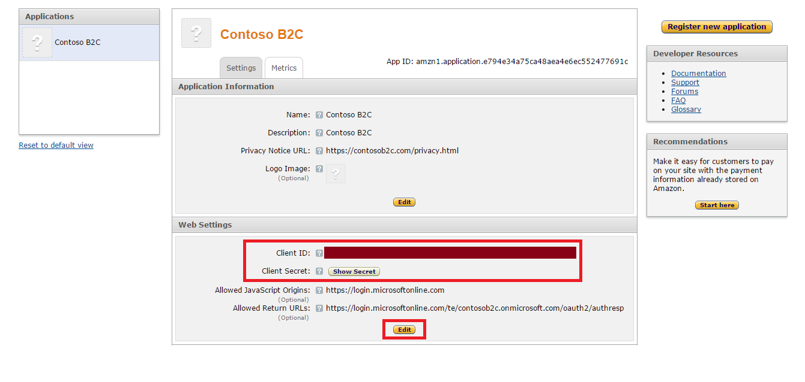
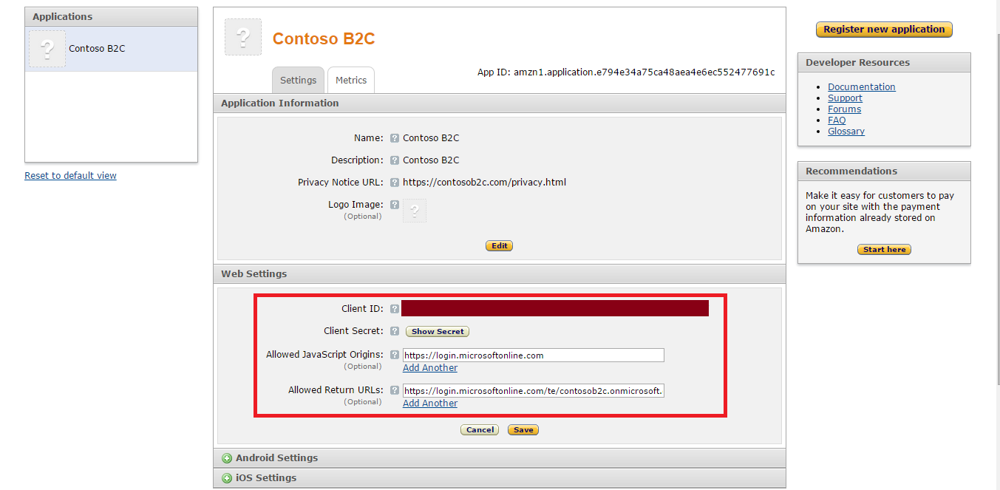

<properties
	pageTitle="Azure Active Directory B2C: Amazon configuration | Microsoft Azure"
	description="Provide sign-up and sign-in to consumers with Amazon accounts in your applications that are secured by Azure Active Directory B2C."
	services="active-directory-b2c"
	documentationCenter=""
	authors="swkrish"
	manager="msmbaldwin"
	editor="bryanla"/>

<tags
	ms.service="active-directory-b2c"
	ms.workload="identity"
	ms.tgt_pltfrm="na"
	ms.devlang="na"
	ms.topic="article"
	ms.date="07/22/2016"
	ms.author="swkrish"/>

# Azure Active Directory B2C: Provide sign-up and sign-in to consumers with Amazon accounts

## Create an Amazon application

To use Amazon as an identity provider in Azure Active Directory (Azure AD) B2C, you need to create an Amazon application and supply it with the right parameters. You need an Amazon account to do this. If you don’t have one, you can get it at [http://www.amazon.com/](http://www.amazon.com/).

1. Go to the [Amazon Developer Center](https://login.amazon.com/) and sign in with your Amazon account credentials.
2. If you have not already done so, click **Sign Up**, follow the developer registration steps, and accept the policy.
3. Click **Register new application**.

    

4. Provide application information (**Name**, **Description**, and **Privacy Notice URL**) and click **Save**.

    

5. In the **Web Settings** section, copy the values of **Client ID** and **Client Secret**. (You need to click the **Show Secret** button to see this.) You need both of them to configure Amazon as an identity provider in your tenant. Click **Edit** at the bottom of the section. **Client Secret** is an important security credential.

	

6. Enter `https://login.microsoftonline.com` in the **Allowed JavaScript Origins** field and `https://login.microsoftonline.com/te/{tenant}/oauth2/authresp` in the **Allowed Return URLs** field. Replace **{tenant}** with your tenant's name (for example, contoso.onmicrosoft.com). Click **Save**. The **{tenant}** value is case-sensitive.

    

## Configure Amazon as an identity provider in your tenant

1. Follow these steps to [navigate to the B2C features blade](active-directory-b2c-app-registration.md#navigate-to-the-b2c-features-blade) on the Azure portal.
2. On the B2C features blade, click **Identity providers**.
3. Click **+Add** at the top of the blade.
4. Provide a friendly **Name** for the identity provider configuration. For example, enter "Amzn".
5. Click **Identity provider type**, select **Amazon**, and click **OK**.
6. Click **Set up this identity provider** and enter the client ID and client secret of the Amazon application that you created earlier.
7. Click **OK** and then click **Create** to save your Amazon configuration.
