<properties
	pageTitle="Azure Active Directory B2C: Facebook configuration | Microsoft Azure"
	description="Provide sign-up and sign-in to consumers with Facebook accounts in your applications that are secured by Azure Active Directory B2C."
	services="active-directory-b2c"
	documentationCenter=""
	authors="swkrish"
	manager="msmbaldwin"
	editor="bryanla"/>

<tags
	ms.service="active-directory-b2c"
	ms.workload="identity"
	ms.tgt_pltfrm="na"
	ms.devlang="na"
	ms.topic="article"
	ms.date="07/24/2016"
	ms.author="swkrish"/>

# Azure Active Directory B2C: Provide sign-up and sign-in to consumers with Facebook accounts

## Create a Facebook application

To use Facebook as an identity provider in Azure Active Directory (Azure AD) B2C, you need to create a Facebook application and supply it with the right parameters. You need a Facebook account to do this. If you don’t have one, you can get it at [https://www.facebook.com/](https://www.facebook.com/).

1. Go to the [Facebook for developers](https://developers.facebook.com/) website and sign in with your Facebook account credentials.
2. If you have not already done so, you need to register as a Facebook developer. To do this, click **Register** (on the upper-right corner of the page), accept Facebook's policies, and complete the registration steps.
3. Click **My Apps** and then click **Add a new App**. Choose **Website** as the platform, and then click **Skip and Create App ID**.

    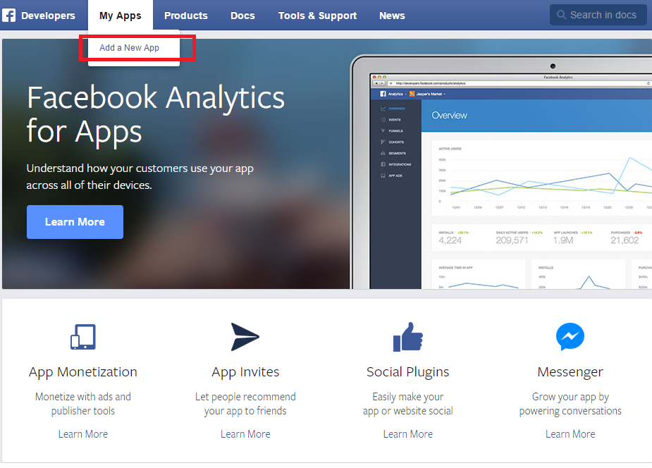

    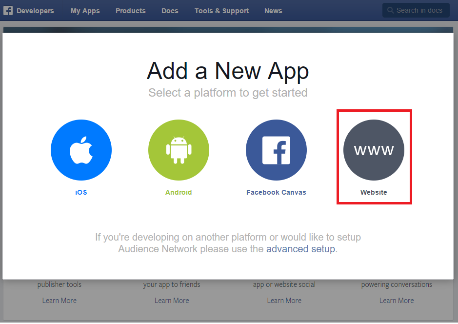

    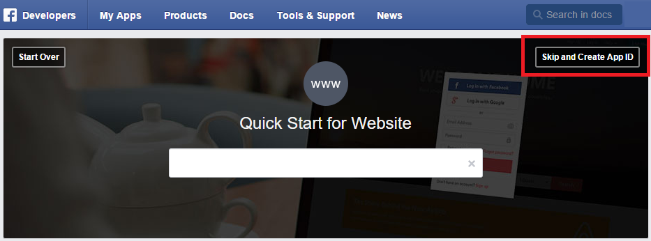

4. On the form, provide a **Display Name**, a valid **Contact Email**, an appropriate **Category**, and click **Create App ID**. This requires you to accept Facebook platform policies and complete an online security check.

    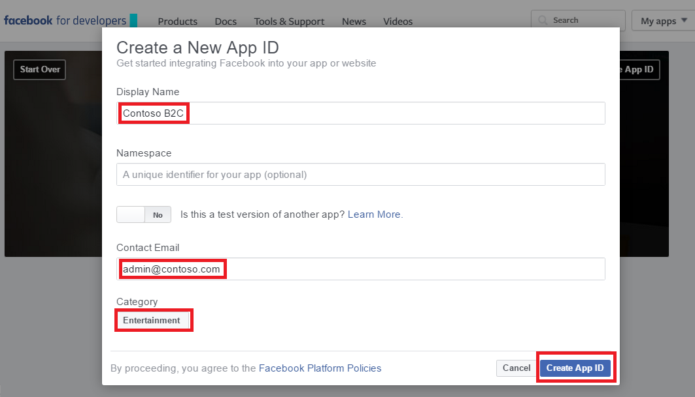

5. Click **Settings** on the left navigation.
6. Click **+Add Platform** and then select **Website**.

    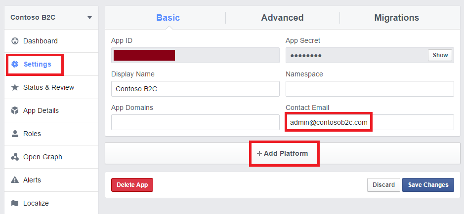

    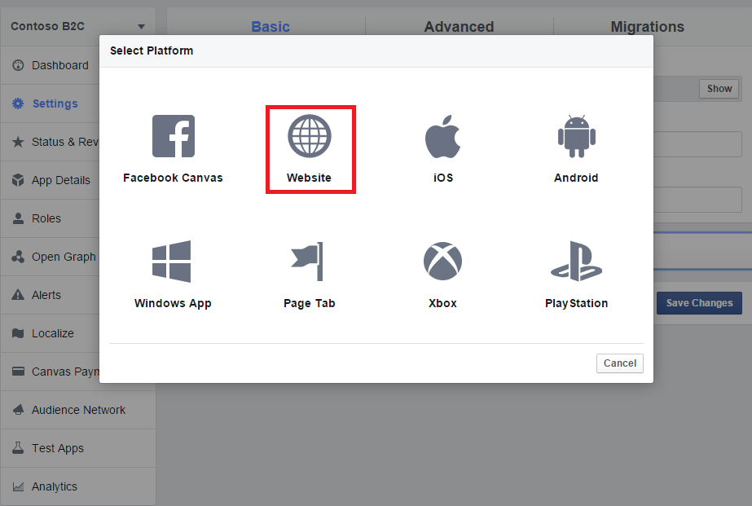

7. Enter [https://login.microsoftonline.com/](https://login.microsoftonline.com/) in the **Site URL** field and then click **Save Changes**.

    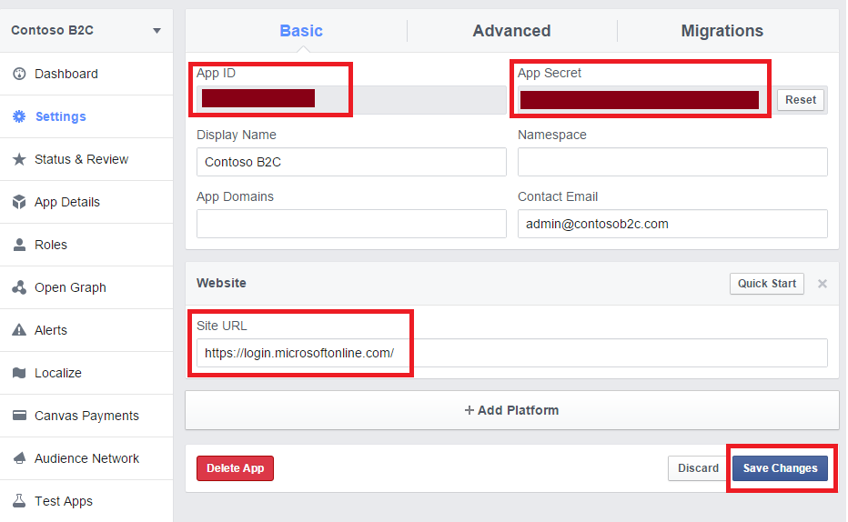

8. Copy the value of **App ID**. Click **Show** and copy the value of **App Secret**. You will need both of them to configure Facebook as an identity provider in your tenant. **App Secret** is an important security credential.

    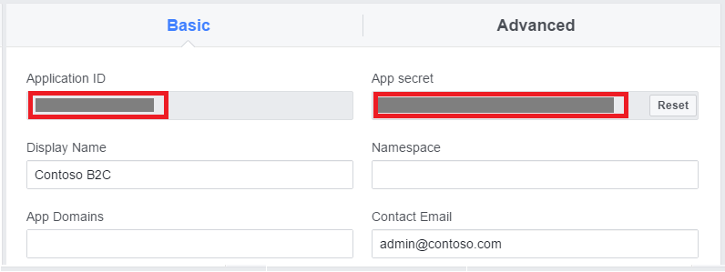

9. Click **+ Add Product** on the left navigation and then the **Get Started** button next to **Facebook Login**.

    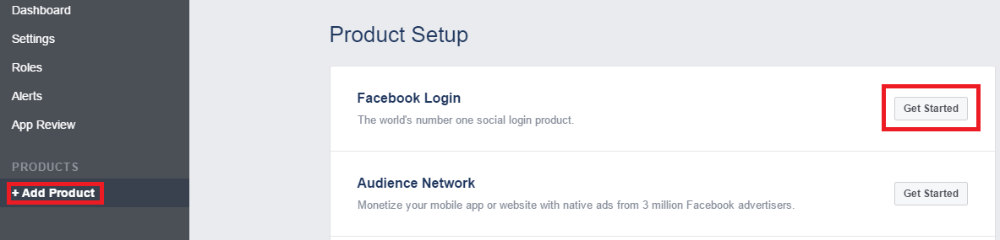

10. Enter `https://login.microsoftonline.com/te/{tenant}/oauth2/authresp` in the **Valid OAuth redirect URIs** field in the **Client OAuth Settings** section. Replace **{tenant}** with your tenant's name (for example, contosob2c.onmicrosoft.com). Click **Save Changes** at the bottom of the page.

    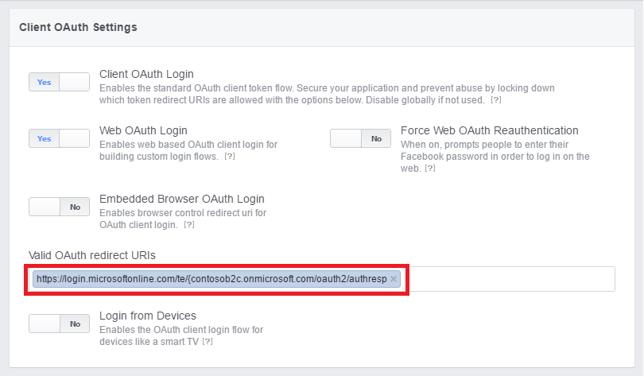

11. To make your Facebook application usable by Azure AD B2C, you need to make it publicly available. You can do this by clicking **App Review** on the left navigation and by turning the switch at the top of the page to **YES** and clicking **Confirm**.

    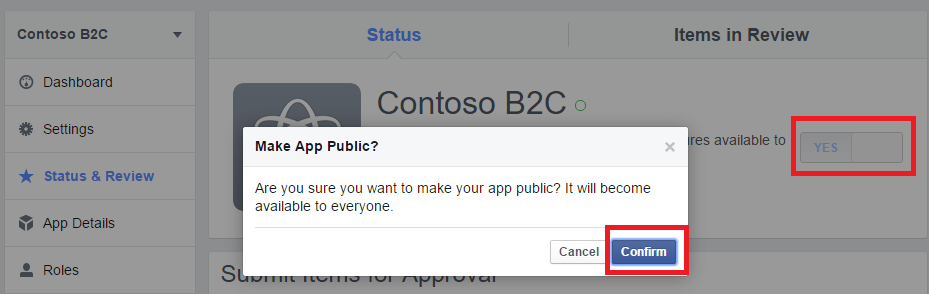

## Configure Facebook as an identity provider in your tenant

1. Follow these steps to [navigate to the B2C features blade](active-directory-b2c-app-registration.md#navigate-to-the-b2c-features-blade) on the Azure portal.
2. On the B2C features blade, click **Identity providers**.
3. Click **+Add** at the top of the blade.
4. Provide a friendly **Name** for the identity provider configuration. For example, enter "FB".
5. Click **Identity provider type**, select **Facebook**, and click **OK**.
6. Click **Set up this identity provider** and enter the app ID and app secret (of the Facebook application that you created earlier) in the **Client ID** and **Client secret** fields respectively.
7. Click **OK**, and then click **Create** to save your Facebook configuration.
