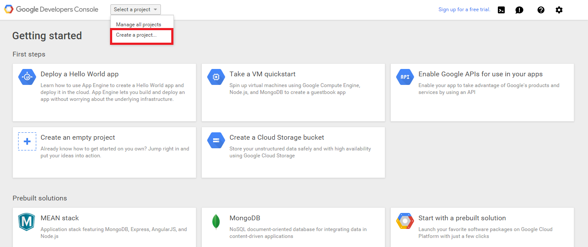
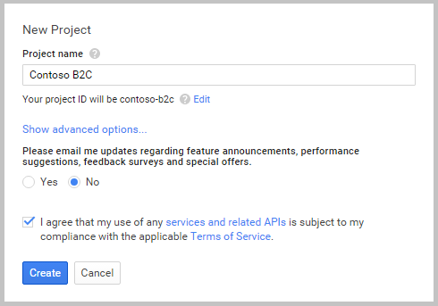
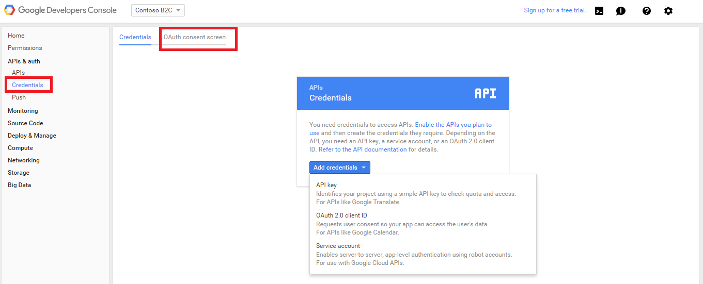
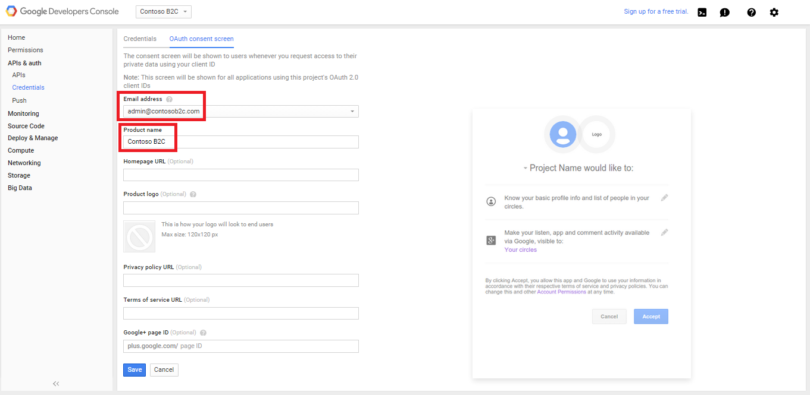
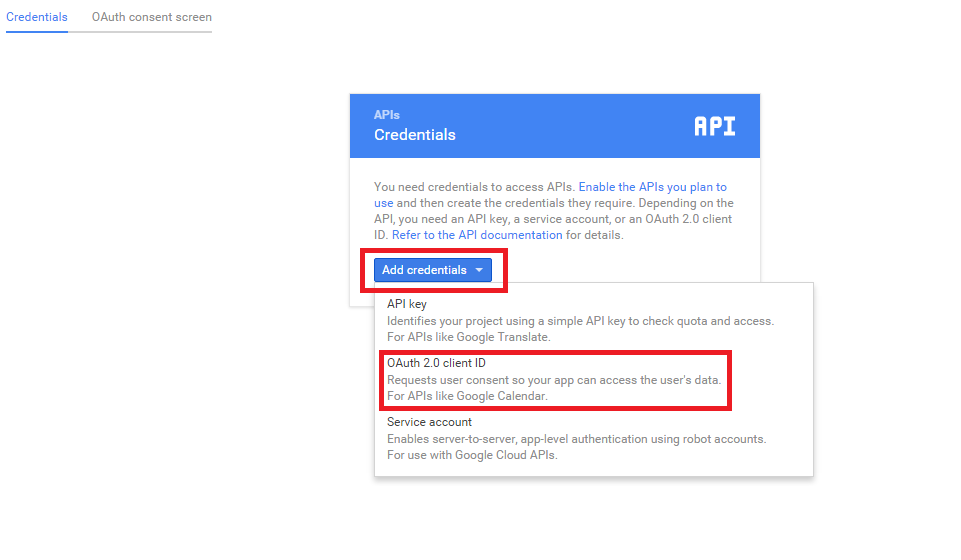
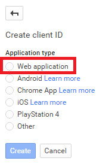
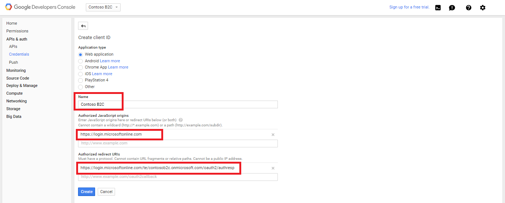
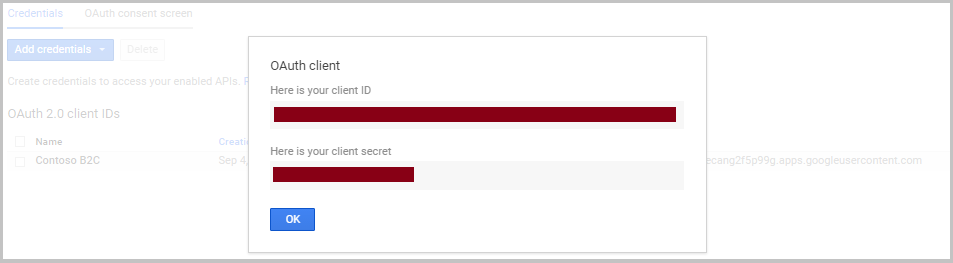

<properties
	pageTitle="Azure Active Directory B2C: Google+ configuration | Microsoft Azure"
	description="Provide sign-up and sign-in to consumers with Google+ accounts in your applications that are secured by Azure Active Directory B2C."
	services="active-directory-b2c"
	documentationCenter=""
	authors="swkrish"
	manager="msmbaldwin"
	editor="bryanla"/>

<tags
	ms.service="active-directory-b2c"
	ms.workload="identity"
	ms.tgt_pltfrm="na"
	ms.devlang="na"
	ms.topic="article"
	ms.date="07/24/2016"
	ms.author="swkrish"/>

# Azure Active Directory B2C: Provide sign-up and sign-in to consumers with Google+ accounts

## Create a Google+ application

To use Google+ as an identity provider in Azure Active Directory (Azure AD) B2C, you need to create a Google+ application and supply it with the right parameters. You need a Google+ account to do this. If you don’t have one, you can get it at [https://accounts.google.com/SignUp](https://accounts.google.com/SignUp).

1. Go to the [Google Developers Console](https://console.developers.google.com/) and sign in with your Google+ account credentials.
2. Click **Create project**, enter a **Project name**, and then click **Create**.

    

    

3. Click **API Manager** and then click **Credentials** in the left navigation.
4. Click the **OAuth consent screen** tab at the top.

    

5. Select or specify a valid **Email address**, provide a **Product name**, and click **Save**.

    

6. Click **New credentials** and then choose **OAuth client ID**.

    

7. Under **Application type**, select **Web application**.

    

8. Provide a **Name** for your application, enter `https://login.microsoftonline.com` in the **Authorized JavaScript origins** field, and `https://login.microsoftonline.com/te/{tenant}/oauth2/authresp` in the **Authorized redirect URIs** field. Replace **{tenant}** with your tenant's name (for example, contosob2c.onmicrosoft.com). The **{tenant}** value is case-sensitive. Click **Create**.

    

9. Copy the values of **Client ID** and **Client secret**. You will need both of them to configure Google+ as an identity provider in your tenant. **Client secret** is an important security credential.

    

## Configure Google+ as an identity provider in your tenant

1. Follow these steps to [navigate to the B2C features blade](active-directory-b2c-app-registration.md#navigate-to-the-b2c-features-blade) on the Azure portal.
2. On the B2C features blade, click **Identity providers**.
3. Click **+Add** at the top of the blade.
4. Provide a friendly **Name** for the identity provider configuration. For example, enter "G+".
5. Click **Identity provider type**, select **Google**, and click **OK**.
6. Click **Set up this identity provider** and enter the client ID and client secret of the Google+ application that you created earlier.
7. Click **OK** and then click **Create** to save your Google+ configuration.
