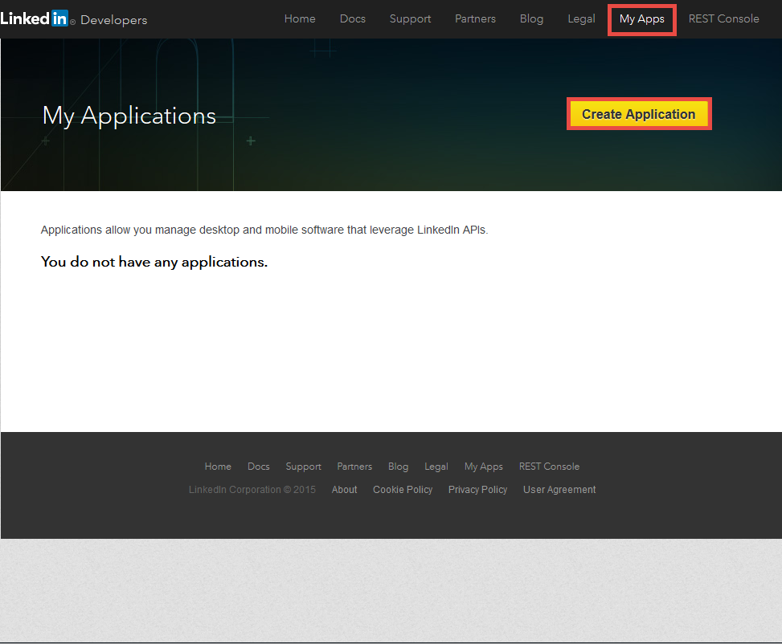
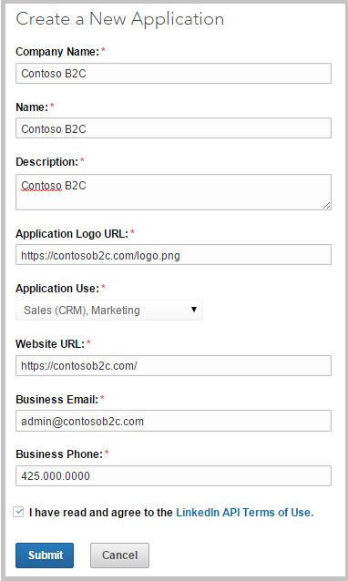

<properties
	pageTitle="Azure Active Directory B2C: LinkedIn configuration | Microsoft Azure"
	description="Provide sign-up and sign-in to consumers with LinkedIn accounts in your applications that are secured by Azure Active Directory B2C"
	services="active-directory-b2c"
	documentationCenter=""
	authors="swkrish"
	manager="msmbaldwin"
	editor="bryanla"/>

<tags
	ms.service="active-directory-b2c"
	ms.workload="identity"
	ms.tgt_pltfrm="na"
	ms.devlang="na"
	ms.topic="article"
	ms.date="07/24/2016"
	ms.author="swkrish"/>

# Azure Active Directory B2C: Provide sign-up and sign-in to consumers with LinkedIn accounts

## Create a LinkedIn application

To use LinkedIn as an identity provider in Azure Active Directory (Azure AD) B2C, you need to create a LinkedIn application and supply it with the right parameters. You need a LinkedIn account to do this. If you don’t have one, you can get it at [https://www.linkedin.com/](https://www.linkedin.com/).

1. Go to the [LinkedIn Developers website](https://www.developer.linkedin.com/) and sign in with your LinkedIn account credentials.
2. Click **My Apps** in the top menu bar and then click **Create Application**.

    

3. In the **Create a New Application** form, fill in the relevant information (**Company Name**, **Name**, **Description**, **Application Logo URL**, **Application Use**, **Website URL**, **Business Email** and **Business Phone**).
4. Agree to the **LinkedIn API Terms of Use** and click **Submit**.

    

5. Copy the values of **Client ID** and **Client Secret**. (You can find them under **Authentication Keys**.) You will need both of them to configure LinkedIn as an identity provider in your tenant.

	>[AZURE.NOTE] **Client Secret** is an important security credential.

6. Enter `https://login.microsoftonline.com/te/{tenant}/oauth2/authresp` in the **Authorized Redirect URLs** field (under **OAuth 2.0**). Replace **{tenant}** with your tenant's name (for example, contoso.onmicrosoft.com). Click **Add**, and then click **Update**. The **{tenant}** value is case-sensitive.

    

## Configure LinkedIn as an identity provider in your tenant

1. Follow these steps to [navigate to the B2C features blade](active-directory-b2c-app-registration.md#navigate-to-the-b2c-features-blade) on the Azure portal.
2. On the B2C features blade, click **Identity providers**.
3. Click **+Add** at the top of the blade.
4. Provide a friendly **Name** for the identity provider configuration. For example, enter "LI".
5. Click **Identity provider type**, select **LinkedIn**, and click **OK**.
6. Click **Set up this identity provider** and enter the client ID and client secret of the LinkedIn application that you created earlier.
7. Click **OK** and then click **Create** to save your LinkedIn configuration.
