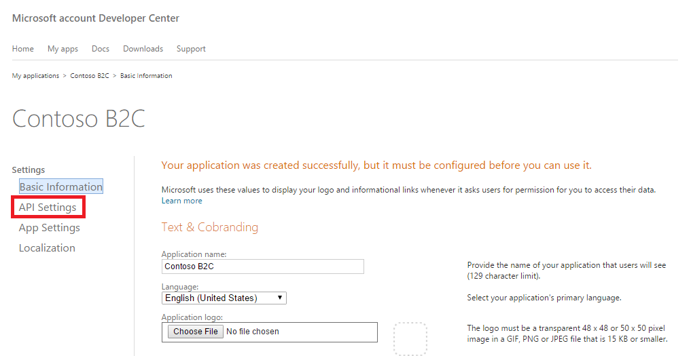
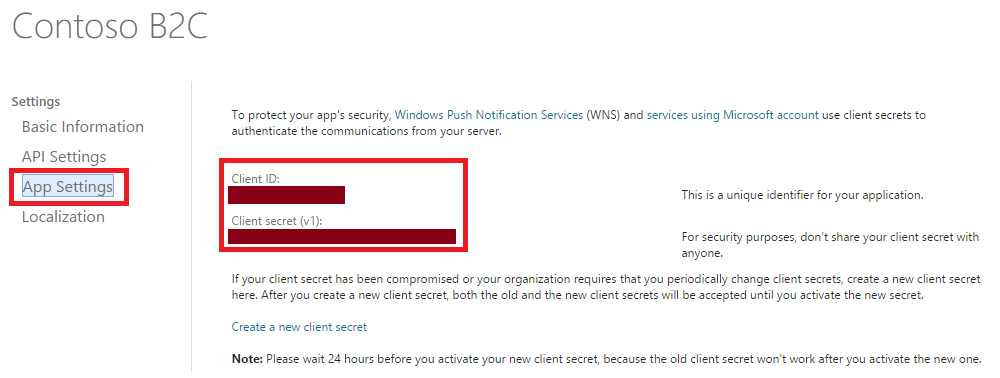

<properties
	pageTitle="Azure Active Directory B2C preview: Microsoft account configuration | Microsoft Azure"
	description="Provide sign-up and sign-in to consumers with Microsoft accounts in your applications that are secured by Azure Active Directory B2C."
	services="active-directory-b2c"
	documentationCenter=""
	authors="swkrish"
	manager="msmbaldwin"
	editor="bryanla"/>

<tags
	ms.service="active-directory-b2c"
	ms.workload="identity"
	ms.tgt_pltfrm="na"
	ms.devlang="na"
	ms.topic="article"
	ms.date="06/27/2016"
	ms.author="swkrish"/>

# Azure Active Directory B2C preview: Provide sign-up and sign-in to consumers with Microsoft accounts

[AZURE.INCLUDE [active-directory-b2c-preview-note](../../includes/active-directory-b2c-preview-note.md)]

## Create a Microsoft account application

To use Microsoft account as an identity provider in Azure Active Directory (Azure AD) B2C, you need to create a Microsoft account application and supply it with the right parameters. You need a Microsoft account to do this. If you don’t have one, you can get it at [https://www.live.com/](https://www.live.com/).

1. Go to the [Microsoft account Developer Center](https://account.live.com/developers/applications) and sign in with your Microsoft account credentials.
2. Click **Create application**.

    

3. Provide an **Application name** and click **I accept**. This requires you to accept Microsoft services terms of use.

    

4. Click **API Settings** on the left navigation. Enter a valid **Contact Email**.

    

5. Enter `https://login.microsoftonline.com/te/{tenant}/oauth2/authresp` in the **Redirect URLs** field. Replace **{tenant}** with your tenant's name (for example, contosob2c.onmicrosoft.com). Click **Save** at the bottom of the page.

    

6. Click **App Settings** on the left navigation. Copy the values of **Client ID** and **Client secret**. You will need both of them to configure Microsoft account as an identity provider in your tenant. **Client secret** is an important security credential.

    

## Configure Microsoft account as an identity provider in your tenant

1. Follow these steps to [navigate to the B2C features blade](active-directory-b2c-app-registration.md#navigate-to-the-b2c-features-blade) on the Azure portal.
2. On the B2C features blade, click **Identity providers**.
3. Click **+Add** at the top of the blade.
4. Provide a friendly **Name** for the identity provider configuration. For example, enter "MSA".
5. Click **Identity provider type**, select **Microsoft account**, and click **OK**.
6. Click **Set up this identity provider** and enter the client ID and client secret of the Microsoft account application that you created earlier.
7. Click **OK** and then click **Create** to save your Microsoft account configuration.
