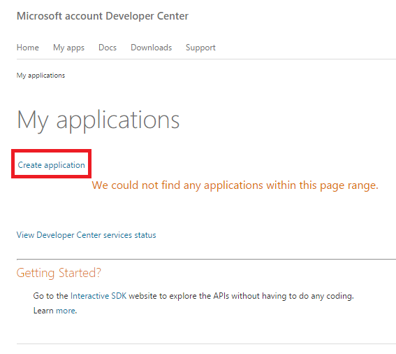
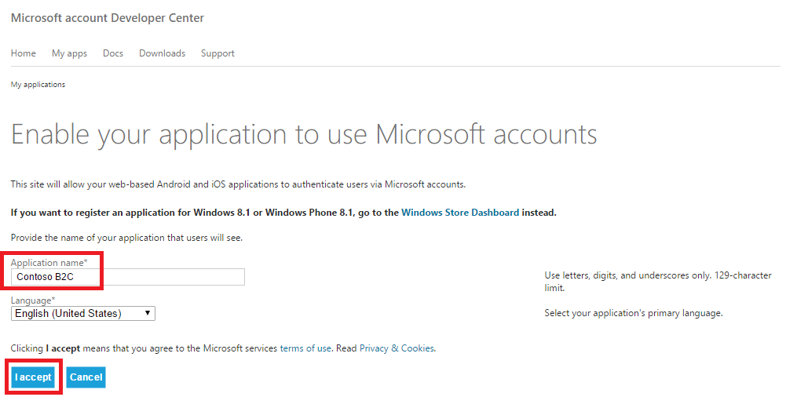
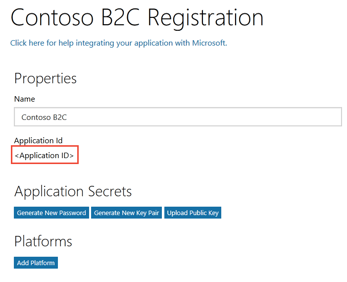
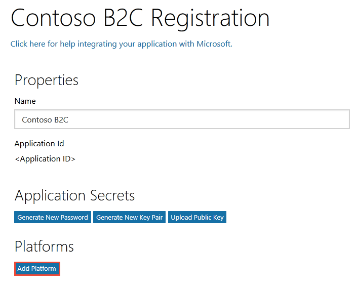
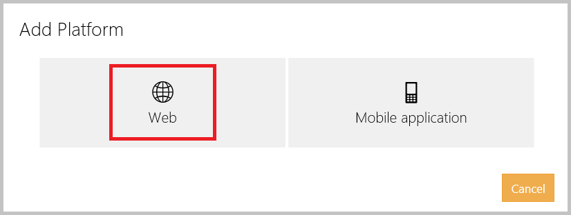
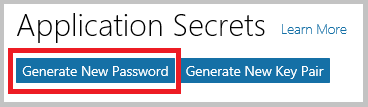
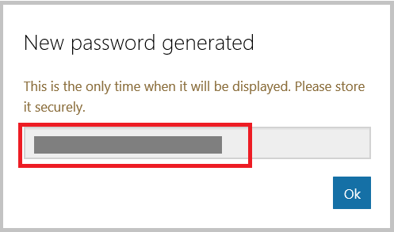
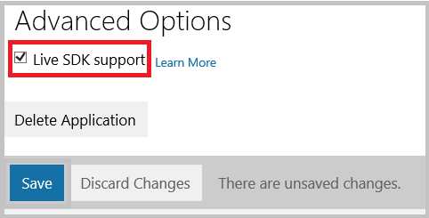

<properties
	pageTitle="Azure Active Directory B2C: Microsoft account configuration | Microsoft Azure"
	description="Provide sign-up and sign-in to consumers with Microsoft accounts in your applications that are secured by Azure Active Directory B2C."
	services="active-directory-b2c"
	documentationCenter=""
	authors="swkrish"
	manager="msmbaldwin"
	editor="bryanla"/>

<tags
	ms.service="active-directory-b2c"
	ms.workload="identity"
	ms.tgt_pltfrm="na"
	ms.devlang="na"
	ms.topic="article"
	ms.date="07/24/2016"
	ms.author="swkrish"/>

# Azure Active Directory B2C: Provide sign-up and sign-in to consumers with Microsoft accounts

## Create a Microsoft account application

To use Microsoft account as an identity provider in Azure Active Directory (Azure AD) B2C, you need to create a Microsoft account application and supply it with the right parameters. You need a Microsoft account to do this. If you don’t have one, you can get it at [https://www.live.com/](https://www.live.com/).

1. Go to the [Microsoft Application Registration Portal](https://apps.dev.microsoft.com) and sign in with your Microsoft account credentials.
2. Click **Add an app**.

    

3. Provide a **Name** for your application and click **Create application**.

    

4. Copy the value of **Application Id**. You will need it to configure Microsoft account as an identity provider in your tenant.

    

5. Click on **Add platform** and choose **Web**.

	

	

6. Click on **Generate New Password** under the **Application Secrets** section. Copy the new password displayed on screen. You will need it to configure Microsoft account as an identity provider in your tenant. This password is an important security credential.

	

	

7. Enter `https://login.microsoftonline.com/te/{tenant}/oauth2/authresp` in the **Redirect URIs** field. Replace **{tenant}** with your tenant's name (for example, contosob2c.onmicrosoft.com).

    

8. Check the box that says **Live SDK support** under the **Advanced Options** section. Click **Save**.

    

## Configure Microsoft account as an identity provider in your tenant

1. Follow these steps to [navigate to the B2C features blade](active-directory-b2c-app-registration.md#navigate-to-the-b2c-features-blade) on the Azure portal.
2. On the B2C features blade, click **Identity providers**.
3. Click **+Add** at the top of the blade.
4. Provide a friendly **Name** for the identity provider configuration. For example, enter "MSA".
5. Click **Identity provider type**, select **Microsoft account**, and click **OK**.
6. Click **Set up this identity provider** and enter the Application Id and password of the Microsoft account application that you created earlier.
7. Click **OK** and then click **Create** to save your Microsoft account configuration.
