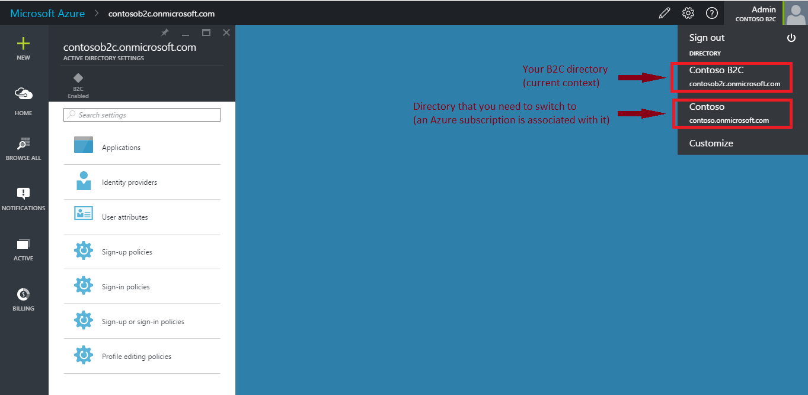
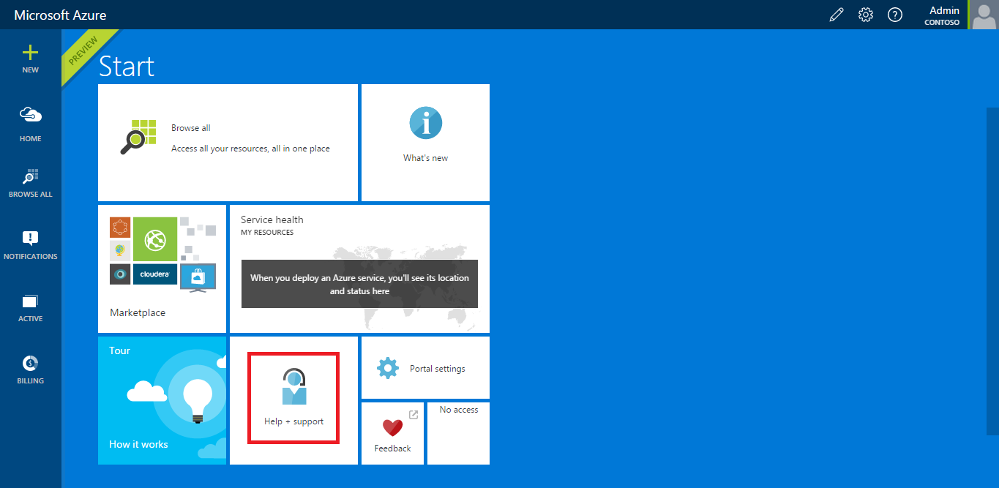
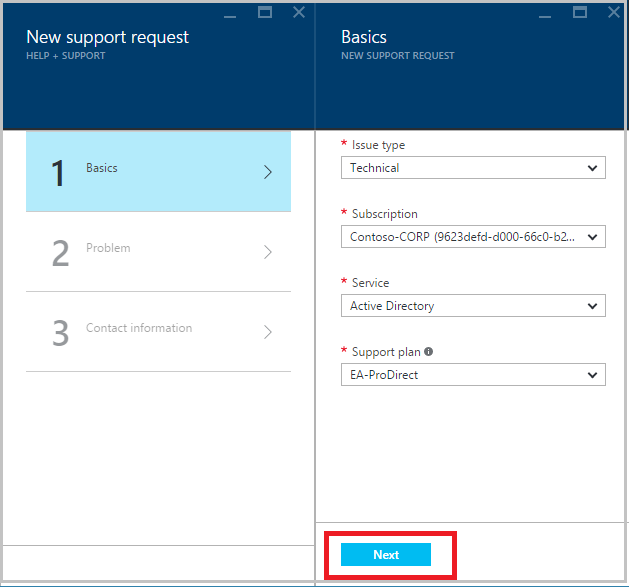
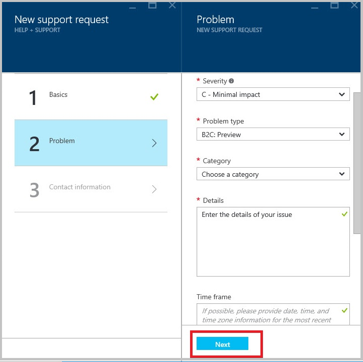
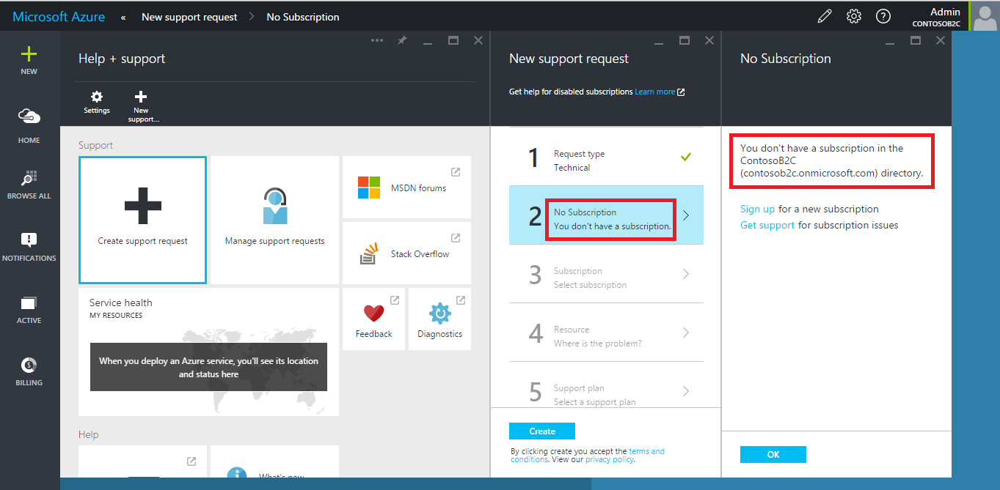

<properties
	pageTitle="Azure Active Directory B2C: Support | Microsoft Azure"
	description="How to file support requests for Azure Active Directory B2C"
	services="active-directory-b2c"
	documentationCenter=""
	authors="swkrish"
	manager="msmbaldwin"
	editor="bryanla"/>

<tags
	ms.service="active-directory-b2c"
	ms.workload="identity"
	ms.tgt_pltfrm="na"
	ms.devlang="na"
	ms.topic="article"
	ms.date="07/24/2016"
	ms.author="swkrish"/>

# Azure Active Directory B2C: File Support Requests

You can file support requests for Azure Active Directory (Azure AD) B2C on the Azure portal using the following steps:

1. [Follow these steps to navigate to the B2C features blade on the Azure portal](active-directory-b2c-app-registration.md#navigate-to-the-b2c-features-blade).
2. Switch from your B2C tenant to another tenant that has an Azure subscription associated with it. Typically, the latter is your employee tenant or the default tenant created for you when you signed up for an Azure subscription. To learn more, see [how an Azure subscription is related to Azure AD](active-directory-how-subscriptions-associated-directory.md#how-an-azure-subscription-is-related-to-azure-ad).

    

3. After switching tenants, click **Help + support**.

    

4. Click **New support request**.

    

5. In the **Basics** blade, use these details and click **Next**.

    - **Issue type** is **Technical**.
	- Choose the appropriate **Subscription**.
    - **Service** is **Active Directory**.
    - Choose the appropriate **Support plan**. If you don't have one, you can sign up for one [here](https://azure.microsoft.com/en-us/support/plans/).

    

6. In the **Problem** blade, use these details and click **Next**.

    - Choose the appropriate **Severity** level.
    - **Problem type** is **B2C**.
    - Choose the appropriate **Category**.
	- Describe your issue in the **Details** field. Provide details such as the B2C tenant name, description of the problem, error messages, correlation IDs (if available), and so on.
    - In the **Time frame** field, provide the date and time (including time zone) that the issue occurred.
    - Under **File upload**, upload all screenshots and files that you think would assist in resolving the issue.

    

7. In the **Contact information** blade, add your contact information. Click **Create**.

    

8. After submitting your support request, you can monitor it by clicking **Help + support** on the Startboard, and then **Manage support requests**.

## Known issue: Filing a support request in the context of a B2C tenant

If you missed step 2 outlined above and try to create a support request in the context of your B2C tenant, you will see the following error.

> [AZURE.IMPORTANT]
> Don't attempt to sign up for a new Azure subscription in your B2C tenant.  

