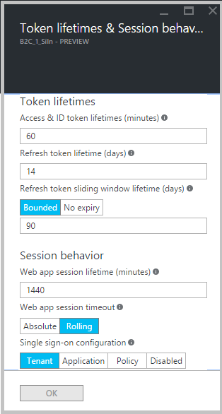

<properties
	pageTitle="Azure Active Directory B2C: Token, session and single sign-on configuration | Microsoft Azure"
	description="Token, session and single sign-on configuration in Azure Active Directory B2C"
	services="active-directory-b2c"
	documentationCenter=""
	authors="swkrish"
	manager="msmbaldwin"
	editor="bryanla"/>

<tags
	ms.service="active-directory-b2c"
	ms.workload="identity"
	ms.tgt_pltfrm="na"
	ms.devlang="na"
	ms.topic="article"
	ms.date="07/18/2016"
	ms.author="swkrish"/>

# Azure Active Directory B2C: Token, session and single sign-on configuration

This feature gives you fine-grained control, on a [per-policy basis](active-directory-b2c-reference-policies.md), of:
 
1. Lifetimes of security tokens emitted by Azure Active Directory (Azure AD) B2C.
2. Lifetimes of web application sessions managed by Azure AD B2C.
3. Single sign-on (SSO) behavior across multiple apps and policies in your B2C tenant.

You can use this feature in your B2C tenant as follows:

1. Follow these steps to [navigate to the B2C features blade](active-directory-b2c-app-registration.md#navigate-to-the-b2c-features-blade) on the Azure portal.
2. Click **Sign-in policies**. *Note: You can use this feature on any policy type, not just on **Sign-in policies***.
3. Open a policy by clicking it. For example, click on **B2C_1_SiIn**.
4. Click **Edit** at the top of the blade.
5. Click **Token, session & single sign-on config**.
6. Make your desired changes. Learn about available properties in subsequent sections.
7. Click **OK**.
8. Click **Save** on the top of the blade.

## Token lifetimes configuration

Azure AD B2C supports the [OAuth 2.0 authorization protocol](active-directory-b2c-reference-protocols.md) for enabling secure access to protected resources. To implement this support, Azure AD B2C emits various [security tokens](active-directory-b2c-reference-tokens.md). These are the properties you can use to manage lifetimes of security tokens emitted by Azure AD B2C:

- **Access & ID token lifetimes (minutes)**: The lifetime of the OAuth 2.0 bearer token used to gain access to a protected resource. Azure AD B2C issues only ID tokens at this time. This value would apply to access tokens as well, when we add support for them.
   - Default = 60 minutes.
   - Minimum (inclusive) = 5 minutes.
   - Maximum (inclusive) = 1440 minutes.
- **Refresh token lifetime (days)**: The maximum time period before which a refresh token can be used to acquire a new access or ID token (and optionally, a new refresh token, if your application had been granted the `offline_access` scope).
   - Default = 14 days.
   - Minimum (inclusive) = 1 day.
   - Maximum (inclusive) = 90 days.
- **Refresh token sliding window lifetime (days)**: After this time period elapses the user is forced to re-authenticate, irrespective of the validity period of the most recent refresh token acquired by the application. It can only be provided if the switch is set to **Bounded**. It needs to be greater than or equal to the **Refresh token lifetime (days)** value. If the switch is set to **Unbounded**, you cannot provide a specific value.
   - Default = 90 days.
   - Minimum (inclusive) = 1 day.
   - Maximum (inclusive) = 365 days.

These are a couple of use cases that you can enable using these properties:

- Allow a user to stay signed into a mobile application indefinitely, as long as he or she is continually active on the application. You can do this by setting the **Refresh token sliding window lifetime (days)** switch to **Unbounded** in your sign-in policy.
- Meet your industry's security and compliance requirements by setting the appropriate access token lifetimes.

## Session configuration

Azure AD B2C supports the [OpenID Connect authentication protocol](active-directory-b2c-reference-oidc.md) for enabling secure sign-in to web applications. These are the properties you can use to manage web application sessions:

- **Web app session lifetime (minutes)**: The lifetime of Azure AD B2C's session cookie stored on the user's browser upon successful authentication.
   - Default = 1440 minutes.
   - Minimum (inclusive) = 15 minutes.
   - Maximum (inclusive) = 1440 minutes.
- **Web app session timeout**: If this switch is set to **Absolute**, the user is forced to re-authenticate after the time period specified by **Web app session lifetime (minutes)** elapses. If this switch is set to **Rolling** (the default setting), the user remains signed in as long as the user is continually active in your web application.

These are a couple of use cases that you can enable using these properties:

- Meet your industry's security and compliance requirements by setting the appropriate web application session lifetimes.
- Force re-authentication after a set time period during a user's interaction with a high-security part of your web application. 

## Single sign-on (SSO) configuration

If you have multiple applications and policies in your B2C tenant, you can manage user interactions across them using the **Single sign-on configuration** property. You can set the property to one of the following settings:

- **Tenant**: This is the default setting. Using this setting allows multiple applications and policies in your B2C tenant to share the same user session. For example, once a user signs into an application, Contoso Shopping, he or she can also seamlessly sign into another one, Contoso Pharmacy, upon accessing it.
- **Application**: This allows you to maintain a user session exclusively for an application, independent of other applications. For example, if you want the user to sign in to Contoso Pharmacy (with the same credentials), even if he or she is already signed into Contoso Shopping, another application on the same B2C tenant. 
- **Policy**: This allows you to maintain a user session exclusively for a policy, independent of the applications using it. For example, if the user has already signed in and completed a multi factor authentication (MFA) step, he or she can be given access to higher-security parts of multiple applications as long as the session tied to the policy doesn't expire.
- **Disabled**: This forces the user to run through the entire user journey on every execution of the policy. For example, this will allow multiple users to sign up to your application (in a shared desktop scenario), even while a single user remains signed in during the whole time.
