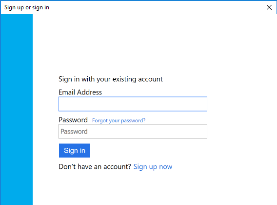
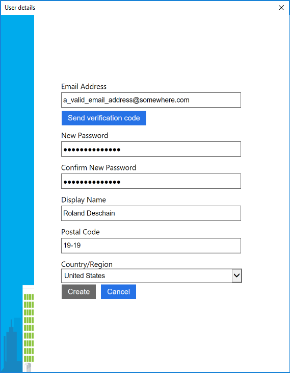
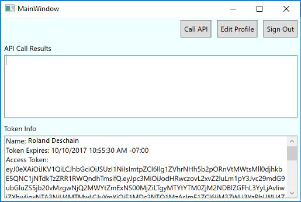
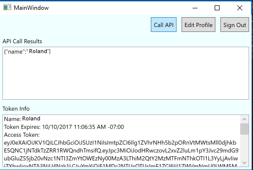
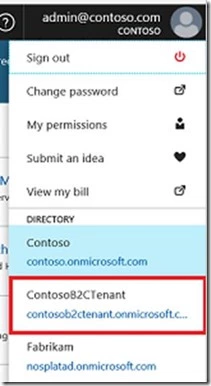

# Part 1: Sign into a WPF application using Azure AD B2C

Azure AD B2C enables your applications to authenticate to:

* Social Accounts such as Facebook, Google, LinkedIn, and more.
* Enterprise Accounts using open standard protocols, OpenID Connect or SAML
* Local Accounts using email address/username and password

This tutorial is a continuation of the [test drive a B2C WPF app](https://docs.microsoft.com/en-us/azure/active-directory-b2c/active-directory-b2c-quickstarts-desktop-app) demostrating a sample WPF application that allows the users to sign in and access an API resource to receive a welcome message back in a hosted Azure AD B2C test tenant environment. 

In this tutorial, you learn how to

> [!div class="checklist"]
> * Register the sample WPF desktop app in your Azure AD B2C tenant.
> * Create a user sign-up/sign-in policy for your WPF app for a local account using an email address and password.
> * Register the sample ASP.NET Web API in your Azure AD B2C tenant. 
> * Configure the sample WPF application and web API to use your Azure AD B2C tenant coordinates. 

## Prerequisites

* Create your own [Azure AD B2C Tenant](https://docs.microsoft.com/en-us/azure/active-directory-b2c/active-directory-b2c-get-started)
* Install [Visual Studio 2017](https://www.visualstudio.com/downloads/) with the following workloads:
    - **.NET desktop development**
    - **ASP.NET and web development**

[!INCLUDE [quickstarts-free-trial-note](../../includes/quickstarts-free-trial-note.md)]

## Step 1 - Download the sample code

[Download](https://github.com/Azure-Samples/active-directory-b2c-dotnet-desktop) or clone the sample from GitHub.

```bash
git clone https://github.com/Azure-Samples/active-directory-b2c-dotnet-desktop.git
```

### Sample WPF app B2C integration overview

This tutorial demostrates calling a web API with the appropriate scopes to receive a welcome message addressed to the user's display name.

The sample application demostrates the following:

1. WPF desktop project: uses the **Sign Up or Sign In** policy to sign up or sign in with an email address. 
2. Web API sample app: provides a web API to be secured by Azure AD B2C and called by the WPF desktop application.

You can sign up to use the application by clicking the Sign up / sign in link.



On the following sign up or sign in screen, you can enter your sign-up information. 

> [!NOTE]
> You need to use a valid email address to receive the verification code.



Upon successful sign up, you will see your display name in the token info section.  



Once logged in, you can click **Call API** button to call the web API and receive a welcome message addressed to you.



This tutorial walks you through how to integrate Azure AD B2C into your application so your users can sign up and access a resource.

## Step 2 - Register the WPF Desktop Application with your Azure AD B2C tenant

Make sure you are in your B2C tenant in the upper right drop-down.



Click on your Azure AD B2C resource from your dashboard. 

Click on **Applications** then click **Add**. 

Fill out the following details:

- **Name** – the friendly name to identify your app in the Azure portal, e.g. `WPF Desktop App`
- **Web App / Web API** – mark **No** since this is a WPF desktop app
- **Native client** - mark **Yes** since this is a WPF desktop app
- **Allow implicit flow** – keep the default as **Yes**
- **Custom Redirect URI** – enter `com.onmicrosoft.<your tenant name>.<any app name>://redirect/path` e.g. `com.onmicrosoft.contoso.appname://redirect/path` Your sign in or sign up policy uses this URI to send tokens to.
- **App ID URI** – leave this blank.

Your desktop application registration should look like the following image:


Click **Create** to register the application. Once created, you can view the properties of your desktop application, e.g. its `Application ID`, by click **Application** - `WPF Desktop App`

## Step 3 - Create your Sign In or Sign Up policy

A policy defines certain user workflows, for example, signing in, signing up, changing passwords, and so forth. This sections shows you how to create a **Sign in or Sign up** policy.

If you already have an existing policy from a previous tutorial, you can skip to the next step. 

From the B2C portal page, go to **Policies - Sign up or Sign in** and click **Add**

Configure your policy using the following: 

1. Call the policy `b2c_1_SiUpIn`. This policy name is used in the sample code.
2. Identity provider - select **email signup**
3. Sign up attributes – these are the fields your users see when they sign up for your app. Make sure to check **Display Name** and **Postal Code** since the sample apps use these attributes.
4. Application claims – these are the claims that appear in an token. Make sure to check **Display Name**, **Postal Code**,  **User is new** and **User’s Object ID** are checked. 

Press **OK** to finish creating your policy. 

## Step 4 - Update the sample code to use your tenant and policy

Now that the WPF desktop App is registered with B2C and you have a policy, it is time to configure the sample application to talk to your B2C tenant.

Open the `active-directory-b2c-wpf` solution in Visual Studio.

The Visual Studio solution contains two projects:

- **active-directory-b2c-wpf** – A WPF desktop application where you can sign in and call a web API. 
- **HelloAPI-server** – A web API that sends back a welcome message addressed to your display name. 

Open the `active-directory-b2c-wpf` project to make modifications to the WPF desktop application project.

> [!Note]
> By default, the samples are configured to talk to a demo tenant called `fabrikamb2c.onmicrosoft.com` To have these samples talk to your specific tenant, you need to update the `App.xaml.cs` file for the WPF project and the `Web.config` file for the web API.

In the `active-directory-b2c-wpf` project, open the App.xaml.cs file and make the following updates:

```C#
private static string Tenant = "<your-tenant-name>.onmicrosoft.com";
private static string ClientId = "<The Application ID for your WPF app as seen in portal registration>";
```

Update the PolicySignUpSignIn value with the value you used to create your policy. The value for this walkthrough is **b2c_1_SiUpIn**

```C#
public static string PolicySignUpSignIn = "b2c_1_SiUpIn";
```

## Step 5 - Run and test the sample WPF application

You only need to run the `active-directory-b2c-wpf` for Part 1 of this tutorial.

In Solution Explorer, right-click on the **active-directory-b2c-wpf** project and click **Set as Startup**

Press **F5** to build and launch the WPF desktop app. 

Click the **sign in** button to sign up for the WPF Application. 

However, if you click the **Call API** link and the `HelloAPI-server` project is running, you will receive an error "user is unauthorized." You receive this error because you are attempting to access a resource from the demo tenant, so your access token is not valid for this API.  

## Next Steps

This article walked you through creating a sign up or sign in policy for your users to sign up for your WPF desktop application. 

The next part of this tutorial is how to access the API.

> [!div class="nextstepaction"]
> [Part 2: Access a resource](active-directory-b2c-tutorials-desktop-app-part-b.md)