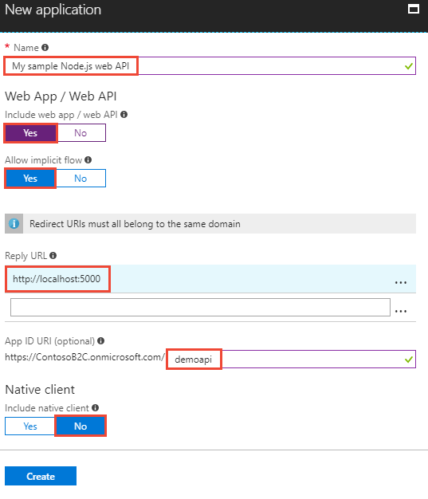

# Tutorial: Grant access to a Node.js web API from a desktop app using Azure Active Directory B2C

This tutorial shows you how to call an Azure Active Directory (Azure AD) B2C protected Node.js web API resource from a Windows Presentation Foundation (WPF) desktop app.

In this tutorial, you learn how to:

> [!div class="checklist"]
> * Register a web API in your Azure AD B2C tenant
> * Define and configure scopes for a web API
> * Grant app permissions to the web API
> * Update sample code to use Azure AD B2C to protect a web API

[!INCLUDE [quickstarts-free-trial-note](../../includes/quickstarts-free-trial-note.md)]

## Prerequisites

* Complete the [Authenticate users with Azure Active Directory B2C in a desktop app tutorial](active-directory-b2c-tutorials-desktop-app.md).
* Install [Visual Studio 2017](https://www.visualstudio.com/downloads/) with **.NET desktop development** and **ASP.NET and web development** workloads.
* Install [Node.js](https://nodejs.org/en/download/)

## Register web API

Web API resources need to be registered in your tenant before they can accept and respond to [protected resource requests](../active-directory/develop/developer-glossary.md#resource-server) by [client applications](../active-directory/develop/developer-glossary.md#client-application) that present an [access token](../active-directory/develop/developer-glossary.md#access-token) from Azure Active Directory. Registration establishes the [application and service principal object](../active-directory/develop/developer-glossary.md#application-object) in your tenant. 

Sign in to the [Azure portal](https://portal.azure.com/) as the global administrator of your Azure AD B2C tenant.

[!INCLUDE [active-directory-b2c-switch-b2c-tenant](../../includes/active-directory-b2c-switch-b2c-tenant.md)]

1. Select **Azure AD B2C** from the services list in the Azure portal.

2. In the B2C settings, click **Applications** and then click **Add**.

    To register the sample web API in your tenant, use the following settings.
    
    
    
    | Setting      | Suggested value  | Description                                        |
    | ------------ | ------- | -------------------------------------------------- |
    | **Name** | My sample Node.js web API | Enter a **Name** that describes your web API to developers. |
    | **Include web app / web API** | Yes | Select **Yes** for a web API. |
    | **Allow implicit flow** | Yes | Select **Yes** since the API uses [OpenID Connect sign-in](active-directory-b2c-reference-oidc.md). |
    | **Reply URL** | `http://localhost:5000` | Reply URLs are endpoints where Azure AD B2C returns any tokens that your API requests. In this tutorial, the sample web API runs locally (localhost) and listens on port 5000. |
    | **App ID URI** | demoapi | The URI uniquely identifies the API in the tenant. This allows you to register multiple APIs per tenant. [Scopes](../active-directory/develop/developer-glossary.md#scopes) govern access to the protected API resource and are defined per App ID URI. |
    | **Native client** | No | Since this is a web API and not a native client, select No. |
    
3. Click **Create** to register your API.

Registered APIs are displayed in the applications list for the Azure AD B2C tenant. Select your web API from the list. The web API's property pane is displayed.


Make note of the **Application Client ID**. The ID uniquely identifies the API and is needed when configuring the API later in the tutorial.

Registering your web API with Azure AD B2C defines a trust relationship. Since the API is registered with B2C, the API can now trust the B2C access tokens it receives from other applications.

## Define and configure scopes

[Scopes](../active-directory/develop/developer-glossary.md#scopes) provide a way to govern access to protected resources. Scopes are used by the web API to implement scope-based access control. For example, some users could have both read and write access, whereas other users might have read-only permissions. In this tutorial, you define read and write permissions for the web API.

### Define scopes for the web API

Registered APIs are displayed in the applications list for the Azure AD B2C tenant. Select your web API from the list. The web API's property pane is displayed.

Click **Published scopes (Preview)**.

To configure scopes for the API, add the following entries. 


| Setting      | Suggested value  | Description                                        |
| ------------ | ------- | -------------------------------------------------- |
| **Scope** | demo.read | Read access to demo API|

Click **Save**.

The published scopes can be used to grant a client app permission to the web API.

### Grant app permissions to web API

To call a protected web API from an app, you need to grant your app permissions to the API. In this tutorial, use the desktop app created in [Authenticate users with Azure Active Directory B2C in a desktop app tutorial](active-directory-b2c-tutorials-desktop-app.md).

1. In the Azure portal, select **Azure AD B2C** from the services list and click **Applications** to view the registered app list.

2. Select **My Sample WPF App** from the app list and click **API access (Preview)** then **Add**.

3. In the **Select API** dropdown, select your registered web API **My sample Node.js web API**.

4. In the **Select Scopes** dropdown, select the scopes you defined in the web API registration.

    

5. Click **OK**.

Your **My Sample WPF App** is registered to call the protected **My sample Node.js web API**. A user [authenticates](../active-directory/develop/developer-glossary.md#authentication) with Azure AD B2C to use the WPF desktop application. The desktop application obtains an [authorization grant](../active-directory/develop/developer-glossary.md#authorization-grant) from Azure AD B2C to access the protected web API.

## Update web API code

Now that the web API is registered and you have scopes defined, you need to configure the web API code to use your Azure AD B2C tenant. In this tutorial, you configure a sample Node.js web app you can download from GitHub. 

[Download a zip file](https://github.com/Azure-Samples/active-directory-b2c-javascript-nodejs-webapi/archive/master.zip) or clone the sample web app from GitHub.

```
git clone https://github.com/Azure-Samples/active-directory-b2c-javascript-nodejs-webapi.git
```
The Node.js web API sample uses the Passport.js library to enable Azure AD B2C to protect calls to the API. 

### Configure the web API

1. Open the `index.html` file in the Node.js web API sample.
2. Configure the sample with the Azure AD B2C tenant registration information. Change the following lines of code:

```nodejs
var tenantID = "<your-tenant-name>.onmicrosoft.com";
var clientID = "<Application ID for your Node.js Web API>";
var policyName = "B2C_1_SiUpIn";  // Sign-in / sign-up policy name
```

### Configure the desktop app

1. Open the `active-directory-b2c-wpf` solution from [Authenticate users with Azure Active Directory B2C in a desktop app tutorial](active-directory-b2c-tutorials-desktop-app.md) in Visual Studio.

## Run the sample

Run the Node.js web API:

1. Launch a Node.js command prompt.
2. Change to the directory containing the Node.js sample. For example `cd c:\active-directory-b2c-javascript-nodejs-webapi`
3. Run the following commands:
    ```
    npm install && npm update
    ```
    ```
    node index.js
    ```
Run the desktop app:

1. Press **F5** to run the desktop app.
2. Sign in using the email address and password used in [Authenticate users with Azure Active Directory B2C in a desktop app tutorial](active-directory-b2c-tutorials-desktop-app.md).
3. Click the **Call API** button. 

The desktop app makes a request to the web API to and gets a response with the logged-in user's display name. You're protected desktop app is calling the protected web API in your Azure AD B2C tenant.

## Clean up resources

You can use your Azure AD B2C tenant if you plan to try other Azure AD B2C tutorials. When no longer needed, you can [delete your Azure AD B2C tenant](active-directory-b2c-faqs.md#how-do-i-delete-my-azure-ad-b2c-tenant).

## Next steps

This article walked you through protecting a ASP.NET web API by registering and defining scopes in Azure AD B2C. Learn more by browsing the available Azure AD B2C code samples.

> [!div class="nextstepaction"]
> [Azure AD B2C code samples](https://azure.microsoft.com/resources/samples/?service=active-directory-b2c&sort=0)
