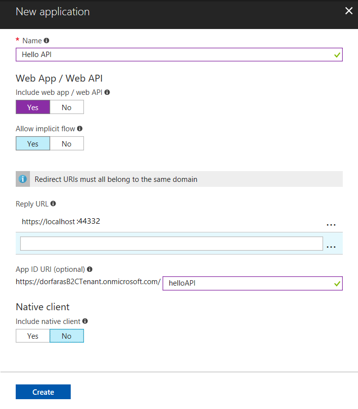
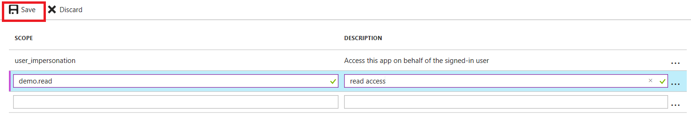
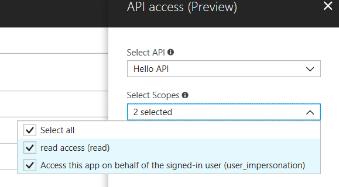
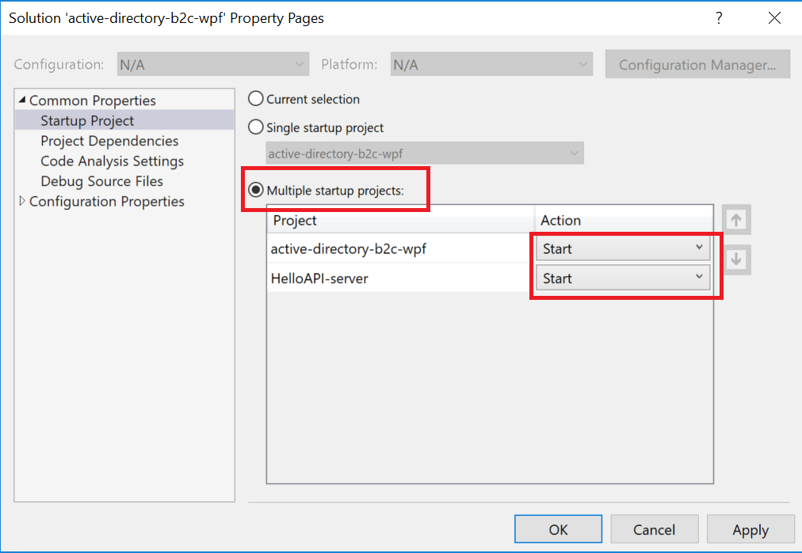

# Part 2 - Access an Azure AD B2C-protected ASP.NET Web API from a WPF Desktop Application

Part 2 of this tutorial walks you through how to call a resource, e.g. an API, using an access token generated by Azure AD B2C. 

## Step 1 - Register the Web API with Azure AD B2C

Make sure you are in your B2C tenant in the upper right drop-down.


Click on your Azure AD B2C resource from your dashboard. 

Click on **Applications** then click **Add**. 

Fill out the following details:

- **Name** – For you to identify your Web API in the Azure portal, e.g. `Hello API`
- **Application ID** – This is the Application ID to put into the sample project
- **Web App / Web API** – Select yes, since this is a Web API
- **Reply URL** – Enter `https://localhost:44332` because you are running the sample locally
- **App ID URL** – Enter `helloAPI` for this sample. Because a tenant can have more than 1 registered API, this unique App ID URL is needed to define scopes only for this particular API. Scopes are defined per App ID URL and are not global to a tenant.

The resulting screenshot looks like:



Registering your Web API with Azure AD B2C defines a trust relationship. Since the API is now registered with B2C, the API can now trust the B2C access tokens it receives from other applications.

## Step 2 - Define and configure scopes

The Web API determines which permissions the user has by looking at the scopes provided in the access token for that user. For example, some users could have both read and write access, whereas other users might have read-only permissions. 

This examples show you how to define read and write permissions for the API; however, you could also define other permissions, e.g. write-only. 

### Define the scopes for the web API

From the web API registration page, click Published scopes (Preview)


And fill out the scopes as shown below. Use the scope name "demo.read" and description "read access." 

Hit Save.



The scope names listed under the Scope heading go into your code.

### Grant the app permissions to the web API

In the previous steps, you created scopes for an API. In these steps, you define the API scopes for the WPF application.

Switch over to your WPF application in the Portal and click API access (Preview)


Click Add at the top. A window appears on the far right hand side.

Select your Web API by its portal name and select the scopes you created in the Web API registration.



Click **OK** button at the bottom of screen.


Now your WPF app and web API are registered with B2C.

## Step 3 - Update the sample code to use your tenant and policy

Now that the WPF app and web API are registered with B2C and you have a policy, it is time to configure the sample applications to talk to your B2C tenant.

Open the `active-directory-b2c-wpf` solution in Visual Studio.

Open the `App.xaml.cs` file in the `active-directory-b2c-wpf` project. This project is configured to talk to a demo tenant called `fabrikamb2c.onmicrosoft.com` To update this sample talk to the sample API included in this solution, make the following update:

```C#
// public static string ApiEndpoint = "https://fabrikamb2chello.azurewebsites.net/hello";
public static string ApiEndpoint = "https://localhost:44332/hello";
```

Provide the App ID URI of the API to the WPF app. The WPF app uses the App ID URI to tell B2C which API it wants permissions to call. Update this sample to use the scope you defined in your tenant as follows: 

```C#
// public static string[] ApiScopes = { "https://fabrikamb2c.onmicrosoft.com/demoapi/demo.read" };

public static string[] ApiScopes = { "https://<your tenant name>.onmicrosoft.com/helloAPI/demo.read" };
```

Next, in the **HelloAPI-server** project, open the `Web.config` and make the following changes:

```C#

<add key="ida:Tenant" value="<your tenant name>.onmicrosoft.com" />
<add key="ida:ClientId" value="<Application ID for your Web API>" />
```

Update the value with the value you used to create your policy, e.g. `b2c_1_SiUpIn`

```C#
<add key="ida:SignUpSignInPolicyId" value="b2c_1_SiUpIn" />
```

Now your samples are ready to run.

## Step 4 - Run and test the sample WPF application and web API

You will need to run both the `active-directory-b2c-wpf` and `HelloAPI-server` projects at the same time. 

1. In Solution Explorer, right-click on the solution and open the **Common Properties - Startup Project** window. 
2. Select **Multiple startup projects**.
3. Change the **Action** for both projects from **None** to **Start** as shown in the image below.



Press **F5** to start both applications.

If you've already have an existing account in your B2C tenant, you can use that account to sign into the WPF application. Otherwise, click the sign up link to sign up for the WPF Application. Once signed in, click the `Call API` button to access the API resource. 

## Next Steps

This article walked you through creating a Sign Up or Sign In policy. There are other built-in policies for resetting passwords, editing a profile, and so forth, which you can find more information about in the article [reference policies.](https://docs.microsoft.com/en-us/azure/active-directory-b2c/active-directory-b2c-reference-policies)