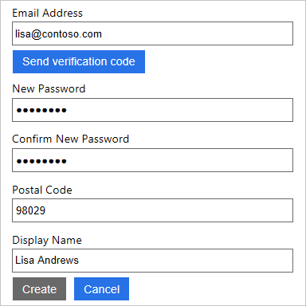

# Tutorial: Enable authentication in a native client application using Azure Active Directory B2C

This tutorial shows you how to use Azure Active Directory (Azure AD) B2C to sign in and sign up users in an Windows Presentation Foundation (WPF) desktop application. Azure AD B2C enables your applications to authenticate to social accounts, enterprise accounts, and Azure Active Directory accounts using open standard protocols.

In this tutorial, you learn how to:

> [!div class="checklist"]
> * Add the native client application
> * Configure the sample to use the application
> * Sign up using the user flow

[!INCLUDE [quickstarts-free-trial-note](../../includes/quickstarts-free-trial-note.md)]

## Prerequisites

- [Create user flows](tutorial-create-user-flows.md) to enable user experiences in your application.
- Install [Visual Studio 2019](https://www.visualstudio.com/downloads/) with **.NET desktop development** and **ASP.NET and web development** workloads.

## Add the native client application

1. Sign in to the [Azure portal](https://portal.azure.com).
2. Make sure you're using the directory that contains your Azure AD B2C tenant by clicking the **Directory and subscription filter** in the top menu and choosing the directory that contains your tenant.
3. Choose **All services** in the top-left corner of the Azure portal, and then search for and select **Azure AD B2C**.
4. Select **Applications**, and then select **Add**.
5. Enter a name for the application. For example, *nativeapp1*.
6. For **Include web app/ web API**, select **No**.
7. For **Include native client**, select **Yes**.
8. For **Redirect URI**, enter a valid redirect URI with a custom scheme. There are two important considerations when choosing a redirect URI:

    - **Unique** - The scheme of the redirect URI should be unique for every application. In the example `com.onmicrosoft.contoso.appname://redirect/path`, `com.onmicrosoft.contoso.appname` is the scheme. This pattern should be followed. If two applications share the same scheme, the user is given a choice to choose an application. If the user makes an incorrect choice, the sign-in fails.
    - **Complete** - The redirect URI must have a scheme and a path. The path must contain at least one forward slash after the domain. For example, `//contoso/` works and `//contoso` fails. Make sure that the redirect URI doesn't include special characters, such as underscores.

9. Click **Create**.
10. On the properties page, record the application ID that you'll use when you configure the sample.

## Configure the sample

In this tutorial, you configure a sample that you can download from GitHub. The sample WPF desktop application demonstrates sign-up, sign-in, and calls a protected web API in Azure AD B2C. [Download a zip file](https://github.com/Azure-Samples/active-directory-b2c-dotnet-desktop/archive/master.zip), [browse the repo](https://github.com/Azure-Samples/active-directory-b2c-dotnet-desktop), or clone the sample from GitHub.

```
git clone https://github.com/Azure-Samples/active-directory-b2c-dotnet-desktop.git
```

To change the app settings, replace the `<your-tenant-name>` with your tenant name and replace`<application-ID`> with the application ID that you recorded.

1. Open the `active-directory-b2c-wpf` solution in Visual Studio.
2. In the `active-directory-b2c-wpf` project, open the **App.xaml.cs** file and make the following updates:

    ```C#
    private static string Tenant = "<your-tenant-name>.onmicrosoft.com";
    private static string ClientId = "<application-ID>";
    ```

3. Update the **PolicySignUpSignIn** variable with the name of the user flow that you created.

    ```C#
    public static string PolicySignUpSignIn = "B2C_1_signupsignin1";
    ```

## Run the sample

Press **F5** to build and run the sample.

### Sign up using an email address

1. Click **Sign In** to sign up as a user. This uses the **B2C_1_signupsignin1** user flow.
2. Azure AD B2C presents a sign-in page with a sign-up link. Since you don't have an account yet, click the **Sign up now** link.
3. The sign-up workflow presents a page to collect and verify the user's identity using an email address. The sign-up workflow also collects the user's password and the requested attributes defined in the user flow.

    Use a valid email address and validate using the verification code. Set a password. Enter values for the requested attributes.

    

4. Click **Create** to create a local account in the Azure AD B2C tenant.

Now, the user can use their email address to sign in and use the desktop app.

> [!NOTE]
> If you click the **Call API** button, you will receive an "Unauthorized" error. You receive this error because you are attempting to access a resource from the demo tenant. Since your access token is only valid for your Azure AD tenant, the API call is unauthorized. Continue with the next tutorial to create a protected web API for your tenant.

## Next steps

In this tutorial, you learned how to:

> [!div class="checklist"]
> * Add the native client application
> * Configure the sample to use the application
> * Sign up using the user flow

> [!div class="nextstepaction"]
> [Tutorial: Grant access to a Node.js web API from a desktop app using Azure Active Directory B2C](active-directory-b2c-tutorials-spa-webapi.md)
