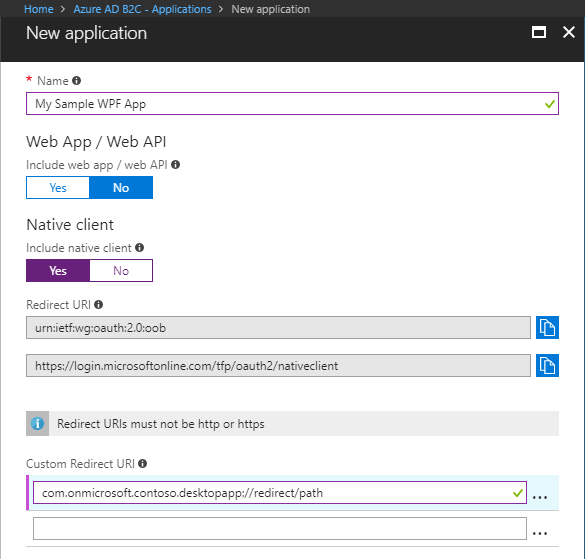
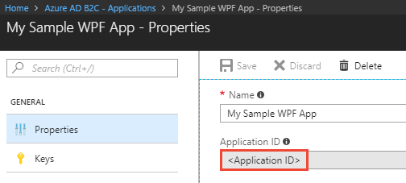
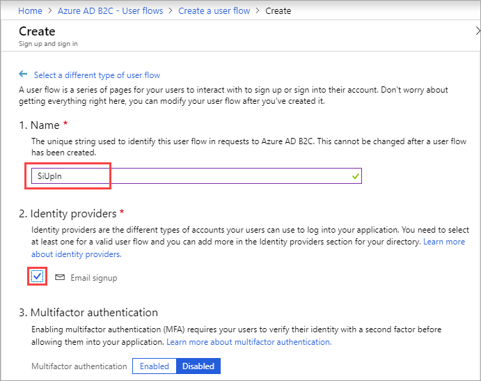

# Tutorial: Enable desktop app authentication with accounts using Azure Active Directory B2C

This tutorial shows you how to use Azure Active Directory (Azure AD) B2C to sign in and sign up users in an Windows Presentation Foundation (WPF) desktop application. Azure AD B2C enables your apps to authenticate to social accounts, enterprise accounts, and Azure Active Directory accounts using open standard protocols.

In this tutorial, you learn how to:

> [!div class="checklist"]
> * Register the sample desktop app in your Azure AD B2C tenant.
> * Create user flows for user sign-up, sign-in, editing a profile, and password reset.
> * Configure the sample application to use your Azure AD B2C tenant.

[!INCLUDE [quickstarts-free-trial-note](../../includes/quickstarts-free-trial-note.md)]

## Prerequisites

* Create your own [Azure AD B2C Tenant](active-directory-b2c-get-started.md)
* Install [Visual Studio 2017](https://www.visualstudio.com/downloads/) with **.NET desktop development** and **ASP.NET and web development** workloads.

## Register desktop app

Applications need to be [registered](../active-directory/develop/developer-glossary.md#application-registration) in your tenant before they can receive [access tokens](../active-directory/develop/developer-glossary.md#access-token) from Azure Active Directory. App registration creates an [application id](../active-directory/develop/developer-glossary.md#application-id-client-id) for the app in your tenant. 

Sign in to the [Azure portal](https://portal.azure.com/) as the global administrator of your Azure AD B2C tenant.

[!INCLUDE [active-directory-b2c-switch-b2c-tenant](../../includes/active-directory-b2c-switch-b2c-tenant.md)]

1. Select **Azure AD B2C** from the services list in the Azure portal. 

2. In the B2C settings, click **Applications** and then click **Add**. 

    To register the sample web app in your tenant, use the following settings:
    
    
    
    | Setting      | Suggested value  | Description                                        |
    | ------------ | ------- | -------------------------------------------------- |
    | **Name** | My Sample WPF App | Enter a **Name** that describes your app to consumers. | 
    | **Include web app / web API** | No | Select **No** for a desktop app. |
    | **Include native client** | Yes | Since this is a desktop app and is considered a native client. |
    | **Redirect URI** | Default values | Unique identifier to which Azure AD B2C redirects the user agent in an OAuth 2.0 response. |
    | **Custom Redirect URI** | `com.onmicrosoft.contoso.appname://redirect/path` | Enter `com.onmicrosoft.<your tenant name>.<any app name>://redirect/path` User flows send tokens to this URI. |
    
3. Click **Create** to register your app.

Registered apps are displayed in the applications list for the Azure AD B2C tenant. Select your desktop app from the list. The registered desktop app's property pane is displayed.



Make note of the **Application Client ID**. The ID uniquely identifies the app and is needed when configuring the app later in the tutorial.

## Create user flows

An Azure AD B2C user flow defines the user experience for an identity task. For example, signing in, signing up, changing passwords, and editing profiles are common user flows.

### Create a sign-up or sign-in user flow

To sign up users to access then sign in to the desktop app, create a **sign-up or sign-in user flow**.

1. From the Azure AD B2C portal page, select **User flows** and click **New user flow**.
2. On the **Recommended** tab, click **Sign up and sign in**.

    To configure your user flow, use the following settings:

    

    | Setting      | Suggested value  | Description                                        |
    | ------------ | ------- | -------------------------------------------------- |
    | **Name** | SiUpIn | Enter a **Name** for the user flow. The user flow name is prefixed with **B2C_1_**. You use the full user flow name **B2C_1_SiUpIn** in the sample code. | 
    | **Identity providers** | Email signup | The identity provider used to uniquely identify the user. |

3.	Under **User attributes and claims**, click **Show more** and select the following settings:

    

    | Column      | Suggested values  | Description                                        |
    | ------------ | ------- | -------------------------------------------------- |
    | **Collect attribute** | Display Name and Postal Code | Select attributes to be collected from the user during signup. |
    | **Return claim** | Display Name, Postal Code, User is new, User's Object ID | Select [claims](../active-directory/develop/developer-glossary.md#claim) you want to be included in the [access token](../active-directory/develop/developer-glossary.md#access-token). |

4. Click **OK**.

5. Click **Create** to create your user flow. 

### Create a profile editing user flow

To allow users to reset their user profile information on their own, create a **profile editing user flow**.

1. From the Azure AD B2C portal page, select **User flow** and click **New user flow**.
2. On the **Recommended** tab, click **Profile editing**.

    To configure your user flow, use the following settings:

    | Setting      | Suggested value  | Description                                        |
    | ------------ | ------- | -------------------------------------------------- |
    | **Name** | SiPe | Enter a **Name** for the user flow. The user flow name is prefixed with **B2C_1_**. You use the full user flow name **B2C_1_SiPe** in the sample code. | 
    | **Identity providers** | Local Account SignIn | The identity provider used to uniquely identify the user. |

3. Under **User attributes**, click **Show more** and select the following settings:

    | Column      | Suggested values  | Description                                        |
    | ------------ | ------- | -------------------------------------------------- |
    | **Collect attribute** | Display Name and Postal Code | Select attributes users can modify during profile edit. |
    | **Return claim** | Display Name, Postal Code, User's Object ID | Select [claims](../active-directory/develop/developer-glossary.md#claim) you want to be included in the [access token](../active-directory/develop/developer-glossary.md#access-token) after a successful profile edit. |

4. Click **OK**.
5. Click **Create** to create your user flow. 

### Create a password reset user flow

To enable password reset on your application, you need to create a **password reset user flow**. This user flow describes the consumer experience during password reset and the contents of tokens that the application receives on successful completion.

1. From the Azure AD B2C portal page, select **user flows** and click **New user flow**.
2. On the **Recommended** tab, click **Password reset**.

    To configure your user flow, use the following settings.

    | Setting      | Suggested value  | Description                                        |
    | ------------ | ------- | -------------------------------------------------- |
    | **Name** | SSPR | Enter a **Name** for the user flow. The user flow name is prefixed with **B2C_1_**. You use the full user flow name **B2C_1_SSPR** in the sample code. | 
    | **Identity providers** | Reset password using email address | This is the identity provider used to uniquely identify the user. |

3. Under **Application claims**, click **Show more** and select the following setting:

    | Column      | Suggested value  | Description                                        |
    | ------------ | ------- | -------------------------------------------------- |
    | **Return claim** | User's Object ID | Select [claims](../active-directory/develop/developer-glossary.md#claim) you want to be included in the [access token](../active-directory/develop/developer-glossary.md#access-token) after a successful password reset. |

4. Click **OK**.
5. Click **Create** to create your user flow. 

## Update desktop app code

Now that you have a desktop app registered and user flows created, you need to configure your app to use your Azure AD B2C tenant. In this tutorial, you configure a sample desktop app. 

[Download a zip file](https://github.com/Azure-Samples/active-directory-b2c-dotnet-desktop/archive/master.zip), [browse the repo](https://github.com/Azure-Samples/active-directory-b2c-dotnet-desktop), or clone the sample from GitHub.

```
git clone https://github.com/Azure-Samples/active-directory-b2c-dotnet-desktop.git
```

The sample WPF desktop app demonstrates how a desktop app can use Azure AD B2C for user sign-up, sign-in, and call a protected web API.

You need to change the app to use the app registration in your tenant and configure the user flows you created. 

To change the app settings:

1. Open the `active-directory-b2c-wpf` solution in Visual Studio.

2. In the `active-directory-b2c-wpf` project, open the **App.xaml.cs** file and make the following updates:

    ```C#
    private static string Tenant = "<your-tenant-name>.onmicrosoft.com";
    private static string ClientId = "The Application ID for your desktop app registered in your tenant";
    ```

3. Update the **PolicySignUpSignIn** variable with the *sign-up or sign-in user flow* name you created in a previous step. Remember to include the *B2C_1_* prefix.

    ```C#
    public static string PolicySignUpSignIn = "B2C_1_SiUpIn";
    ```

## Run the sample desktop application

Press **F5** to build and run the desktop app. 

The sample app supports sign up, sign in, editing a profile, and password reset. This tutorial highlights how a user signs up to use the app using an email address. You can explore other scenarios on your own.

### Sign up using an email address

1. Click the **Sign In** button to sign up as a user of the desktop app. This uses the **B2C_1_SiUpIn** user flow you defined in a previous step.

2. Azure AD B2C presents a sign-in page with a sign-up link. Since you don't have an account yet, click the **Sign up now** link. 

3. The sign-up workflow presents a page to collect and verify the user's identity using an email address. The sign-up workflow also collects the user's password and the requested attributes defined in the user flow.

    Use a valid email address and validate using the verification code. Set a password. Enter values for the requested attributes. 

    

4. Click **Create** to create a local account in the Azure AD B2C tenant.

Now, the user can use their email address to sign in and use the desktop app.

> [!NOTE]
> If you click the **Call API** button, you will receive an "Unauthorized" error. You receive this error because you are attempting to access a resource from the demo tenant. Since your access token is only valid for your Azure AD tenant, the API call is unauthorized. Continue with the next tutorial to create a protected web API for your tenant. 

## Clean up resources

You can use your Azure AD B2C tenant if you plan to try other Azure AD B2C tutorials. When no longer needed, you can [delete your Azure AD B2C tenant](active-directory-b2c-faqs.md#how-do-i-delete-my-azure-ad-b2c-tenant).

## Next steps

In this tutorial, you learned how to create an Azure AD B2C tenant, create user flows, and update the sample desktop app to use your Azure AD B2C tenant. Continue to the next tutorial to learn how to register, configure, and call a protected web API from a desktop app.

> [!div class="nextstepaction"]
> 
