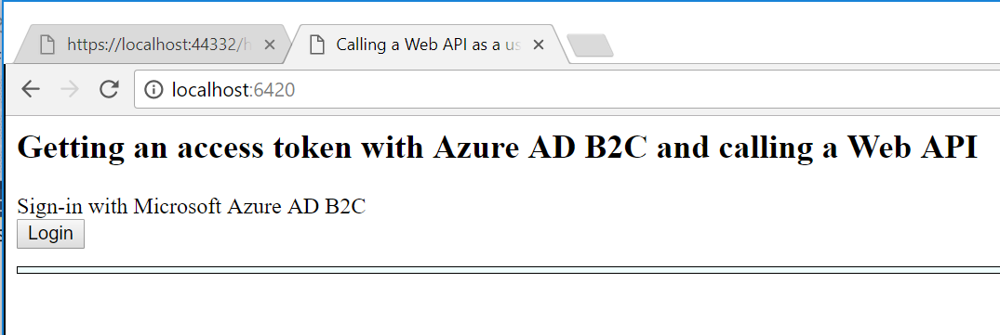
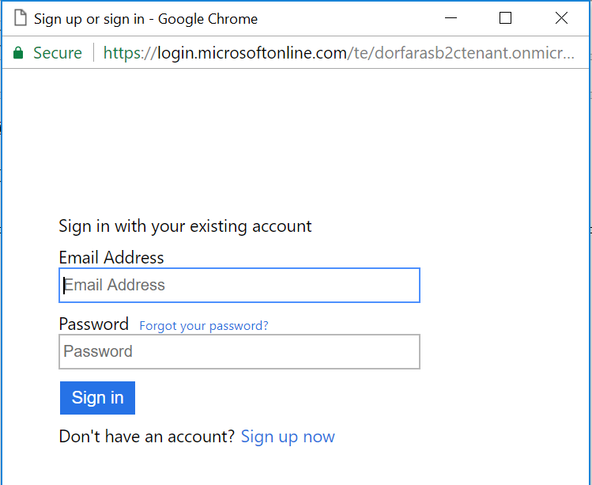
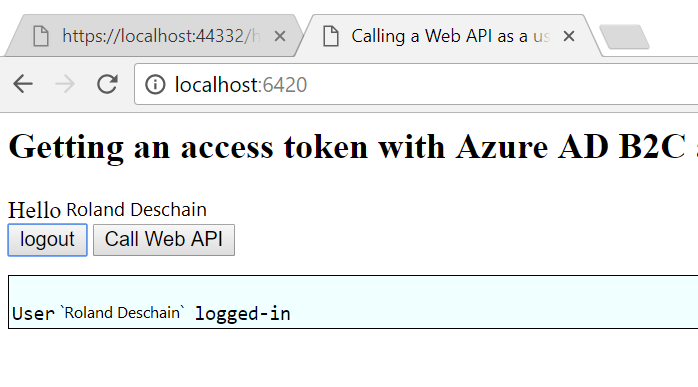
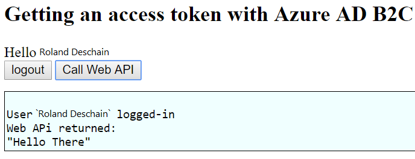

# Part 1 - Integrate Azure AD B2C into a Single Page Application (JavaScript)

Azure AD B2C enables your applications to authenticate to

* Social Accounts such as Facebook, Google, LinkedIn, and more.
* Enterprise Accounts using open standard protocols, OpenID Connect or SAML
* Local Accounts using email address/username and password

This tutorial is a continuation of the [test drive a B2C single page application](https://docs.microsoft.com/en-us/azure/active-directory-b2c/active-directory-b2c-quickstarts-spa) demostrating a sample WPF application that allows the users to sign in and access an API resource (by receiving a hello message back) in a hosted Azure AD B2C test tenant environment. 

In this tutorial, you learn how to

> [!div class="checklist"]
> * Register a sample single page application (SPA) in your Azure AD B2C tenant.
> * Create a user sign-up/sign-in policy for your SPA for a local account using an email address and password.
> * Register a sample ASP.NET Core Web API in your Azure AD B2C tenant. 
> * Configure a sample SPA and the ASP.NET Core Web API to use your Azure AD B2C tenant coordinates. 

## Prerequisites

You need the following: 

* Create your own [Azure AD B2C Tenant](https://docs.microsoft.com/en-us/azure/active-directory-b2c/active-directory-b2c-get-started)
* Install [Visual Studio 2017](https://www.visualstudio.com/downloads/) with the following workloads:
    - **ASP.NET and web development**
* [.NET Core 2.0.0 SDK](https://www.microsoft.com/net/core) or later
* [Visual Studio Code](https://code.visualstudio.com/)
* VS Code [C# extension](https://marketplace.visualstudio.com/items?itemName=ms-vscode.csharp)
* [Node](https://nodejs.org/en/download/)

[!INCLUDE [quickstarts-free-trial-note](../../includes/quickstarts-free-trial-note.md)]

## Step 1 - Download the sample node.js single page app

[Download](https://github.com/Azure-Samples/active-directory-b2c-javascript-msal-singlepageapp) or clone the sample from GitHub.

```bash
git clone https://github.com/Azure-Samples/active-directory-b2c-javascript-msal-singlepageapp.git
```

### Sample single page application overview

This tutorial demostrates a node.js SPA calling an ASP.NET Core web API with the appropriate scopes to receive a message back. 

You can sign up to use the application by clicking the **Login** button.



On the following sign up or sign in screen, you can enter your sign-up information. 

> [!NOTE]
> You need to use a valid email address to receive the verification code.



Upon successful sign up, you will see your display name in the token info section.  



Once logged in, you can click **Call Web API** button to call the web API and receive a welcome message addressed to you.



## Step 2 - Register the Single Page Application with your Azure AD B2C tenant

Make sure you are in your B2C tenant in the upper right drop-down.


Click on your Azure AD B2C resource from your dashboard. 

Click on **Applications** then click **Add**. 

Fill out the following details:

- **Name** – the friendly name to identify your app in the Azure portal, e.g. `MSAL.js SPA sample`
- **Web App / Web API** – mark **Yes** since this is a single page app
- **Allow implicit flow** – keep the default as **Yes**
- **Reply URL** – enter `http://localhost:6420` since this is the URL where your SPA sample code uses. 
- **App ID URI** – leave this blank.
- **Native client** - leave marked as `No` since this is a single page app

Your web application registration should look like the following image:


Click **Create** to register the application. Once created, you can view the properties of your single page application, e.g. its `Application ID`, by click **Application** - `MSAL.js Sample App`

## Step 3 - Create a Sign In or Sign Up policy

A policy defines certain user workflows, for example, signing in, signing up, changing passwords, and so forth. This sections shows you how to create a **Sign in or Sign up** policy.

If you already have an existing policy from a previous tutorial, you can skip to the next step. 

From the B2C portal page, go to **Policies - Sign up or Sign in** and click **Add**

Configure your policy using the following: 

1. Call the policy `b2c_1_SiUpIn`. This policy name is used in the sample code.
2. Identity provider - select **email signup**
3. Sign up attributes – these are the fields your users see when they sign up for your app. Make sure to check **Display Name** and **Postal Code** since the sample apps use these attributes.
4. Application claims – these are the claims that appear in an token. Make sure to check **Display Name**, **Postal Code**,  **User is new** and **User’s Object ID** are checked. 

Press **OK** to finish creating your policy. 

## Step 4 - Update the sample code to use your tenant and policy

Now that the SPA is registered with B2C and you have a policy, it is time to configure the sample application to talk to your B2C tenant.

Open the sample you cloned from GitHub, e.g. open `active-directory-b2c-javascript-msal-singlepageapp` folder in Visual Studio Code.

> [!Note]
> By default, the samples are configured to talk to a demo tenant called `fabrikamb2c.onmicrosoft.com` To have this sample talk to your specific tenant, you need to update the `index.html` file.

In the `index.html` file, for the `applicationConfig` variable, make the following updates to the 4 lines of code below:

```javascript
        // The current application coordinates were pre-registered in a B2C tenant.
        var applicationConfig = {
            clientID: '<The Application ID for your SPA as seen in the portal registration>',
            authority: "https://login.microsoftonline.com/tfp/<your-tenant-name>.onmicrosoft.com/b2c_1_SiUpIn",
            b2cScopes: ["https://<your-tenant-name>.onmicrosoft.com/HelloCoreAPI/read"],
            webApi: 'https://localhost:44332/hello',
        };
```

Part 2 of this tutorial creates the ASP.NET Core Web API registration with the App ID URI `https://<your-tenant-name>.onmicrosoft.com/HelloCoreAPI/` and Scope `read`. 

The policy name used in this walkthrough is **b2c_1_SiUpIn** If you are using a different policy name, updated the policy name in the `authority` variable.

## Step 5 - Run and test the single page application

From your command prompt, run the following:

```bash
cd active-directory-b2c-javascript-msal-singlepageapp
npm install && npm update
node server.js
```

The console window shows the port number for the web application

```bash
Listening on port 6420...
```

You can visit http://localhost:6420 and click the Login button to start the Azure AD B2C sign in or sign up workflow.

However, if you click the **Call Web API** link, you will receive an error "user is unauthorized." You receive this error because you are attempting to access a resource from the demo tenant, so your access token is not valid for this API resource.  

## Next Steps

In this tutorial, you learned how to create an Azure AD B2C tenant, create a sign in or sign up policy, and update the sample single page application to use your own Azure AD B2C tenant coordinates. To learn more, continue to the next tutorial to learn how to register and update the sample ASP.NET Core Web API to use your Azure AD B2C tenant.

> [!div class="nextstepaction"]
> [Continue to Part 2: Access a B2C-secured ASP.NET Web API resource](active-directory-b2c-tutorials-spa-part-1.md)
