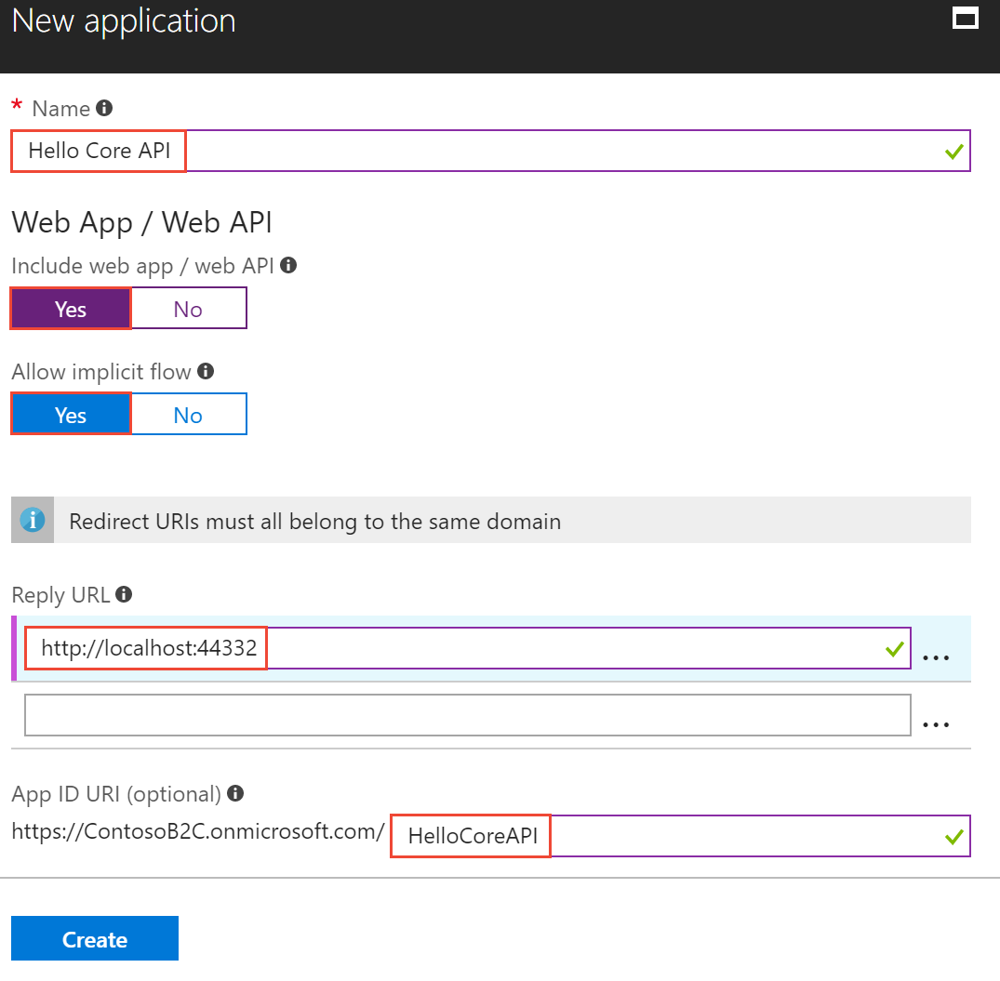
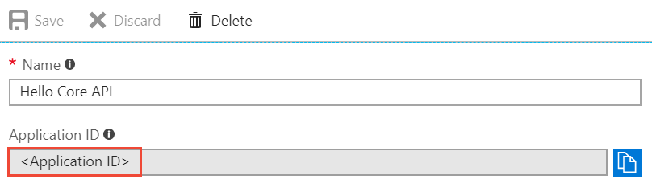
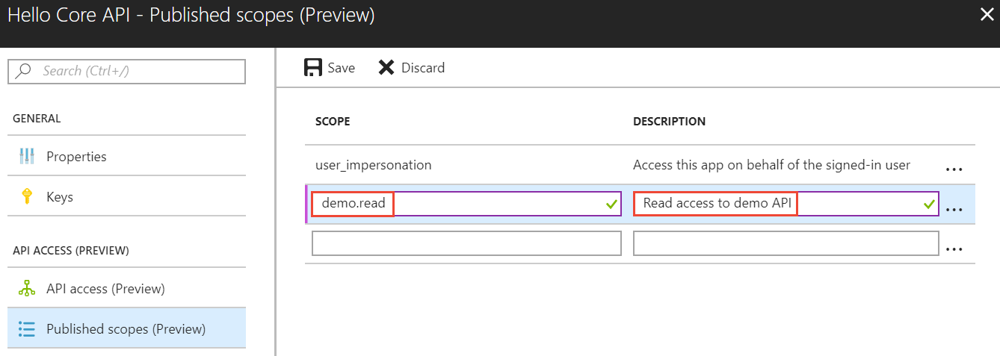
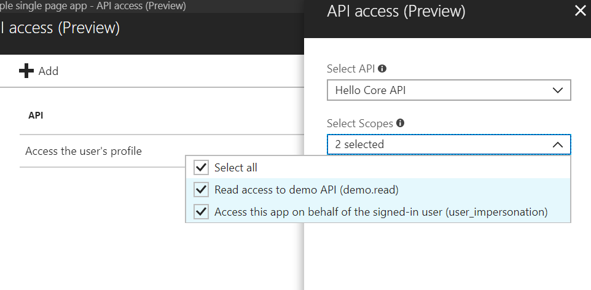

# Tutorial: Grant access to an ASP.NET Core web API from a single-page app using Azure Active Directory B2C

This tutorial shows you how to call an Azure Active Directory (Azure AD) B2C protected ASP.NET Core web API resource from a single page app.

In this tutorial, you learn how to:

> [!div class="checklist"]
> * Register a web API in your Azure AD B2C tenant
> * Define and configure scopes for a web API
> * Grant app permissions to the web API
> * Update sample code to use Azure AD B2C to protect a web API

[!INCLUDE [quickstarts-free-trial-note](../../includes/quickstarts-free-trial-note.md)]

## Prerequisites

* Complete the [Authenticate users with Azure Active Directory B2C in a single page application tutorial](active-directory-b2c-tutorials-spa.md).
* Install [Visual Studio 2017](https://www.visualstudio.com/downloads/) with the **ASP.NET and web development** workload.
* [.NET Core 2.0.0 SDK](https://www.microsoft.com/net/core) or later
* Install [Node.js](https://nodejs.org/en/download/)

## Register web API

Web API resources need to be registered in your tenant before they can accept and respond to [protected resource requests](../active-directory/develop/developer-glossary.md#resource-server) by [client applications](../active-directory/develop/developer-glossary.md#client-application) that present an [access token](../active-directory/develop/developer-glossary.md#access-token) from Azure Active Directory. Registration establishes the [application and service principal object](../active-directory/develop/developer-glossary.md#application-object) in your tenant. 

Sign in to the [Azure portal](https://portal.azure.com/) as the global administrator of your Azure AD B2C tenant.

[!INCLUDE [active-directory-b2c-switch-b2c-tenant](../../includes/active-directory-b2c-switch-b2c-tenant.md)]

1. Choose **All services** in the top-left corner of the Azure portal, search for and select **Azure AD B2C**. You should now be using the tenant that you created in the previous tutorial.

2. Select **Applications** and then select **Add**.

    To register the sample web API in your tenant, use the following settings.
    
    
    
    | Setting      | Suggested value  | Description                                        |
    | ------------ | ------- | -------------------------------------------------- |
    | **Name** | Hello Core API | Enter a **Name** that describes your web API to developers. |
    | **Include web app / web API** | Yes | Select **Yes** for a web API. |
    | **Allow implicit flow** | Yes | Select **Yes** since the API uses [OpenID Connect sign-in](active-directory-b2c-reference-oidc.md). |
    | **Reply URL** | `http://localhost:5000` | Reply URLs are endpoints where Azure AD B2C returns any tokens that your API requests. In this tutorial, the sample web API runs locally (localhost) and listens on port 5000 (once configured to later on in this tutorial). |
    | **App ID URI** | HelloCoreAPI | The URI uniquely identifies the API in the tenant. This allows you to register multiple APIs per tenant. [Scopes](../active-directory/develop/developer-glossary.md#scopes) govern access to the protected API resource and are defined per App ID URI. |
    | **Native client** | No | Since this is a web API and not a native client, select No. |
    
3. Click **Create** to register your API.

Registered APIs are displayed in the applications list for the Azure AD B2C tenant. Select your web API from the list. The web API's property pane is displayed.



Make note of the **Application Client ID**. The ID uniquely identifies the API and is needed when configuring the API later in the tutorial.

Registering your web API with Azure AD B2C defines a trust relationship. Since the API is registered with B2C, the API can now trust the B2C access tokens it receives from other applications.

## Define and configure scopes

[Scopes](../active-directory/develop/developer-glossary.md#scopes) provide a way to govern access to protected resources. Scopes are used by the web API to implement scope-based access control. For example, some users could have both read and write access, whereas other users might have read-only permissions. In this tutorial, you define read permissions for the web API.

### Define scopes for the web API

Registered APIs are displayed in the applications list for the Azure AD B2C tenant. Select your web API from the list. The web API's property pane is displayed.

Click **Published scopes (Preview)**.

To configure scopes for the API, add the following entries. 



| Setting      | Suggested value  | Description                                        |
| ------------ | ------- | -------------------------------------------------- |
| **Scope** | demo.read | Read access to demo API |

Click **Save**.

The published scopes can be used to grant a client app permission to the web API.

### Grant app permissions to web API

To call a protected web API from an app, you need to grant your app permissions to the API. In this tutorial, use the single page app created in [Authenticate users with Azure Active Directory B2C in a single page application (JavaScript)](active-directory-b2c-tutorials-spa.md).

1. In the Azure portal, select **Azure AD B2C** from the services list and click **Applications** to view the registered app list.

2. Select **My sample single page app** from the app list and click **API access (Preview)** then **Add**.

3. In the **Select API** dropdown, select your registered web API **Hello Core API**.

4. In the **Select Scopes** dropdown, select the scopes you defined in the web API registration.

    

5. Click **OK**.

Your **My sample single page app** is registered to call the protected **Hello Core API**. A user [authenticates](../active-directory/develop/developer-glossary.md#authentication) with Azure AD B2C to use the single page app. The single page app obtains an [authorization grant](../active-directory/develop/developer-glossary.md#authorization-grant) from Azure AD B2C to access the protected web API.

## Update code

Now that the web API is registered and you have scopes defined, you need to configure the web API code to use your Azure AD B2C tenant. In this tutorial, you configure a sample .NET Core web app you can download from GitHub. 

[Download a zip file](https://github.com/Azure-Samples/active-directory-b2c-dotnetcore-webapi/archive/master.zip) or clone the sample web app from GitHub.

```
git clone https://github.com/Azure-Samples/active-directory-b2c-dotnetcore-webapi.git
```

### Configure the web API

1. Open the **B2C-WebAPI.sln** solution in Visual Studio.

2. Open the **appsettings.json** file. Update the following values to configure the web api to use your tenant:

    ```javascript
    "AzureAdB2C": 
      {
        "Tenant": "<your tenant name>.onmicrosoft.com", 
        "ClientId": "<The Application ID for your web API obtained from the Azure portal>",
        "Policy": "<Your sign up sign in policy e.g. B2C_1_SiUpIn>",
        "ScopeRead": "demo.read"  
      },
    ```

#### Enable CORS

To allow your single page app to call the ASP.NET Core web API, you need to enable [CORS](https://docs.microsoft.com/aspnet/core/security/cors).

1. In **Startup.cs**, add CORS to the `ConfigureServices()` method.

    ```C#
    public void ConfigureServices(IServiceCollection services) {
      services.AddCors();
    ```

2. In **Startup.cs**, configure CORS in the `Configure()` method.

    ```C#
    public void Configure(IApplicationBuilder app, IHostingEnvironment env, ILoggerFactory loggerFactory) {
      app.UseCors(builder =>
        builder.WithOrigins("http://localhost:6420").AllowAnyHeader().AllowAnyMethod());
    ```

3. Open the **launchSettings.json** file under **Properties**, locate the **iisSettings** *applicationURL* setting, and set the port number to the one registered for the API Reply URL `http://localhost:5000`.

### Configure the single page app

The single page app uses Azure AD B2C for user sign-up, sign-in, and calls the protected ASP.NET Core web API. You need to update the single page app call the .NET Core web api.
To change the app settings:

1. Open the `index.html` file in the Node.js single page app sample.
2. Configure the sample with the Azure AD B2C tenant registration information. In the following code, add your tenant name to **b2cScopes** and change the **webApi** value to the *applicationURL* value that you previously recorded:

    ```javascript
    // The current application coordinates were pre-registered in a B2C tenant.
    var applicationConfig = {
        clientID: '<Application ID for your SPA obtained from portal app registration>',
        authority: "https://<your-tenant-name>.b2clogin.com/tfp/<your-tenant-name>.onmicrosoft.com/B2C_1_SiUpIn",
        b2cScopes: ["https://<Your tenant name>.onmicrosoft.com/HelloCoreAPI/demo.read"],
        webApi: 'http://localhost:5000/api/values',
    };
    ```

## Run the SPA app and web API

You need to run both the Node.js single page app and the .NET Core web API.

### Run the ASP.NET Core Web API 

Press **F5** to debug the **B2C-WebAPI.sln** solution in Visual Studio.

When the project launches, a web page is displayed in your default browser announcing the web api is available for requests.

### Run the single page app

1. Launch a Node.js command prompt.
2. Change to the directory containing the Node.js sample. For example `cd c:\active-directory-b2c-javascript-msal-singlepageapp`
3. Run the following commands:
    ```
    npm install && npm update
    node server.js
    ```

    The console window displays the port number of where the app is hosted.
    
    ```
    Listening on port 6420...
    ```

4. Use a browser to navigate to the address `http://localhost:6420` to view the app.
5. Sign in using the email address and password used in [Authenticate users with Azure Active Directory B2C in a single page application (JavaScript)](active-directory-b2c-tutorials-spa.md).
6. Click the **Call API** button.

After you sign up or sign in with a user account, the sample calls the protected web api and returns a result.

## Clean up resources

You can use your Azure AD B2C tenant if you plan to try other Azure AD B2C tutorials. When no longer needed, you can [delete your Azure AD B2C tenant](active-directory-b2c-faqs.md#how-do-i-delete-my-azure-ad-b2c-tenant).

## Next steps

This article walked you through protecting a web API by registering and defining scopes in Azure AD B2C. Learn more by browsing the available Azure AD B2C code samples.

> [!div class="nextstepaction"]
> [Azure AD B2C code samples](https://azure.microsoft.com/resources/samples/?service=active-directory-b2c&sort=0)
