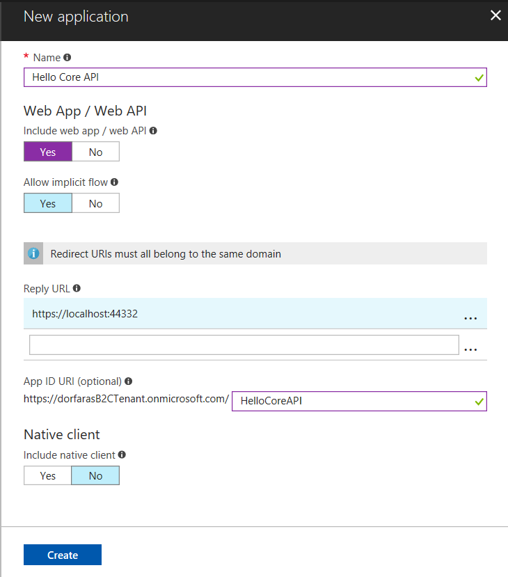
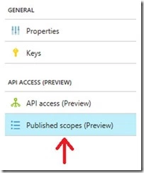
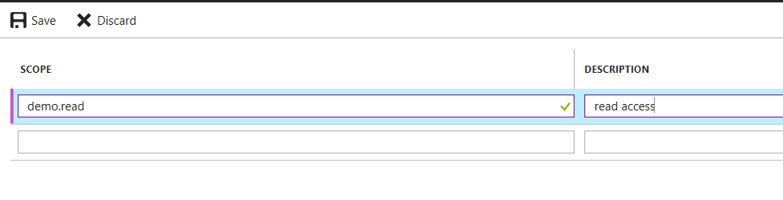
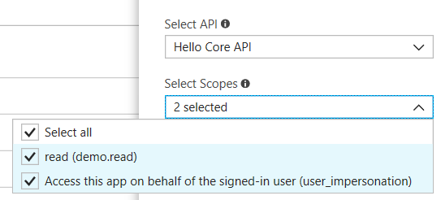
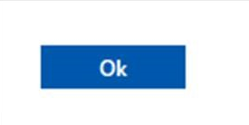

# Part 2 - Access an Azure AD B2C-protected ASP.NET Core Web API from a Single Page Application (JavaScript)

Part 2 of this tutorial walks you through how to call a resource, e.g. an API, using an access token generated by Azure AD B2C. 

## Step 1 - Download the sample ASP.NET Core Web API

[Download](https://github.com/Azure-Samples/active-directory-b2c-dotnetcore-webapi) or clone the sample from GitHub.

```bash
git clone https://github.com/Azure-Samples/active-directory-b2c-dotnetcore-webapi.git
```

## Step 2 - Register the ASP.NET Core Web API with Azure AD B2C

Make sure you are in your B2C tenant in the upper right drop-down.


Click on your Azure AD B2C resource from your dashboard. 

Click on **Applications** then click **Add**. 

Fill out the following details:

- **Name** – For you to identify your ASP.NET Core Web API in the Azure portal, e.g. `Hello Core API`
- **Application ID** – This is the Application ID to put into the sample project
- **Web App / Web API** – Select yes, since this is a Web API
- **Reply URL** – Enter `https://localhost:44332` because this is the URL the sample uses
- **App ID URL** – Enter `HelloCoreAPI` for this sample. Because a tenant can have more than 1 registered API, this unique App ID URL is needed to define scopes only for this particular API. Scopes are defined per App ID URL and are not global to a tenant.

The resulting screenshot looks like:



Registering your ASP.NET Core Web API with Azure AD B2C defines a trust relationship. Since the API is now registered with B2C, the API can now trust the B2C access tokens it receives from other applications.

## Step 3 - Define and configure scopes

The Web API determines which permissions the user has by looking at the scopes provided in the access token for that user. For example, some users could have both read and write access, whereas other users might have read-only permissions. 

This examples show you how to define read permissions for the API; however, you could also define other permissions, e.g. write-only. 

### Define the scopes for the web API

From the ASP.NET Core Web API registration page, click Published scopes (Preview)



And fill out the scopes as shown below. Use the scope name `demo.read` and description `read access`.



The scope names listed under the Scope heading go into your code.

### Grant the app permissions to the web API

In the previous steps, you created scopes for an API. In these steps, you define the API scopes for the SPA.

Switch over to your SPA in the Portal called `MSAL.js SPA sample` and click API access (Preview)


Click Add at the top. A window appears on the far right hand side.

Select your Web API by its portal name `Hello Core API` and select the `demo.read` scope you created in the Web API registration.



Click **OK** button at the bottom of screen.



Now your SPA and ASP.NET Core Web API are registered with B2C.

## Step 4 - Update the sample code to use your tenant and policy

Now that the ASP.NET Core Web API is registered with B2C, it is time to configure the sample  to talk to your B2C tenant.

Open the `B2C-WebAPI.sln` solution in Visual Studio 2017.

Open the `appsettings.json` file  This project is configured to talk to a demo tenant called `fabrikamb2c.onmicrosoft.com` To update this sample talk to the sample API included in this solution, make the following update:

```javascript
"AzureAdB2C": 
  {
    "Tenant": "<your tenant name>.onmicrosoft.com", 
    "ClientId": "<the application id you just registered>",
    "Policy": "<your sign up sign in policy e.g. B2C_1_SiUpIn>",
    "ScopeRead": "demo.read"  
  },
```

Now your samples are ready to run.

## Step 5 - Enable CORS

You need to enable CORS for your SPA to call the ASP.NET Core Web API. You can read more about how [to enable CORS in an ASP.NET Core Application](https://docs.microsoft.com/en-us/aspnet/core/security/cors)

Add CORS to your `ConfigureServices()` method in `Startup.cs`

```C#
public void ConfigureServices(IServiceCollection services) {
  services.AddCors();
```

Configure CORS in your `Configure()` method in `Startup.cs`.

```C#
public void Configure(IApplicationBuilder app, IHostingEnvironment env, ILoggerFactory loggerFactory) {
  app.UseCors(builder =>
    builder.WithOrigins("http://localhost:6420").AllowAnyHeader().AllowAnyMethod());
```

## Step 6 - Run and test the sample SPA and the ASP.NET Core Web API

### Run the Single Page Application

To run both the SPA, run these commands from a command prompt:

```bash
cd active-directory-b2c-javascript-msal-singlepageapp
npm install && npm update
node server.js
```

The console window shows the port number for the web application

```bash
Listening on port 6420...
```

You can visit http://localhost:6420 and click the Login button to start the Azure AD B2C sign in or sign up workflow.

### Run the ASP.NET Core Web API 

Hit F5 in Visual Studio to run the ASP.NET Core Web API.

### Access the API Resource

On the single page application hosted on http://localhost:6240, click the **Call Web API** link. You will see "Hello there!" returned. 

## Next Steps

This article walked you through creating a Sign Up or Sign In policy. There are other built-in policies for resetting passwords, editing a profile, and so forth, which you can find more information about in the article [reference policies.](https://docs.microsoft.com/en-us/azure/active-directory-b2c/active-directory-b2c-reference-policies)