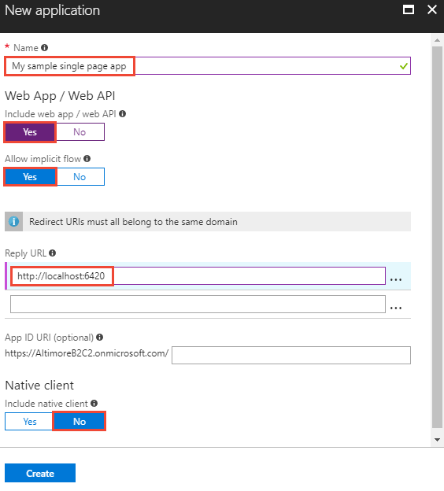
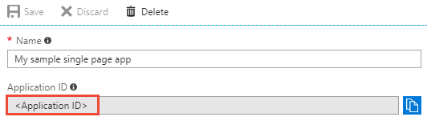

# Tutorial: Enable single-page app authentication with accounts using Azure Active Directory B2C

This tutorial shows you how to use Azure Active Directory (Azure AD) B2C to sign in and sign up users in a single page application (SPA). Azure AD B2C enables your apps to authenticate to social accounts, enterprise accounts, and Azure Active Directory accounts using open standard protocols.

In this tutorial, you learn how to:

> [!div class="checklist"]
> * Register a sample single page application in your Azure AD B2C directory.
> * Create user flows for user sign-up, sign-in, editing a profile, and password reset.
> * Configure the sample application to use your Azure AD B2C directory.

[!INCLUDE [quickstarts-free-trial-note](../../includes/quickstarts-free-trial-note.md)]

## Prerequisites

* Create your own [Azure AD B2C Directory](active-directory-b2c-get-started.md)
* Install [Visual Studio 2017](https://www.visualstudio.com/downloads/) with the **ASP.NET and web development** workload.
* [.NET Core 2.0.0 SDK](https://www.microsoft.com/net/core) or later
* Install [Node.js](https://nodejs.org/en/download/)

## Register single page app

Applications need to be [registered](../active-directory/develop/developer-glossary.md#application-registration) in your directory before they can receive [access tokens](../active-directory/develop/developer-glossary.md#access-token) from Azure Active Directory. App registration creates an [application id](../active-directory/develop/developer-glossary.md#application-id-client-id) for the app in your directory. 

Sign in to the [Azure portal](https://portal.azure.com/) as the global administrator of your Azure AD B2C directory.

[!INCLUDE [active-directory-b2c-switch-b2c-tenant](../../includes/active-directory-b2c-switch-b2c-tenant.md)]

1. Select **Azure AD B2C** from the services list in the Azure portal. 

2. In the B2C settings, click **Applications** and then click **Add**. 

    To register the sample web app in your directory, use the following settings:
    
    
    
    | Setting      | Suggested value  | Description                                        |
    | ------------ | ------- | -------------------------------------------------- |
    | **Name** | My sample single page app | Enter a **Name** that describes your app to consumers. | 
    | **Include web app / web API** | Yes | Select **Yes** for a single page app. |
    | **Allow implicit flow** | Yes | Select **Yes** since the app uses [OpenID Connect sign-in](active-directory-b2c-reference-oidc.md). |
    | **Reply URL** | `http://localhost:6420` | Reply URLs are endpoints where Azure AD B2C returns any tokens that your app requests. In this tutorial, the sample runs locally (localhost) and listens on port 6420. |
    | **Include native client** | No | Since this is a single page app and not a native client, select No. |
    
3. Click **Create** to register your app.

Registered apps are displayed in the applications list for the Azure AD B2C directory. Select your single page app from the list. The registered single page app's property pane is displayed.



Make note of the **Application Client ID**. The ID uniquely identifies the app and is needed when configuring the app later in the tutorial.

## Create user flows

An Azure AD B2C user flow defines the user experience for an identity task. For example, signing in, signing up, changing passwords, and editing profiles are common user flows.

### Create a sign-up or sign-in user flow

To sign up users to access then sign in to the web app, create a **sign-up or sign-in user flow**.

1. From the Azure AD B2C portal page, select **User flows** and click **New user flow**.
2. On the **Recommended** tab, click **Sign up and sign in**.

    To configure your user flow, use the following settings:

    

    | Setting      | Suggested value  | Description                                        |
    | ------------ | ------- | -------------------------------------------------- |
    | **Name** | SiUpIn | Enter a **Name** for the user flow. The user flow name is prefixed with **B2C_1_**. You use the full user flow name **B2C_1_SiUpIn** in the sample code. | 
    | **Identity providers** | Email signup | The identity provider used to uniquely identify the user. |

3. Under **User attributes and claims**, click **Show more** and select the following settings:

    

    | Column      | Suggested value  | Description                                        |
    | ------------ | ------- | -------------------------------------------------- |
    | **Collect attribute** | Display Name and Postal Code | Select attributes to be collected from the user during signup. |
    | **Return claim** | Display Name, Postal Code, User is new, User's Object ID | Select [claims](../active-directory/develop/developer-glossary.md#claim) you want to be included in the [access token](../active-directory/develop/developer-glossary.md#access-token). |

4. Click **OK**.
5. Click **Create** to create your user flow. 

### Create a profile editing user flow

To allow users to reset their user profile information on their own, create a **profile editing user flow**.

1. From the Azure AD B2C portal page, select **User flows** and click **New user flow**.
2. On the **Recommended** tab, click **Profile editing**.

    To configure your user flow, use the following settings:

    | Setting      | Suggested value  | Description                                        |
    | ------------ | ------- | -------------------------------------------------- |
    | **Name** | SiPe | Enter a **Name** for the user flow. The user flow name is prefixed with **B2C_1_**. You use the full user flow name **B2C_1_SiPe** in the sample code. | 
    | **Identity providers** | Local Account SignIn | The identity provider used to uniquely identify the user. |

3.	Under **User attributes**, click **Show more** and select the following settings:

    | Column      | Suggested value  | Description                                        |
    | ------------ | ------- | -------------------------------------------------- |
    | **Collect attribute** | Display Name and Postal Code | Select attributes users can modify during profile edit. |
    | **Return claim** | Display Name, Postal Code, User's Object ID | Select [claims](../active-directory/develop/developer-glossary.md#claim) you want to be included in the [access token](../active-directory/develop/developer-glossary.md#access-token) after a successful profile edit. |

4. Click **OK**.
5. Click **Create** to create your user flow. 

### Create a password reset user flow

To enable password reset on your application, you need to create a **password reset user flow**. This user flow describes the consumer experience during password reset and the contents of tokens that the application receives on successful completion.

1. From the Azure AD B2C portal page, select **User flows** and click **New user flow**.
2. On the **Recommended** tab, click **Password reset**.

    To configure your user flow, use the following settings.

    | Setting      | Suggested value  | Description                                        |
    | ------------ | ------- | -------------------------------------------------- |
    | **Name** | SSPR | Enter a **Name** for the user flow. The user flow name is prefixed with **B2C_1_**. You use the full user flow name **B2C_1_SSPR** in the sample code. | 
    | **Identity providers** | Reset password using email address | This is the identity provider used to uniquely identify the user. |

3. Under **Application claims**, click **Show more** and select the following setting:

    | Column      | Suggested value  | Description                                        |
    | ------------ | ------- | -------------------------------------------------- |
    | **Return claim** | User's Object ID | Select [claims](../active-directory/develop/developer-glossary.md#claim) you want to be included in the [access token](../active-directory/develop/developer-glossary.md#access-token) after a successful password reset. |

4. Click **OK**.
5. Click **Create** to create your user flow. 

## Update single page app code

Now that you have an app registered and user flows created, you need to configure your app to use your Azure AD B2C directory. In this tutorial, you configure a sample SPA JavaScript app you can download from GitHub. 

[Download a zip file](https://github.com/Azure-Samples/active-directory-b2c-javascript-msal-singlepageapp/archive/master.zip) or clone the sample web app from GitHub.

```
git clone https://github.com/Azure-Samples/active-directory-b2c-javascript-msal-singlepageapp.git
```
The sample app demonstrates how a single page app can use Azure AD B2C for user sign-up, sign-in, and call a protected web API. You need to change the app to use the app registration in your directory and configure the user flows you created. 

To change the app settings:

1. Open the `index.html` file in the Node.js single page app sample.
2. Configure the sample with the Azure AD B2C directory registration information. Change the following lines of code (make sure to replace the values with the names of your directory and APIs):

    ```javascript
    // The current application coordinates were pre-registered in a B2C directory.
    var applicationConfig = {
        clientID: '<Application ID for your SPA obtained from portal app registration>',
        authority: "https://fabrikamb2c.b2clogin.com/tfp/fabrikamb2c.onmicrosoft.com/B2C_1_<Sign-up or sign-in policy name>",
        b2cScopes: ["https://fabrikamb2c.onmicrosoft.com/demoapi/demo.read"],
        webApi: 'https://fabrikamb2chello.azurewebsites.net/hello',
    };
    ```

    The user flow name used in this tutorial is **B2C_1_SiUpIn**. If you are using a different user flow name, use your user flow name in `authority` value.

## Run the sample

1. Launch a Node.js command prompt.
2. Change to the directory containing the Node.js sample. For example `cd c:\active-directory-b2c-javascript-msal-singlepageapp`
3. Run the following commands:
    ```
    npm install && npm update
    node server.js
    ```

    The console window displays the port number of where the app is hosted.
    
    ```
    Listening on port 6420...
    ```

4. Use a browser to navigate to the address `http://localhost:6420` to view the app.

The sample app supports sign up, sign in, editing a profile, and password reset. This tutorial highlights how a user signs up to use the app using an email address. You can explore other scenarios on your own.

### Sign up using an email address

1. Click **Login** to sign up as a user of the SPA app. This uses the **B2C_1_SiUpIn** user flow you defined in a previous step.

2. Azure AD B2C presents a sign-in page with a sign-up link. Since you don't have an account yet, click the **Sign up now** link. 

3. The sign-up workflow presents a page to collect and verify the user's identity using an email address. The sign-up workflow also collects the user's password and the requested attributes defined in the user flow.

    Use a valid email address and validate using the verification code. Set a password. Enter values for the requested attributes. 

    

4. Click **Create** to create a local account in the Azure AD B2C directory.

Now, the user can use their email address to sign in and use the SPA app.

> [!NOTE]
> After login, the app displays an "insufficient permissions" error. You receive this error because you are attempting to access a resource from the demo directory. Since your access token is only valid for your Azure AD directory, the API call is unauthorized. Continue with the next tutorial to create a protected web API for your directory. 

## Clean up resources

You can use your Azure AD B2C directory if you plan to try other Azure AD B2C tutorials. When no longer needed, you can [delete your Azure AD B2C directory](active-directory-b2c-faqs.md#how-do-i-delete-my-azure-ad-b2c-tenant).

## Next steps

In this tutorial, you learned how to create an Azure AD B2C directory, create user flows, and update the sample single page app to use your Azure AD B2C directory. Continue to the next tutorial to learn how to register, configure, and call a protected web API from a desktop app.

> [!div class="nextstepaction"]
> [Azure AD B2C code samples](https://azure.microsoft.com/resources/samples/?service=active-directory-b2c&sort=0)
