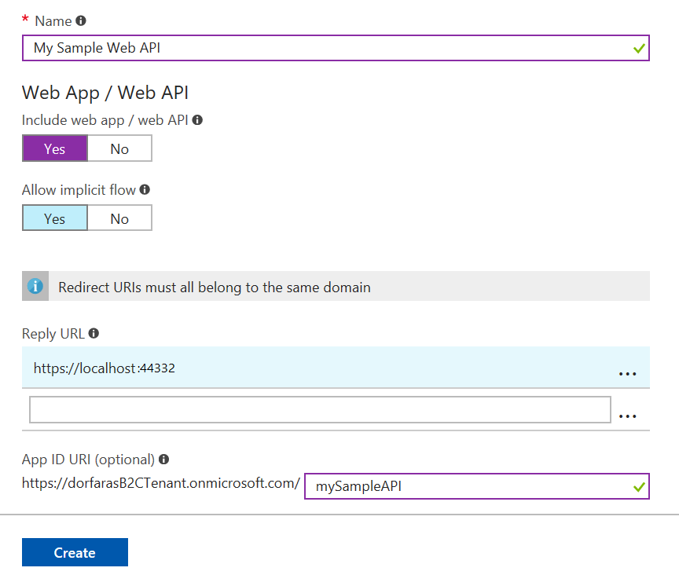
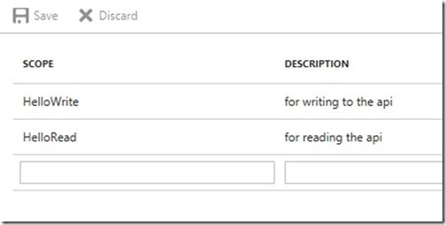
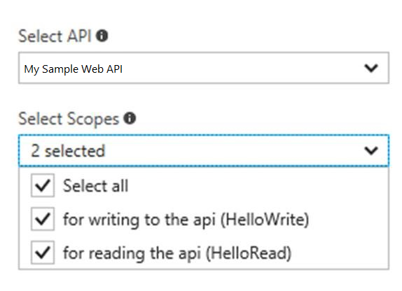
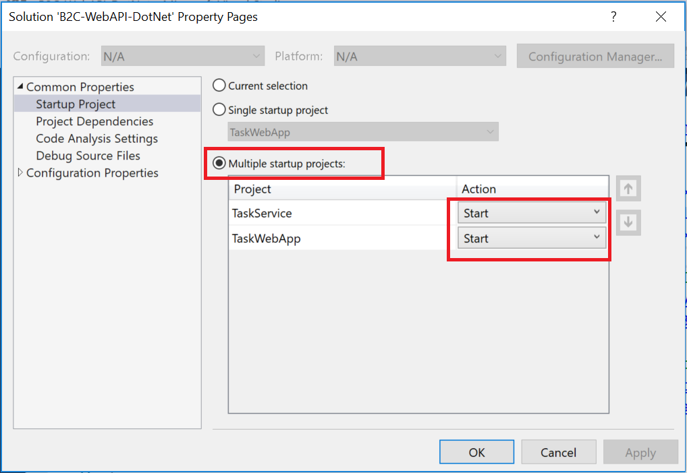

# Part 2 - Access an Azure AD B2C-protected ASP.NET Web API from an ASP.NET Web Application

Part 2 of this tutorial walks you through how to call a resource, e.g. an API, using an access token generated by Azure AD B2C. 

## Prerequisites

* Make sure you complete Part 1 if you haven't done so yet. 

## Step 1 - Register the Web API with Azure AD B2C

Make sure you are in your B2C tenant in the upper right drop-down.


Click on your Azure AD B2C resource from your dashboard. 

Click on **Applications** then click **Add**. 

Fill out the following details:

- **Name** – for you to identify your Web API in the Azure portal, e.g. `My Sample Web API`
- **Application ID** – This is the Application ID to put into your sample code
- **Web App / Web API** – Yes, this is a Web API
- **Reply URL** – this is the localhost the sample uses, e.g. `https://localhost:44332`.
- **App ID URL** – Enter `myAPISample`. Because a tenant can have more than 1 registered API, this unique App ID URL is needed to define scopes only for this particular API. Scopes are defined per App ID URL and are not global to a tenant.

The resulting screenshot looks like:



Registering your Web API with Azure AD B2C defines a trust relationship. Since the API is now registered with B2C, the API can now trust the B2C access tokens it receives from other applications.

## Step 2 - Define and configure scopes

The Web API determines which permissions the user has by looking at the scopes provided in the access token for that user. For example, some users could have both read and write access, whereas other users might have read-only permissions. 

This examples show you how to define read and write permissions for the API; however, you could also define other permissions, e.g. write-only. 

### Define the scopes for the web API

From the web API registration page, click Published scopes (Preview)


And fill out the scopes as shown below. Use the scope names "HelloRead" and "HelloWrite". The `Hello` prefix is to convey your scope names can be anything.



The scope names listed under the Scope heading go into your code.

### Grant the app permissions to the web API

In the previous steps, you created scopes for an API. In these steps, you define the API scopes for the Web App.

Switch over to your web app `My Sample Web App` in the Portal and click API access (Preview)


Click Add at the top. A window appears on the far right hand side.

Select your Web API by its portal name and select the scopes you created in the Web API registration.



Click **OK** button at the bottom of screen.


Now your Web App and Web API are registered with B2C.

## Step 3 - Update the sample code to use your tenant and policy

Now that the Web App and Web API are registered with B2C and you have a policy, it is time to configure the sample applications to talk to your B2C tenant.

Open the B2C-WebAPI-DotNet solution in Visual Studio.

> [!Note]
> By default, the samples are configured to talk to a demo tenant called `fabrikamb2c.onmicrosoft.com` To have these samples talk to your specific tenant, you need to update the Web.config for both projects.

> [!Note]
> You can go to Tools – Options – Projects and Solutions – General page and check the Track Active Item in Solution Explorer to keep track of which Web.config you are editing.

Comment out the aadb2cplayground site and uncomment the `locahost:44332` for the TaskServiceUrl where the Web API will run. The resulting code looks as follows: 

```C#
<!--<add key="api:TaskServiceUrl" value="https://aadb2cplayground.azurewebsites.net/" />-->

<add key="api:TaskServiceUrl" value="https://localhost:44332/"/>
```

Provide the App ID URI of the API to the Web App. The Web App uses the App ID URI to tell B2C which API it wants permissions to call. Comment out the fabrikamb2c tenant and updating your scopes as follows:

```C#
<!--<add key="api:ApiIdentifier" value="https://fabrikamb2c.onmicrosoft.com/api/" />—>

<add key="api:ApiIdentifier" value="https://dorfarasB2CTenant.onmicrosoft.com/api/" />

<add key="api:ReadScope" value="HelloRead" />

<add key="api:WriteScope" value="HelloWrite" />
```

Next, in the TaskService project, open the Web.config and make the following changes:

```C#
<add key="ida:Tenant" value="<Your Fictitious Test Company Name>.onmicrosoft.com" />

<add key="ida:ClientId" value="<The Application ID for your Web API as seen in portal>"/>
```

Update the value with the value you used to create your policy. If you’re following along this example, use the following value

```C#
<add key="ida:SignUpSignInPolicyId" value="b2c_1_SiUpIn" />
```

Update your scopes as follows:

```C#
<add key="api:ReadScope" value="HelloRead" />

<add key="api:WriteScope" value="HelloWrite" />
```

Now your samples are ready to run.

## Step 4 - Run and test the sample web application and web API

The Visual Studio solution contains two projects:

- **TaskWebApp** – A web application where you can view and modify your TODOs. 
- **TaskService** – A web API representing your TODO list. All CRUD operations are performed by this web API

You will need to run both the `TaskWebApp` and `TaskService` projects at the same time. 

1. In Solution Explorer, right-click on the solution and open the **Common Properties - Startup Project** window. 
2. Select **Multiple startup projects**.
3. Change the **Action** for both projects from **None** to **Start** as shown in the image below.



Press **F5** to start both applications. Each application opens in its own tab browser as follows:

* `https://localhost:44316/` - This page is the ASP.NET Web Application. You interact directly with this page. 
* `https://localhost:44332/` - This page is the web API. For this walkthrough, you do not interact with this page.

Click the sign up / sign in link to sign up for the Web Application. Once signed in, click the **To-do list** link. Now you can create todo items. 

## Next Steps

This article walked you through creating a Sign Up or Sign In policy. There are other built-in policies for resetting passwords, editing a profile, and so forth, which you can find more information about in the article [reference policies.](https://docs.microsoft.com/en-us/azure/active-directory-b2c/active-directory-b2c-reference-policies)