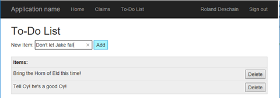
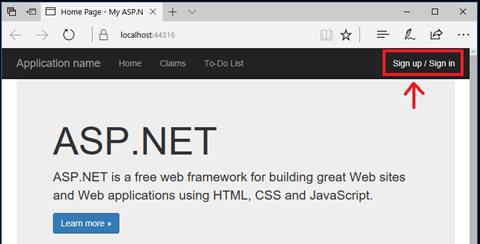
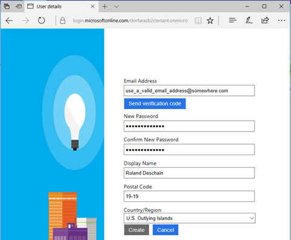

# Integrate Azure Active Directory B2C into an ASP.NET Web Application using your own B2C tenant - Part 1

This tutorial shows you how to use Azure Active Directory B2C in an ASP.NET web app. Azure Active Directory (AD) B2C allows your applications to authenticate to:

* Social accounts such as Facebook, Google, LinkedIn, and more.
* Enterprise accounts using open standard protocols such as OpenID Connect or SAML.
* Azure Active Directory accounts 

In this tutorial, you learn how to:

> [!div class="checklist"]
> * Register the sample ASP.NET web app in your Azure AD B2C tenant.
> * Create a user sign-up/sign-in policy for your web app using an email address and password.
> * Register the web API in your Azure AD B2C tenant. 
> * Configure the sample web application and web API to use your Azure AD B2C tenant. 

## Prerequisites

* Create your own [Azure AD B2C Tenant](https://docs.microsoft.com/en-us/azure/active-directory-b2c/active-directory-b2c-get-started)
* Install [Visual Studio 2017](https://www.visualstudio.com/downloads/) with the following workloads:
    - **ASP.NET and web development**

[!INCLUDE [quickstarts-free-trial-note](../../includes/quickstarts-free-trial-note.md)]

## Overview

The sample ASP.NET web app is a simple task list application that allows users to create and update a to-do list. 



The sample app demonstrates how users can sign up to use the application in your Azure AD B2C tenant.



Users can use a social account or create an account to use as their identity to access the application. 




## Step 1 - Download the sample code

[Download a zip file](https://github.com/Azure-Samples/active-directory-b2c-dotnet-webapp-and-webapi/archive/master.zip) or clone the sample from GitHub.

```bash
git clone https://github.com/Azure-Samples/active-directory-b2c-dotnet-webapp-and-webapi.git
```

## Step 2 - Register the Web Application with your Azure AD B2C tenant

In order for your application to receive [access tokens](../active-directory/develop/active-directory-dev-glossary.md#access-token) from Azure Active Directory, it needs to be registered in your Azure AD B2C [tenant](../active-directory/develop/active-directory-dev-glossary.md#tenant). App registration creates an [application id](../active-directory/develop/active-directory-dev-glossary.md#application-id-client-id) for the application in the tenant. 

### Navigate to B2C settings

Log in to the [Azure portal](https://portal.azure.com/) as the Global Administrator of the B2C tenant. 

[!INCLUDE [active-directory-b2c-switch-b2c-tenant](../../includes/active-directory-b2c-switch-b2c-tenant.md)]

[!INCLUDE [active-directory-b2c-portal-navigate-b2c-service](../../includes/active-directory-b2c-portal-navigate-b2c-service.md)]
Make sure you are in your B2C tenant in the upper right drop-down.

[!INCLUDE [active-directory-b2c-portal-add-application](../../includes/active-directory-b2c-portal-add-application.md)]

To register your web application, use the settings specified in the table.


| Setting      | Sample value  | Description                                        |
| ------------ | ------- | -------------------------------------------------- |
| **Name** | `My Sample Web App` | Enter a **Name** for the application that describes your application to consumers. | 
| **Include web app / web API** | Yes | Select **Yes** for a web application. |
| **Allow implicit flow** | Yes | Select **Yes** since the application uses [OpenID Connect sign-in](../articles/active-directory-b2c/active-directory-b2c-reference-oidc.md) |
| **Reply URL** | `https://localhost:44316` | Reply URLs are endpoints where Azure AD B2C returns any tokens that your application requests. In this tutorial, the sample is running locally (localhost) and listening on port 44316. |

Click **Create** to register your application.

Your newly registered application is displayed in the applications list for the B2C tenant. Select your web app from the list. The web application's property pane is displayed.


Make note of the globally unique **Application Client ID**. You use the ID in your application's code.

## Step 3 - Create the Client Secret

For your Web App to call B2C, the app needs to send B2C its client ID (i.e. the Application ID as shown in the portal) and the Client Secret. These client credentials are sent via the HTTP request in the web app during the initial `/authorize` endpoint call, hence starting the authorization code flow. 

To get your Web App client secret, go to the Keys page for your Web App registration.


> [!Note]
> When you click Generate key, you’ll only get to see the key this one time. Make sure you copy the key down somewhere if you’re not ready yet to paste into Visual Studio.

Now that the Web App is registered with B2C, it is time to register the Web API.

## Step 4 - Create a Sign In or Sign Up policy

A policy defines certain user workflows, for example, signing in, signing up, changing passwords, and so forth. This sections shows you how to create a **Sign in or Sign up** policy.

If you already have an existing policy from a previous tutorial, you can skip to the next step. 

From the B2C portal page, go to **Policies - Sign up or Sign in** and click **Add**

Configure your policy using the following: 

1. Call the policy `b2c_1_SiUpIn`. This policy name is used in the sample code.
2. Identity provider - select **email signup**
3. Sign up attributes – these are the fields your users see when they sign up for your app. Make sure to check **Display Name** and **Postal Code** since the sample apps use these attributes.
4. Application claims – these are the claims that appear in an token. Make sure to check **Display Name**, **Postal Code**,  **User is new** and **User’s Object ID** are checked. 

Press **OK** to finish creating your policy. 

## Step 5 - Update the sample code to use your tenant and policy

Now that the Web App is registered with B2C and you have a policy, it is time to configure the sample application to talk to your B2C tenant.

Open the `B2C-WebAPI-DotNet` solution in Visual Studio.

There are two projects in the sample solution:

1. **Web application sample app:** Web application to create and edit a task list. The web application uses the **Sign Up or Sign In** policy to sign up or sign in users with an email address.
2. **Web API sample app:** Web API that supports the create, read,  update, and delete task list functionality. The web API is secured by Azure AD B2C and called by the web application.

The Visual Studio solution contains two projects:

- **TaskWebApp** – A web application where you can view and modify your TODOs. 
- **TaskService** – A web API representing your TODO list. All CRUD operations are performed by this web API

Open the `TaskWebApp` project to make modifications to the web application project.

> [!Note]
> By default, the samples are configured to talk to a demo tenant called `fabrikamb2c.onmicrosoft.com` To have these samples talk to your specific tenant, you need to update the Web.config for both projects.

> [!Note]
> You can go to Tools – Options – Projects and Solutions – General page and check the Track Active Item in Solution Explorer to keep track of which Web.config you are editing.

In the TaskWebApp project, open the Web.config file and make the following updates:

```C#
<add key="ida:Tenant" value="<Your Tenant Name>.onmicrosoft.com" />

<add key="ida:ClientId" value="<The Application ID for your Web App as seen in portal registration" />

<add key="ida:ClientSecret" value="the Web App secret - if you didn't copy it, delete and regenerate" />
```

Update the value with the value you used to create your policy. The value for this walkthrough is **b2c_1_SiUpIn**

```C#
<add key="ida:SignUpSignInPolicyId" value="b2c_1_SiUpIn" />
```

## Step 6 - Run and test the sample web application

You only need to run the `TaskWebApp` for Part 1 of this tutorial.

In Solution Explorer, right-click on the **TaskWebApp** project and click **Set as Startup**

Press **F5** to start the web application on `https://localhost:44316/`. 

Click the **sign up / sign in** link to sign up for the Web Application. 

However, if you click the **To-do list** link and the TaskService project is running, you will receive an error "user is unauthorized." You receive this error because you are attempting to access a resource from the demo tenant, so your access token is not valid for this API resource.  

## Next Steps

In this tutorial, you learned how to create an Azure AD B2C tenant, create a sign in or sign up policy, and update the sample web application to use your Azure AD B2C coordinates. To learn more, continue to the next tutorial to learn how to register and update the sample ASP.NET Web API to use your Azure AD B2C tenant.

> [!div class="nextstepaction"]
> [Continue to Part 2: Access a B2C-secured ASP.NET Web API resource](active-directory-b2c-tutorials-web-app-part-b.md)
