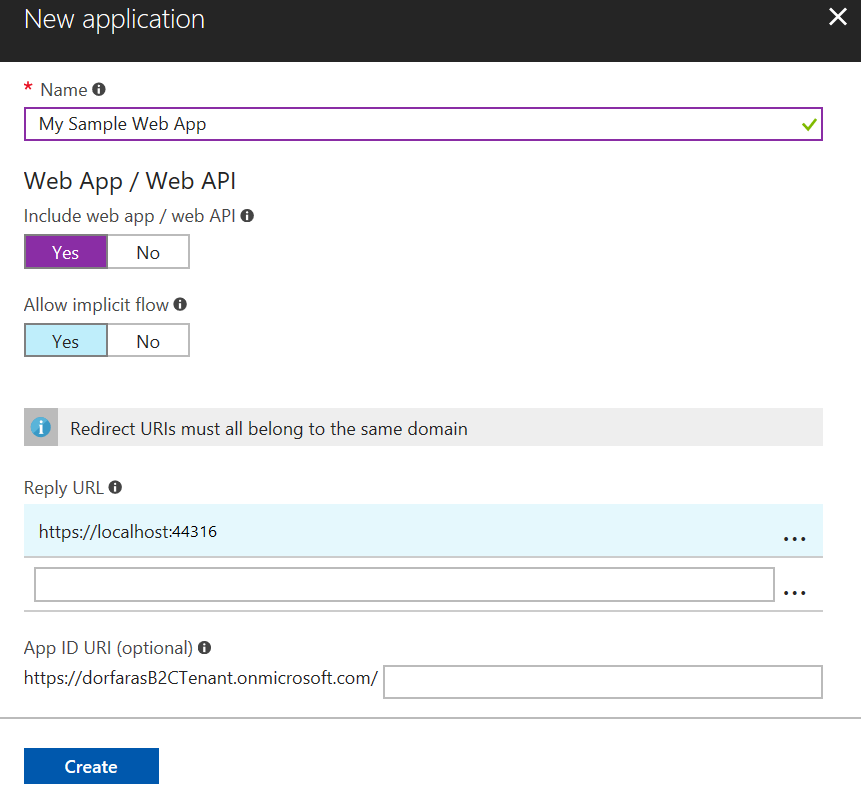
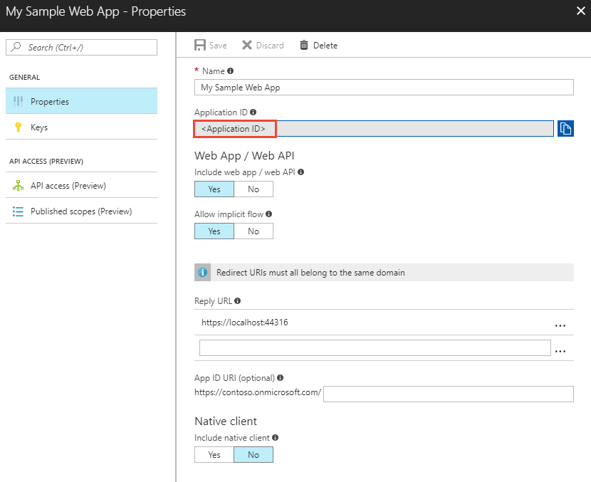
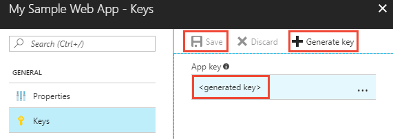
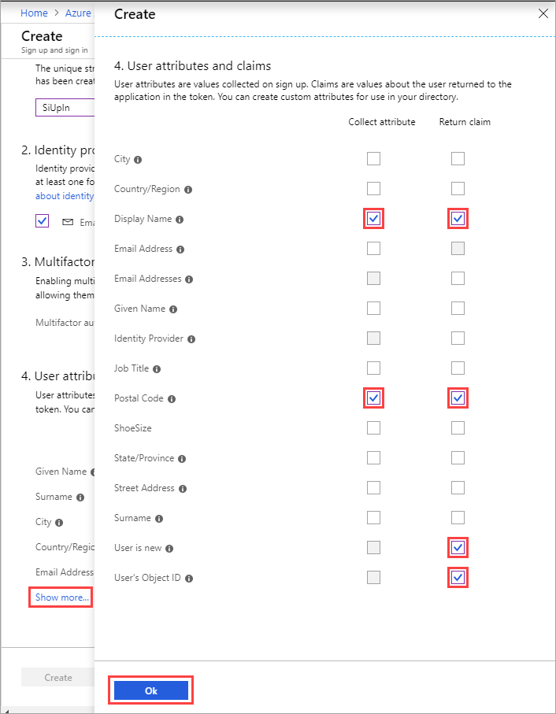

# Tutorial: Enable a web application to authenticate with accounts using Azure Active Directory B2C

This tutorial shows you how to use Azure Active Directory (Azure AD) B2C to sign in and sign up users in an ASP.NET web app. Azure AD B2C enables your apps to authenticate to social accounts, enterprise accounts, and Azure Active Directory accounts using open standard protocols.

In this tutorial, you learn how to:

> [!div class="checklist"]
> * Register a sample ASP.NET web app in your Azure AD B2C tenant.
> * Create user flows for user sign-up, sign-in, editing a profile, and password reset.
> * Configure the sample web app to use your Azure AD B2C tenant. 

[!INCLUDE [quickstarts-free-trial-note](../../includes/quickstarts-free-trial-note.md)]

## Prerequisites

* Create your own [Azure AD B2C Tenant](active-directory-b2c-get-started.md)
* Install [Visual Studio 2017](https://www.visualstudio.com/downloads/) with the **ASP.NET and web development** workload.

## Register web app

Applications need to be [registered](../active-directory/develop/developer-glossary.md#application-registration) in your tenant before they can receive [access tokens](../active-directory/develop/developer-glossary.md#access-token) from Azure Active Directory. App registration creates an [application id](../active-directory/develop/developer-glossary.md#application-id-client-id) for the app in your tenant. 

Sign in to the [Azure portal](https://portal.azure.com/) as the global administrator of your Azure AD B2C tenant.

[!INCLUDE [active-directory-b2c-switch-b2c-tenant](../../includes/active-directory-b2c-switch-b2c-tenant.md)]

1. Choose **All services** in the top-left corner of the Azure portal, search for and select **Azure AD B2C**. You should now be using the tenant that you created in the previous tutorial. 

2. In the B2C settings, click **Applications** and then click **Add**. 

    To register the sample web app in your tenant, use the following settings:

    
    
    | Setting      | Suggested value  | Description                                        |
    | ------------ | ------- | -------------------------------------------------- |
    | **Name** | My Sample Web App | Enter a **Name** that describes your app to consumers. | 
    | **Include web app / web API** | Yes | Select **Yes** for a web app. |
    | **Allow implicit flow** | Yes | Select **Yes** since the app uses [OpenID Connect sign-in](active-directory-b2c-reference-oidc.md). |
    | **Reply URL** | `https://localhost:44316` | Reply URLs are endpoints where Azure AD B2C returns any tokens that your app requests. In this tutorial, the sample runs locally (localhost) and listens on port 44316. |
    | **Include native client** | No | Since this is a web app and not a native client, select No. |
    
3. Click **Create** to register your app.

Registered apps are displayed in the applications list for the Azure AD B2C tenant. Select your web app from the list. The web app's property pane is displayed.



Make note of the **Application ID**. The ID uniquely identifies the app and is needed when configuring the app later in the tutorial.

### Create a client password

Azure AD B2C uses OAuth2 authorization for [client applications](../active-directory/develop/developer-glossary.md#client-application). Web apps are [confidential clients](../active-directory/develop/developer-glossary.md#web-client) and require a client ID or application ID and a client secret, client password, or application key.

1. Select the Keys page for the registered web app and click **Generate key**.

2. Click **Save** to display the app key.

    

The key is displayed once in the portal. It's important to copy and save the key value. You need this value for configuring your app. Keep the key secure. Don't share the key publicly.

## Create user flows

An Azure AD B2C user flow defines the user experience for an identity task. For example, signing in, signing up, changing passwords, and editing profiles are common user flows.

### Create a sign-up or sign-in user flow

To sign up users to access then sign in to the web app, create a **sign-up or sign-in user flow**.

1. From the Azure AD B2C portal page, select **User flows** and click **New user flow**.
2. On the **Recommended** tab, click **Sign up and sign in**.

    To configure your user flow, use the following settings:

    

    | Setting      | Suggested value  | Description                                        |
    | ------------ | ------- | -------------------------------------------------- |
    | **Name** | SiUpIn | Enter a **Name** for the user flow. The user flow name is prefixed with **b2c_1_**. You use the full user flow name **b2c_1_SiUpIn** in the sample code. | 
    | **Identity providers** | Email signup | The identity provider used to uniquely identify the user. |

3. Under **User attributes and claims**, click **Show more** and select the following settings:

    

    | Column      | Suggested values  | Description                                        |
    | ------------ | ------- | -------------------------------------------------- |
    | **Collect attribute** | Display Name and Postal Code | Select attributes to be collected from the user during signup. |
    | **Return claim** | Display Name, Postal Code, User is new, User's Object ID | Select [claims](../active-directory/develop/developer-glossary.md#claim) you want to be included in the [access token](../active-directory/develop/developer-glossary.md#access-token). |

4. Click **OK**.
5. Click **Create** to create your user flow. 

### Create a profile editing user flow

To allow users to reset their user profile information on their own, create a **profile editing user flow**.

1. From the Azure AD B2C portal page, select **User flows** and click **New user flow**.
2. On the **Recommended** tab, click **Profile editing**.

    To configure your user flow, use the following settings:

    | Setting      | Suggested value  | Description                                        |
    | ------------ | ------- | -------------------------------------------------- |
    | **Name** | SiPe | Enter a **Name** for the user flow. The user flow name is prefixed with **b2c_1_**. You use the full user flow name **b2c_1_SiPe** in the sample code. | 
    | **Identity providers** | Local Account SignIn | The identity provider used to uniquely identify the user. |

3. Under **User attributes**, click **Show more** and select the following settings:

    | Column      | Suggested values  | Description                                        |
    | ------------ | ------- | -------------------------------------------------- |
    | **Collect attribute** | Display Name and Postal Code | Select attributes users can modify during profile edit. |
    | **Return claim** | Display Name, Postal Code, User's Object ID | Select [claims](../active-directory/develop/developer-glossary.md#claim) you want to be included in the [access token](../active-directory/develop/developer-glossary.md#access-token) after a successful profile edit. |

4. Click **OK**.
5. Click **Create** to create your user flow. 

### Create a password reset user flow

To enable password reset on your application, you need to create a **password reset user flow**. This user flow describes the consumer experience during password reset and the contents of tokens that the application receives on successful completion.

1. From the Azure AD B2C portal page, select **Password reset policies** and click **Add**.
2. On the **Recommended** tab, click **Password reset**.

    To configure your user flow, use the following settings.

    | Setting      | Suggested value  | Description                                        |
    | ------------ | ------- | -------------------------------------------------- |
    | **Name** | SSPR | Enter a **Name** for the user flow. The user flow name is prefixed with **b2c_1_**. You use the full user flow name **b2c_1_SSPR** in the sample code. | 
    | **Identity providers** | Reset password using email address | This is the identity provider used to uniquely identify the user. |

3. Under **Application claims**, click **Show more** and select the following setting:
    | Column      | Suggested value  | Description                                        |
    | ------------ | ------- | -------------------------------------------------- |
    | **Return claim** | User's Object ID | Select [claims](../active-directory/develop/developer-glossary.md#claim) you want to be included in the [access token](../active-directory/develop/developer-glossary.md#access-token) after a successful password reset. |

4. Click **OK**.
5. Click **Create** to create your user flow. 

## Update web app code

Now that you have a web app registered and user flows created, you need to configure your app to use your Azure AD B2C tenant. In this tutorial, you configure a sample web app you can download from GitHub. 

[Download a zip file](https://github.com/Azure-Samples/active-directory-b2c-dotnet-webapp-and-webapi/archive/master.zip) or clone the sample web app from GitHub. Make sure that you extract the sample file in a folder where the total character length of the path is less than 260.

```
git clone https://github.com/Azure-Samples/active-directory-b2c-dotnet-webapp-and-webapi.git
```

The sample ASP.NET web app is a simple task list app for creating and updating a to-do list. The app uses [Microsoft OWIN middleware components](https://docs.microsoft.com/aspnet/aspnet/overview/owin-and-katana/) to let users sign up to use the app in your Azure AD B2C tenant. By creating an Azure AD B2C user flow, users can use a social account or create an account to use as their identity to access the app. 

There are two projects in the sample solution:

**Web app sample app (TaskWebApp):** Web app to create and edit a task list. The web app uses the **sign-up or sign-in** user flow to sign up or sign in users.

**Web API sample app (TaskService):** Web API that supports the create, read, update, and delete task list functionality. The web API is protected by Azure AD B2C and called by the web app.

You need to change the app to use the app registration in your tenant, which includes the application ID and the key that you previously recorded. You also need to configure the user flows you created. The sample web app defines the configuration values as app settings in the Web.config file. To change the app settings:

1. Open the **B2C-WebAPI-DotNet** solution in Visual Studio.

2. In the **TaskWebApp** web app project, open the **Web.config** file. Replace the value for `ida:Tenant` with the name of the tenant that you created. Replace the value for `ida:ClientId` with the application ID that you recorded. Replace the value of `ida:ClientSecret` with the key that you recorded.

3. In the **Web.config** file, replace the value for `ida:SignUpSignInPolicyId` with `b2c_1_SiUpIn`. Replace the value for `ida:EditProfilePolicyId` with `b2c_1_SiPe`. Replace the value for `ida:ResetPasswordPolicyId` with `b2c_1_SSPR`.

## Run the sample web app

In Solution Explorer, right-click on the **TaskWebApp** project and click **Set as StartUp Project**

Press **F5** to start the web app. The default browser launches to the local web site address `https://localhost:44316/`. 

The sample app supports sign up, sign in, editing a profile, and password reset. This tutorial highlights how a user signs up to use the app using an email address. You can explore other scenarios on your own.

### Sign up using an email address

1. Click the **Sign up / Sign in** link in the top banner to sign up as a user of the web app. This uses the **b2c_1_SiUpIn** user flow you defined in a previous step.

2. Azure AD B2C presents a sign-in page with a sign-up link. Since you don't have an account yet, click the **Sign up now** link. 

3. The sign-up workflow presents a page to collect and verify the user's identity using an email address. The sign-up workflow also collects the user's password and the requested attributes defined in the user flow.

    Use a valid email address and validate using the verification code. Set a password. Enter values for the requested attributes. 

    

4. Click **Create** to create a local account in the Azure AD B2C tenant.

Now the user can use their email address to sign in and use the web app.

## Clean up resources

You can use your Azure AD B2C tenant if you plan to try other Azure AD B2C tutorials. When no longer needed, you can [delete your Azure AD B2C tenant](active-directory-b2c-faqs.md#how-do-i-delete-my-azure-ad-b2c-tenant).

## Next steps

In this tutorial, you learned how to create an Azure AD B2C tenant, create user flows, and update the sample web app to use your Azure AD B2C tenant. Continue to the next tutorial to learn how to register, configure, and call a ASP.NET web API protected by your Azure AD B2C tenant.

> [!div class="nextstepaction"]
> [Tutorial: Use Azure Active Directory B2C to protect an ASP.NET web API](active-directory-b2c-tutorials-web-api.md)
